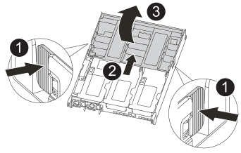

= 
:allow-uri-read: 

Le support de démarrage est situé à l'intérieur du module de contrôleur sous le conduit d'air et est accessible en retirant le module de contrôleur du système.

.Étapes
. Si vous n'êtes pas déjà mis à la terre, mettez-vous à la terre correctement.
. Libérez les dispositifs de retenue du câble d'alimentation, puis débranchez les câbles des blocs d'alimentation.
. Desserrez le crochet et la bride de boucle qui relient les câbles au périphérique de gestion des câbles, puis débranchez les câbles système et les SFP (si nécessaire) du module de contrôleur, en maintenant une trace de l'emplacement où les câbles ont été connectés.
+
Laissez les câbles dans le périphérique de gestion des câbles de sorte que lorsque vous réinstallez le périphérique de gestion des câbles, les câbles sont organisés.

. Retirez le périphérique de gestion des câbles du module de contrôleur et mettez-le de côté.
. Appuyez sur les deux loquets de verrouillage, puis faites pivoter les deux loquets vers le bas en même temps.
+
Le module de contrôleur se déplace légèrement hors du châssis.

+
image::../media/drw_c400_remove_controller_IEOPS-1216.svg[Déposer le contrôleur]

+
[cols="10,90"]
|===

 a| 
image:../media/icon_round_1.png["Légende numéro 1"]
 a| 
Loquets de verrouillage

 a| 
image:../media/icon_round_2.png["Légende numéro 2"]
 a| 
Le contrôleur sort légèrement du châssis

|===
. Faites glisser le module de contrôleur hors du châssis.
+
Assurez-vous de prendre en charge la partie inférieure du module de contrôleur lorsque vous le faites glisser hors du châssis.

. Placez le module de commande sur une surface plane et stable.
. Ouvrir le conduit d'air :
+

+
[cols="10,90"]
|===

 a| 
image:../media/icon_round_1.png["Légende numéro 1"]
 a| 
Languettes de verrouillage

 a| 
image:../media/icon_round_2.png["Légende numéro 2"]
 a| 
Faire glisser le conduit d'air vers l'arrière du contrôleur

 a| 
image::../media/icon_round_3.png[Numéro de légende 3]
 a| 
Tourner le conduit d'air vers le haut

|===
+
.. Appuyer sur les pattes de verrouillage situées sur les côtés du conduit d'air vers le milieu du module de commande.
.. Faites glisser le conduit d'air vers l'arrière du module de commande, puis faites-le pivoter vers le haut jusqu'à sa position complètement ouverte.

. Recherchez et retirez le support de démarrage du module de contrôleur :
+
image::../media/drw_c400_replace_boot_media_IEOPS-1217.svg[Retirez le support de démarrage]

+
[cols="10,90"]
|===

 a| 
image:../media/icon_round_1.png["Légende numéro 1"]
 a| 
Appuyez sur le bouton bleu

 a| 
image:../media/icon_round_2.png["Légende numéro 2"]
 a| 
Faites pivoter le support de démarrage vers le haut et retirez-le du support

|===
+
.. Appuyez sur le bouton bleu à l'extrémité du support de démarrage jusqu'à ce que le rebord du support de démarrage disparaisse du bouton bleu.
.. Faites pivoter le support de démarrage vers le haut et retirez doucement le support de démarrage du support.

. Alignez les bords du support de démarrage de remplacement avec le support de démarrage, puis poussez-le doucement dans le support.
. Vérifiez le support de démarrage pour vous assurer qu'il est bien en place dans le support.
+
Si nécessaire, retirez le support de démarrage et réinstallez-le dans le support.

. Verrouillez le support de démarrage en place :
+
.. Faites pivoter le support de démarrage vers le bas, vers la carte mère.
.. En plaçant un doigt à l'extrémité du support de démarrage par le bouton bleu, appuyez sur l'extrémité du support de démarrage pour engager le bouton de verrouillage bleu.
.. Tout en appuyant sur le support de démarrage, soulevez le bouton de verrouillage bleu pour verrouiller le support de démarrage en place.

. Fermer le conduit d'air.

