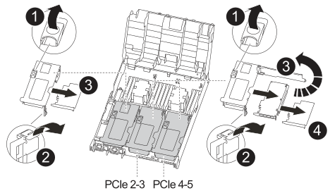
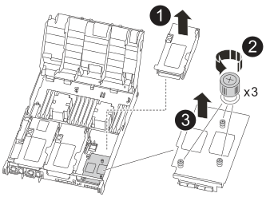

= Étape 1 : arrêtez le contrôleur défaillant
:allow-uri-read: 

Pour remplacer une carte PCIe ou mezzanine, déconnectez les câbles et tous les modules SFP et QSFP des cartes, remplacez la carte PCIe ou mezzanine défectueuse, puis recâble les cartes.

* Cette procédure peut être utilisée avec toutes les versions de ONTAP prises en charge par votre système
* Tous les autres composants du système doivent fonctionner correctement ; si ce n'est pas le cas, vous devez contacter le support technique.

== Étape 1 : arrêtez le contrôleur défaillant

[role="lead"]
Vous pouvez arrêter ou reprendre le contrôleur défaillant en suivant différentes procédures, en fonction de la configuration matérielle du système de stockage.

[role="tabbed-block"]
====
.Option 1 : plupart des configurations
--
[role="lead"]
Pour arrêter le contrôleur défaillant, vous devez déterminer l'état du contrôleur et, si nécessaire, prendre le contrôle de façon à ce que le contrôleur en bonne santé continue de transmettre des données provenant du stockage défaillant du contrôleur.

.Description de la tâche
* Si vous disposez d'un système SAN, vous devez avoir vérifié les messages d'événement  `cluster kernel-service show`) pour le serveur lame SCSI du contrôleur défectueux.  `cluster kernel-service show`La commande (depuis la commande priv en mode avancé) affiche le nom du nœud, l'état de quorum de ce nœud, l'état de disponibilité de ce nœud ainsi que l'état opérationnel de ce nœud.
+
Chaque processus SCSI-Blade doit se trouver au quorum avec les autres nœuds du cluster. Tout problème doit être résolu avant de procéder au remplacement.

* Si vous avez un cluster avec plus de deux nœuds, il doit être dans le quorum. Si le cluster n'est pas au quorum ou si un contrôleur en bonne santé affiche la valeur false pour l'éligibilité et la santé, vous devez corriger le problème avant de désactiver le contrôleur défaillant ; voir link:https://docs.netapp.com/us-en/ontap/system-admin/synchronize-node-cluster-task.html?q=Quorum["Synchroniser un nœud avec le cluster"^].

.Étapes
. Si AutoSupport est activé, supprimez la création automatique de cas en appelant un message AutoSupport : `system node autosupport invoke -node * -type all -message MAINT=<# of hours>h`
+
Le message AutoSupport suivant supprime la création automatique de dossiers pendant deux heures : `cluster1:> system node autosupport invoke -node * -type all -message MAINT=2h`

. Désactiver le rétablissement automatique depuis la console du contrôleur sain : `storage failover modify –node local -auto-giveback false`
+

NOTE: Lorsque vous voyez _voulez-vous désactiver l'auto-giveback?_, entrez `y`.

. Faites passer le contrôleur douteux à l'invite DU CHARGEUR :
+
[cols="1,2"]
|===
| Si le contrôleur en état de fonctionnement s'affiche... | Alors... 

 a| 
Invite DU CHARGEUR
 a| 
Passez à l'étape suivante.

 a| 
Attente du retour...
 a| 
Appuyez sur Ctrl-C, puis répondez `y` lorsque vous y êtes invité.

 a| 
Invite système ou invite de mot de passe
 a| 
Prendre le contrôle défectueux ou l'arrêter à partir du contrôleur en bon état : `storage failover takeover -ofnode _impaired_node_name_`

Lorsque le contrôleur douteux s'affiche en attente de rétablissement..., appuyez sur Ctrl-C et répondez `y`.

|===

--
.Option 2 : le contrôleur est intégré à un MetroCluster à deux nœuds
--
[role="lead"]
Pour arrêter le contrôleur défaillant, vous devez déterminer l'état du contrôleur et, si nécessaire, basculer le contrôleur de sorte que ce dernier continue de transmettre des données depuis le stockage défaillant du contrôleur.

.Description de la tâche
* Vous devez laisser les alimentations allumées à l'issue de cette procédure pour fournir une alimentation au contrôleur en état.

.Étapes
. Vérifiez l'état du contrôleur MetroCluster pour déterminer si le contrôleur défectueux a automatiquement basculé sur le contrôleur en bon état : `metrocluster show`
. Selon qu'un basculement automatique s'est produit, suivre le tableau suivant :
+
[cols="1,2"]
|===
| En cas de dysfonctionnement du contrôleur... | Alors... 

 a| 
A automatiquement basculé
 a| 
Passez à l'étape suivante.

 a| 
N'a pas été automatiquement commutée
 a| 
Effectuer un basculement planifié à partir du contrôleur en bon état : `metrocluster switchover`

 a| 
N'a pas été automatiquement commutée, vous avez tenté de basculer avec le `metrocluster switchover` la commande, et le basculement a été vetoté
 a| 
Examinez les messages de veto et, si possible, résolvez le problème et réessayez. Si vous ne parvenez pas à résoudre le problème, contactez le support technique.

|===
. Resynchroniser les agrégats de données en exécutant le `metrocluster heal -phase aggregates` commande provenant du cluster survivant.
+
[listing]
----
controller_A_1::> metrocluster heal -phase aggregates
[Job 130] Job succeeded: Heal Aggregates is successful.
----
+
Si la guérison est vetotée, vous avez la possibilité de réémettre le `metrocluster heal` commande avec `-override-vetoes` paramètre. Si vous utilisez ce paramètre facultatif, le système remplace tout veto logiciel qui empêche l'opération de correction.

. Vérifiez que l'opération a été terminée à l'aide de la commande MetroCluster Operation show.
+
[listing]
----
controller_A_1::> metrocluster operation show
    Operation: heal-aggregates
      State: successful
Start Time: 7/25/2016 18:45:55
   End Time: 7/25/2016 18:45:56
     Errors: -
----
. Vérifier l'état des agrégats à l'aide de `storage aggregate show` commande.
+
[listing]
----
controller_A_1::> storage aggregate show
Aggregate     Size Available Used% State   #Vols  Nodes            RAID Status
--------- -------- --------- ----- ------- ------ ---------------- ------------
...
aggr_b2    227.1GB   227.1GB    0% online       0 mcc1-a2          raid_dp, mirrored, normal...
----
. Réparez les agrégats racine à l'aide de `metrocluster heal -phase root-aggregates` commande.
+
[listing]
----
mcc1A::> metrocluster heal -phase root-aggregates
[Job 137] Job succeeded: Heal Root Aggregates is successful
----
+
Si la guérison est vetotée, vous avez la possibilité de réémettre le `metrocluster heal` commande avec le paramètre -override-vetos. Si vous utilisez ce paramètre facultatif, le système remplace tout veto logiciel qui empêche l'opération de correction.

. Vérifier que l'opération de correction est terminée en utilisant le `metrocluster operation show` commande sur le cluster destination :
+
[listing]
----

mcc1A::> metrocluster operation show
  Operation: heal-root-aggregates
      State: successful
 Start Time: 7/29/2016 20:54:41
   End Time: 7/29/2016 20:54:42
     Errors: -
----
. Sur le module de contrôleur défaillant, débranchez les blocs d'alimentation.

--
====

== Étape 2 : retirer le module de contrôleur

[role="lead"]
Pour accéder aux composants à l'intérieur du module de contrôleur, vous devez retirer le module de contrôleur du châssis.

. Si vous n'êtes pas déjà mis à la terre, mettez-vous à la terre correctement.
. Libérez les dispositifs de retenue du câble d'alimentation, puis débranchez les câbles des blocs d'alimentation.
. Desserrez le crochet et la bride de boucle qui relient les câbles au périphérique de gestion des câbles, puis débranchez les câbles système et les SFP (si nécessaire) du module de contrôleur, en maintenant une trace de l'emplacement où les câbles ont été connectés.
+
Laissez les câbles dans le périphérique de gestion des câbles de sorte que lorsque vous réinstallez le périphérique de gestion des câbles, les câbles sont organisés.

. Retirez le périphérique de gestion des câbles du module de contrôleur et mettez-le de côté.
. Appuyez sur les deux loquets de verrouillage, puis faites pivoter les deux loquets vers le bas en même temps.
+
Le module de contrôleur se déplace légèrement hors du châssis.

+
image::../media/drw_c400_remove_controller_IEOPS-1216.svg[drw c400 retirer le contrôleur IEOPS 1216]

+
[cols="10a,90a"]
|===

 a| 
image:../media/legend_icon_01.png["Légende numéro 1"]
 a| 
Loquets de verrouillage

 a| 
image:../media/legend_icon_02.png["Légende numéro 2"]
 a| 
Le contrôleur sort légèrement du châssis

|===
. Faites glisser le module de contrôleur hors du châssis.
+
Assurez-vous de prendre en charge la partie inférieure du module de contrôleur lorsque vous le faites glisser hors du châssis.

. Placez le module de commande sur une surface plane et stable.

== Étape 3 : remplacer une carte PCIe

[role="lead"]
Pour remplacer une carte PCIe, vous devez localiser la carte PCIe défectueuse, retirer la carte de montage qui contient la carte du module de contrôleur, remplacer la carte, puis réinstaller la carte de montage PCIe dans le module de contrôleur.

Vous pouvez utiliser l'animation, l'illustration ou les étapes écrites suivantes pour remplacer une carte PCIe.

.Animation - remplacer une carte PCIe
video::ed42334e-8eb2-48dd-b447-b0300189230f[panopto]

[cols="10,90"]
|===

 a| 
image:../media/legend_icon_01.png["Légende numéro 1"]
 a| 
Loquet de verrouillage de la rehausse

 a| 
image:../media/legend_icon_02.png["Légende numéro 2"]
 a| 
Loquet de verrouillage de la carte PCI

 a| 
image:../media/legend_icon_03.png["Numéro de légende 3"]
 a| 
Plaque de verrouillage PCI

 a| 
image:../media/legend_icon_04.png["Numéro de légende 4"]
 a| 
Carte PCI

|===
. Retirez la carte de montage contenant la carte à remplacer :
+
.. Ouvrez le conduit d'air en appuyant sur les pattes de verrouillage situées sur les côtés du conduit d'air, faites-le glisser vers l'arrière du module de contrôleur, puis faites-le tourner jusqu'à sa position complètement ouverte.
.. Retirez tous les modules SFP ou QSFP qui peuvent se trouver dans les cartes PCIe.
.. Faites pivoter le loquet de verrouillage de la rehausse sur le côté gauche de la rehausse vers le haut et vers le conduit d'air.
+
La carte de montage se soulève légèrement du module de contrôleur.

.. Soulevez le montant droit et mettez-le de côté sur une surface plane stable,

. Retirez la carte PCIe de la carte de montage :
+
.. Tournez la carte de montage pour accéder à la carte PCIe.
.. Appuyez sur le support de verrouillage situé sur le côté de la carte de montage PCIe, puis faites-le pivoter en position ouverte.
.. Pour les surmontoirs 2 et 3 uniquement, faites pivoter le panneau latéral vers le haut.
.. Retirez la carte PCIe de la carte de montage en poussant doucement vers le haut sur le support et en la soulevant hors du support.

. Installez la carte PCIe de remplacement dans la carte de montage en alignant la carte avec le support, appuyez sur la carte dans le support, puis fermez le panneau latéral de la carte de montage, le cas échéant.
+
Assurez-vous d'aligner correctement la carte dans la fente et d'exercer une pression uniforme sur la carte lorsqu'elle est insérée dans la prise. La carte PCIe doit être complètement et uniformément insérée dans le logement.

+

NOTE: Si vous installez une carte dans le logement inférieur et que vous ne voyez pas bien le support de carte, retirez la carte supérieure de sorte que vous puissiez voir le support de carte, installer la carte, puis réinstaller la carte que vous avez retirée du logement supérieur.

. Réinstallez la carte de montage :
+
.. Alignez la carte de montage avec les broches sur le côté du support de montage, abaissez la carte de montage sur les broches.
.. Poussez la carte de montage directement dans la prise de la carte mère.
.. Faites pivoter le loquet vers le bas au ras de la tôle de la rehausse.

== Étape 4 : remplacer la carte mezzanine

[role="lead"]
La carte mezzanine se trouve sous la carte de montage numéro 3 (logements 4 et 5). Vous devez retirer cette carte de montage pour accéder à la carte mezzanine, remplacer la carte mezzanine, puis réinstaller le numéro de montage 3. Voir le mappage des FRU sur le module de contrôleur pour plus d'informations.

Vous pouvez utiliser l'animation, l'illustration ou les étapes écrites suivantes pour remplacer la carte mezzanine.

.Animation : remplacez la carte mezzanine
video::e3fd32b6-bdbb-4c53-b666-b030018a5744[panopto]

[cols="10a,90a"]
|===

 a| 
image:../media/legend_icon_01.png["Légende numéro 1"]
 a| 
Carte de montage PCI

 a| 
image:../media/legend_icon_02.png["Légende numéro 2"]
 a| 
Vis moletée de la carte de montage

 a| 
image:../media/legend_icon_03.png["Numéro de légende 3"]
 a| 
Carte de montage

|===
. Retirez la carte de montage numéro 3 (emplacements 4 et 5) :
+
.. Ouvrez le conduit d'air en appuyant sur les pattes de verrouillage situées sur les côtés du conduit d'air, faites-le glisser vers l'arrière du module de contrôleur, puis faites-le tourner jusqu'à sa position complètement ouverte.
.. Retirez tous les modules SFP ou QSFP qui peuvent se trouver dans les cartes PCIe.
.. Faites pivoter le loquet de verrouillage de la rehausse sur le côté gauche de la rehausse vers le haut et vers le conduit d'air.
+
La carte de montage se soulève légèrement du module de contrôleur.

.. Soulevez la rehausse, puis mettez-la de côté sur une surface plane et stable.

. Remplacez la carte mezzanine :
+
.. Retirez tous les modules QSFP ou SFP de la carte.
.. Desserrez les vis moletées de la carte mezzanine, soulevez doucement la carte pour la retirer du support et mettez-la de côté.
.. Alignez la carte mezzanine de remplacement sur le support et les broches de guidage, puis poussez doucement la carte dans le support.
.. Serrez les vis moletées sur la carte mezzanine.

. Réinstallez la carte de montage :
+
.. Alignez la carte de montage avec les broches sur le côté du support de montage, abaissez la carte de montage sur les broches.
.. Poussez la carte de montage directement dans la prise de la carte mère.
.. Faites pivoter le loquet vers le bas au ras de la tôle de la rehausse.

== Étape 5 : installer le module de contrôleur

Après avoir remplacé le composant du module de contrôleur, vous devez réinstaller le module de contrôleur dans le châssis, puis le démarrer en mode Maintenance.

. Si ce n'est déjà fait, fermer le conduit d'air.
. Alignez l'extrémité du module de contrôleur avec l'ouverture du châssis, puis poussez doucement le module de contrôleur à mi-course dans le système.
+

NOTE: N'insérez pas complètement le module de contrôleur dans le châssis tant qu'il n'y a pas été demandé.

. Recâblage du système, selon les besoins.
+
Si vous avez retiré les convertisseurs de support (QSFP ou SFP), n'oubliez pas de les réinstaller si vous utilisez des câbles à fibre optique.

. Terminez l'installation du module de contrôleur :
+
.. Branchez le cordon d'alimentation dans le bloc d'alimentation, réinstallez le collier de verrouillage du câble d'alimentation, puis connectez le bloc d'alimentation à la source d'alimentation.
.. A l'aide des loquets de verrouillage, poussez fermement le module de contrôleur dans le châssis jusqu'à ce qu'il rencontre le fond de panier central et qu'il soit bien en place.
+
Les loquets de verrouillage se montent lorsque le module de contrôleur est bien en place.

+

NOTE: Ne forcez pas trop lorsque vous faites glisser le module de contrôleur dans le châssis pour éviter d'endommager les connecteurs.

+
Le module de contrôleur commence à démarrer dès qu'il est complètement inséré dans le châssis. Soyez prêt à interrompre le processus de démarrage.

.. Insérez complètement le module de commande dans le châssis en faisant tourner les loquets de verrouillage vers le haut, en les inclinant de manière à dégager les goupilles de verrouillage, poussez doucement le contrôleur complètement vers l'intérieur, puis abaissez les loquets de verrouillage en position verrouillée.
.. Si ce n'est déjà fait, réinstallez le périphérique de gestion des câbles.
.. Interrompez le processus de démarrage normal et démarrez vers LE CHARGEUR en appuyant sur `Ctrl-C`.
+

NOTE: Si votre système s'arrête au menu de démarrage, sélectionnez l'option de démarrage pour DÉMARRER le CHARGEUR.

.. À l'invite DU CHARGEUR, entrez `bye` Pour réinitialiser les cartes PCIe et d'autres composants et laisser le contrôleur redémarrer.

. Rétablir le fonctionnement normal du contrôleur en renvoie son espace de stockage : `storage failover giveback -ofnode _impaired_node_name_`
. Si le retour automatique a été désactivé, réactivez-le : `storage failover modify -node local -auto-giveback true`

== Étape 6 : rétablir le fonctionnement du module de contrôleur

Pour restaurer le contrôleur, vous devez refaire le système, remettre le module de contrôleur, puis réactiver le rétablissement automatique.

. Recâblage du système, selon les besoins.
+
Si vous avez retiré les convertisseurs de support (QSFP ou SFP), n'oubliez pas de les réinstaller si vous utilisez des câbles à fibre optique.

. Rétablir le fonctionnement normal du contrôleur en renvoie son espace de stockage : `storage failover giveback -ofnode _impaired_node_name_`
. Si le retour automatique a été désactivé, réactivez-le : `storage failover modify -node local -auto-giveback true`

== Étape 7 : retournez les agrégats via une configuration MetroCluster à deux nœuds

Après avoir terminé le remplacement des unités remplaçables sur site dans une configuration MetroCluster à deux nœuds, vous pouvez exécuter l'opération de rétablissement MetroCluster. Cette configuration renvoie la configuration à son état de fonctionnement normal, avec les SVM (Storage Virtual machines) source et sur le site précédemment douteux actifs et peuvent accéder aux données des pools de disques locaux.

Cette tâche s'applique uniquement aux configurations MetroCluster à deux nœuds.

.Étapes
. Vérifiez que tous les nœuds sont dans le `enabled` état : `metrocluster node show`
+
[listing]
----
cluster_B::>  metrocluster node show

DR                           Configuration  DR
Group Cluster Node           State          Mirroring Mode
----- ------- -------------- -------------- --------- --------------------
1     cluster_A
              controller_A_1 configured     enabled   heal roots completed
      cluster_B
              controller_B_1 configured     enabled   waiting for switchback recovery
2 entries were displayed.
----
. Vérifier que la resynchronisation est terminée sur tous les SVM : `metrocluster vserver show`
. Vérifier que toutes les migrations LIF automatiques effectuées par les opérations de correction ont été effectuées correctement : `metrocluster check lif show`
. Effectuez le rétablissement en utilisant le `metrocluster switchback` utilisez une commande à partir d'un nœud du cluster survivant.
. Vérifiez que l'opération de rétablissement est terminée : `metrocluster show`
+
L'opération de rétablissement s'exécute toujours lorsqu'un cluster est dans `waiting-for-switchback` état :

+
[listing]
----
cluster_B::> metrocluster show
Cluster              Configuration State    Mode
--------------------	------------------- 	---------
 Local: cluster_B configured       	switchover
Remote: cluster_A configured       	waiting-for-switchback
----
+
Le rétablissement est terminé une fois les clusters dans `normal` état :

+
[listing]
----
cluster_B::> metrocluster show
Cluster              Configuration State    Mode
--------------------	------------------- 	---------
 Local: cluster_B configured      		normal
Remote: cluster_A configured      		normal
----
+
Si un rétablissement prend beaucoup de temps, vous pouvez vérifier l'état des lignes de base en cours en utilisant le `metrocluster config-replication resync-status show` commande.

. Rétablir toutes les configurations SnapMirror ou SnapVault.

== Étape 8 : renvoyer la pièce défaillante à NetApp

Retournez la pièce défectueuse à NetApp, tel que décrit dans les instructions RMA (retour de matériel) fournies avec le kit. Voir la https://mysupport.netapp.com/site/info/rma["Retour de pièce et amp ; remplacements"] pour plus d'informations.
