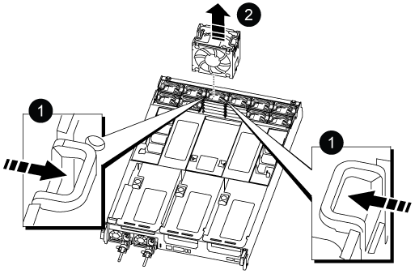
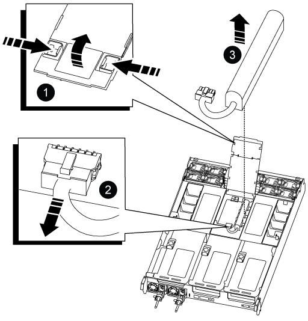
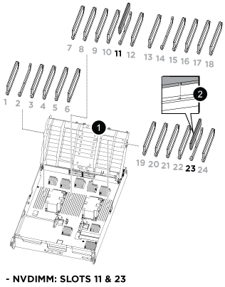

= Étape 1 : retirer le module de contrôleur
:allow-uri-read: 

Pour remplacer le contrôleur, vous devez retirer le contrôleur défectueux, déplacer les composants FRU vers le module de contrôleur de remplacement, installer le module de contrôleur de remplacement dans le châssis, puis démarrer le système en mode maintenance.

== Étape 1 : retirer le module de contrôleur

Vous devez retirer le module de contrôleur du châssis lorsque vous remplacez le module de contrôleur ou remplacez un composant dans le module de contrôleur.

. À l'avant du châssis, enfoncez fermement chaque disque jusqu'à ce que vous sentiez un arrêt positif. Cela permet de s'assurer que les disques sont fermement installés contre le fond de panier central du châssis.
+
image::../media/drw_a800_drive_seated_IEOPS-960.svg[Disques de siège]

. Aller à l'arrière du châssis. Si vous n'êtes pas déjà mis à la terre, mettez-vous à la terre correctement.
. Débranchez les blocs d'alimentation du module de contrôleur de la source.
. Libérez les dispositifs de retenue du câble d'alimentation, puis débranchez les câbles des blocs d'alimentation.
. Desserrez le crochet et la bride de boucle reliant les câbles au dispositif de gestion des câbles, puis débranchez les câbles du système et les modules SFP et QSFP (si nécessaire) du module de contrôleur, en gardant une trace de l'emplacement de connexion des câbles.
+
Laissez les câbles dans le périphérique de gestion des câbles de sorte que lorsque vous réinstallez le périphérique de gestion des câbles, les câbles sont organisés.

. Retirez le périphérique de gestion des câbles du module de contrôleur et mettez-le de côté.
. Appuyez sur les deux loquets de verrouillage, puis faites pivoter les deux loquets vers le bas en même temps.
+
Le module de contrôleur se déplace légèrement hors du châssis.

+
image::../media/drw_a800_pcm_remove.png[Relâchez le module de contrôleur]

+
[cols="1,4"]
|===

 a| 
image:../media/legend_icon_01.png["Légende numéro 1"]
 a| 
Loquet de verrouillage

 a| 
image:../media/legend_icon_02.png["Légende numéro 2"]
 a| 
Goupille de blocage

|===
. Faites glisser le module de contrôleur hors du châssis et placez-le sur une surface plane et stable.
+
Assurez-vous de prendre en charge la partie inférieure du module de contrôleur lorsque vous le faites glisser hors du châssis. .

. Placez le module de commande sur une surface plane et stable.
. Ouvrir le conduit d'air du module de contrôleur :
+
.. Appuyer sur les languettes de verrouillage situées sur les côtés du conduit d'air vers le milieu du module de contrôleur.
.. Faites glisser le conduit d'air vers les modules de ventilateur, puis tournez-le vers le haut jusqu'à sa position complètement ouverte.
+
image::../media/drw_a800_open_air_duct.png[Ouvrir le conduit d'air]

+
[cols="1,4"]
|===

 a| 
image:../media/legend_icon_01.png["Légende numéro 1"]
 a| 
Pattes de verrouillage du conduit d'air

 a| 
image:../media/legend_icon_02.png["Légende numéro 2"]
 a| 
Faire glisser le conduit d'air vers les modules de ventilation

 a| 
image:../media/legend_icon_03.png["Numéro de légende 3"]
 a| 
Tourner la conduite d'air vers les modules de ventilation

|===

== Étape 2 : déplacer les blocs d'alimentation

Vous devez déplacer les blocs d'alimentation du module de contrôleur endommagé vers le module de contrôleur de remplacement lorsque vous remplacez un module de contrôleur.

. Faites tourner la poignée de came de façon à pouvoir tirer le bloc d'alimentation hors du module de contrôleur tout en appuyant sur la patte de verrouillage.
+

CAUTION: L'alimentation est en court-circuit. Utilisez toujours deux mains pour le soutenir lors du retrait du module de contrôleur afin qu'il ne bascule pas brusquement et ne vous blesse pas.

+
image::../media/drw_a800_replace_psu.png[Retirez ou remplacez un bloc d'alimentation]

+
[cols="1,4"]
|===

 a| 
image:../media/legend_icon_01.png["Légende numéro 1"]
 a| 
Languette bleue de verrouillage du bloc d'alimentation

 a| 
image:../media/legend_icon_02.png["Légende numéro 2"]
 a| 
Alimentation électrique

|===
. Déplacez le bloc d'alimentation vers le nouveau module de contrôleur, puis installez-le.
. À l'aide des deux mains, soutenez et alignez les bords du bloc d'alimentation avec l'ouverture du module de contrôleur, puis poussez doucement le bloc d'alimentation dans le module de contrôleur jusqu'à ce que la languette de verrouillage s'enclenche.
+
Les blocs d'alimentation ne s'enclenteront correctement qu'avec le connecteur interne et se verrouillent d'une seule manière.

+

NOTE: Pour éviter d'endommager le connecteur interne, ne pas exercer de force excessive lors du glissement du bloc d'alimentation dans le système.

== Étape 3 : déplacer les ventilateurs

Vous devez déplacer les ventilateurs du module de contrôleur défectueux vers le module de remplacement lors du remplacement d'un module de contrôleur défectueux.

. Retirez le module de ventilateur en pinçant les languettes de verrouillage sur le côté du module de ventilateur, puis en soulevant le module de ventilateur pour le sortir du module de contrôleur.
+

+
|===

 a| 
image:../media/legend_icon_01.png["Légende numéro 1"]

 a| 
Languettes de verrouillage du ventilateur

 a| 
image:../media/legend_icon_02.png["Légende numéro 2"]

 a| 
Module de ventilateur

|===
. Déplacez le module de ventilateur vers le module de contrôleur de remplacement, puis installez le module de ventilateur en alignant ses bords avec l'ouverture du module de contrôleur, puis en faisant glisser le module de ventilateur dans le module de contrôleur jusqu'à ce que les loquets de verrouillage s'enclenchent.
. Répétez ces étapes pour les autres modules de ventilation.

== Étape 4 : déplacez la batterie NVDIMM

Lors du remplacement du module de contrôleur, vous devez déplacer la batterie NVRAM du module de contrôleur défaillant vers le module de contrôleur de remplacement

. Ouvrez le couvercle du conduit d'air et repérez la batterie NVDIMM dans la carte de montage.
+

+
[cols="1,4"]
|===

 a| 
image:../media/legend_icon_01.png["Légende numéro 1"]
 a| 
Rehausse de conduit d'air

 a| 
image:../media/legend_icon_02.png["Légende numéro 2"]
 a| 
Fiche de batterie NVDIMM

 a| 
image:../media/legend_icon_03.png["Numéro de légende 3"]
 a| 
Batterie NVDIMM

|===
+
*Attention :* le voyant de la carte de commande de la batterie NVDIMM clignote pendant la transmission du contenu à la mémoire flash lorsque vous arrêtez le système. Une fois le transfert terminé, le voyant s'éteint.

. Localisez la fiche mâle batterie et appuyez sur le clip situé sur la face de la fiche mâle batterie pour libérer la fiche de la prise, puis débranchez le câble de batterie de la prise.
. Saisissez la batterie et soulevez-la hors du conduit d'air et du module de contrôleur.
. Placez la batterie dans le module de contrôleur de remplacement, puis installez-la dans le conduit d'air NVDIMM :
+
.. Insérez la batterie dans son logement et appuyez fermement sur la batterie pour vous assurer qu'elle est bien verrouillée.
.. Branchez la fiche de la batterie dans la prise de montage et assurez-vous que la fiche se verrouille en place.

== Étape 5 : retirez les cartes de montage PCIe

Dans le cadre du processus de remplacement du contrôleur, vous devez retirer les modules PCIe du module de contrôleur défaillant. Vous devez les installer au même emplacement dans le module de contrôleur de remplacement une fois que les NVDIMMS et les DIMM ont été déplacés vers le module de contrôleur de remplacement.

. Retirez la carte de montage PCIe du module de contrôleur :
+
.. Retirez tous les modules SFP ou QSFP qui peuvent se trouver dans les cartes PCIe.
.. Faites pivoter le loquet de verrouillage de la rehausse sur le côté gauche de la rehausse vers le haut et vers les modules de ventilateur.
+
La carte de montage se soulève légèrement du module de contrôleur.

.. Soulevez la carte de montage, déplacez-la vers les ventilateurs de manière à ce que la lèvre métallique de la carte de montage soit dégagée du bord du module de contrôleur, soulevez la carte de montage pour la sortir du module de contrôleur, puis placez-la sur une surface plane et stable.
+
image::../media/drw_a800_riser_2_3_remove.png[Déposer les rehausses 2 et 3]

+
[cols="1,4"]
|===

 a| 
image:../media/legend_icon_01.png["Légende numéro 1"]
 a| 
Conduit d'air

 a| 
image:../media/legend_icon_02.png["Légende numéro 2"]
 a| 
Verrous de verrouillage de la rehausse 1 (rehausse gauche), de la rehausse 2 (rehausse centrale) et 3 (rehausse droite)

|===

. Répétez l'étape précédente pour les autres surmontoirs du module de commande pour personnes en état de fonctionnement.
. Répétez les étapes ci-dessus avec les surmontoirs vides dans le contrôleur de remplacement et mettez-les à l'écart.

== Étape 6 : déplacement des DIMM système

Pour déplacer les modules DIMM, localisez-les et déplacez-les du contrôleur défaillant vers le contrôleur de remplacement et suivez la séquence d'étapes spécifique.

. Notez l'orientation du module DIMM dans le support afin que vous puissiez insérer le module DIMM dans le module de remplacement dans le bon sens.
. Éjectez le module DIMM de son logement en écartant lentement les deux languettes de l'éjecteur de DIMM de chaque côté du module DIMM, puis en faisant glisser le module DIMM hors de son logement.
+

NOTE: Tenez soigneusement le module DIMM par les bords pour éviter toute pression sur les composants de la carte de circuit DIMM.

. Repérez le logement où vous installez le module DIMM.
. Insérez le module DIMM directement dans le logement.
+
Le module DIMM s'insère bien dans le logement, mais devrait être facilement installé. Si ce n'est pas le cas, réalignez le module DIMM avec le logement et réinsérez-le.

+

NOTE: Inspectez visuellement le module DIMM pour vérifier qu'il est bien aligné et complètement inséré dans le logement.

. Poussez délicatement, mais fermement, sur le bord supérieur du module DIMM jusqu'à ce que les languettes de l'éjecteur s'enclenchent sur les encoches situées aux extrémités du module DIMM.
. Répétez ces étapes pour les autres modules DIMM.

== Étape 7 : déplacez les NVDIMM

Pour déplacer les NVDIMM, localisez-les et déplacez-les du contrôleur défaillant vers le contrôleur de remplacement et suivez la séquence d'étapes spécifique.

. Localisez les NVDIMM de votre module de contrôleur.
+

+
[cols="1,4"]
|===

 a| 
image:../media/legend_icon_01.png["Légende numéro 1"]
 a| 
Conduit d'air

 a| 
image:../media/legend_icon_02.png["Légende numéro 2"]
 a| 
NVDIMM

|===
. Notez l'orientation du NVDIMM dans le support pour pouvoir insérer le NVDIMM dans le module de remplacement du contrôleur dans le bon sens.
. Éjectez le NVDIMM de son logement en écartant lentement les deux languettes d'éjection NVDIMM de chaque côté du NVDIMM, puis faites glisser le NVDIMM hors du support et mettez-le de côté.
+

NOTE: Tenez soigneusement le NVDIMM par les bords pour éviter toute pression sur les composants de la carte de circuit imprimé NVDIMM.

. Localisez le logement où vous installez le NVDIMM.
. Insérez le NVDIMM directement dans le logement.
+
Le NVDIMM s'insère fermement dans le logement, mais devrait être facilement installé. Si ce n'est pas le cas, réalignez le NVDIMM avec le logement et réinsérez-le.

+

NOTE: Inspectez visuellement le NVDIMM pour vérifier qu'il est bien aligné et complètement inséré dans le logement.

. Poussez délicatement, mais fermement, sur le bord supérieur du NVDIMM jusqu'à ce que les languettes de l'éjecteur s'enclenchent au-dessus des encoches aux extrémités du NVDIMM.
. Répétez les étapes précédentes pour déplacer l'autre NVDIMM.

== Étape 8 : déplacer le support de démarrage

Vous devez déplacer le périphérique de support d'amorçage à partir du contrôleur défectueux et l'installer dans le contrôleur de remplacement.

Le support de démarrage est situé sous le surmontoir 3.

. Recherchez le support de démarrage :
+
image::../media/drw_a800_pcm_replace_only_boot_media.png[Retirez le support de démarrage]

+
[cols="1,4"]
|===

 a| 
image:../media/legend_icon_01.png["Légende numéro 1"]
 a| 
Conduit d'air

 a| 
image:../media/legend_icon_02.png["Légende numéro 2"]
 a| 
Carte de montage 3

 a| 
image:../media/legend_icon_03.png["Numéro de légende 3"]
 a| 
Tournevis cruciforme n° 1

 a| 
image:../media/legend_icon_04.png["Numéro de légende 4"]
 a| 
Vis du support de démarrage

 a| 
image:../media/legend_icon_05.png["Numéro de légende 5"]
 a| 
Support de démarrage

|===
. Retirez le support de démarrage du module de contrôleur :
+
.. À l'aide d'un tournevis cruciforme n° 1, retirez la vis qui maintient le support de démarrage et mettez la vis de côté en lieu sûr.
.. Saisissez les côtés du support de coffre, faites pivoter doucement le support de coffre vers le haut, puis tirez le support de coffre hors du support et mettez-le de côté.

. Déplacez le support de démarrage vers le nouveau module de contrôleur et installez-le :
+
.. Alignez les bords du support de coffre avec le logement de la prise, puis poussez-le doucement d'équerre dans le support.
.. Faites pivoter le support de démarrage vers le bas, vers la carte mère.
.. Fixez le support de démarrage à la carte mère à l'aide de la vis du support de démarrage.
+
Ne serrez pas trop la vis pour éviter d'endommager le support de démarrage.

== Étape 9 : installez les cartes de montage PCIe

Vous installez les cartes de montage PCIe dans le module de contrôleur de remplacement après avoir déplaçant les modules DIMM, les NVDIMM et le support de démarrage.

. Installez la carte de montage dans le module de contrôleur de remplacement :
+
.. Alignez la lèvre de la carte de montage avec la partie inférieure de la tôle du module de contrôleur.
.. Guidez la carte de montage le long des broches du module de contrôleur, puis abaissez la carte de montage dans le module de contrôleur.
.. Faites pivoter le loquet de verrouillage vers le bas et cliquez dessus en position verrouillée.
+
Lorsqu'il est verrouillé, le loquet de verrouillage est aligné avec le haut de la carte de montage et la carte de montage est placée directement dans le module de contrôleur.

.. Réinsérez tous les modules SFP ou QSFP qui ont été retirés des cartes PCIe.

. Répétez l'étape précédente pour les autres cartes de montage PCIe.

== Étape 10 : installer le module de contrôleur

Après avoir déplacé tous les composants du module de contrôleur défaillant vers le module de contrôleur de remplacement, vous devez installer le module de contrôleur de remplacement dans le châssis, puis le démarrer en mode maintenance.

. Si ce n'est déjà fait, fermer le conduit d'air :
+
.. Faire basculer la conduite d'air complètement vers le bas jusqu'au module de commande.
.. Faites glisser la conduite d'air vers les surmontoirs jusqu'à ce que les pattes de verrouillage s'enclenchent.
.. Inspecter le conduit d'air pour s'assurer qu'il est correctement installé et verrouillé en place.
+
image::../media/drw_a700s_close_air_duct.png[Fermer le conduit d'air]

+
[cols="1,4"]
|===

 a| 
image:../media/legend_icon_01.png["Légende numéro 1"]
 a| 
Languettes de verrouillage

 a| 
image:../media/legend_icon_02.png["Légende numéro 2"]
 a| 
Faire glisser le plongeur

|===

. Alignez l'extrémité du module de contrôleur avec l'ouverture du châssis, puis poussez doucement le module de contrôleur à mi-course dans le système.
+

NOTE: N'insérez pas complètement le module de contrôleur dans le châssis tant qu'il n'y a pas été demandé.

. Reliez uniquement les ports de gestion et de console, de sorte que vous puissiez accéder au système pour effectuer les tâches décrites dans les sections ci-après.
+

NOTE: Vous connecterez le reste des câbles au module de contrôleur plus loin dans cette procédure.

. Terminez la réinstallation du module de contrôleur :
+
.. Poussez fermement le module de contrôleur dans le châssis jusqu'à ce qu'il rencontre le fond de panier central et qu'il soit bien en place.
+
Les loquets de verrouillage se montent lorsque le module de contrôleur est bien en place.

+

NOTE: Ne forcez pas trop lorsque vous faites glisser le module de contrôleur dans le châssis pour éviter d'endommager les connecteurs.

+
Le module de contrôleur commence à démarrer dès qu'il est complètement inséré dans le châssis. Soyez prêt à interrompre le processus de démarrage.

.. Faites pivoter les loquets de verrouillage vers le haut, inclinez-les de manière à dégager les goupilles de verrouillage, puis abaissez-les en position verrouillée.
.. Interrompre le processus de démarrage normal en appuyant sur `Ctrl-C`.

. Branchez les câbles système et les modules émetteurs-récepteurs dans le module de contrôleur et réinstallez le périphérique de gestion des câbles.
. Branchez les câbles d'alimentation dans les blocs d'alimentation et réinstallez les dispositifs de retenue des câbles d'alimentation.
+

NOTE: Si votre système est équipé de blocs d'alimentation CC, assurez-vous que les vis à molette du câble du bloc d'alimentation sont serrées.

