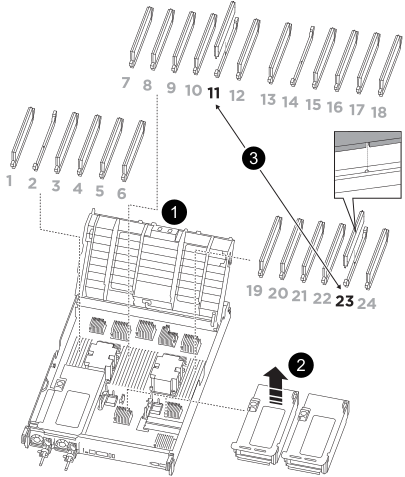

= 
:allow-uri-read: 

.Étapes
. Accédez au NVDIMM en déverrouillant le loquet de verrouillage sur la colonne montante appropriée, puis retirez la colonne montante.
+

+
[cols="1,4"]
|===

 a| 
image:../media/icon_round_1.png["Légende numéro 1"]
 a| 
Couvercle de conduit d'air

 a| 
image:../media/icon_round_2.png["Légende numéro 2"]
 a| 
Carte de montage 2

 a| 
image:../media/icon_round_3.png["Numéro de légende 3"]
 a| 
NVDIMM dans les emplacements 11 et 23

|===
. Notez l'orientation du NVDIMM dans le support pour pouvoir insérer le NVDIMM dans le module de remplacement du contrôleur dans le bon sens.
. Éjectez le NVDIMM de son logement en écartant lentement les deux languettes d'éjection NVDIMM de chaque côté du NVDIMM, puis faites glisser le NVDIMM hors du support et mettez-le de côté.
+

NOTE: Tenez soigneusement le NVDIMM par les bords pour éviter toute pression sur les composants de la carte de circuit imprimé NVDIMM.

. Retirez le NVDIMM de remplacement du sac d'expédition antistatique, tenez le NVDIMM par les coins, puis alignez-le sur le logement.
+
L'encoche entre les broches du NVDIMM doit être alignée avec la languette du support.

. Localisez le logement où vous installez le NVDIMM.
. Insérez le NVDIMM directement dans le logement.
+
Le NVDIMM s'insère fermement dans le logement, mais devrait être facilement installé. Si ce n'est pas le cas, réalignez le NVDIMM avec le logement et réinsérez-le.

+

NOTE: Inspectez visuellement le NVDIMM pour vérifier qu'il est bien aligné et complètement inséré dans le logement.

. Poussez délicatement, mais fermement, sur le bord supérieur du NVDIMM jusqu'à ce que les languettes de l'éjecteur s'enclenchent au-dessus des encoches aux extrémités du NVDIMM.
. Réinstallez les cartes de montage que vous avez retirées du module de contrôleur.
. Fermer le conduit d'air.

