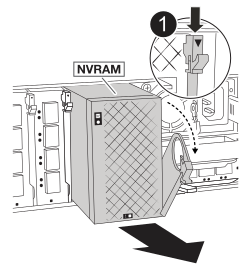

= Étape 1 : retirez les blocs d'alimentation et les câbles
:allow-uri-read: 

== Étape 1 : retirez les blocs d'alimentation et les câbles

Vous devez retirer les deux blocs d'alimentation (PSU) avant de retirer le contrôleur.

.Étapes
. Retirez les blocs d'alimentation :
+
.. Si vous n'êtes pas déjà mis à la terre, mettez-vous à la terre correctement.
.. Débranchez les cordons d’alimentation des blocs d’alimentation.
+
Si votre système est alimenté en courant continu, débranchez le bloc d'alimentation des blocs d'alimentation.

.. Retirez les deux blocs d'alimentation de l'arrière du châssis en faisant pivoter la poignée du bloc d'alimentation vers le haut afin de pouvoir retirer le bloc d'alimentation, appuyez sur la languette de verrouillage du bloc d'alimentation, puis retirez le bloc d'alimentation du châssis.
+

CAUTION: Le bloc d'alimentation est court-circuité. Utilisez toujours deux mains pour le soutenir lors du retrait du module de contrôleur afin qu'il ne bascule pas brusquement et ne vous blesse pas.

+
image::../media/drw_a1k_psu_remove_replace_ieops-1378.svg[Retirer ou remplacer le bloc d'alimentation]

+
[cols="1,4"]
|===

 a| 
image:../media/icon_round_1.png["Légende numéro 1"]
 a| 
Languette de verrouillage du bloc d'alimentation en terre cuite

|===
.. Répétez ces étapes pour le deuxième bloc d’alimentation.

. Retirez les câbles :
+
.. Débranchez les câbles système et les modules SFP et QSFP (si nécessaire) du module de contrôleur, mais laissez-les dans le périphérique de gestion des câbles pour les organiser.
+

NOTE: Les câbles doivent avoir été étiquetés au début de cette procédure.

.. Retirez le dispositif de gestion des câbles du châssis et mettez-le de côté.

== Étape 2 : Retirez les cartes d’E/S, la NVRAM12 et le module de gestion du système

. Retirez le module d'E/S cible du châssis :
+
image:../media/drw_a1k_io_remove_replace_ieops-1382.svg["Retirez le module d'E/S."]

+
[cols="1,4"]
|===

 a| 
image:../media/icon_round_1.png["Légende numéro 1"]
 a| 
Loquet de came d'E/S.

|===
+
.. Appuyer sur le bouton de came du module cible.
.. Faites tourner le loquet de came aussi loin que possible du module.
.. Retirez le module du châssis en accrochant votre doigt dans l'ouverture du levier à came et en tirant le module hors du châssis.
+
Assurez-vous de garder une trace de l'emplacement dans lequel se trouvait le module d'E/S.

.. Mettez le module d’E/S de côté et répétez ces étapes pour tous les autres modules d’E/S.

. Retirez le module NVRAM12 :
+
.. Appuyer sur le bouton de came de verrouillage.
+
Le bouton de came s'éloigne du châssis.

.. Faites pivoter le loquet de came le plus loin possible.
.. Retirez le module NVRAM du châssis en accrochant votre doigt dans l'ouverture du levier de came et en tirant le module hors du châssis.
+

+
[cols="1,4"]
|===

 a| 
image:../media/icon_round_1.png["Légende numéro 1"]
| Loquet à came NVRAM12 
|===
.. Placez le module NVRAM sur une surface stable.

. Supprimer le module de gestion du système :
+
.. Appuyez sur le bouton CAM du module de gestion du système.
.. Faites tourner le levier de came vers le bas aussi loin que possible.
.. Enroulez votre doigt dans le trou du levier de came et tirez le module hors du système.
+
image::../media/drw_a1k_sys-mgmt_remove_ieops-1384.svg[Gestion du système supprimer]

+
[cols="1,4"]
|===

 a| 
image::../media/icon_round_1.png[Légende numéro 1]
 a| 
Loquet de came du module de gestion du système

|===

== Étape 3 : retirez le module de contrôleur

. À l'avant de l'unité, accrochez vos doigts dans les trous des cames de verrouillage, appuyez sur les languettes des leviers de came et faites doucement, mais fermement pivoter les deux loquets vers vous en même temps.
+
Le module de contrôleur se déplace légèrement hors du châssis.

+
image::../media/drw_a1k_pcm_remove_replace_ieops-1375.svg[Supprimer le graphique du contrôleur]

+
[cols="1,4"]
|===

 a| 
image:../media/icon_round_1.png["Légende numéro 1"]
| Verrouillage des verrous de came 
|===
. Faites glisser le module de contrôleur hors du châssis et placez-le sur une surface plane et stable.
+
Assurez-vous de prendre en charge la partie inférieure du module de contrôleur lorsque vous le faites glisser hors du châssis.

== Étape 4 : Remplacer le châssis endommagé

Retirez le châssis défectueux et installez le châssis de remplacement.

.Étapes
. Retirez le châssis défectueux :
+
.. Retirez les vis des points de montage du châssis.
.. Faites glisser le châssis endommagé hors des rails du rack dans une armoire système ou un rack d'équipement, puis mettez-le de côté.

. Installez le châssis de remplacement :
+
.. Installez le châssis de remplacement dans le rack d'équipement ou l'armoire système en guidant le châssis sur les rails du rack dans une armoire système ou un rack d'équipement.
.. Faites glisser le châssis complètement dans le rack de l'équipement ou l'armoire système.
.. Fixez l'avant du châssis au rack de l'équipement ou à l'armoire système à l'aide des vis que vous avez retirées du châssis défectueux.

== Étape 5 : Installer les composants du châssis

Une fois le châssis de remplacement installé, vous devez installer le module de contrôleur, recâbler les modules d'E/S et le module de gestion du système, puis réinstaller et brancher les blocs d'alimentation.

.Étapes
. Installez le module de contrôleur :
+
.. Alignez l’extrémité du module de contrôleur avec l’ouverture à l’avant du châssis, puis poussez doucement le contrôleur jusqu’au bout dans le châssis.
.. Faites pivoter les loquets de verrouillage en position verrouillée.

. Installer les cartes E/S à l'arrière du châssis :
+
.. Alignez l'extrémité du module d'E/S avec le même emplacement dans le châssis de remplacement que dans le châssis endommagé, puis poussez doucement le module jusqu'au fond du châssis.
.. Faites pivoter le loquet à came vers le haut jusqu'à la position verrouillée.
.. Répétez ces étapes pour tous les autres modules d’E/S.

. Installez le module de gestion du système à l'arrière du châssis :
+
.. Alignez l’extrémité du module de gestion du système avec l’ouverture du châssis, puis poussez doucement le module jusqu’au fond du châssis.
.. Faites pivoter le loquet à came vers le haut jusqu'à la position verrouillée.
.. Si vous ne l’avez pas déjà fait, réinstallez le dispositif de gestion des câbles et reconnectez les câbles aux cartes d’E/S et au module de gestion du système.
+

NOTE: Si vous avez retiré les convertisseurs de support (QSFP ou SFP), n'oubliez pas de les réinstaller.

+
Assurez-vous que les câbles sont connectés conformément aux étiquettes des câbles.

. Installez le module NVRAM12 à l'arrière du châssis à l'arrière du châssis :
+
.. Alignez l’extrémité du module NVRAM12 avec l’ouverture du châssis, puis poussez doucement le module jusqu’au fond du châssis.
.. Faites pivoter le loquet à came vers le haut jusqu'à la position verrouillée.

. Installer les blocs d'alimentation :
+
.. À l’aide de vos deux mains, soutenez et alignez les bords du bloc d’alimentation avec l’ouverture du châssis.
.. Poussez doucement le bloc d’alimentation dans le châssis jusqu’à ce que la languette de verrouillage s’enclenche.
+
Les blocs d'alimentation ne s'enclenteront correctement qu'avec le connecteur interne et se verrouillent d'une seule manière.

+

NOTE: Pour éviter d'endommager le connecteur interne, ne forcez pas trop lorsque vous faites glisser le bloc d'alimentation dans le système.

. Reconnectez les câbles d’alimentation du bloc d’alimentation aux deux blocs d’alimentation et fixez chaque câble d’alimentation au bloc d’alimentation à l’aide du dispositif de retenue du câble d’alimentation.
+
Si vous disposez d'une alimentation CC, reconnectez le bloc d'alimentation aux blocs d'alimentation une fois le module de contrôleur entièrement installé dans le châssis et fixez le câble d'alimentation au bloc d'alimentation à l'aide des vis moletées.

+
Les modules de contrôleur commencent à démarrer dès que les blocs d'alimentation sont installés et que l'alimentation est rétablie.

