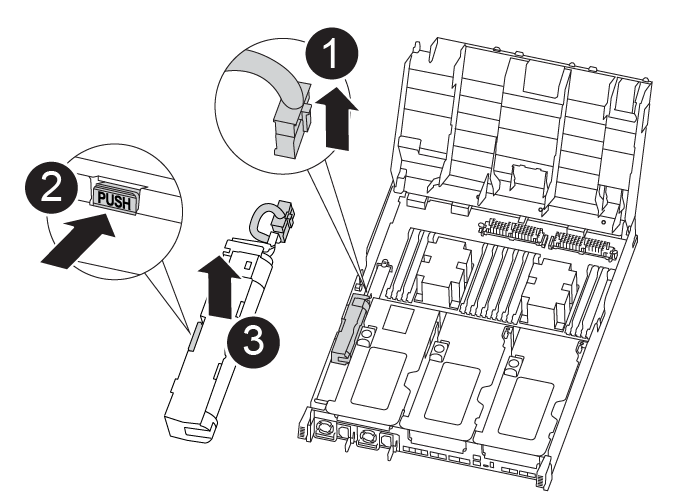

= 
:allow-uri-read: 

Pour déplacer la batterie NVDIMM du module de contrôleur défaillant vers le module de contrôleur de remplacement, vous devez effectuer une séquence spécifique d'étapes.

Vous pouvez utiliser l'animation, l'illustration ou les étapes écrites suivantes pour déplacer la batterie NVDIMM du module de contrôleur pour facultés affaiblies vers le module de contrôleur de remplacement.

.Animation : déplacez la batterie NVDIMM
video::94d115b2-b02a-4234-805c-aad9012f204c[panopto]

[cols="10,90"]
|===

 a| 
image:../media/icon_round_1.png["Légende numéro 1"]
 a| 
Fiche de batterie NVDIMM

 a| 
image:../media/icon_round_2.png["Légende numéro 2"]
 a| 
Languette de verrouillage de la batterie NVDIMM

 a| 
image:../media/icon_round_3.png["Numéro de légende 3"]
 a| 
Batterie NVDIMM

|===
.Étapes
. Ouvrir le conduit d'air :
+
.. Appuyer sur les pattes de verrouillage situées sur les côtés du conduit d'air vers le milieu du module de commande.
.. Faites glisser le conduit d'air vers l'arrière du module de commande, puis faites-le pivoter vers le haut jusqu'à sa position complètement ouverte.

. Localisez la batterie NVDIMM dans le module de contrôleur.
. Localisez la fiche mâle batterie et appuyez sur le clip situé sur la face de la fiche mâle batterie pour libérer la fiche de la prise, puis débranchez le câble de batterie de la prise.
. Saisissez la batterie et appuyez sur la languette de verrouillage bleue indiquant « POUSSER », puis soulevez la batterie pour la sortir du support et du module de contrôleur.
. Placer la batterie sur le module de contrôleur de remplacement.
. Alignez le module de batterie avec l'ouverture prévue pour la batterie, puis poussez délicatement la batterie dans son logement jusqu'à ce qu'elle se verrouille en place.
+

NOTE: Ne rebranchez pas le câble de la batterie sur la carte mère tant que vous n'y êtes pas invité.

