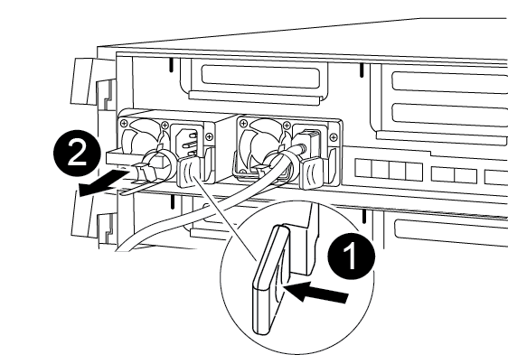

= 
:allow-uri-read: 

Lorsque vous remplacez un module de contrôleur, vous devez déplacer le bloc d'alimentation du module de contrôleur endommagé vers le module de contrôleur de remplacement.

Vous pouvez utiliser l'animation, l'illustration ou les étapes écrites suivantes pour déplacer les blocs d'alimentation vers le module de contrôleur de remplacement.

.Animation - déplacer les blocs d'alimentation
video::92060115-1967-475b-b517-aad9012f130c[panopto]
.Étapes
. Retirer l'alimentation électrique :
+

+
[cols="10,90"]
|===

 a| 
image:../media/icon_round_1.png["Légende numéro 1"]
 a| 
Languette de verrouillage du bloc d'alimentation

 a| 
image:../media/icon_round_2.png["Légende numéro 2"]
 a| 
Dispositif de retenue du câble d'alimentation

|===
+
.. Faites pivoter la poignée de came de façon à ce qu'elle puisse être utilisée pour extraire le bloc d'alimentation du châssis.
.. Appuyez sur la languette de verrouillage bleue pour dégager le bloc d'alimentation du châssis.
.. A l'aide des deux mains, retirez le bloc d'alimentation du châssis, puis mettez-le de côté.

. Déplacez le bloc d'alimentation vers le nouveau module de contrôleur, puis installez-le.
. À l'aide des deux mains, soutenez et alignez les bords du bloc d'alimentation avec l'ouverture du module de contrôleur, puis poussez doucement le bloc d'alimentation dans le module de contrôleur jusqu'à ce que la languette de verrouillage s'enclenche.
+
Les blocs d'alimentation ne s'enclenteront correctement qu'avec le connecteur interne et se verrouillent d'une seule manière.

+

NOTE: Pour éviter d'endommager le connecteur interne, ne pas exercer de force excessive lors du glissement du bloc d'alimentation dans le système.

. Répétez les étapes précédentes pour les blocs d'alimentation restants.

