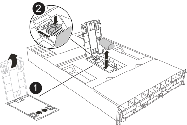

= Étape 1 : arrêtez le contrôleur défaillant
:allow-uri-read: 

.Description de la tâche
Cette procédure s'applique au remplacement d'une pile NV défectueuse pour le module NVRAM situé dans les emplacements 4 et 5 du contrôleur AFX 2K. Pour obtenir des informations sur le remplacement de la pile NV pour le module NVRAM12-EX dans les emplacements 6 et 7 du contrôleur AFX 2K, consultez link:../install-setup/nv12l-replace.html#step-2-replace-the-nvram12-ex-module-nvram-dimm-or-nvram-battery["Remplacez la batterie NV pour la NVRAM12-EX"].

== Étape 1 : arrêtez le contrôleur défaillant

Arrêtez ou prenez le contrôle du contrôleur défectueux.

Prenez le contrôle et arrêtez le contrôleur défaillant afin que le contrôleur fonctionnel continue de fournir les données provenant du stockage du contrôleur défaillant. Pour ce faire, vous supprimez la création automatique de cas dans AutoSupport, désactivez la restitution automatique et amenez le contrôleur défaillant à l'invite LOADER. L'invite LOADER correspond à l'état d'arrêt sécurisé à partir duquel vous pouvez remplacer la FRU.

.Description de la tâche
* Si vous avez un cluster avec plus de quatre nœuds, il doit être en quorum.  Pour afficher les informations de cluster sur vos nœuds, utilisez le `cluster show` commande.  Pour plus d'informations sur le `cluster show` commande, voirlink:https://docs.netapp.com/us-en/ontap/system-admin/display-nodes-cluster-task.html["Afficher les détails au niveau du nœud dans un cluster ONTAP"^] .
* Si le cluster n'est pas en quorum ou si l'état ou l'éligibilité d'un contrôleur (autre que le contrôleur altéré) s'affiche comme faux, vous devez corriger le problème avant d'arrêter le contrôleur altéré. Voir link:https://docs.netapp.com/us-en/ontap/system-admin/synchronize-node-cluster-task.html?q=Quorum["Synchroniser un nœud avec le cluster"^] .

.Étapes
. Si AutoSupport est activé, supprimez la création automatique de dossier en invoquant un message AutoSupport :
+
`system node autosupport invoke -node * -type all -message MAINT=<# of hours>h`

+
Le message AutoSupport suivant supprime la création automatique de dossiers pendant deux heures :

+
`cluster1:> system node autosupport invoke -node * -type all -message MAINT=2h`

. Désactiver le retour automatique depuis la console du contrôleur défaillant :
+
`storage failover modify -node impaired-node -auto-giveback-of false`

+

NOTE: Lorsque vous voyez _Voulez-vous désactiver la restitution automatique ?_, entrez `y` .

. Faites passer le contrôleur douteux à l'invite DU CHARGEUR :
+
[cols="1,2"]
|===
| Si le contrôleur en état de fonctionnement s'affiche... | Alors... 

 a| 
Invite DU CHARGEUR
 a| 
Passez à l'étape suivante.

 a| 
Invite système ou invite de mot de passe
 a| 
Prendre le relais ou arrêter le contrôleur altéré à partir du contrôleur sain :
`storage failover takeover -ofnode _impaired_node_name_ -halt _true_`

Le paramètre _-halt true_ amène le nœud altéré à l'invite LOADER.

|===

== Étape 2 : retirer le module de contrôleur

Vous devez retirer le module de contrôleur du boîtier lorsque vous remplacez le module de contrôleur ou un composant à l'intérieur du module de contrôleur.

. Vérifiez la LED d'état NVRAM située dans l'emplacement 4/5 et la LED d'état NVRAM12-EX dans l'emplacement 6/7 du système. Il y a également une LED NVRAM sur la face avant du module contrôleur. Recherchez l'icône NV :
+
image::../media/drw_a1K-70-90_nvram-led_ieops-1463.svg[Emplacement graphique de la LED d'avertissement et d'état de la NVRAM]

+
[cols="1,4"]
|===

2+| *NVRAM* 

 a| 
image:../media/icon_round_1.png["Légende numéro 1"]
 a| 
LED d'état NVRAM

 a| 
image:../media/icon_round_2.png["Légende numéro 2"]
 a| 
LED d'avertissement NVRAM

|===
+
image::../media/drw_afx_emr_nvram-led_ieops-2962.svg[Schéma de l'emplacement des LED d'attention et d'état NVRAM12-EX]

+
[cols="1,4"]
|===

2+| *NVRAM12-EX* 

 a| 
image:../media/icon_round_1.png["Légende numéro 1"]
 a| 
LED d'état NVRAM12-EX

 a| 
image:../media/icon_round_2.png["Légende numéro 2"]
 a| 
LED d'attention NVRAM12-EX

|===
+
** Si le voyant NV est éteint, passez à l'étape suivante.
** Si le voyant NV clignote, attendez l'arrêt du clignotement. Si le clignotement continue pendant plus de 5 minutes, contactez le support technique pour obtenir de l'aide.

. Si vous n'êtes pas déjà mis à la terre, mettez-vous à la terre correctement.
. Retirez la lunette (si nécessaire) à deux mains, en saisissant les ouvertures de chaque côté de la lunette et en tirant vers vous jusqu'à ce que la lunette se détache des rotules sur le cadre du châssis.
. À l'avant de l'unité, accrochez vos doigts dans les trous des cames de verrouillage, appuyez sur les languettes des leviers de came et faites doucement, mais fermement pivoter les deux loquets vers vous en même temps.
+
Le module de contrôleur se déplace légèrement hors du boîtier.

+
image::../media/drw_a1k_pcm_remove_replace_ieops-1375.svg[Supprimer le graphique du contrôleur]

+
[cols="1,4"]
|===

 a| 
image:../media/icon_round_1.png["Légende numéro 1"]
| Verrouillage des verrous de came 
|===
. Faites glisser le module de contrôleur hors du boîtier et placez-le sur une surface plane et stable.
+
Assurez-vous de soutenir le bas du module de contrôleur lorsque vous le faites glisser hors du boîtier.

== Étape 3 : remplacez la batterie NV

Retirez la batterie NV défectueuse du module de contrôleur et installez la batterie NV de remplacement.

. Ouvrez le couvercle du conduit d'air et localisez la batterie NV.
+

+
[cols="1,4"]
|===

 a| 
image:../media/icon_round_1.png["Légende numéro 1"]
| Couvercle du conduit d'air de la batterie NV 

 a| 
image:../media/icon_round_2.png["Légende numéro 2"]
 a| 
Fiche mâle batterie NV

|===
. Soulevez la batterie pour accéder à la prise mâle batterie.
. Appuyez sur le clip situé à l'avant de la fiche mâle batterie pour la débrancher de la prise, puis débranchez le câble de batterie de la prise.
. Retirez la batterie du conduit d'air et du module de contrôleur, puis mettez-la de côté.
. Retirez la batterie de rechange de son emballage.
. Installez la batterie de remplacement dans le contrôleur :
+
.. Branchez la fiche de la batterie dans la prise de montage et assurez-vous que la fiche se verrouille en place.
.. Insérez la batterie dans son logement et appuyez fermement sur la batterie pour vous assurer qu'elle est bien verrouillée.

. Fermez le couvercle du conduit d'air NV.
+
Assurez-vous que la fiche se verrouille dans la prise.

== Étape 4 : réinstallez le module de contrôleur

Réinstallez le module de contrôleur et démarrez-le.

. Assurez-vous que le conduit d'air est complètement fermé en le faisant tourner jusqu'en butée.
+
Il doit être aligné sur la tôle du module de contrôleur.

. Alignez l'extrémité du module de contrôleur avec l'ouverture du boîtier, puis faites glisser le module de contrôleur dans le châssis, les leviers tournés vers l'avant du système.
. Une fois que le module de contrôleur vous empêche de le faire glisser plus loin, faites pivoter les poignées de came vers l'intérieur jusqu'à ce qu'elles se reverrouillent sous les ventilateurs
+

NOTE: N'appliquez pas une force excessive lorsque vous faites glisser le module de contrôleur dans le boîtier pour éviter d'endommager les connecteurs.

+
Le module de contrôleur commence à démarrer dès qu'il est complètement inséré dans le boîtier.

. Alignez la lunette avec les rotules, puis poussez doucement la lunette en place.
. Appuyez sur <enter> lorsque les messages de la console s'arrêtent.
+
** Si vous voyez l’invite de connexion, passez à l’étape suivante.
** Si vous ne voyez pas d’invite de connexion, connectez-vous au nœud partenaire.

. Renvoyer uniquement la racine avec l'option override-destination-checks :
+
`storage failover giveback -ofnode impaired-node -only-root true -override -destination-checks true`

+

NOTE: La commande suivante n’est disponible que dans le niveau de privilège du mode Diagnostic.  Pour plus d'informations sur les niveaux de privilège, voirlink:https://docs.netapp.com/us-en/ontap/system-admin/administrative-privilege-levels-concept.html["Comprendre les niveaux de privilèges pour les commandes CLI ONTAP"^] .

+
Si vous rencontrez des erreurs, contactez https://support.netapp.com["Support NetApp"].

. Attendez 5 minutes après la fin du rapport de retour, puis vérifiez le basculement et l'état de retour :
+
`storage failover show`et `storage failover show-giveback`

+

NOTE: La commande suivante n’est disponible que dans le niveau de privilège du mode Diagnostic.

. Si le retour automatique a été désactivé, réactivez-le :
+
`storage failover modify -node local -auto-giveback-of true`

. Remettre le contrôleur défectueux en fonctionnement normal en réutilisant son espace de stockage :
+
`storage failover giveback -ofnode _impaired_node_name_`

. Si AutoSupport est activé, restaurer/annuler la suppression de la création automatique de cas :
+
`system node autosupport invoke -node * -type all -message MAINT=END`

== Étape 5 : renvoyer la pièce défaillante à NetApp

Retournez la pièce défectueuse à NetApp, tel que décrit dans les instructions RMA (retour de matériel) fournies avec le kit. Voir la https://mysupport.netapp.com/site/info/rma["Retour de pièces et remplacements"] page pour plus d'informations.
