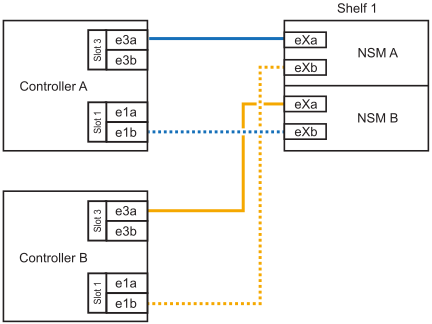

= 
:allow-uri-read: 

Vous pouvez ajouter à chaud jusqu'à deux tiroirs NS224 à une paire HA AFF A20, AFF A30, AFF C30, AFF A50 ou AFF C60 lorsque du stockage supplémentaire est nécessaire (dans le tiroir interne).

.Avant de commencer
* Vous devez avoir examiné le link:requirements-hot-add-shelf.html["exigences et bonnes pratiques à ajouter à chaud"].
* Vous devez avoir effectué les procédures applicables dans link:prepare-hot-add-shelf.html["Préparez l'ajout à chaud d'une étagère"].
* Vous devez avoir installé les tiroirs, les mettre sous tension et définir les ID de tiroir comme décrit dans la section link:prepare-hot-add-shelf.html["Installation d'un tiroir pour ajouter à chaud"].

.Description de la tâche
* Pour effectuer cette procédure, nous part du principe que votre paire haute disponibilité ne dispose que d'un stockage interne (pas de tiroirs externes). Dans l'un des cas suivants :
+
** Ajout à chaud d'un tiroir supplémentaire pour le AFF A20.
** Ajout à chaud de deux tiroirs supplémentaires et de deux modules d'E/S compatibles RoCE dans chaque contrôleur pour AFF A30, AFF C30, AFF A50 ou AFF C60.

* Cette procédure concerne les scénarios d'ajout à chaud suivants :
+
** Ajout à chaud du premier tiroir à une paire haute disponibilité avec un module d'E/S compatible RoCE dans chaque contrôleur.
** Ajout à chaud du premier tiroir à une paire haute disponibilité avec deux modules d'E/S compatibles RoCE dans chaque contrôleur.
** Ajout à chaud du second tiroir à une paire haute disponibilité avec deux modules d'E/S compatibles RoCE dans chaque contrôleur.

* Ces systèmes sont compatibles avec les tiroirs NS224 avec les modules NSM100 et les tiroirs NS224 avec les modules NSM100B. Pour vous assurer que vous connectez les contrôleurs aux ports appropriés, remplacez le « X » de chaque schéma par le numéro de port correct pour votre module :
+
[cols="1,4"]
|===
| Type de module | Étiquetage des ports 

 a| 
NSM100
 a| 
« 0 »

ex. e0a

 a| 
NSM100B
 a| 
« 1 »

ex. e1a

|===

.Étapes
. Si vous ajoutez un tiroir à chaud à l'aide d'un ensemble de ports compatibles RoCE (un module d'E/S compatible RoCE) dans chaque module de contrôleur, et qu'il s'agit du seul tiroir NS224 de votre paire haute disponibilité, procédez comme suit.
+
Dans le cas contraire, passez à l'étape suivante.

+

NOTE: Cette étape suppose que vous avez installé le module d'E/S compatible RoCE dans le logement 3.

+
.. Armoire de câbles NSM A, port EXA, vers le connecteur 3 a (e3a) du contrôleur A.
.. Chemin de câbles du port EXB NSM A vers le port b (e3b) du connecteur 3 du contrôleur B.
.. Connecteur EXA du NSM B de l'étagère de câbles vers le port a (e3a) du connecteur 3 du contrôleur B.
.. Chemin de câbles du port EXB NSM B vers le port b (e3b) du connecteur 3 du contrôleur A.
+
L'illustration suivante montre le câblage d'un tiroir ajouté à chaud avec un module d'E/S compatible RoCE dans chaque module de contrôleur :

+
image::../media/drw_ns224_g_1shelf_1card_ieops-2002.svg[Câblage pour AFF A20,452px,AFF C30]

. Si vous ajoutez un ou deux tiroirs à chaud avec deux ensembles de ports compatibles RoCE (deux modules d'E/S compatibles RoCE) dans chaque module de contrôleur, procédez aux sous-étapes applicables.
+

NOTE: Cette étape suppose que vous avez installé les modules d'E/S compatibles RoCE dans les connecteurs 3 et 1.

+
[cols="1,3"]
|===
| Tiroirs | Câblage 

 a| 
Etagère 1
 a| 
.. Reliez le port EXA du NSM A au port A (e3a) du contrôleur a 3.
.. Reliez le port EXB du NSM A au port b (e1b) de l'emplacement 1 du contrôleur B.
.. Reliez le port EXA du NSM B au port a (e3a) de l'emplacement 3 du contrôleur B.
.. Reliez le port EXB du NSM B au port b (e1b) de l'emplacement 1 du contrôleur A.
.. Si vous ajoutez à chaud une deuxième étagère, complétez les sous-étapes "shellf 2" ; sinon, passez à l'étape 3.

L'illustration suivante montre le câblage d'un tiroir à ajout à chaud utilisant deux modules d'E/S compatibles RoCE dans chaque module de contrôleur :

 a| 
Etagère 2
 a| 
.. Reliez le port EXA du NSM A au port A du contrôleur a 1 (e1a).
.. Reliez le port EXB du NSM A au port b (e3b) du connecteur 3 du contrôleur B.
.. Reliez le port EXA du NSM B au port a (e1a) de l'emplacement 1 du contrôleur B.
.. Reliez le port EXB du NSM B au port b (e3b) du connecteur 3 du contrôleur A.
.. Passez à l'étape 3.

L'illustration suivante montre le câblage de deux tiroirs à ajout à chaud utilisant deux modules d'E/S compatibles RoCE dans chaque module de contrôleur :

image::../media/drw_ns224_g_2shelf_2card_ieops-2003.svg[Câblage pour AFF A20,452px,AFF C30]

|===
. Vérifiez que le tiroir ajouté à chaud est correctement câblé à l'aide de https://mysupport.netapp.com/site/tools/tool-eula/activeiq-configadvisor["Active IQ Config Advisor"^].
+
Si des erreurs de câblage sont générées, suivez les actions correctives fournies.

.Et la suite ?
Si vous avez désactivé l'affectation automatique de disque dans le cadre de votre préparation, vous devez attribuer manuellement la propriété des disques, puis réactiver l'affectation automatique de disque, si nécessaire. Allez à link:complete-hot-add-shelf.html["Terminez l'ajout à chaud"].

Sinon, vous effectuez l'ajout à chaud d'un tiroir.
