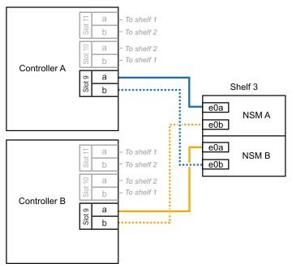
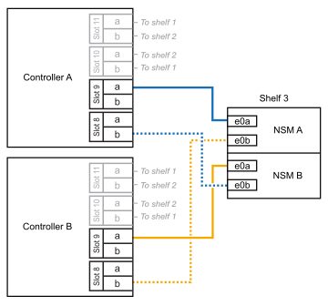

= 
:allow-uri-read: 

.Avant de commencer
* Vous devez avoir examiné le link:requirements-hot-add-shelf.html["exigences et bonnes pratiques à ajouter à chaud"].
* Vous devez avoir effectué les procédures applicables dans link:prepare-hot-add-shelf.html["Préparez-vous à ajouter une étagère à chaud"].
* Vous devez avoir installé les tiroirs, les mettre sous tension et définir les ID de tiroir comme décrit dans la section link:prepare-hot-add-shelf.html["Installation d'un tiroir pour ajouter à chaud"].

.Description de la tâche
* Pour effectuer cette procédure, vous devez dans une paire haute disponibilité disposer d'au moins un tiroir NS224 existant.
* Cette procédure concerne les scénarios d'ajout à chaud suivants :
+
** Ajout à chaud d'un second tiroir à une paire haute disponibilité avec deux modules d'E/S compatibles RoCE dans chaque contrôleur. (Vous avez installé un deuxième module d'E/S et recâbler le premier tiroir sur les deux modules d'E/S ou le premier tiroir sur deux modules d'E/S. Vous connectez le second tiroir aux deux modules d'E/S).
** Ajout à chaud d'un troisième tiroir à une paire haute disponibilité avec trois modules d'E/S compatibles RoCE dans chaque contrôleur. (Vous avez installé un troisième module d'E/S et câblerez le troisième tiroir au troisième module d'E/S uniquement).
** Ajout à chaud d'un troisième tiroir à une paire haute disponibilité avec quatre modules d'E/S compatibles RoCE dans chaque contrôleur. (Vous avez installé un troisième et un quatrième module d'E/S et vous allez relier le troisième tiroir aux troisième et quatrième modules d'E/S).
** Ajout à chaud d'un quatrième tiroir à une paire haute disponibilité avec quatre modules d'E/S compatibles RoCE dans chaque contrôleur. (Vous avez installé un quatrième module d'E/S et avez remplacé le troisième tiroir par le troisième et le quatrième module d'E/S, ou vous avez déjà relié le troisième tiroir aux troisième et quatrième modules d'E/S. Vous connectez le quatrième tiroir au troisième et au quatrième module d'E/S).

.Étapes
. Si le tiroir NS224 que vous ajoutez à chaud sera le deuxième tiroir NS224 de la paire haute disponibilité, effectuez les opérations suivantes.
+
Dans le cas contraire, passez à l'étape suivante.

+
.. Reliez le port E0a du NSM A du tiroir du contrôleur à l'emplacement 10 port a (e10a).
.. Tiroir de câbles port NSM A e0b sur le connecteur B du contrôleur 11 port b (e11b).
.. Reliez le port e0a du NSM B du contrôleur B au connecteur 10 port a (e10a) du contrôleur.
.. Port e0b du tiroir de câbles NSM B vers le connecteur A du contrôleur 11 port b (e11b).
+
L'illustration suivante met en avant le câblage du second tiroir de la paire haute disponibilité avec deux modules d'E/S compatibles RoCE dans chaque contrôleur :

+
image::../media/drw_ns224_vino_m_2shelves_2cards_ieops-1642.svg[Câblage pour AFF/ASA A1K avec deux tiroirs et deux modules d'E/S.]

. Si le tiroir NS224 que vous ajoutez à chaud sera le troisième tiroir NS224 de la paire haute disponibilité avec trois modules d'E/S compatibles RoCE dans chaque contrôleur, procédez comme suit. Dans le cas contraire, passez à l'étape suivante.
+
.. Reliez le port E0a À l'emplacement 9 du port a (e9a) du contrôleur A.
.. Connectez le port E0b du tiroir NSM A au connecteur 9 b (e9b) du contrôleur B.
.. Connectez le port e0a à la fente 9 a (e9a) du contrôleur B du tiroir NSM B.
.. Reliez le port B e0b du tiroir NSM au connecteur 9 b (e9b) du contrôleur A.
+
L'illustration suivante met en avant le câblage du troisième tiroir de la paire haute disponibilité avec trois modules d'E/S compatibles RoCE dans chaque contrôleur :

+

. Si le tiroir NS224 que vous ajoutez à chaud sera le troisième tiroir NS224 de la paire haute disponibilité avec quatre modules d'E/S compatibles RoCE dans chaque contrôleur, procédez comme suit. Dans le cas contraire, passez à l'étape suivante.
+
.. Reliez le port E0a À l'emplacement 9 du port a (e9a) du contrôleur A.
.. Connectez le port E0b du tiroir NSM A au connecteur 8 b (e8b) du contrôleur B.
.. Connectez le port e0a à la fente 9 a (e9a) du contrôleur B du tiroir NSM B.
.. Reliez le port B e0b du tiroir NSM au connecteur 8 b (e8b) du contrôleur A.
+
L'illustration suivante met en avant le câblage du troisième tiroir de la paire haute disponibilité avec quatre modules d'E/S compatibles RoCE dans chaque contrôleur :

+

. Si le tiroir NS224 que vous ajoutez à chaud sera le quatrième tiroir NS224 de la paire haute disponibilité avec quatre modules d'E/S compatibles RoCE dans chaque contrôleur, effectuez les étapes suivantes.
+
.. Reliez le port E0a À l'emplacement 8 du port a (e8a) du contrôleur A.
.. Connectez le port E0b du tiroir NSM A au connecteur 9 b (e9b) du contrôleur B.
.. Connectez le port e0a à la fente 8 a (e8a) du contrôleur B du tiroir NSM B.
.. Reliez le port B e0b du tiroir NSM au connecteur 9 b (e9b) du contrôleur A.
+
L'illustration suivante met en avant le câblage du quatrième tiroir de la paire haute disponibilité avec quatre modules d'E/S compatibles RoCE dans chaque contrôleur :

+
image::../media/drw_ns224_vino_m_4shelves_4cards_ieops-1645.svg[Câblage pour AFF/ASA A1K avec quatre tiroirs et quatre modules d'E/S.]

. Vérifiez que le tiroir ajouté à chaud est correctement câblé à l'aide de https://mysupport.netapp.com/site/tools/tool-eula/activeiq-configadvisor["Active IQ Config Advisor"^].
+
Si des erreurs de câblage sont générées, suivez les actions correctives fournies.

.Et la suite ?
Si vous avez désactivé l'affectation automatique de disque dans le cadre de votre préparation, vous devez attribuer manuellement la propriété des disques, puis réactiver l'affectation automatique de disque, si nécessaire. Allez à link:complete-hot-add-shelf.html["Terminez l'ajout à chaud"].

Sinon, vous effectuez l'ajout à chaud d'un tiroir.
