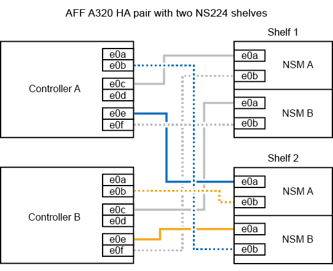

= 
:allow-uri-read: 

.Étapes
. Reliez le tiroir aux contrôleurs.
+
.. Reliez le port E0A du NSM A au port e0e du contrôleur.
.. Câble port A NSM e0b sur le port B du contrôleur e0b.
.. Reliez le port E0A du NSM B au port e0e du contrôleur B.
.. Reliez le port B du NSM e0b au port De contrôleur A e0b. + l'illustration suivante montre le câblage du tiroir à chaud (tiroir 2) :
+

. Vérifiez que le tiroir ajouté à chaud est correctement câblé à l'aide de https://mysupport.netapp.com/site/tools/tool-eula/activeiq-configadvisor["Active IQ Config Advisor"^].
+
Si des erreurs de câblage sont générées, suivez les actions correctives fournies.

