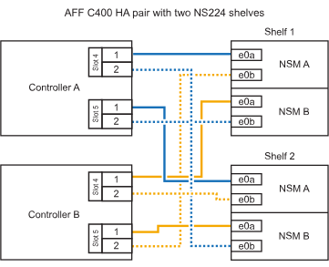

= 
:allow-uri-read: 

.Avant de commencer
* Vous devez avoir examiné le link:requirements-hot-add-shelf.html["exigences et bonnes pratiques à ajouter à chaud"].
* Vous devez avoir effectué les procédures applicables dans link:prepare-hot-add-shelf.html["Préparez l'ajout à chaud d'une étagère"].
* Vous devez avoir installé les tiroirs, les mettre sous tension et définir les ID de tiroir comme décrit dans la section link:prepare-hot-add-shelf.html["Installation d'un tiroir pour ajouter à chaud"].

*Etagère pour câble à une paire HA AFF A400*

Dans le cas d'une paire HA AFF A400, vous pouvez ajouter à chaud jusqu'à deux tiroirs et utiliser les ports e0c/e0d et les ports du slot 5 en fonction des besoins.

.Étapes
. Si vous ajoutez un tiroir à chaud en utilisant un ensemble de ports compatibles RoCE (ports intégrés compatibles RoCE) sur chaque contrôleur, et qu'il s'agit du seul tiroir NS224 de votre paire haute disponibilité, procédez comme suit.
+
Dans le cas contraire, passez à l'étape suivante.

+
.. Reliez le port E0A du tiroir NSM A au port e0c du contrôleur.
.. Reliez le port e0b du tiroir NSM A au port e0d du contrôleur B.
.. Reliez le port e0a du tiroir NSM B au port e0c du contrôleur B.
.. Reliez le port e0b du tiroir NSM B au port e0d du contrôleur A.
+
L'illustration suivante montre le câblage d'un tiroir à ajout à chaud utilisant un ensemble de ports compatibles RoCE sur chaque contrôleur :

+
image::../media/drw_ns224_a400_1shelf.png[Câblage d'un AFF/ASA A400 avec un tiroir NS224 et un ensemble de ports intégrés]

. Si vous ajoutez à chaud un ou deux tiroirs à l'aide de deux ensembles de ports compatibles RoCE (ports intégrés et compatibles RoCE avec la carte PCIe) sur chaque contrôleur, procédez comme suit.
+
[cols="1,3"]
|===
| Tiroirs | Câblage 

 a| 
Etagère 1
 a| 
.. Reliez le port E0A du NSM A au port e0c du contrôleur.
.. Reliez le port NSM A e0b au connecteur 5 2 (e5b) du contrôleur B.
.. Reliez le port E0A du NSM B au port e0c du contrôleur B.
.. Reliez le port B NSM e0b au connecteur 5 2 (e5b) du contrôleur A.
.. Si vous ajoutez une deuxième étagère à chaud, suivez les sous-étapes « Étagère 2 » ; sinon, passez à l’étape suivante.

 a| 
Etagère 2
 a| 
.. Reliez le port e0a du NSM A au port 1 (e5a) du connecteur 5 du contrôleur A.
.. Reliez le port e0b du NSM A au port e0d du contrôleur B.
.. Reliez le port e0a du NSM B au port 1 (e5a) du connecteur 5 du contrôleur B.
.. Reliez le port e0b du NSM B au port e0d du contrôleur A.
.. Passez à l'étape suivante.

|===
+
L'illustration suivante montre le câblage de deux tiroirs à chaud :

+
image::../media/drw_ns224_a400_2shelves_IEOPS-983.svg[Câblage d'un /ASA A400 avec deux tiroirs NS224, un jeu de ports intégrés et un jeu de ports sur les cartes PCIe]

. Vérifiez que le tiroir ajouté à chaud est correctement câblé à l'aide de https://mysupport.netapp.com/site/tools/tool-eula/activeiq-configadvisor["Active IQ Config Advisor"^].
+
Si des erreurs de câblage sont générées, suivez les actions correctives fournies.

. Si vous avez désactivé l'affectation automatique de disques dans le cadre de la préparation de cette procédure, vous devez attribuer manuellement la propriété du disque, puis réactiver l'affectation automatique de disques, si nécessaire. Voir link:complete-hot-add-shelf.html["Terminez l'ajout à chaud"].
+
Sinon, cette procédure est effectuée.

*Etagère de câble à une paire haute disponibilité AFF C400*

Pour une paire HA AFF C400, vous pouvez ajouter à chaud jusqu'à deux tiroirs et utiliser les ports des emplacements 4 et 5 selon les besoins.

.Étapes
. Si vous ajoutez un tiroir à chaud en utilisant un ensemble de ports compatibles RoCE sur chaque contrôleur et qu'il s'agit du seul tiroir NS224 de votre paire haute disponibilité, procédez comme suit.
+
Dans le cas contraire, passez à l'étape suivante.

+
.. Connectez le port E0a À l'emplacement 4 du contrôleur A (e4a) du tiroir NSM A.
.. Connectez le port E0b du tiroir NSM A au port 2 (e4b) du connecteur 4 du contrôleur B.
.. Connectez le port B e0a à la fente 4 du contrôleur B 1 (e4a) du tiroir de câblage NSM.
.. Connectez le port B e0b du tiroir NSM au port 2 (e4b) du contrôleur A 4.
+
L'illustration suivante montre le câblage d'un tiroir à ajout à chaud utilisant un ensemble de ports compatibles RoCE sur chaque contrôleur :

+
image::../media/drw_ns224_c400_1shelf_IEOPS-985.svg[Câblage d'un AFF/ASA C400 avec un tiroir NS224 et un ensemble de ports de carte PCIe]

. Si vous ajoutez à chaud un ou deux tiroirs à l'aide de deux ensembles de ports compatibles RoCE sur chaque contrôleur, procédez comme suit.
+
[cols="1,3"]
|===
| Tiroirs | Câblage 

 a| 
Etagère 1
 a| 
.. Reliez le port e0a du NSM A au port 1 (e4a) du connecteur 4 du contrôleur A.
.. Reliez le port NSM A e0b au connecteur 5 2 (e5b) du contrôleur B.
.. Reliez le port e0a du NSM B au port 1 (e4a) du port 4 du contrôleur B.
.. Reliez le port B NSM e0b au connecteur 5 2 (e5b) du contrôleur A.
.. Si vous ajoutez une deuxième étagère à chaud, suivez les sous-étapes « Étagère 2 » ; sinon, passez à l’étape suivante.

 a| 
Etagère 2
 a| 
.. Reliez le port e0a du NSM A au port 1 (e5a) du connecteur 5 du contrôleur A.
.. Reliez le port Nsm A e0b au port 2 (e4b) du connecteur 4 du contrôleur B.
.. Reliez le port e0a du NSM B au port 1 (e5a) du connecteur 5 du contrôleur B.
.. Reliez le port B NSM e0b au connecteur 4 2 (e4b) du contrôleur A.
.. Passez à l'étape suivante.

|===
+
L'illustration suivante montre le câblage de deux tiroirs à chaud :

+

. Vérifiez que le tiroir ajouté à chaud est correctement câblé à l'aide de https://mysupport.netapp.com/site/tools/tool-eula/activeiq-configadvisor["Active IQ Config Advisor"^].
+
Si des erreurs de câblage sont générées, suivez les actions correctives fournies.

.Et la suite ?
Si vous avez désactivé l'affectation automatique de disque dans le cadre de votre préparation, vous devez attribuer manuellement la propriété des disques, puis réactiver l'affectation automatique de disque, si nécessaire. Allez à link:complete-hot-add-shelf.html["Terminez l'ajout à chaud"].

Sinon, vous effectuez l'ajout à chaud d'un tiroir.
