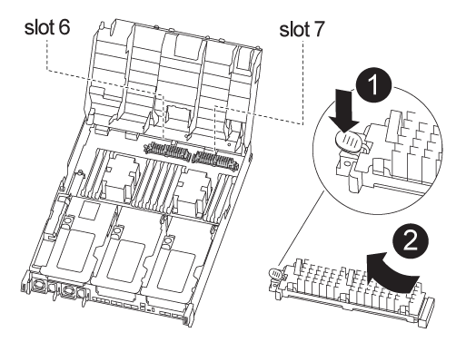

= 
:allow-uri-read: 

Lors du remplacement d'un module de contrôleur, vous devez déplacer le module de cache du module de contrôleur défectueux vers le module de contrôleur de remplacement.

NOTE: Le module de contrôleur ver2 ne dispose que d'un seul support de module de cache dans le FAS8300. Le modèle FAS8700 ne dispose pas d'un module de contrôleur VER2. La fonctionnalité du module de cache n'est pas affectée par le retrait du socket.

Vous pouvez utiliser l'animation, l'illustration ou les étapes écrites suivantes pour déplacer les modules de cache vers le nouveau module de contrôleur.

.Animation : déplacez les modules de cache
video::d6a43902-0e78-40c3-a2bd-aad9012f5b94[panopto]

.Étapes
. Si vous n'êtes pas déjà mis à la terre, mettez-vous à la terre correctement.
. Déplacez les modules de cache du module de contrôleur défaillant vers le module de contrôleur de remplacement :
+
.. Appuyez sur la languette de dégagement bleue à l'extrémité du module de cache, faites pivoter le module vers le haut, puis retirez-le du support.
.. Déplacez le module de mise en cache vers le même support sur le module de contrôleur de remplacement.
.. Alignez les bords du module de cache avec le support et insérez délicatement le module aussi loin que possible dans le support.
.. Faites pivoter le module de cache vers le bas, vers la carte mère.
.. Placez votre doigt à l'extrémité du module de cache par le bouton bleu, appuyez fermement sur l'extrémité du module de cache, puis soulevez le bouton de verrouillage pour verrouiller le module de cache en place.

