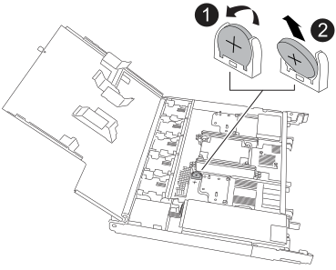

= 
:allow-uri-read: 

Retirez la batterie RTC défectueuse et installez la batterie RTC de remplacement.

Vous devez utiliser une batterie RTC approuvée.

.Étapes
. Localisez la batterie RTC.
. Retirez la batterie RTC :
+

+
[cols="1,4"]
|===

 a| 
image::../media/icon_round_1.png[Légende numéro 1]
 a| 
Faites pivoter doucement la batterie RTC à un angle opposé à son support.

 a| 
image::../media/icon_round_2.png[Légende numéro 2]
 a| 
Retirez la batterie RTC de son support.

|===
. Installez la batterie RTC de remplacement :
+
.. Retirez la batterie de rechange du sac d'expédition antistatique.
.. Positionnez la batterie de manière à ce que le signe plus de la batterie soit orienté vers l'extérieur pour correspondre au signe plus de la carte mère.
.. Insérez la batterie dans le support en l'inclinant, puis poussez-la en position verticale de sorte qu'elle soit bien en place dans le support.
.. Inspectez visuellement la batterie pour vous assurer qu'elle est bien en place dans son support et que la polarité est correcte.

