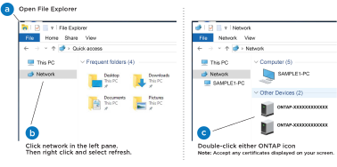

= Configuration et configuration complètes du système de stockage - AFF A1K
:allow-uri-read: 
:icons: font
:imagesdir: ../media/

[role="lead"]
Une fois le matériel installé, utilisez le logiciel ONTAP pour configurer et gérer votre système de stockage.

== Étape 1 : collecte des informations sur le cluster

Si ce n'est pas déjà fait, rassemblez les informations dont vous avez besoin pour configurer votre cluster, telles que le port et l'adresse IP de l'interface de gestion du cluster.

Utilisez les https://docs.netapp.com/us-en/ontap/software_setup/index.html["fiche technique de configuration du cluster"] pour enregistrer les valeurs dont vous avez besoin pendant le processus de configuration du cluster. Si une valeur par défaut est fournie, vous pouvez utiliser cette valeur ou saisir votre propre valeur.

== Étape 2 : découverte de votre réseau de clusters

Le processus de détection vous permet de détecter les contrôleurs de votre système de stockage sur le réseau.

[role="tabbed-block"]
====
.Option 1 : la détection du réseau est activée
--
Si la détection de réseau est activée sur votre ordinateur portable, vous pouvez effectuer la configuration et l'installation de la plate-forme à l'aide de la détection automatique de cluster.

.Étapes
. Connectez votre ordinateur portable au commutateur de gestion et accédez aux ordinateurs et périphériques réseau.
. Sélectionnez une icône ONTAP pour découvrir :
+

+
.. Ouvrez l'Explorateur de fichiers.
.. Cliquez sur *réseau* dans le volet de gauche.
.. Cliquez avec le bouton droit de la souris et sélectionnez *Actualiser*.
.. Double-cliquez sur l'une des icônes ONTAP et acceptez les certificats affichés à l'écran.
+

NOTE: XXXXX est le numéro de série de la plate-forme pour le nœud cible.

+
System Manager s'ouvre.

--
.Option 2 : la détection réseau n'est pas activée
--
Si la détection réseau n'est pas activée sur votre ordinateur portable, effectuez la configuration et l'installation à l'aide de l'assistant d'installation du cluster de l'interface de ligne de commande ONTAP.

.Avant de commencer
Assurez-vous que votre ordinateur portable est connecté au port série console et que les contrôleurs sont sous tension. Voir link:install-power-hardware.html#step-2-power-on-the-controllers["Mettez les contrôleurs sous tension"] pour obtenir des instructions.

.Étapes
Attribuez une adresse IP initiale de gestion des nœuds à l'un des nœuds.

[cols="1,2"]
|===
| Si le réseau de gestion dispose de DHCP... | Alors... 

 a| 
Configuré
 a| 
Notez l'adresse IP attribuée aux nouveaux contrôleurs.

 a| 
Non configuré
 a| 
. Ouvrez une session de console à l'aide de PuTTY, d'un serveur de terminal ou de l'équivalent pour votre environnement.
+

NOTE: Consultez l'aide en ligne de votre ordinateur portable ou de votre console si vous ne savez pas comment configurer PuTTY.

. Se connecter à la console du premier nœud.
+
Le nœud démarre, puis l'assistant de configuration du cluster démarre sur la console.

. Entrez l'adresse IP de gestion du nœud lorsque l'assistant de configuration du cluster vous y invite.

|===
--
====

== Étape 3 : configuration du cluster

NetApp vous recommande d'utiliser System Manager pour configurer de nouveaux clusters. Reportez-vous https://docs.netapp.com/us-en/ontap/task_configure_ontap.html["Configurez ONTAP sur un nouveau cluster avec System Manager"] à pour obtenir des instructions de configuration.

System Manager simplifie et simplifie l'installation et la configuration du cluster, notamment l'attribution d'une adresse IP de gestion de nœud, l'initialisation du cluster, la création d'un niveau local, la configuration des protocoles et le provisionnement initial du stockage connecté.

NOTE: Une fois le cluster initialisé, téléchargez-le et exécutez-le  https://mysupport.netapp.com/site/tools/tool-eula/activeiq-configadvisor["Active IQ Config Advisor"] pour confirmer votre configuration.
