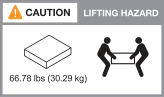

= Conditions requises pour l'installation - AFF A1K
:allow-uri-read: 
:icons: font
:imagesdir: ../media/

[role="lead"]
Vérifiez l'équipement nécessaire et les précautions de levage pour votre système de stockage AFF A1K et vos tiroirs de stockage.

== Équipement nécessaire pour l'installation

Pour installer votre système de stockage AFF A1K, vous avez besoin de l'équipement et des outils suivants.

* Accès à un navigateur Web pour configurer votre système de stockage
* Sangle de décharge électrostatique (ESD)
* Lampe de poche
* Ordinateur portable ou console avec connexion USB/série
* Trombone ou stylo à pointe sphérique à pointe étroite pour le réglage des ID de tablette de stockage NS224
* Tournevis Phillips n°2

== Précautions de levage

Les systèmes de stockage AFF A1K et les tiroirs de stockage NS224 sont très volumineux. Faites preuve de prudence lorsque vous soulevez et déplacez ces éléments.

=== Système de stockage AFF A1K

Un système de stockage AFF A1K peut peser jusqu'à 28.5 kg (62.83 lb). Pour soulever le système, faire appel à deux personnes ou à un relevage hydraulique.

image::../media/drw_a1k_weight_caution_ieops-1698.svg[AFF A1K icône d'avertissement de levage]

=== Tiroir NS224

Une étagère de stockage NS224 peut peser jusqu'à 30.29 kg (66.78 lb). Pour soulever la tablette de rangement, faites appel à deux personnes ou à un dispositif de levage hydraulique. Conservez tous les composants dans la tablette de stockage (avant et arrière) pour éviter de débalourer le poids de la tablette.

.Informations associées
* https://library.netapp.com/ecm/ecm_download_file/ECMP12475945["Informations de sécurité et avis réglementaires"^]

.Et la suite ?
Après avoir examiné la configuration matérielle requise, vous link:install-prepare.html["Préparez l'installation de votre système de stockage AFF A1K"].
