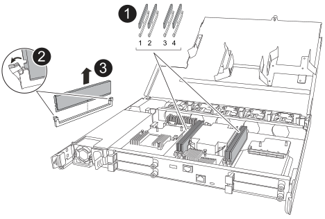

= Remplacer un module DIMM - AFF A20, AFF A30 et AFF A50
:allow-uri-read: 
:icons: font
:imagesdir: ../media/

[role="lead"]
Remplacez un module DIMM dans votre système de stockage AFF A20, AFF A30 ou AFF A50 si des erreurs de mémoire excessives, corrigibles ou non, sont détectées.  De telles erreurs peuvent empêcher le système de stockage de démarrer ONTAP.  Le processus de remplacement implique l'arrêt du contrôleur défectueux, son retrait, le remplacement du module DIMM, la réinstallation du contrôleur, puis le renvoi de la pièce défectueuse à NetApp.

.Avant de commencer
* Tous les autres composants du système de stockage doivent fonctionner correctement ; dans le cas contraire, contactez https://mysupport.netapp.com/site/global/dashboard["Support NetApp"] avant de continuer.
* Vous devez remplacer le composant FRU défectueux par un composant FRU de remplacement que vous avez reçu de votre fournisseur.

.Description de la tâche
Si nécessaire, vous pouvez allumer les voyants d'emplacement du système de stockage (bleus) pour faciliter la localisation physique du système de stockage concerné. Connectez-vous au BMC à l'aide de SSH et entrez `system location-led _on_` la commande.

Un système de stockage comporte trois voyants d'emplacement : un sur le panneau de commande et un sur chaque contrôleur. Les LED d'emplacement restent allumées pendant 30 minutes.

Vous pouvez les désactiver en entrant `system location-led _off_` la commande. Si vous n'êtes pas sûr que les LED soient allumées ou éteintes, vous pouvez vérifier leur état en entrant `system location-led show` la commande.

== Étape 1 : arrêtez le contrôleur défaillant

Arrêtez ou prenez le contrôleur pour facultés affaiblies en utilisant l'une des options suivantes.

[role="tabbed-block"]
====
.Option 1 : la plupart des systèmes
--
Pour arrêter le contrôleur défaillant, vous devez déterminer l'état du contrôleur et, si nécessaire, prendre le contrôle de façon à ce que le contrôleur en bonne santé continue de transmettre des données provenant du stockage défaillant du contrôleur.

.Description de la tâche
* Si vous disposez d'un système SAN, vous devez avoir vérifié les messages d'événement  `cluster kernel-service show`) pour le serveur lame SCSI du contrôleur défectueux.  `cluster kernel-service show`La commande (from priv mode Advanced) affiche le nom du nœud, son état de disponibilité et link:https://docs.netapp.com/us-en/ontap/system-admin/display-nodes-cluster-task.html["état du quorum"]son état de fonctionnement.
+
Chaque processus SCSI-Blade doit se trouver au quorum avec les autres nœuds du cluster. Tout problème doit être résolu avant de procéder au remplacement.

* Si vous avez un cluster avec plus de deux nœuds, il doit être dans le quorum. Si le cluster n'est pas au quorum ou si un contrôleur en bonne santé affiche la valeur false pour l'éligibilité et la santé, vous devez corriger le problème avant de désactiver le contrôleur défaillant ; voir link:https://docs.netapp.com/us-en/ontap/system-admin/synchronize-node-cluster-task.html?q=Quorum["Synchroniser un nœud avec le cluster"^].

.Étapes
. Si AutoSupport est activé, supprimez la création automatique de dossier en invoquant un message AutoSupport :
+
`system node autosupport invoke -node * -type all -message MAINT=<# of hours>h`

+
Le message AutoSupport suivant supprime la création automatique de dossiers pendant deux heures :

+
`cluster1:> system node autosupport invoke -node * -type all -message MAINT=2h`

. Désactiver le retour automatique :
+
.. Entrez la commande suivante depuis la console du contrôleur sain :
+
`storage failover modify -node _impaired_node_name_ -auto-giveback false`

.. Entrer `y` lorsque vous voyez l'invite _Voulez-vous désactiver le retour automatique ?_

. Faites passer le contrôleur douteux à l'invite DU CHARGEUR :
+
[cols="1,2"]
|===
| Si le contrôleur en état de fonctionnement s'affiche... | Alors... 

 a| 
Invite DU CHARGEUR
 a| 
Passez à l'étape suivante.

 a| 
Attente du retour...
 a| 
Appuyez sur Ctrl-C, puis répondez `y` lorsque vous y êtes invité.

 a| 
Invite système ou invite de mot de passe
 a| 
Prendre le contrôle défectueux ou l'arrêter à partir du contrôleur en bon état :

`storage failover takeover -ofnode _impaired_node_name_ -halt _true_`

Le paramètre _-halt true_ vous amène à l'invite Loader.

|===

--
.Option 2 : le contrôleur est dans un MetroCluster
--
Pour arrêter le contrôleur défaillant, vous devez déterminer l'état du contrôleur et, si nécessaire, prendre le contrôle de façon à ce que le contrôleur en bonne santé continue de transmettre des données provenant du stockage défaillant du contrôleur.

* Si vous avez un cluster avec plus de deux nœuds, il doit être dans le quorum. Si le cluster n'est pas au quorum ou si un contrôleur en bonne santé affiche la valeur false pour l'éligibilité et la santé, vous devez corriger le problème avant de désactiver le contrôleur défaillant ; voir link:https://docs.netapp.com/us-en/ontap/system-admin/synchronize-node-cluster-task.html?q=Quorum["Synchroniser un nœud avec le cluster"^].
* Vous devez avoir confirmé que l'état de configuration MetroCluster est configuré et que les nœuds sont dans un état activé et normal :
+
`metrocluster node show`

.Étapes
. Si AutoSupport est activé, supprimez la création automatique de dossier en invoquant un message AutoSupport :
+
`system node autosupport invoke -node * -type all -message MAINT=number_of_hours_downh`

+
Le message AutoSupport suivant supprime la création automatique de dossiers pendant deux heures :

+
`cluster1:*> system node autosupport invoke -node * -type all -message MAINT=2h`

. Désactiver le retour automatique :
+
.. Entrez la commande suivante depuis la console du contrôleur sain :
+
`storage failover modify -node local -auto-giveback false`

.. Entrer `y` lorsque vous voyez l'invite _Voulez-vous désactiver le retour automatique ?_

. Faites passer le contrôleur douteux à l'invite DU CHARGEUR :
+
[cols="1,2"]
|===
| Si le contrôleur en état de fonctionnement s'affiche... | Alors... 

 a| 
Invite DU CHARGEUR
 a| 
Passez à la section suivante.

 a| 
Attente du retour...
 a| 
Appuyez sur Ctrl-C, puis répondez `y` lorsque vous y êtes invité.

 a| 
Invite système ou invite de mot de passe (entrer le mot de passe système)
 a| 
Prendre le contrôle défectueux ou l'arrêter à partir du contrôleur en bon état :

`storage failover takeover -ofnode _impaired_node_name_ -halt _true_`

Le paramètre _-halt true_ vous amène à l'invite Loader.

|===

--
====

== Étape 2 : retirer le contrôleur

Vous devez retirer le contrôleur du châssis lorsque vous remplacez le contrôleur ou un composant à l'intérieur du contrôleur.

.Avant de commencer
Assurez-vous que tous les autres composants du système de stockage fonctionnent correctement. Si ce n'est pas le cas, vous devez contacter https://mysupport.netapp.com/site/global/dashboard["Support NetApp"] avant de poursuivre cette procédure.

.Étapes
. Sur le contrôleur défectueux, assurez-vous que le voyant NV est éteint.
+
Lorsque le voyant NV est éteint, la désactivation est terminée et vous pouvez retirer le contrôleur défectueux en toute sécurité.

+

NOTE: Si le voyant NV clignote (vert), la désactivation est en cours. Vous devez attendre que le voyant NV s'éteigne. Toutefois, si le clignotement continue pendant plus de cinq minutes, contactez https://mysupport.netapp.com/site/global/dashboard["Support NetApp"] avant de poursuivre cette procédure.

+
Le voyant NV se trouve à côté de l'icône NV sur le contrôleur.

+
image::../media/drw_g_nvmem_led_ieops-1839.svg[Emplacement du voyant d'état NV]

[cols="1,4"]
|===

 a| 
image::../media/icon_round_1.png[Légende numéro 1]
 a| 
Icône NV et LED sur le contrôleur

|===

CAUTION: Portez systématiquement un bracelet antistatique relié à une prise de terre vérifiée lors des opérations d'installation et de maintenance. Le non-respect des précautions ESD appropriées peut causer des dommages permanents aux nœuds de contrôleur, aux baies de stockage et aux commutateurs réseau.

. Débranchez l'alimentation du contrôleur défectueux :
+

NOTE: Les blocs d'alimentation ne sont pas équipés d'un interrupteur d'alimentation.

+
[cols="1,2"]
|===
| Si vous déconnectez un... | Alors... 

 a| 
ALIMENTATION CA
 a| 
.. Ouvrez le dispositif de retenue du cordon d'alimentation.
.. Débranchez le cordon d'alimentation du bloc d'alimentation et mettez-le de côté.

 a| 
BLOC D'ALIMENTATION CC
 a| 
.. Dévissez les deux vis à serrage à main du connecteur du cordon d'alimentation CC D-SUB.
.. Débranchez le cordon d'alimentation du bloc d'alimentation et mettez-le de côté.

|===
. Débranchez tous les câbles du contrôleur défectueux.
+
Garder une trace de l'endroit où les câbles ont été connectés.

. Retirez le contrôleur défectueux :
+
L'illustration suivante indique le fonctionnement des poignées du contrôleur (du côté gauche du contrôleur) lors du retrait d'un contrôleur :

+
image::../media/drw_g_and_t_handles_remove_ieops-1837.svg[fonctionnement de la poignée du contrôleur pour retirer un contrôleur]

+
[cols="1,4"]
|===

 a| 
image::../media/icon_round_1.png[Légende numéro 1]
 a| 
Aux deux extrémités du contrôleur, poussez les languettes de verrouillage verticales vers l'extérieur pour libérer les poignées.

 a| 
image::../media/icon_round_2.png[Légende numéro 2]
 a| 
** Tirez les poignées vers vous pour déloger le contrôleur du fond de panier central.
+
Lorsque vous tirez, les poignées sortent du contrôleur et vous ressentez une certaine résistance, continuez à tirer.

** Faites glisser le contrôleur hors du châssis tout en soutenant le bas du contrôleur, puis placez-le sur une surface plane et stable.

 a| 
image::../media/icon_round_3.png[Numéro de légende 3]
 a| 
Si nécessaire, faites pivoter les poignées vers le haut (à côté des languettes) pour les écarter.

|===
. Ouvrez le capot du contrôleur en tournant la vis à molette dans le sens inverse des aiguilles d'une montre pour la desserrer, puis ouvrez le capot.

== Étape 3 : remplacez un module DIMM

Pour remplacer un module DIMM, localisez le module DIMM défectueux à l'intérieur du contrôleur et suivez la séquence spécifique des étapes.

CAUTION: Portez systématiquement un bracelet antistatique relié à une prise de terre vérifiée lors des opérations d'installation et de maintenance. Le non-respect des précautions ESD appropriées peut causer des dommages permanents aux nœuds de contrôleur, aux baies de stockage et aux commutateurs réseau.

.Étapes
. Localisez les modules DIMM sur votre contrôleur et identifiez le module DIMM défectueux.
+

NOTE: Consultez le ou le schéma des FRU sur le https://hwu.netapp.com["NetApp Hardware Universe"] capot du contrôleur pour connaître l'emplacement exact des modules DIMM.

. Retirez le module DIMM défectueux :
+

+
[cols="1,4"]
|===

 a| 
image::../media/icon_round_1.png[Légende numéro 1]
 a| 
Numérotation et positions des emplacements DIMM.

NOTE: Selon le modèle de votre système de stockage, vous aurez deux ou quatre modules DIMM.

 a| 
image::../media/icon_round_2.png[Légende numéro 2]
 a| 
** Notez l'orientation du module DIMM dans le support de manière à pouvoir insérer le module DIMM de remplacement dans le même sens.
** Éjectez le module DIMM défectueux en écartant lentement les deux pattes d'éjection du module DIMM situées aux deux extrémités du logement DIMM.

IMPORTANT: Tenez soigneusement le module DIMM par les coins ou les bords pour éviter toute pression sur les composants de la carte de circuit DIMM.

 a| 
image::../media/icon_round_3.png[Numéro de légende 3]
 a| 
Soulevez le module DIMM et retirez-le de son logement.

Les languettes de l'éjecteur restent en position ouverte.

|===
. Installez le module DIMM de remplacement :
+
.. Retirez le module DIMM de remplacement de son sac d'expédition antistatique.
.. Assurez-vous que les pattes d'éjection du module DIMM sur le connecteur sont en position ouverte.
.. Tenez le module DIMM par les coins, puis insérez-le correctement dans le logement.
+
L'encoche située au bas du DIMM, entre les broches, doit être alignée avec la languette dans le logement.

+
Lorsqu'il est correctement inséré, le module DIMM s'insère facilement, mais s'insère fermement dans le logement. Réinsérez le module DIMM si vous pensez qu'il n'est pas correctement inséré.

.. Vérifiez visuellement le module DIMM pour vous assurer qu'il est bien aligné et entièrement inséré dans le logement.
.. Poussez doucement, mais fermement, sur le bord supérieur du DIMM jusqu'à ce que les languettes de l'éjecteur s'enclenchent sur les encoches aux deux extrémités du DIMM.

== Étape 4 : réinstallez le contrôleur

Réinstallez le contrôleur dans le châssis et redémarrez-le.

.Description de la tâche
L'illustration suivante montre le fonctionnement des poignées du contrôleur (à partir du côté gauche d'un contrôleur) lors de la réinstallation du contrôleur et peut être utilisée comme référence pour le reste des étapes de réinstallation du contrôleur.

image::../media/drw_g_and_t_handles_reinstall_ieops-1838.svg[fonctionnement de la poignée du contrôleur pour installer un contrôleur]

[cols="1,4"]
|===

 a| 
image::../media/icon_round_1.png[Légende numéro 1]
 a| 
Si vous avez fait pivoter les poignées du contrôleur vers le haut (à côté des languettes) pour les écarter pendant que vous effectuez l'entretien du contrôleur, faites-les pivoter vers le bas en position horizontale.

 a| 
image::../media/icon_round_2.png[Légende numéro 2]
 a| 
Poussez les poignées pour réinsérer le contrôleur dans le châssis à mi-course, puis, lorsque vous y êtes invité, appuyez sur jusqu'à ce que le contrôleur soit complètement en place.

 a| 
image::../media/icon_round_3.png[Numéro de légende 3]
 a| 
Faites pivoter les poignées en position verticale et verrouillez-les en place à l'aide des languettes de verrouillage.

|===
.Étapes
. Fermez le capot du contrôleur et tournez la vis dans le sens des aiguilles d'une montre jusqu'à ce qu'elle soit serrée.
. Insérez le contrôleur à mi-chemin dans le châssis.
+
Alignez l'arrière du contrôleur avec l'ouverture du châssis, puis appuyez doucement sur le contrôleur à l'aide des poignées.

+

NOTE: N'insérez pas complètement le contrôleur dans le châssis avant d'y être invité.

. Connectez le câble de la console au port console du contrôleur et à l'ordinateur portable de manière à ce que l'ordinateur portable reçoive les messages de la console lorsque le contrôleur redémarre.
+

NOTE: Ne branchez pas d'autres câbles ou cordons d'alimentation pour le moment.

. Placez entièrement le contrôleur dans le châssis :
+
.. Appuyez fermement sur les poignées jusqu'à ce que le contrôleur rencontre le fond de panier central et soit bien en place.
+

NOTE: Ne forcez pas lorsque vous faites glisser le contrôleur dans le châssis ; vous risqueriez d'endommager les connecteurs.

.. Faites pivoter les poignées du contrôleur vers le haut et verrouillez-les en place à l'aide des languettes.
+

NOTE: Le contrôleur de remplacement est alimenté par le contrôleur en bon état et commence le démarrage dès qu'il est complètement inséré dans le châssis.

. Recâblage du contrôleur selon les besoins.
. Rebranchez le cordon d'alimentation au bloc d'alimentation.
+
Une fois l'alimentation rétablie, le voyant d'état doit être vert.

+
[cols="1,2"]
|===
| Si vous reconnectez un... | Alors... 

 a| 
ALIMENTATION CA
 a| 
.. Branchez le cordon d'alimentation au bloc d'alimentation.
.. Fixez le cordon d'alimentation à l'aide du dispositif de retenue du cordon d'alimentation.

 a| 
BLOC D'ALIMENTATION CC
 a| 
.. Branchez le connecteur du cordon d'alimentation CC D-SUB sur le bloc d'alimentation.
.. Serrez les deux vis à oreilles pour fixer le connecteur du cordon d'alimentation CC D-SUB au bloc d'alimentation.

|===
. Remettre le contrôleur défectueux en fonctionnement normal en réutilisant son espace de stockage :
+
`storage failover giveback -ofnode _impaired_node_name_`

. Restaurez le rétablissement automatique à partir de la console du contrôleur sain :
+
`storage failover modify -node local -auto-giveback true`

. Si AutoSupport est activé, restaurez (annulez la suppression) de la création automatique de cas :
+
`system node autosupport invoke -node * -type all -message MAINT=END`

== Étape 5 : renvoyer la pièce défaillante à NetApp

Retournez la pièce défectueuse à NetApp, tel que décrit dans les instructions RMA (retour de matériel) fournies avec le kit. Voir la https://mysupport.netapp.com/site/info/rma["Retour de pièces et remplacements"] page pour plus d'informations.
