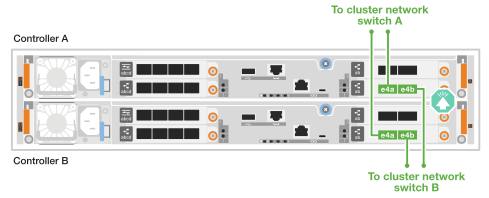
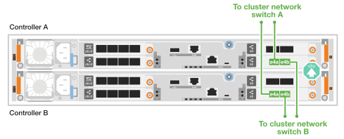
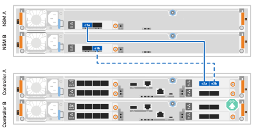

= Câbler le matériel - AFF A20, AFF A30 et AFF A50
:allow-uri-read: 
:icons: font
:imagesdir: ../media/

[role="lead"]
Après avoir installé le matériel de votre système de stockage AFF A20, AFF A30 ou AFF A50, reliez les contrôleurs au réseau et aux tiroirs.

.Avant de commencer
Pour plus d'informations sur la connexion du système de stockage aux commutateurs réseau, contactez votre administrateur réseau.

.Description de la tâche
* Les procédures de câblage du réseau hôte/cluster/haute disponibilité présentent les configurations courantes.
+
Si votre configuration ne s'affiche pas ici, reportez-vous à  la section link:https://hwu.netapp.com["NetApp Hardware Universe"^] pour obtenir des informations complètes sur la configuration et la priorité des connecteurs afin de connecter le câble de votre système de stockage.

* Les graphiques de câblage sont dotés d'icônes de flèche indiquant l'orientation correcte (vers le haut ou vers le bas) de la languette du connecteur de câble lors de l'insertion d'un connecteur dans un port.
+
Lorsque vous insérez le connecteur, vous devez le sentir en place ; si vous ne le sentez pas, retirez-le, retournez-le et réessayez.

+
image:../media/drw_cable_pull_tab_direction_ieops-1699.svg["Direction de la languette de tirage du câble"]

* Si vous effectuez un câblage vers un commutateur optique, insérez l'émetteur-récepteur optique dans le port du contrôleur avant de le connecter au port du commutateur.

== Étape 1 : câblez les connexions du cluster/haute disponibilité

Reliez les contrôleurs au cluster ONTAP en créant des connexions.

[role="tabbed-block"]
====
.Câblage switchless cluster Cabling
--
.AFF A30 ou AFF A50 avec deux modules d'E/S 40/100 GbE à 2 ports
[%collapsible]
=====
.Étapes
. Reliez les connexions d'interconnexion cluster/haute disponibilité :
+

NOTE: Le trafic d'interconnexion de cluster et le trafic haute disponibilité partagent les mêmes ports physiques (sur les modules d'E/S des connecteurs 2 et 4). Les ports sont 40/100 GbE.

+
.. Reliez le port e2a du contrôleur A au port e2a du contrôleur B.
.. Connectez le port e4a du contrôleur A au port e4a du contrôleur B.
+

NOTE: Les ports de module d'E/S e2b et e4b sont inutilisés et disponibles pour la connectivité réseau de l'hôte.

+
*Câbles d'interconnexion cluster/haute disponibilité 100 GbE*

+
image::../media/oie_cable100_gbe_qsfp28.png[Câble 100 GbE haute disponibilité du cluster]

+
image::../media/drw_isi_a30-50_switchless_2p_100gbe_2card_cabling_ieops-2011.svg[schéma de câblage des clusters sans commutateur a30 et a50 utilisant deux modules io 100 gbe]

=====
.AFF A30 ou AFF A50 avec un module d'E/S 40/100 GbE à 2 ports
[%collapsible]
=====
.Étapes
. Reliez les connexions d'interconnexion cluster/haute disponibilité :
+

NOTE: Le trafic d'interconnexion de cluster et le trafic haute disponibilité partagent les mêmes ports physiques (sur le module d'E/S du slot 4). Les ports sont 40/100 GbE.

+
.. Connectez le port e4a du contrôleur A au port e4a du contrôleur B.
.. Reliez le port e4b du contrôleur A au port e4b du contrôleur B.
+
*Câbles d'interconnexion cluster/haute disponibilité 100 GbE*

+
image::../media/oie_cable100_gbe_qsfp28.png[Câble 100 GbE haute disponibilité du cluster]

+
image::../media/drw_isi_a30-50_switchless_2p_100gbe_1card_cabling_ieops-1925.svg[schéma de câblage des clusters sans commutateur a30 et a50 utilisant un module io 100 gbe]

=====
.AFF A20 avec un module d'E/S 10/25 GbE à 2 ports
[%collapsible]
=====
.Étapes
. Reliez les connexions d'interconnexion cluster/haute disponibilité :
+

NOTE: Le trafic d'interconnexion de cluster et le trafic haute disponibilité partagent les mêmes ports physiques (sur le module d'E/S du slot 4). Les ports sont 10/25 GbE.

+
.. Connectez le port e4a du contrôleur A au port e4a du contrôleur B.
.. Reliez le port e4b du contrôleur A au port e4b du contrôleur B.
+
*Câbles d'interconnexion cluster/haute disponibilité 25 GbE*

+
image:../media/oie_cable_sfp_gbe_copper.png["Connecteur en cuivre SFP GbE"]

+
image::../media/drw_isi_a20_switchless_2p_25gbe_cabling_ieops-2018.svg[schéma de câblage du cluster a20 sans commutateur utilisant un module 25 gbe io]

=====
--
.Câblage commuté du cluster
--
.AFF A30 ou AFF A50 avec deux modules d'E/S 40/100 GbE à 2 ports
[%collapsible]
=====
.Étapes
. Reliez les connexions d'interconnexion cluster/haute disponibilité :
+

NOTE: Le trafic d'interconnexion de cluster et le trafic haute disponibilité partagent les mêmes ports physiques (sur les modules d'E/S des connecteurs 2 et 4). Les ports sont 40/100 GbE.

+
.. Reliez le port e4a du contrôleur de câble A au commutateur de réseau du cluster A.
.. Reliez le port e2a du contrôleur de câbles au commutateur de réseau du cluster B.
.. Reliez le port e4a du contrôleur B au commutateur a du réseau du cluster
.. Reliez le port e2a du contrôleur B au commutateur de réseau du cluster B.
+

NOTE: Les ports de module d'E/S e2b et e4b sont inutilisés et disponibles pour la connectivité réseau de l'hôte.

+
*Câbles d'interconnexion cluster/haute disponibilité 40/100 GbE*

+
image::../media/oie_cable100_gbe_qsfp28.png[Câble 40/100 GbE haute disponibilité du cluster]

+
image::../media/drw_isi_a30-50_switched_2p_100gbe_2card_cabling_ieops-2013.svg[schéma de câblage des clusters commutés a30 et a50 avec deux modules io 100 gbe]

=====
.AFF A30 ou AFF A50 avec un module d'E/S 40/100 GbE à 2 ports
[%collapsible]
=====
.Étapes
. Reliez les contrôleurs aux commutateurs du réseau du cluster :
+

NOTE: Le trafic d'interconnexion de cluster et le trafic haute disponibilité partagent les mêmes ports physiques (sur le module d'E/S du slot 4). Les ports sont 40/100 GbE.

+
.. Reliez le port e4a du contrôleur de câble A au commutateur de réseau du cluster A.
.. Reliez le port e4b du contrôleur A au commutateur de réseau du cluster B.
.. Reliez le port e4a du contrôleur B au commutateur a du réseau du cluster
.. Reliez le port e4b du contrôleur B au commutateur de réseau du cluster B.
+
*Câbles d'interconnexion cluster/haute disponibilité 40/100 GbE*

+
image::../media/oie_cable100_gbe_qsfp28.png[Câble 40/100 GbE haute disponibilité du cluster]

+

=====
.AFF A20 avec un module d'E/S 10/25 GbE à 2 ports
[%collapsible]
=====
. Reliez les contrôleurs aux commutateurs du réseau du cluster :
+

NOTE: Le trafic d'interconnexion de cluster et le trafic haute disponibilité partagent les mêmes ports physiques (sur le module d'E/S du slot 4). Les ports sont 10/25 GbE.

+
.. Reliez le port e4a du contrôleur de câble A au commutateur de réseau du cluster A.
.. Reliez le port e4b du contrôleur A au commutateur de réseau du cluster B.
.. Reliez le port e4a du contrôleur B au commutateur a du réseau du cluster
.. Reliez le port e4b du contrôleur B au commutateur de réseau du cluster B.
+
*Câbles d'interconnexion cluster/haute disponibilité 10/25 GbE*

+
image:../media/oie_cable_sfp_gbe_copper.png["Connecteur en cuivre SFP GbE"]

+

=====
--
====

== Étape 2 : câblez les connexions réseau de l'hôte

Reliez les contrôleurs à votre réseau hôte Ethernet ou FC.

[role="tabbed-block"]
====
.Câblage hôte Ethernet
--
.AFF A30 ou AFF A50 avec deux modules d'E/S 40/100 GbE à 2 ports
[%collapsible]
=====
.Étapes
. Sur chaque contrôleur, reliez les ports e2b et e4b aux commutateurs réseau hôte Ethernet.
+

NOTE: Les ports des modules d'E/S des connecteurs 2 et 4 sont 40/100 GbE (connectivité hôte 40/100 GbE).

+
*Câbles 40/100 GbE*

+
image::../media/oie_cable_sfp_gbe_copper.png[Câble de 40/100 Go]

+
image::../media/drw_isi_a30-50_host_2p_40-100gbe_2card_cabling_ieops-2014.svg[Câble vers les switchs réseau hôte ethernet 40 gbe]

=====
.AFF A20, A30 ou AFF A50 avec un module d'E/S 10/25 GbE à 4 ports
[%collapsible]
=====
.Étapes
. Sur chaque contrôleur, reliez les ports e2a, e2b, e2c et e2d aux commutateurs de réseau hôte Ethernet.
+
*Câbles 10/25 GbE*

+
image:../media/oie_cable_sfp_gbe_copper.png["Connecteur en cuivre SFP GbE"]

+
image::../media/drw_isi_a30-50_host_2p_40-100gbe_1card_cabling_ieops-1923.svg[Câble vers les switchs réseau hôte ethernet 40 gbe]

=====
--
.Câblage hôte FC
--
.AFF A20, A30 ou AFF A50 avec un module d'E/S FC 64 Gbit/s à 4 ports
[%collapsible]
=====
.Étapes
. Sur chaque contrôleur, reliez les ports 1a, 1b, 1c et 1D aux commutateurs réseau hôte FC.
+
*Câbles FC 64 Gbit/s*

+
image:../media/oie_cable_sfp_gbe_copper.png["Câble fc de 64 Go"]

+
image::../media/drw_isi_a30-50_4p_64gb_fc_1card_cabling_ieops-1924.svg[Câble vers les switchs réseau hôte fc de 64 go]

=====
--
====

== Étape 3 : branchement des câbles du réseau de gestion

Connectez les contrôleurs au réseau de gestion.

. Reliez les ports de gestion (clé anglaise) de chaque contrôleur aux switchs réseau de gestion.
+
*CÂBLES 1000BASE-T RJ-45*

+
image::../media/oie_cable_rj45.png[Câbles RJ-45]

+
image::../media/drw_isi_g_wrench_cabling_ieops-1928.svg[Connectez-vous à votre réseau de gestion]

IMPORTANT: Ne branchez pas encore les cordons d'alimentation.

== Étape 4 : branchement des tiroirs sur le câble

Cette procédure explique comment connecter les contrôleurs à un tiroir NS224.

.Description de la tâche
* Pour connaître le nombre maximum de tiroirs pris en charge par votre système de stockage et pour toutes vos options de câblage, telles que les options optiques et connectées par commutateur, reportez-vous à link:https://hwu.netapp.com["NetApp Hardware Universe"^]la section .
* Vous connectez chaque contrôleur à chaque module NSM100B du tiroir NS224 à l'aide des câbles de stockage fournis avec votre système de stockage. Ce câble peut être le type suivant :
+
*Câbles en cuivre QSFP28 100 GbE*

+
image::../media/oie_cable100_gbe_qsfp28.png[Câble en cuivre QSFP28 à 100 GbE]

* Les graphiques présentent le câblage du contrôleur A en bleu et le câblage du contrôleur B en jaune.

.Étapes
. Connectez les câbles du contrôleur A au tiroir :
+
.. Contrôleur de câble A, port e3a à NSM A, port e1a.
.. Contrôleur de câble A, port e3b à NSM B, port e1b.
+

. Câble du contrôleur B vers le tiroir :
+
.. Contrôleur de câble du port B e3a au port NSM B e1a.
.. Port e3b du contrôleur de câble au port e1b du NSM A.
+
image:../media/drw_isi_g_1_ns224_controller_b_cabling_ieops-1946.svg["Ports du contrôleur B e3a et e3b câblés sur un tiroir NS224"]

.Et la suite ?
Après avoir câblé le matériel de votre système de stockage, vous link:install-power-hardware.html["mettez le système de stockage sous tension"].
