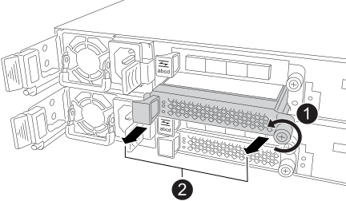
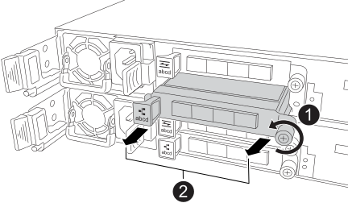

= Ajout du module E/S - AFF A20, AFF A30 et AFF A50
:allow-uri-read: 
:icons: font
:imagesdir: ../media/

[role="lead"]
Vous pouvez ajouter un module d'E/S à vos systèmes de stockage AFF A20, AFF A30 et AFF A50 lorsqu'il y a des emplacements disponibles ou lorsque tous les emplacements sont entièrement remplis.

.Description de la tâche
* Si nécessaire, vous pouvez allumer les voyants d'emplacement du système de stockage (bleus) pour faciliter la localisation physique du système de stockage concerné. Connectez-vous au BMC à l'aide de SSH et entrez `system location-led _on_` la commande.
+
Un système de stockage comporte trois voyants d'emplacement : un sur le panneau de commande et un sur chaque contrôleur. Les LED d'emplacement restent allumées pendant 30 minutes.

+
Vous pouvez les désactiver en entrant `system location-led _off_` la commande. Si vous n'êtes pas sûr que les LED soient allumées ou éteintes, vous pouvez vérifier leur état en entrant `system location-led show` la commande.

== Étape 1 : arrêtez le module de contrôleur défectueux

Pour arrêter le contrôleur défaillant, vous devez déterminer l'état du contrôleur et, si nécessaire, prendre le contrôle de façon à ce que le contrôleur en bonne santé continue de transmettre des données provenant du stockage défaillant du contrôleur.

.Avant de commencer
Si vous avez un cluster avec plus de deux nœuds, il doit être dans le quorum. Si le cluster n'est pas au quorum ou si un contrôleur en bonne santé affiche la valeur false pour l'éligibilité et la santé, vous devez corriger le problème avant de désactiver le contrôleur défaillant ; voir link:https://docs.netapp.com/us-en/ontap/system-admin/synchronize-node-cluster-task.html?q=Quorum["Synchroniser un nœud avec le cluster"^].

.Étapes
. Si AutoSupport est activé, supprimez la création automatique de cas en appelant une commande de message AutoSupport : `system node autosupport invoke -node * -type all -message MAINT=number_of_hours_downh`
+
La commande AutoSupport suivante supprime la création automatique de dossiers pendant deux heures : `cluster1:*> system node autosupport invoke -node * -type all -message MAINT=2h`

. Désactiver le rétablissement automatique depuis la console du contrôleur sain : `storage failover modify –node local -auto-giveback false`
. Faites passer le contrôleur douteux à l'invite DU CHARGEUR :
+
[cols="1,2"]
|===
| Si le contrôleur en état de fonctionnement s'affiche... | Alors... 

 a| 
Invite DU CHARGEUR
 a| 
Passez à l'étape suivante.

 a| 
`Waiting for giveback...`
 a| 
Appuyez sur Ctrl-C, puis répondez `y` lorsque vous y êtes invité.

 a| 
Invite système ou invite de mot de passe (entrer le mot de passe système)
 a| 
Arrêtez ou prenez le contrôle du contrôleur défectueux à partir du contrôleur sain : `storage failover takeover -ofnode _impaired_node_name_`

Lorsque le contrôleur douteux s'affiche en attente de rétablissement..., appuyez sur Ctrl-C et répondez `y`.

|===

== Étape 2 : ajoutez le nouveau module d'E/S.

Si le système de stockage dispose de logements disponibles, installez le nouveau module d'E/S dans l'un des emplacements disponibles. Si tous les emplacements sont occupés, retirez un module d'E/S existant pour libérer de l'espace, puis installez le nouveau.

.Avant de commencer
* Vérifiez que le https://hwu.netapp.com/["NetApp Hardware Universe"^] nouveau module d'E/S est compatible avec votre système de stockage et la version de ONTAP que vous exécutez.
* Si plusieurs emplacements sont disponibles, vérifiez les priorités des emplacements dans https://hwu.netapp.com/["NetApp Hardware Universe"^] Et utiliser la meilleure solution disponible pour votre module d'E/S.
* Tous les autres composants du système de stockage doivent fonctionner correctement. Si ce n'est pas le cas, vous devez contacter https://mysupport.netapp.com/site/global/dashboard["Support NetApp"] avant de poursuivre cette procédure.

[role="tabbed-block"]
====
.Ajoutez un module d'E/S à un emplacement disponible
--
Vous pouvez ajouter un nouveau module d'E/S à un système de stockage avec les emplacements disponibles.

.Étapes
. Si vous n'êtes pas déjà mis à la terre, mettez-vous à la terre correctement.
. Sur le contrôleur défectueux, retirez le module d'obturation d'E/S du logement cible.
+
Le module d'obturation doit être installé sur les emplacements d'E/S inutilisés pour éviter d'éventuels problèmes thermiques.

+

+
[cols="1,4"]
|===

 a| 
image:../media/icon_round_1.png["Légende numéro 1"]
 a| 
Sur le module d'obturation d'E/S, tournez la vis à molette dans le sens inverse des aiguilles d'une montre pour la desserrer.

 a| 
image:../media/icon_round_2.png["Légende numéro 2"]
 a| 
Retirez le module d'obturation d'E/S du contrôleur à l'aide de la languette de gauche et de la vis à molette.

|===
. Installez le nouveau module d'E/S :
+
.. Alignez le module d'E/S sur les bords de l'ouverture du logement du contrôleur.
.. Poussez doucement le module d'E/S à fond dans le logement, en veillant à ce qu'il soit correctement inséré dans le connecteur.
+
Vous pouvez utiliser la languette de gauche et la vis moletée pour enfoncer le module d'E/S.

.. Tournez la vis à molette dans le sens des aiguilles d'une montre pour la serrer.

. Reliez le module d'E/S aux périphériques désignés.
+
Si vous avez installé un module d'E/S de stockage, installez et câblez vos tiroirs NS224, comme décrit à la section https://docs.netapp.com/us-en/ontap-systems/ns224/hot-add-shelf-overview.html["Workflow d'ajout à chaud"^].

. Redémarrez le contrôleur défectueux à partir de l'invite Loader : `bye`
+
Le redémarrage du contrôleur défectueux réinitialise également les modules d'E/S et les autres composants.

. Remettez le contrôleur défectueux au contrôleur partenaire : `storage failover giveback -ofnode _impaired_node_name_`
. Répétez ces étapes pour ajouter un module d'E/S à l'autre contrôleur.
. Restaurez le rétablissement automatique à partir de la console du contrôleur sain : `storage failover modify -node local -auto-giveback _true_`
. Si AutoSupport est activé, restaurer (annuler la suppression) la création automatique de cas : `system node autosupport invoke -node * -type all -message MAINT=END`

--
.Ajoutez un module d'E/S à un système entièrement rempli
--
Vous pouvez ajouter un module d'E/S à un système entièrement rempli en retirant un module d'E/S existant et en installant un nouveau à sa place.

.Description de la tâche
Veillez à bien comprendre les scénarios suivants pour ajouter un nouveau module d'E/S à un système entièrement rempli :

[cols="1,2"]
|===
| Scénario | Action requise 

 a| 
NIC à NIC (même nombre de ports)
 a| 
Les LIF migrent automatiquement lorsque son module de contrôleur est arrêté.

 a| 
NIC à NIC (nombre différent de ports)
 a| 
Réaffectez de manière permanente les LIF sélectionnées à un autre port de attache. Voir https://docs.netapp.com/ontap-9/topic/com.netapp.doc.onc-sm-help-960/GUID-208BB0B8-3F84-466D-9F4F-6E1542A2BE7D.html["Migration d'une LIF"^] pour plus d'informations.

 a| 
Carte réseau vers module d'E/S de stockage
 a| 
Utilisez System Manager pour migrer définitivement les LIF vers différents ports de base, comme décrit dans la https://docs.netapp.com/ontap-9/topic/com.netapp.doc.onc-sm-help-960/GUID-208BB0B8-3F84-466D-9F4F-6E1542A2BE7D.html["Migration d'une LIF"^].

|===
.Étapes
. Si vous n'êtes pas déjà mis à la terre, mettez-vous à la terre correctement.
. Sur le contrôleur défectueux, débranchez tout câblage du module d'E/S cible.
. Retirez le module d'E/S cible du contrôleur :
+

+
[cols="1,4"]
|===

 a| 
image:../media/icon_round_1.png["Légende numéro 1"]
 a| 
Tournez la vis moletée du module d'E/S dans le sens inverse des aiguilles d'une montre pour la desserrer.

 a| 
image:../media/icon_round_2.png["Légende numéro 2"]
 a| 
Retirez le module d'E/S du contrôleur à l'aide de la languette située à gauche sur l'étiquette du port et de la vis à molette.

|===
. Installez le nouveau module d'E/S dans le logement cible :
+
.. Alignez le module d'E/S sur les bords du logement.
.. Poussez doucement le module d'E/S à fond dans le logement, en veillant à ce qu'il soit correctement inséré dans le connecteur.
+
Vous pouvez utiliser la languette de gauche et la vis moletée pour enfoncer le module d'E/S.

.. Tournez la vis à molette dans le sens des aiguilles d'une montre pour la serrer.

. Reliez le module d'E/S aux périphériques désignés.
+
Si vous avez installé un module d'E/S de stockage, installez et câblez vos tiroirs NS224, comme décrit à la section https://docs.netapp.com/us-en/ontap-systems/ns224/hot-add-shelf-overview.html["Workflow d'ajout à chaud"^].

. Répétez les étapes de retrait et d'installation du module d'E/S pour ajouter des modules d'E/S supplémentaires au contrôleur.
. Redémarrez le contrôleur défectueux à partir de l'invite Loader : `bye`
+
Le redémarrage du contrôleur défectueux réinitialise également les modules d'E/S et les autres composants.

. Remettez le contrôleur défectueux au contrôleur partenaire : `storage failover giveback -ofnode _impaired_node_name_`
. Restaurez le rétablissement automatique à partir de la console du contrôleur sain : `storage failover modify -node local -auto-giveback _true_`
. Si AutoSupport est activé, restaurez (annulez la suppression) la création automatique de cas : nœud système AutoSupport appelez -node * -type all -message maint=END
. Si vous avez installé un module NIC, spécifiez le mode d'utilisation de chaque port comme _network_: `storage port modify -node *_<node name>_ -port *_<port name>_ -mode network`
. Répétez ces étapes pour l'autre contrôleur.

--
====