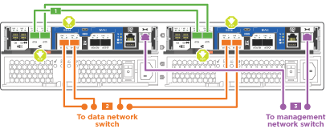
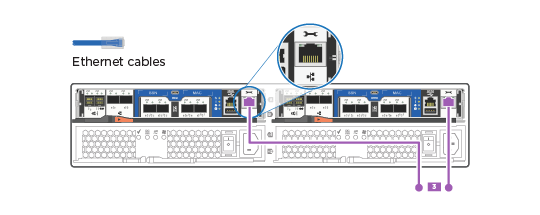

= Guide détaillé - AFF A220
:allow-uri-read: 
:icons: font
:imagesdir: ../media/

[role="lead"]
Cette page fournit des instructions détaillées pour l'installation d'un système NetApp classique.

== Étape 1 : préparer l'installation

Pour installer votre système AFF A220, vous devez créer un compte sur le site de support NetApp, enregistrer votre système et obtenir les clés de licence. Vous devez également inventorier le nombre et le type de câbles appropriés pour votre système et collecter des informations réseau spécifiques.

Pour obtenir des informations sur les conditions requises par le site ainsi que des informations supplémentaires sur le système configuré, accédez au Hardware Universe. Pour plus d'informations sur ce système, vous pouvez également accéder aux notes de version de votre version de ONTAP.

https://hwu.netapp.com["NetApp Hardware Universe"]

http://mysupport.netapp.com/documentation/productlibrary/index.html?productID=62286["Retrouvez les notes de mise à jour de votre version de ONTAP 9"]

Vous devez fournir les informations suivantes sur votre site :

* Espace rack pour le système de stockage
* Tournevis Phillips n°2
* Câbles réseau supplémentaires pour connecter votre système à votre commutateur réseau et à votre ordinateur portable ou console avec un navigateur Web
* Ordinateur portable ou console avec connexion RJ-45 et accès à un navigateur Web

.Étapes
. Déballez le contenu de toutes les boîtes.
. Notez le numéro de série du système depuis les contrôleurs.
+
image::../media/drw_ssn_label.png[Exemple de numéro de série du système indiquant l'emplacement du numéro]

. Configurez votre compte :
+
.. Connectez-vous à votre compte existant ou créez un compte.
.. Enregistrez votre système.
+
https://mysupport.netapp.com/eservice/registerSNoAction.do?moduleName=RegisterMyProduct["Enregistrement de produit NetApp"]

. Téléchargez et installez Config Advisor sur votre ordinateur portable.
+
https://mysupport.netapp.com/site/tools/tool-eula/activeiq-configadvisor["Téléchargement NetApp : Config Advisor"]

. Faites un inventaire et notez le nombre et le type de câbles que vous avez reçus.
+
Le tableau suivant identifie les types de câbles que vous pouvez recevoir. Si vous recevez un câble non répertorié dans le tableau, reportez-vous à la Hardware Universe pour localiser le câble et identifier son utilisation.

+
https://hwu.netapp.com["NetApp Hardware Universe"]

+
[cols="1,2,1,2"]
|===
| Type de câble... | Numéro de pièce et longueur | Type de connecteur | Pour... 

 a| 
Câble 10 GbE (en fonction de la commande)
 a| 
X6566B-05-R6 (112-00297), 0,5 m

X6566B-2-R6 (112-00299), 2 m
 a| 
image:../media/oie_cable_sfp_gbe_copper.png[""]
 a| 
Réseau d'interconnexion de cluster

 a| 
Câble 10 GbE (en fonction de la commande)
 a| 
Référence X6566B-2-R6 (112-00299), 2 m

Ou X6566B-3-R6 (112-00300), 3 m

X6566B-5-R6 (112-00301), 5 m
 a| 
image:../media/oie_cable_sfp_gbe_copper.png[""]
 a| 
Les données

 a| 
Câbles de réseau optique (selon la commande)
 a| 
X6553-R6 (112-00188), 2 M.

X6536-R6 (112-00090), 5 m

X6554-R6(112-00189), 15 m
 a| 
image:../media/oie_cable_fiber_lc_connector.png["Illustration montrant un connecteur LC à fibre optique"]
 a| 
Réseau hôte FC

 a| 
Cat 6, RJ-45 (selon la commande)
 a| 
Références X6585-R6 (112-00291), 3 m

X6562-R6 (112-00196), 5 m
 a| 
image:../media/oie_cable_rj45.png[""]
 a| 
Réseau de gestion et données Ethernet

 a| 
Stockage (selon les commandes)
 a| 
Référence X66030A (112-00435), 0,5 m

X66031A (112-00436), 1 m

X66032A (112-00437), 2 M.

X66033A (112-00438), 3 M.
 a| 
image:../media/oie_cable_mini_sas_hd_to_mini_sas_hd.png[""]
 a| 
Stockage

 a| 
Câble de console micro-USB
 a| 
Sans objet
 a| 
image:../media/oie_cable_micro_usb.png["Illustration montrant un connecteur micro USB"]
 a| 
Connexion de la console pendant la configuration du logiciel sur un ordinateur portable/console autre que Windows ou Mac

 a| 
Câbles d'alimentation
 a| 
Sans objet
 a| 
image:../media/oie_cable_power.png[""]
 a| 
Mise sous tension du système

|===
. Téléchargez et remplissez la fiche de configuration _Cluster_.
+
https://library.netapp.com/ecm/ecm_download_file/ECMLP2839002["Fiche de configuration du cluster"]

== Étape 2 : installer le matériel de fixation

Vous devez installer votre système sur un rack de 4 montants ou une armoire système NetApp, le cas échéant.

.Étapes
. Installez les kits de rails, au besoin.
. Installez et sécurisez votre système en suivant les instructions fournies avec le kit de rails.
+

NOTE: Vous devez être conscient des problèmes de sécurité associés au poids du système.

+
image::../media/drw_oie_fas2700_weight_caution.png[attention de poids du drw oie fas2700]

. Fixez les dispositifs de gestion des câbles (comme illustré).
+
image::../media/drw_cable_management_arm_install.png[installation du ARM de gestion des câbles drw]

. Placez le panneau à l'avant du système.

== Étape 3 : connectez les câbles des contrôleurs à votre réseau

Vous pouvez connecter les contrôleurs à votre réseau en utilisant la méthode de cluster sans commutateur à deux nœuds ou en utilisant le réseau d'interconnexion de cluster.

=== Option 1 : câler un cluster sans commutateur à 2 nœuds, configuration réseau unifiée

Le réseau de gestion, le réseau de données UTA2 et les ports de gestion des contrôleurs sont connectés aux commutateurs. Les ports d'interconnexion de cluster sont câblés sur les deux contrôleurs.

Vous devez avoir contacté votre administrateur réseau pour obtenir des informations sur la connexion du système aux commutateurs.

Assurez-vous de vérifier que la flèche de l'illustration indique l'orientation correcte du connecteur de câble à languette.

image::../media/oie_cable_pull_tab_down.png[languette de traction du câble oie vers le bas]

NOTE: Lorsque vous insérez le connecteur, vous devez le sentir en place ; si vous ne le sentez pas, retirez-le, tournez-le et réessayez.

.Étapes
. Vous pouvez utiliser le graphique ou les instructions pas à pas pour terminer le câblage entre les contrôleurs et vers les commutateurs :
+

+
[cols="1,3"]
|===
| Étape | Effectuer des opérations sur chaque contrôleur 

 a| 

 a| 
Reliez les ports d'interconnexion de cluster entre eux grâce au câble d'interconnexion de cluster :

** e0a à e0a
** e0b à e0bimage:../media/drw_c190_u_tnsc_clust_cbling.png[""]

 a| 
image:../media/oie_legend_icon_2_o.png[""]
 a| 
Utilisez l'un des types de câbles suivants pour relier les ports de données UTA2 au réseau hôte :

Un hôte FC

** 0c et 0d
** *Ou* 0e et 0f A 10GbE
** e0c et e0d
** *ou* e0e et e0f

NOTE: Vous pouvez connecter une paire de ports en tant que CNA et une paire de ports en tant que FC, ou vous pouvez connecter les deux paires de ports en tant que CNA ou les deux paires de ports en tant que FC.

image:../media/drw_c190_u_fc_10gbe_cbling.png["Illustration montrant les connexions des ports de données comme décrit dans le texte qui les entoure"]

 a| 
image:../media/oie_legend_icon_3_lp.png[""]
 a| 
Reliez les ports e0M aux switchs réseau de gestion avec les câbles RJ45 :

 a| 
image:../media/oie_legend_icon_attn_symbol.png[""]
 a| 
NE branchez PAS les cordons d'alimentation à ce stade.

|===
. Pour câbler votre espace de stockage, reportez-vous à la section <<Étape 4 : câblage des contrôleurs aux tiroirs disques>>

=== Option 2 : câblage d'un cluster avec commutateur, configuration réseau unifiée

Le réseau de gestion, le réseau de données UTA2 et les ports de gestion des contrôleurs sont connectés aux commutateurs. Les ports d'interconnexion de cluster sont câblés aux commutateurs d'interconnexion de cluster.

Vous devez avoir contacté votre administrateur réseau pour obtenir des informations sur la connexion du système aux commutateurs.

Assurez-vous de vérifier que la flèche de l'illustration indique l'orientation correcte du connecteur de câble à languette.

image::../media/oie_cable_pull_tab_down.png[languette de traction du câble oie vers le bas]

NOTE: Lorsque vous insérez le connecteur, vous devez le sentir en place ; si vous ne le sentez pas, retirez-le, tournez-le et réessayez.

.Étapes
. Vous pouvez utiliser le graphique ou les instructions pas à pas pour terminer le câblage entre les contrôleurs et les commutateurs :
+
image::../media/drw_2700_switched_unified_network_cabling_animated_gif.png[image gif animée câblage réseau unifié commuté drw 2700]

+
[cols="1,3"]
|===
| Étape | Effectuer des opérations sur chaque module de contrôleur 

 a| 

 a| 
Connectez les câbles e0a et e0b aux commutateurs d'interconnexion des clusters avec le câble d'interconnexion des clusters :

image:../media/drw_c190_u_switched_clust_cbling.png[""]

 a| 
image:../media/oie_legend_icon_2_o.png[""]
 a| 
Utilisez l'un des types de câbles suivants pour relier les ports de données UTA2 au réseau hôte :

Un hôte FC

** 0c et 0d
** **ou** 0e et 0f

Une liaison 10 GbE

** e0c et e0d
** **ou** e0e et e0f

NOTE: Vous pouvez connecter une paire de ports en tant que CNA et une paire de ports en tant que FC, ou vous pouvez connecter les deux paires de ports en tant que CNA ou les deux paires de ports en tant que FC.

image:../media/drw_c190_u_fc_10gbe_cbling.png["Illustration montrant les connexions des ports de données comme décrit dans le texte qui les entoure"]

 a| 
image:../media/oie_legend_icon_3_lp.png[""]
 a| 
Reliez les ports e0M aux switchs réseau de gestion avec les câbles RJ45 :

 a| 
image:../media/oie_legend_icon_attn_symbol.png[""]
 a| 
NE branchez PAS les cordons d'alimentation à ce stade.

|===
. Pour câbler votre espace de stockage, reportez-vous à la section <<Étape 4 : câblage des contrôleurs aux tiroirs disques>>

=== Option 3 : connexion d'un cluster à 2 nœuds sans commutateur, configuration réseau Ethernet

Le réseau de gestion, le réseau de données Ethernet et les ports de gestion des contrôleurs sont connectés aux commutateurs. Les ports d'interconnexion de cluster sont câblés sur les deux contrôleurs.

Vous devez avoir contacté votre administrateur réseau pour obtenir des informations sur la connexion du système aux commutateurs.

Assurez-vous de vérifier que la flèche de l'illustration indique l'orientation correcte du connecteur de câble à languette.

image::../media/oie_cable_pull_tab_down.png[languette de traction du câble oie vers le bas]

NOTE: Lorsque vous insérez le connecteur, vous devez le sentir en place ; si vous ne le sentez pas, retirez-le, tournez-le et réessayez.

.Étapes
. Vous pouvez utiliser le graphique ou les instructions pas à pas pour terminer le câblage entre les contrôleurs et vers les commutateurs :
+
image::../media/drw_2700_tnsc_ethernet_network_cabling_animated_gif.png[image gif animée câblage réseau ethernet drw 2700 tnsc]

+
[cols="1,3"]
|===
| Étape | Effectuer des opérations sur chaque contrôleur 

 a| 

 a| 
Reliez les ports d'interconnexion de cluster entre eux grâce au câble d'interconnexion de cluster :

** e0a à e0a
** e0b à e0b
image:../media/drw_c190_e_tnsc_clust_cbling.png["Illustration montrant l'interconnexion de cluster entre les ports à l'arrière des contrôleurs"]

 a| 
image:../media/oie_legend_icon_2_o.png[""]
 a| 
Utilisez le câble RJ45 Cat 6 pour raccorder les ports e0c à e0f à votre réseau hôte :

image:../media/drw_c190_e_rj45_cbling.png[""]

 a| 
image:../media/oie_legend_icon_3_lp.png[""]
 a| 
Reliez les ports e0M aux switchs réseau de gestion avec les câbles RJ45 :

image:../media/drw_c190_e_mgmt_cbling.png[""]

 a| 
image:../media/oie_legend_icon_attn_symbol.png[""]
 a| 
NE branchez PAS les cordons d'alimentation à ce stade.

|===
. Pour câbler votre espace de stockage, reportez-vous à la section <<Étape 4 : câblage des contrôleurs aux tiroirs disques>>

=== Option 4 : câble d'un cluster commuté, configuration réseau Ethernet

Le réseau de gestion, le réseau de données Ethernet et les ports de gestion des contrôleurs sont connectés aux commutateurs. Les ports d'interconnexion de cluster sont câblés aux commutateurs d'interconnexion de cluster.

Vous devez avoir contacté votre administrateur réseau pour obtenir des informations sur la connexion du système aux commutateurs.

Assurez-vous de vérifier que la flèche de l'illustration indique l'orientation correcte du connecteur de câble à languette.

image::../media/oie_cable_pull_tab_down.png[languette de traction du câble oie vers le bas]

NOTE: Lorsque vous insérez le connecteur, vous devez le sentir en place ; si vous ne le sentez pas, retirez-le, tournez-le et réessayez.

.Étapes
. Vous pouvez utiliser le graphique ou les instructions pas à pas pour terminer le câblage entre les contrôleurs et les commutateurs :
+
image::../media/drw_2700_switched_ethernet_network_cabling_animated_gif.png[image gif animée câblage réseau ethernet commuté drw 2700]

+
[cols="1,2"]
|===
| Étape | Effectuer des opérations sur chaque module de contrôleur 

 a| 

 a| 
Connectez les câbles e0a et e0b aux commutateurs d'interconnexion des clusters avec le câble d'interconnexion des clusters :

image:../media/drw_c190_e_switched_clust_cbling.png[""]

 a| 
image:../media/oie_legend_icon_2_o.png[""]
 a| 
Utilisez le câble RJ45 Cat 6 pour raccorder les ports e0c à e0f à votre réseau hôte :

image:../media/drw_c190_e_rj45_cbling.png[""]

 a| 
image:../media/oie_legend_icon_3_lp.png[""]
 a| 
Reliez les ports e0M aux switchs réseau de gestion avec les câbles RJ45 :

image:../media/drw_c190_e_mgmt_cbling.png[""]

 a| 
image:../media/oie_legend_icon_attn_symbol.png[""]
 a| 
NE branchez PAS les cordons d'alimentation à ce stade.

|===
. Pour câbler votre espace de stockage, reportez-vous à la section <<Étape 4 : câblage des contrôleurs aux tiroirs disques>>

== Étape 4 : câblage des contrôleurs aux tiroirs disques

Vous devez connecter les câbles des contrôleurs à vos tiroirs à l'aide des ports de stockage intégrés. NetApp recommande le câblage MP-HA pour les systèmes avec stockage externe. Si vous disposez d'un lecteur de bande SAS, vous pouvez utiliser le câblage à chemin unique. Si vous ne possédez pas de tiroirs externes, le câblage MP-HA vers les disques internes est facultatif (non illustré) si les câbles SAS sont commandés avec le système.

=== Option 1 : câblage du stockage sur une paire haute disponibilité avec des tiroirs disques externes

Vous devez connecter le câble des connexions du tiroir à celui du tiroir, puis connecter les deux contrôleurs aux tiroirs disques.

Assurez-vous de vérifier que la flèche de l'illustration indique l'orientation correcte du connecteur de câble à languette.

image::../media/oie_cable_pull_tab_down.png[languette de traction du câble oie vers le bas]

.Étapes
. Connectez les câbles de la paire haute disponibilité à des tiroirs disques externes :
+

NOTE: L'exemple utilise DS224C. Le câblage est similaire à celui des autres tiroirs disques pris en charge.

+
image::../media/drw_2700_ha_storage_cabling_animated_gif.png[image gif animée câblage de stockage 2700 ha drw]

+
[cols="1,3"]
|===
| Étape | Effectuer des opérations sur chaque contrôleur 

 a| 
image:../media/oie_legend_icon_1_lo.png[""]
 a| 
Reliez les ports tiroir à tiroir.

** Le port 3 du module d'E/S A sur le port 1 du module d'E/S A du tiroir directement en dessous.
** Le port 3 de l'IOM B vers le port 1 sur le IOM B du shelf directement en dessous.
+
image:../media/oie_cable_mini_sas_hd_to_mini_sas_hd.png[""] Câbles HD Mini-SAS vers mini-SAS HD

 a| 
image:../media/oie_legend_icon_2_mb.png[""]
 a| 
Connectez chaque nœud au module d'E/S A de la pile.

** Port 0b du contrôleur 1 vers le port Iom A 3 sur le dernier tiroir de disque de la pile.
** Port 0a du contrôleur 2 vers le port 1 du module d'E/S sur le premier tiroir de disque de la pile.
+
image:../media/oie_cable_mini_sas_hd_to_mini_sas_hd.png[""] Câbles HD Mini-SAS vers mini-SAS HD

 a| 
image:../media/oie_legend_icon_3_t.png[""]
 a| 
Connectez chaque nœud au module d'E/S B de la pile

** Du port 0a du contrôleur 1 au port 1 du module d'E/S sur le premier tiroir de disque de la pile.
** Contrôleur 2, port 0b vers le port B IOM 3 sur le dernier tiroir de disque de la pile.image:../media/oie_cable_mini_sas_hd_to_mini_sas_hd.png[""] Câbles HD Mini-SAS vers mini-SAS HD

|===
+
Si vous disposez de plusieurs tiroirs disques, reportez-vous au _Guide d'installation et de câblage_ correspondant à votre type de tiroir disque.

. Pour terminer la configuration de votre système, reportez-vous à la section <<Étape 5 : installation et configuration complètes du système>>

== Étape 5 : installation et configuration complètes du système

Vous pouvez effectuer la configuration et l'installation du système en utilisant la découverte de cluster uniquement avec une connexion au commutateur et à l'ordinateur portable, ou en vous connectant directement à un contrôleur du système, puis en vous connectant au commutateur de gestion.

=== Option 1 : effectuez la configuration du système si la détection du réseau est activée

Si la détection réseau est activée sur votre ordinateur portable, vous pouvez effectuer l'installation et la configuration du système à l'aide de la détection automatique des clusters.

.Étapes
. Utilisez l'animation suivante pour définir un ou plusieurs ID de tiroir disque
+
.Animation : définissez les ID de tiroir disque
video::c600f366-4d30-481a-89d9-ab1b0066589b[panopto]
. Branchez les câbles d'alimentation aux alimentations du contrôleur, puis connectez-les à des sources d'alimentation de différents circuits.
. Mettez les boutons marche/arrêt sur les deux nœuds.
+
image::../media/drw_turn_on_power_switches_to_psus.png[drw allumez les interrupteurs d'alimentation des blocs d'alimentation]

+

NOTE: Le démarrage initial peut prendre jusqu'à huit minutes.

. Assurez-vous que la détection réseau de votre ordinateur portable est activée.
+
Consultez l'aide en ligne de votre ordinateur portable pour plus d'informations.

. Utilisez l'animation suivante pour connecter votre ordinateur portable au commutateur de gestion.
+
.Animation : connectez votre ordinateur portable au commutateur de gestion
video::d61f983e-f911-4b76-8b3a-ab1b0066909b[panopto]
. Sélectionnez une icône ONTAP pour découvrir :
+
image::../media/drw_autodiscovery_controler_select.png[sélection du contrôleur de découverte automatique drw]

+
.. Ouvrez l'Explorateur de fichiers.
.. Cliquez sur réseau dans le volet gauche.
.. Cliquez avec le bouton droit de la souris et sélectionnez Actualiser.
.. Double-cliquez sur l'une des icônes ONTAP et acceptez les certificats affichés à l'écran.
+

NOTE: XXXXX est le numéro de série du système du nœud cible.

+
System Manager s'ouvre.

. Utilisez la configuration assistée de System Manager pour configurer votre système à l'aide des données collectées dans le _guide de configuration ONTAP_ de NetApp.
+
https://library.netapp.com/ecm/ecm_download_file/ECMLP2862613["Guide de configuration de ONTAP"]

. Vérifiez l'état de santé de votre système en exécutant Config Advisor.
. Une fois la configuration initiale terminée, passez à la https://www.netapp.com/data-management/oncommand-system-documentation/["ONTAP  ; Ressources de documentation ONTAP System Manager"] Pour plus d'informations sur la configuration de fonctionnalités supplémentaires dans ONTAP.

=== Option 2 : fin de la configuration et de la configuration du système si la détection du réseau n'est pas activée

Si la détection réseau n'est pas activée sur votre ordinateur portable, vous devez effectuer la configuration et la configuration à l'aide de cette tâche.

.Étapes
. Branchez et configurez votre ordinateur portable ou votre console :
+
.. Définissez le port de console de l'ordinateur portable ou de la console sur 115,200 bauds avec N-8-1.
+

NOTE: Consultez l'aide en ligne de votre ordinateur portable ou de votre console pour savoir comment configurer le port de console.

.. Connectez le câble de la console à l'ordinateur portable ou à la console, et connectez le port de console du contrôleur à l'aide du câble de console fourni avec votre système.
+
image::../media/drw_console_connect_fas2700_affa200.png[console drw connecter le fas2700 affa200]

.. Connectez l'ordinateur portable ou la console au commutateur du sous-réseau de gestion.
+
image::../media/drw_client_to_mgmt_subnet_fas2700_affa220.png[du client drw à la gestion du sous-réseau fas2700 affa220]

.. Attribuez une adresse TCP/IP à l'ordinateur portable ou à la console à l'aide d'une adresse située sur le sous-réseau de gestion.

. Utilisez l'animation suivante pour définir un ou plusieurs ID de tiroir disque :
+
.Animation : définissez les ID de tiroir disque
video::c600f366-4d30-481a-89d9-ab1b0066589b[panopto]
. Branchez les câbles d'alimentation aux alimentations du contrôleur, puis connectez-les à des sources d'alimentation de différents circuits.
. Mettez les boutons marche/arrêt sur les deux nœuds.
+
image::../media/drw_turn_on_power_switches_to_psus.png[drw allumez les interrupteurs d'alimentation des blocs d'alimentation]

+

NOTE: Le démarrage initial peut prendre jusqu'à huit minutes.

. Attribuez une adresse IP initiale de gestion des nœuds à l'un des nœuds.
+
[cols="1-3"]
|===
| Si le réseau de gestion dispose de DHCP... | Alors... 

 a| 
Configuré
 a| 
Notez l'adresse IP attribuée aux nouveaux contrôleurs.

 a| 
Non configuré
 a| 
.. Ouvrez une session de console à l'aide de PuTTY, d'un serveur de terminal ou de l'équivalent pour votre environnement.
+

NOTE: Consultez l'aide en ligne de votre ordinateur portable ou de votre console si vous ne savez pas comment configurer PuTTY.

.. Saisissez l'adresse IP de gestion lorsque le script vous y invite.

|===
. Utilisez System Manager sur votre ordinateur portable ou sur la console pour configurer votre cluster :
+
.. Indiquez l'adresse IP de gestion des nœuds dans votre navigateur.
+

NOTE: Le format de l'adresse est https://x.x.x.x[].

.. Configurez le système à l'aide des données collectées dans le _NetApp ONTAP Configuration guide_.
+
https://library.netapp.com/ecm/ecm_download_file/ECMLP2862613["Guide de configuration de ONTAP"]

. Vérifiez l'état de santé de votre système en exécutant Config Advisor.
. Une fois la configuration initiale terminée, passez à la https://www.netapp.com/data-management/oncommand-system-documentation/["ONTAP  ; Ressources de documentation ONTAP System Manager"] Pour plus d'informations sur la configuration de fonctionnalités supplémentaires dans ONTAP.

