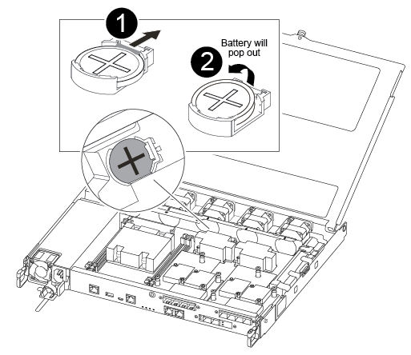

= Remplacez la pile de l'horloge temps réel - AFF A250
:allow-uri-read: 
:icons: font
:imagesdir: ../media/

[role="lead"]
Vous remplacez la batterie de l'horloge temps réel (RTC) dans le module de contrôleur afin que les services et applications de votre système qui dépendent d'une synchronisation précise de l'heure continuent de fonctionner.

* Cette procédure peut être utilisée avec toutes les versions de ONTAP prises en charge par votre système
* Tous les autres composants du système doivent fonctionner correctement ; si ce n'est pas le cas, vous devez contacter le support technique.

== Étape 1 : arrêtez le contrôleur défaillant

Pour arrêter le contrôleur défaillant, vous devez déterminer l'état du contrôleur et, si nécessaire, prendre le contrôle de façon à ce que le contrôleur en bonne santé continue de transmettre des données provenant du stockage défaillant du contrôleur.

.Description de la tâche
* Si vous disposez d'un système SAN, vous devez avoir vérifié les messages d'événement  `cluster kernel-service show`) pour le serveur lame SCSI du contrôleur défectueux.  `cluster kernel-service show`La commande (depuis la commande priv en mode avancé) affiche le nom du nœud, l'état de quorum de ce nœud, l'état de disponibilité de ce nœud ainsi que l'état opérationnel de ce nœud.
+
Chaque processus SCSI-Blade doit se trouver au quorum avec les autres nœuds du cluster. Tout problème doit être résolu avant de procéder au remplacement.

* Si vous avez un cluster avec plus de deux nœuds, il doit être dans le quorum. Si le cluster n'est pas au quorum ou si un contrôleur en bonne santé affiche la valeur false pour l'éligibilité et la santé, vous devez corriger le problème avant de désactiver le contrôleur défaillant ; voir link:https://docs.netapp.com/us-en/ontap/system-admin/synchronize-node-cluster-task.html?q=Quorum["Synchroniser un nœud avec le cluster"^].

.Étapes
. Si AutoSupport est activé, supprimez la création automatique de cas en appelant un message AutoSupport : `system node autosupport invoke -node * -type all -message MAINT=<# of hours>h`
+
Le message AutoSupport suivant supprime la création automatique de dossiers pendant deux heures : `cluster1:> system node autosupport invoke -node * -type all -message MAINT=2h`

. Désactiver le rétablissement automatique depuis la console du contrôleur sain : `storage failover modify –node local -auto-giveback false`
+

NOTE: Lorsque vous voyez _voulez-vous désactiver l'auto-giveback?_, entrez `y`.

. Faites passer le contrôleur douteux à l'invite DU CHARGEUR :
+
[cols="1,2"]
|===
| Si le contrôleur en état de fonctionnement s'affiche... | Alors... 

 a| 
Invite DU CHARGEUR
 a| 
Passez à l'étape suivante.

 a| 
Attente du retour...
 a| 
Appuyez sur Ctrl-C, puis répondez `y` lorsque vous y êtes invité.

 a| 
Invite système ou invite de mot de passe
 a| 
Prendre le contrôle défectueux ou l'arrêter à partir du contrôleur en bon état : `storage failover takeover -ofnode _impaired_node_name_`

Lorsque le contrôleur douteux s'affiche en attente de rétablissement..., appuyez sur Ctrl-C et répondez `y`.

|===

== Étape 2 : retirer le module de contrôleur

Vous devez retirer le module de contrôleur du châssis lorsque vous remplacez un composant dans le module de contrôleur.

Assurez-vous d'étiqueter les câbles de manière à connaître leur origine.

. Si vous n'êtes pas déjà mis à la terre, mettez-vous à la terre correctement.
. Débranchez les blocs d'alimentation du module de contrôleur de la source.
. Libérez les dispositifs de retenue du câble d'alimentation, puis débranchez les câbles des blocs d'alimentation.
. Insérez votre index dans le mécanisme de verrouillage de chaque côté du module de contrôleur, appuyez sur le levier avec votre pouce et tirez doucement le contrôleur à quelques pouces du châssis.
+

NOTE: Si vous avez des difficultés à retirer le module de contrôleur, placez vos doigts à travers les trous des doigts de l'intérieur (en croisant vos bras).

+
image::../media/drw_a250_pcm_remove_install.png[Ouvrez le mécanisme de verrouillage]

+
[cols="1,4"]
|===

 a| 
image:../media/legend_icon_01.png["Légende numéro 1"]
 a| 
Levier

 a| 
image:../media/legend_icon_02.png["Légende numéro 2"]
 a| 
Mécanisme de verrouillage

|===
. À l'aide des deux mains, saisissez les côtés du module de contrôleur et tirez-le doucement hors du châssis et posez-le sur une surface plane et stable.
. Tournez la vis moletée située à l'avant du module de contrôleur dans le sens anti-horaire et ouvrez le capot du module de contrôleur.
+
image::../media/drw_a250_open_controller_module_cover.png[Ouvrez le capot du module de contrôleur]

+
[cols="1,4"]
|===

 a| 
image:../media/legend_icon_01.png["Légende numéro 1"]
| Vis moletée 

 a| 
image::../media/legend_icon_02.png[Légende numéro 2]
 a| 
Capot du module de contrôleur.

|===
. Soulever le couvercle du conduit d'air.
+
image::../media/drw_a250_remove_airduct_cover.png[Soulever le couvercle du conduit d'air]

== Étape 3 : remplacer la batterie RTC

Pour remplacer la batterie RTC, la placer à l'intérieur du contrôleur et suivre l'ordre des étapes.

Utilisez la vidéo suivante ou les étapes tabulées pour remplacer la batterie RTC :

.Animation - remplacer la batterie RTC
video::6ed27f71-d3a7-4cee-8d9f-ac5b016c982d[panopto]
. Localisez la batterie RTC entre le dissipateur de chaleur et le fond de panier central et retirez-la exactement comme indiqué sur le graphique.
+

+
[cols="1,4"]
|===

 a| 
image:../media/legend_icon_01.png["Légende numéro 1"]
 a| 
Tirez doucement la languette hors du logement de la batterie. *Attention:* le tirer de façon agressive pourrait déplacer l'onglet.

 a| 
image:../media/legend_icon_02.png["Légende numéro 2"]
 a| 
Soulevez la batterie. *Remarque :* noter la polarité de la batterie.

 a| 
image:../media/legend_icon_03.png["Numéro de légende 3"]
 a| 
La batterie doit s'éjecter.

|===
+
La batterie sera éjectée.

. Retirez la batterie de rechange du sac d'expédition antistatique.
. Repérez le support de batterie RTC entre le dissipateur de chaleur et le fond de panier central et insérez-le exactement comme indiqué sur le graphique.
+
image::../media/drw_a250_install_rtc_batt.png[Installer la batterie RTC]

+
|===

 a| 
image:../media/legend_icon_01.png["Légende numéro 1"]
| Avec la polarité positive orientée vers le haut, faites glisser la batterie sous la languette du boîtier de la batterie. 

 a| 
image:../media/legend_icon_02.png["Légende numéro 2"]
 a| 
Poussez doucement la batterie en place et assurez-vous que la languette la fixe au boîtier.

CAUTION: Une pression agressive peut provoquer l'éjection de la batterie.

|===
. Inspectez visuellement la batterie pour vous assurer qu'elle est complètement installée dans le support et que la polarité est correcte.

== Étape 4 : réinstaller le module de contrôleur et régler l'heure/la date après le remplacement de la batterie RTC

Après avoir remplacé un composant dans le module de contrôleur, vous devez réinstaller le module de contrôleur dans le châssis du système, réinitialiser l'heure et la date sur le contrôleur, puis le démarrer.

. Si ce n'est déjà fait, fermez le conduit d'air ou le couvercle du module de commande.
. Alignez l'extrémité du module de contrôleur avec l'ouverture du châssis, puis poussez doucement le module de contrôleur à mi-course dans le système.
+
N'insérez pas complètement le module de contrôleur dans le châssis tant qu'il n'y a pas été demandé.

. Recâblage du système, selon les besoins.
+
Si vous avez retiré les convertisseurs de support (QSFP ou SFP), n'oubliez pas de les réinstaller si vous utilisez des câbles à fibre optique.

. Si les blocs d'alimentation ont été débranchés, rebranchez-les et réinstallez les dispositifs de retenue du câble d'alimentation.
. Insérer le module de contrôleur dans le châssis :
+
.. S'assurer que les bras du mécanisme de verrouillage sont verrouillés en position complètement sortie.
.. À l'aide des deux mains, alignez et faites glisser doucement le module de commande dans les bras du mécanisme de verrouillage jusqu'à ce qu'il s'arrête.
.. Placez vos doigts à travers les trous des doigts depuis l'intérieur du mécanisme de verrouillage.
.. Enfoncez vos pouces sur les pattes orange situées sur le mécanisme de verrouillage et poussez doucement le module de commande au-dessus de la butée.
.. Libérez vos pouces de la partie supérieure des mécanismes de verrouillage et continuez à pousser jusqu'à ce que les mécanismes de verrouillage s'enclenchent.
+
Le module de contrôleur commence à démarrer dès qu'il est complètement inséré dans le châssis. Soyez prêt à interrompre le processus de démarrage.

.. Arrêtez le contrôleur à l'invite DU CHARGEUR.

+
Le module de contrôleur doit être complètement inséré et aligné avec les bords du châssis.

. Réinitialiser l'heure et la date sur le contrôleur :
+
.. Vérifiez la date et l'heure sur le contrôleur en bon état à l'aide du `show date` commande.
.. À l'invite DU CHARGEUR sur le contrôleur cible, vérifier l'heure et la date.
.. Si nécessaire, modifiez la date avec le `set date mm/dd/yyyy` commande.
.. Si nécessaire, réglez l'heure, en GMT, à l'aide du `set time hh:mm:ss` commande.
.. Confirmez la date et l'heure sur le contrôleur cible.

. À l'invite DU CHARGEUR, entrez `bye` Pour réinitialiser les cartes PCIe et d'autres composants et laisser le contrôleur redémarrer.
. Rétablir le fonctionnement normal du contrôleur en renvoie son espace de stockage : `storage failover giveback -ofnode _impaired_node_name_`
. Si le retour automatique a été désactivé, réactivez-le : `storage failover modify -node local -auto-giveback true`

== Étape 5 : renvoyer la pièce défaillante à NetApp

Retournez la pièce défectueuse à NetApp, tel que décrit dans les instructions RMA (retour de matériel) fournies avec le kit. Voir la https://mysupport.netapp.com/site/info/rma["Retour de pièces et remplacements"] page pour plus d'informations.
