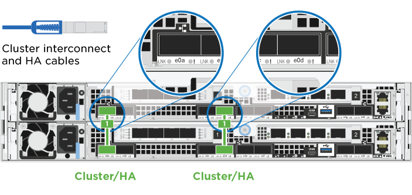
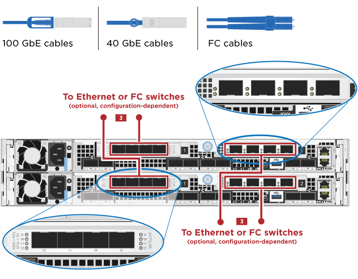
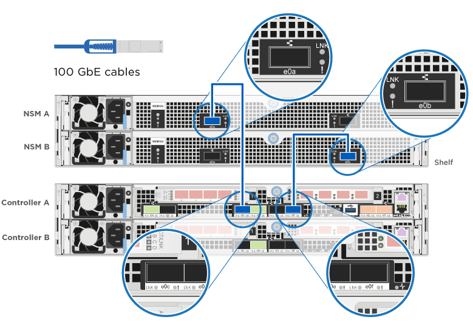

= Guide détaillé : AFF A320
:allow-uri-read: 
:icons: font
:imagesdir: ../media/

[role="lead"]
Ce guide fournit des instructions détaillées vous permettant d'installer un système NetApp classique. Utilisez ce guide si vous souhaitez obtenir des instructions d'installation plus détaillées.

== Avant l'installation

Pour installer votre système AFF A320, vous devez créer un compte, enregistrer le système et obtenir des clés de licence. Vous devez également inventorier le nombre et le type de câbles appropriés pour votre système et collecter des informations réseau spécifiques.

Pour obtenir des informations sur les conditions requises par le site ainsi que des informations supplémentaires sur le système configuré, accédez au Hardware Universe. Pour plus d'informations sur ce système, vous pouvez également accéder aux notes de version de votre version de ONTAP.

https://hwu.netapp.com["NetApp Hardware Universe"]

http://mysupport.netapp.com/documentation/productlibrary/index.html?productID=62286["Retrouvez les notes de mise à jour de votre version de ONTAP 9"]

Vous devez fournir les informations suivantes sur votre site :

* Espace rack pour le système de stockage
* Tournevis Phillips n°2
* Câbles réseau supplémentaires pour connecter votre système à votre commutateur réseau et à votre ordinateur portable ou console avec un navigateur Web
* Ordinateur portable ou console avec connexion RJ-45 et accès à un navigateur Web
+
.. Déballez le contenu de toutes les boîtes.
.. Notez le numéro de série du système depuis les contrôleurs.
+
image::../media/drw_ssn_label.png[Exemple de numéro de série du système]

.. Configurez votre compte :
+
... Connectez-vous à votre compte existant ou créez un compte.
... Enregistrez votre système.
+
https://mysupport.netapp.com/eservice/registerSNoAction.do?moduleName=RegisterMyProduct["Enregistrement de produit NetApp"]

.. Faites un inventaire et notez le nombre et le type de câbles que vous avez reçus.
+
Le tableau suivant identifie les types de câbles que vous pouvez recevoir. Si vous recevez un câble non répertorié dans le tableau, reportez-vous à la Hardware Universe pour localiser le câble et identifier son utilisation.

+
https://hwu.netapp.com["NetApp Hardware Universe"]

+
[cols="1,2,1,2"]
|===
| Type de câble... | Numéro de pièce et longueur | Type de connecteur | Pour... 

 a| 
Câble 100 GbE (QSF(28)
 a| 
X66211A-05 (112-00595), 0,5 m

X66211A-1 (112-00573), 1 m

X66211A-2 (112-00574), 2 M.

X66211A-5 (112-00574), 5 m
 a| 
image:../media/oie_cable100_gbe_qsfp28.png["Connecteur QSFP28 100 GbE"]
 a| 
Stockage, interconnexion de cluster/haute disponibilité et données Ethernet (selon les commandes)

 a| 
Câble 40 GbE
 a| 
X66211A-1 (112-00573), 1 m ;

X66211A-3 (112-00543), 3 m ;

X66211A-5 (112-00576), 5 m
 a| 
image:../media/oie_cable_sfp_gbe_copper.png["Connecteur en cuivre SFP GbE"]
 a| 
Stockage, interconnexion de cluster/haute disponibilité et données Ethernet (selon les commandes)

 a| 
Câble Ethernet - MPO
 a| 
X66200-2 (112-00326), 2 M.

X66250-5 (112-00328), 5 m

X66250-30 (112-00331), 30 m
 a| 
image:../media/oie_cable_etherned_mpo.png["Câble Ethernet - MPO"]
 a| 
Câble Ethernet (selon la commande)

 a| 
Câbles optiques
 a| 
SR :

X6553-R6 (112-00188), 2 M.

X6554-R6 (112-00189), 15 m

X6537-R6 (112-00091), 30 m

LR :

X66250-3 (112-00342), 2 M.

X66260-5 (112-00344), 5 m

X66260-30 (112-00354), 30 m
 a| 
image:../media/oie_cable_fiber_lc_connector.png["Connecteur à fibre LC"]
 a| 
Configurations FC (selon les commandes)

 a| 
RJ-45 (selon la commande)
 a| 
X6585-R6 (112-00291), 3 m

X6562-R6 (112-00196), 5 m
 a| 

 a| 
Réseau de gestion

 a| 
Câble de console micro-USB
 a| 
Sans objet
 a| 
image:../media/oie_cable_micro_usb.png["Connecteur micro USB"]
 a| 
Connexion à la console utilisée lors de la configuration du logiciel si l'ordinateur portable ou la console ne prend pas en charge la détection du réseau.

 a| 
Câbles d'alimentation
 a| 
Sans objet
 a| 
image:../media/oie_cable_power.png["Câbles d'alimentation"]
 a| 
Mise sous tension du système

|===
.. Téléchargez et remplissez la fiche de configuration _Cluster_.
+
https://library.netapp.com/ecm/ecm_download_file/ECMLP2839002["Fiche de configuration du cluster"]

== Installer le matériel de fixation

Vous devez installer votre système sur un rack de 4 montants ou une armoire système NetApp, le cas échéant.

. Installez les kits de rails, au besoin.
. Installez et sécurisez votre système en suivant les instructions fournies avec le kit de rails.
+

NOTE: Vous devez être conscient des problèmes de sécurité associés au poids du système.

+
image::../media/drw_a320_weight_label.png[Avertissement de poids de levage du système]

. Fixez les dispositifs de gestion des câbles (comme illustré).
+
image::../media/drw_a320_cable_management_arms.png[Retirez ou installez les bras de gestion des câbles]

. Placez le panneau à l'avant du système.

== Reliez les contrôleurs à votre réseau

Vous pouvez connecter les contrôleurs à votre réseau en utilisant la méthode de cluster sans commutateur à deux nœuds ou en utilisant le réseau d'interconnexion de cluster.

=== Option 1 : câler un cluster à deux nœuds sans commutateur

Les ports de données en option, les cartes NIC en option et les ports de gestion des modules de contrôleur sont connectés aux commutateurs. Les ports d'interconnexion/haute disponibilité du cluster sont câblés sur les deux modules de contrôleur.

Vous devez avoir contacté votre administrateur réseau pour obtenir des informations sur la connexion du système aux commutateurs.

Assurez-vous de vérifier que la flèche de l'illustration indique l'orientation correcte du connecteur de câble à languette.

image::../media/oie_cable_pull_tab_up.png[Connecteur de câble avec languette de traction sur le dessus]

NOTE: Lorsque vous insérez le connecteur, vous devez le sentir en place ; si vous ne le sentez pas, retirez-le, tournez-le et réessayez.

. Vous pouvez utiliser l'illustration ou les instructions pas à pas pour terminer le câblage entre les contrôleurs et vers les commutateurs :
+
image::../media/drw_a320_tnsc_network_cabling_composite_animated_gif.png[Composite câblage/câblage en cluster sans commutateur à 2 nœuds]

+
[cols="1,2"]
|===
| Étape | Effectuer des opérations sur chaque module de contrôleur 

 a| 
image:../media/icon_square_1_green.png["Étape 1"]
 a| 
Connectez les ports cluster/HA les uns aux autres via un câble 100 GbE (QSFP28) :

** e0a à e0a
** e0d à e0d 

 a| 
image:../media/icon_square_2_yellow.png["Étape 2"]
 a| 
Si vous utilisez vos ports intégrés pour une connexion au réseau de données, connectez les câbles 100 GbE ou 40 GbE aux switchs réseau de données appropriés :

** e0g et e0h image:../media/drw_a320_onboard_data_connection_step2.png["Connectez les connexions du réseau de données intégré"]

 a| 
image:../media/icon_square_3_orange.png["Étape 3"]
 a| 
Si vous utilisez vos cartes NIC pour des connexions Ethernet ou FC, connectez la ou les cartes NIC aux commutateurs appropriés :

 a| 
image:../media/icon_square_4_red.png["Étape 4"]
 a| 
Reliez les ports e0M aux switchs réseau de gestion avec les câbles RJ45.

image:../media/drw_a320_management_port_connection_step4.png["Connectez le port de gestion"]

 a| 
image:../media/oie_legend_icon_attn_symbol.png["Symbole d'attention"]
 a| 
NE branchez PAS les cordons d'alimentation à ce stade.

|===
. Branchez les câbles du stockage : <<Reliez les contrôleurs aux tiroirs disques>>

=== Option 2 : câblage d'un cluster commuté

Les ports de données en option, les cartes NIC en option et les ports de gestion des modules de contrôleur sont connectés aux commutateurs. Les ports d'interconnexion/haute disponibilité de cluster sont câblés sur le commutateur de cluster/haute disponibilité.

Vous devez avoir contacté votre administrateur réseau pour obtenir des informations sur la connexion du système aux commutateurs.

Assurez-vous de vérifier que la flèche de l'illustration indique l'orientation correcte du connecteur de câble à languette.

image::../media/oie_cable_pull_tab_up.png[Connecteur de câble avec languette de traction sur le dessus]

NOTE: Lorsque vous insérez le connecteur, vous devez le sentir en place ; si vous ne le sentez pas, retirez-le, tournez-le et réessayez.

. Vous pouvez utiliser l'illustration ou les instructions pas à pas pour terminer le câblage entre les contrôleurs et vers les commutateurs :
+
image::../media/drw_a320_switched_network_cabling_composite_animated_GIF.png[Composite de câblage de cluster commuté]

+
[cols="1,3"]
|===
| Étape | Effectuer des opérations sur chaque module de contrôleur 

 a| 
image:../media/icon_square_1_green.png["Étape 1"]
 a| 
Connectez les ports cluster/HA au switch cluster/HA avec le câble 100 GbE (QSFP28) :

** e0a sur les deux contrôleurs au commutateur cluster/HA
** E0d sur les deux contrôleurs vers le commutateur cluster/HA image:../media/drw_a320_switched_cluster_ha_connection_step1b.png["Connexions cluster-haute disponibilité commutées"]

 a| 
image:../media/icon_square_2_yellow.png["Étape 2"]
 a| 
Si vous utilisez vos ports intégrés pour une connexion au réseau de données, connectez les câbles 100 GbE ou 40 GbE aux switchs réseau de données appropriés :

** e0g et e0h image:../media/drw_a320_onboard_data_connection_step2.png["Connexions réseau intégrées au cluster commuté"]

 a| 
image:../media/icon_square_3_orange.png["Étape 3"]
 a| 
Si vous utilisez vos cartes NIC pour des connexions Ethernet ou FC, connectez la ou les cartes NIC aux commutateurs appropriés :

 a| 
image:../media/icon_square_4_red.png["Étape 4"]
 a| 
Reliez les ports e0M aux switchs réseau de gestion avec les câbles RJ45.

image:../media/drw_a320_management_port_connection_step4.png["Connexions réseau commutées de gestion de cluster"]

 a| 
image:../media/oie_legend_icon_attn_symbol.png["Symbole d'attention"]
 a| 
NE branchez PAS les cordons d'alimentation à ce stade.

|===
. Branchez les câbles du stockage : <<Reliez les contrôleurs aux tiroirs disques>>

== Reliez les contrôleurs aux tiroirs disques

Vous devez connecter les câbles des contrôleurs à vos tiroirs à l'aide des ports de stockage intégrés.

=== Option 1 : câblage des contrôleurs à un tiroir disque unique

Vous devez connecter chaque contrôleur aux modules NSM du tiroir de disque NS224.

Assurez-vous de vérifier que la flèche de l'illustration indique l'orientation correcte du connecteur de câble à languette.

image::../media/oie_cable_pull_tab_up.png[Connecteur de câble avec languette de traction sur le dessus]

NOTE: Lorsque vous insérez le connecteur, vous devez le sentir en place ; si vous ne le sentez pas, retirez-le, tournez-le et réessayez.

. Vous pouvez utiliser l'illustration ou les instructions pas à pas pour connecter les câbles des contrôleurs à un seul tiroir.
+
image::../media/drw_a320_single_shelf_connections_animated_gif.png[Câblage composite pour un tiroir disque]

+
[cols="1,3"]
|===
| Étape | Effectuer des opérations sur chaque module de contrôleur 

 a| 
image:../media/icon_square_1_blue.png["Légende numéro 1"]
 a| 
Reliez le contrôleur A au tiroir 

 a| 
image:../media/icon_square_2_yellow.png["Légende numéro 2"]
 a| 
Reliez le contrôleur B au tiroir : image:../media/drw_a320_storage_cabling_controller_b_single_shelf.png["Connectez le contrôleur B à un seul tiroir"]

|===
. Pour terminer la configuration de votre système, reportez-vous à la section <<Installation et configuration du système complètes>>

=== Option 2 : câblage des contrôleurs à deux tiroirs disques

Vous devez connecter chaque contrôleur aux modules NSM des deux tiroirs disques NS224.

Assurez-vous de vérifier que la flèche de l'illustration indique l'orientation correcte du connecteur de câble à languette.

image::../media/oie_cable_pull_tab_up.png[Connecteur de câble avec languette de traction sur le dessus]

NOTE: Lorsque vous insérez le connecteur, vous devez le sentir en place ; si vous ne le sentez pas, retirez-le, tournez-le et réessayez.

. Vous pouvez utiliser l'illustration suivante ou les étapes écrites pour connecter les contrôleurs à deux tiroirs disques.
+
image::../media/drw_a320_2_shevles_cabling_animated_gif.png[Câbler l'animation de deux étagères]

+
[cols="1-3"]
|===
| Étape | Effectuer des opérations sur chaque module de contrôleur 

 a| 
image:../media/icon_square_1_blue.png["Légende numéro 1"]
 a| 
Câblez le contrôleur A aux tiroirs : image:../media/drw_a320_2_shelves_cabling_controller_a.png["Reliez deux tiroirs au contrôleur A"]

 a| 
image:../media/icon_square_2_yellow.png["Légende numéro 2"]
 a| 
Câblez le contrôleur B aux tiroirs : image:../media/drw_a320_2_shelves_cabling_controller_b.png["Relier les étagères teo au contrôleur B."]

|===
. Pour terminer la configuration de votre système, reportez-vous à la section <<Installation et configuration du système complètes>>

== Installation et configuration du système complètes

Vous pouvez effectuer la configuration et l'installation du système en utilisant la découverte de cluster uniquement avec une connexion au commutateur et à l'ordinateur portable, ou en vous connectant directement à un contrôleur du système, puis en vous connectant au commutateur de gestion.

=== Option 1 : fin de la configuration et de la configuration du système si la détection du réseau est activée

Si la détection réseau est activée sur votre ordinateur portable, vous pouvez effectuer l'installation et la configuration du système à l'aide de la détection automatique des clusters.

. Branchez les câbles d'alimentation aux alimentations du contrôleur, puis connectez-les à des sources d'alimentation de différents circuits.
+
Le système commence à démarrer. Le démarrage initial peut prendre jusqu'à huit minutes

. Assurez-vous que la détection réseau de votre ordinateur portable est activée.
+
Consultez l'aide en ligne de votre ordinateur portable pour plus d'informations.

. Utilisez l'animation suivante pour connecter votre ordinateur portable au commutateur de gestion.
+
.Animation : connectez votre ordinateur portable au commutateur de gestion
video::d61f983e-f911-4b76-8b3a-ab1b0066909b[panopto]
. Sélectionnez une icône ONTAP pour découvrir :
+
image::../media/drw_autodiscovery_controler_select.png[Sélectionnez une icône ONTAP]

+
.. Ouvrez l'Explorateur de fichiers.
.. Cliquez sur *réseau* dans le volet gauche, cliquez avec le bouton droit de la souris et sélectionnez *refresh*.
.. Double-cliquez sur l'une des icônes ONTAP et acceptez les certificats affichés à l'écran.
+

NOTE: XXXXX est le numéro de série du système du nœud cible.

+
System Manager s'ouvre.

. Utilisez la configuration assistée de System Manager pour configurer votre système à l'aide des données collectées dans le _guide de configuration ONTAP_ de NetApp.
+
https://library.netapp.com/ecm/ecm_download_file/ECMLP2862613["Guide de configuration de ONTAP"]

. Vérifiez l'état de santé de votre système en exécutant Config Advisor.
. Une fois la configuration initiale terminée, reportez-vous à la section https://docs.netapp.com/us-en/ontap/index.html["Documentation sur ONTAP 9"^] pour plus d'informations sur la configuration de fonctions supplémentaires dans ONTAP.

=== Option 2 : fin de la configuration et de la configuration du système si la détection du réseau n'est pas activée

Si la détection réseau n'est pas activée sur votre ordinateur portable, vous devez effectuer la configuration et la configuration à l'aide de cette tâche.

. Branchez et configurez votre ordinateur portable ou votre console :
+
.. Définissez le port de console de l'ordinateur portable ou de la console sur 115,200 bauds avec N-8-1.
+

NOTE: Consultez l'aide en ligne de votre ordinateur portable ou de votre console pour savoir comment configurer le port de console.

.. Connectez le câble de la console à l'ordinateur portable ou à la console à l'aide du câble de console fourni avec le système, puis connectez l'ordinateur portable au commutateur de gestion du sous-réseau de gestion.
+
image::../media/drw_a320_laptop_to_switch_and_controller.png[Connectez l'ordinateur portable au commutateur de sous-réseau de gestion]

.. Attribuez une adresse TCP/IP à l'ordinateur portable ou à la console à l'aide d'une adresse située sur le sous-réseau de gestion.

. Utilisez l'animation suivante pour définir un ou plusieurs ID de tiroir disque :
+
.Animation : définissez les ID de tiroir disque
video::c600f366-4d30-481a-89d9-ab1b0066589b[panopto]
. Branchez les câbles d'alimentation aux alimentations du contrôleur, puis connectez-les à des sources d'alimentation de différents circuits.
+
Le système commence à démarrer. Le démarrage initial peut prendre jusqu'à huit minutes

. Attribuez une adresse IP initiale de gestion des nœuds à l'un des nœuds.
+
[cols="1,3"]
|===
| Si le réseau de gestion dispose de DHCP... | Alors... 

 a| 
Configuré
 a| 
Notez l'adresse IP attribuée aux nouveaux contrôleurs.

 a| 
Non configuré
 a| 
.. Ouvrez une session de console à l'aide de PuTTY, d'un serveur de terminal ou de l'équivalent pour votre environnement.
+

NOTE: Consultez l'aide en ligne de votre ordinateur portable ou de votre console si vous ne savez pas comment configurer PuTTY.

.. Saisissez l'adresse IP de gestion lorsque le script vous y invite.

|===
. Utilisez System Manager sur votre ordinateur portable ou sur la console pour configurer votre cluster :
+
.. Indiquez l'adresse IP de gestion des nœuds dans votre navigateur.
+

NOTE: Le format de l'adresse est +https://x.x.x.x+.

.. Configurez le système à l'aide des données collectées dans le _NetApp ONTAP Configuration guide_.
+
https://library.netapp.com/ecm/ecm_download_file/ECMLP2862613["Guide de configuration de ONTAP"]

. Vérifiez l'état de santé de votre système en exécutant Config Advisor.
. Une fois la configuration initiale terminée, reportez-vous à la section https://docs.netapp.com/us-en/ontap/index.html["Documentation sur ONTAP 9"^] pour plus d'informations sur la configuration de fonctions supplémentaires dans ONTAP.

