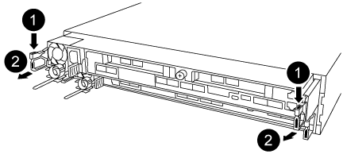

= Remplacez la pile de l'horloge en temps réel : AFF A320
:allow-uri-read: 
:icons: font
:imagesdir: ../media/

[role="lead"]
Vous remplacez la batterie de l'horloge temps réel (RTC) dans le module de contrôleur afin que les services et applications de votre système qui dépendent d'une synchronisation précise de l'heure continuent de fonctionner.

* Cette procédure peut être utilisée avec toutes les versions de ONTAP prises en charge par votre système
* Tous les autres composants du système doivent fonctionner correctement ; si ce n'est pas le cas, vous devez contacter le support technique.

== Étape 1 : arrêter le contrôleur

Pour arrêter le contrôleur défaillant, vous devez déterminer l'état du contrôleur et, si nécessaire, prendre le contrôle de façon à ce que le contrôleur en bonne santé continue de transmettre des données provenant du stockage défaillant du contrôleur.

.Description de la tâche
* Si vous disposez d'un système SAN, vous devez avoir vérifié les messages d'événement  `cluster kernel-service show`) pour le serveur lame SCSI du contrôleur défectueux.  `cluster kernel-service show`La commande (depuis la commande priv en mode avancé) affiche le nom du nœud, l'état de quorum de ce nœud, l'état de disponibilité de ce nœud ainsi que l'état opérationnel de ce nœud.
+
Chaque processus SCSI-Blade doit se trouver au quorum avec les autres nœuds du cluster. Tout problème doit être résolu avant de procéder au remplacement.

* Si vous avez un cluster avec plus de deux nœuds, il doit être dans le quorum. Si le cluster n'est pas au quorum ou si un contrôleur en bonne santé affiche la valeur false pour l'éligibilité et la santé, vous devez corriger le problème avant de désactiver le contrôleur défaillant ; voir link:https://docs.netapp.com/us-en/ontap/system-admin/synchronize-node-cluster-task.html?q=Quorum["Synchroniser un nœud avec le cluster"^].

.Étapes
. Si AutoSupport est activé, supprimez la création automatique de cas en appelant un message AutoSupport : `system node autosupport invoke -node * -type all -message MAINT=<# of hours>h`
+
Le message AutoSupport suivant supprime la création automatique de dossiers pendant deux heures : `cluster1:> system node autosupport invoke -node * -type all -message MAINT=2h`

. Désactiver le rétablissement automatique depuis la console du contrôleur sain : `storage failover modify –node local -auto-giveback false`
+

NOTE: Lorsque vous voyez _voulez-vous désactiver l'auto-giveback?_, entrez `y`.

. Faites passer le contrôleur douteux à l'invite DU CHARGEUR :
+
[cols="1,2"]
|===
| Si le contrôleur en état de fonctionnement s'affiche... | Alors... 

 a| 
Invite DU CHARGEUR
 a| 
Passez à l'étape suivante.

 a| 
Attente du retour...
 a| 
Appuyez sur Ctrl-C, puis répondez `y` lorsque vous y êtes invité.

 a| 
Invite système ou invite de mot de passe
 a| 
Prendre le contrôle défectueux ou l'arrêter à partir du contrôleur en bon état : `storage failover takeover -ofnode _impaired_node_name_`

Lorsque le contrôleur douteux s'affiche en attente de rétablissement..., appuyez sur Ctrl-C et répondez `y`.

|===

== Étape 2 : remplacer la batterie RTC

Vous devez localiser la batterie RTC à l'intérieur du module de contrôleur, puis suivre la séquence spécifique des étapes.

== Étape 3 : retirez le module de contrôleur

Pour accéder aux composants à l'intérieur du module de contrôleur, vous devez retirer le module de contrôleur du châssis.

. Si vous n'êtes pas déjà mis à la terre, mettez-vous à la terre correctement.
. Débranchez l'alimentation du module de contrôleur de la source d'alimentation.
. Desserrez le crochet et la bride de boucle qui relient les câbles au périphérique de gestion des câbles, puis débranchez les câbles système et les SFP (si nécessaire) du module de contrôleur, en maintenant une trace de l'emplacement où les câbles ont été connectés.
+
image::../media/drw_a320_controller_cable_unplug_animated_gif.png[Retrait du périphérique de gestion des câbles]

+
Laissez les câbles dans le périphérique de gestion des câbles de sorte que lorsque vous réinstallez le périphérique de gestion des câbles, les câbles sont organisés.

. Retirez et mettez de côté les dispositifs de gestion des câbles des côtés gauche et droit du module de contrôleur.
. Retirer le module de contrôleur du châssis :
+

+
.. Insérez l'index dans le mécanisme de verrouillage de chaque côté du module de contrôleur.
.. Appuyez sur la languette orange située sur la partie supérieure du mécanisme de verrouillage jusqu'à ce qu'elle se dégage de la goupille de verrouillage du châssis.

+
Le crochet du mécanisme de verrouillage doit être presque vertical et doit être dégagé de l'axe du châssis.

+
.. Tirez doucement le module de contrôleur de quelques pouces vers vous pour pouvoir saisir les côtés du module de contrôleur.
.. A l'aide des deux mains, tirez doucement le module de contrôleur hors du châssis et posez-le sur une surface plane et stable.

== Étape 4 : remplacer la batterie RTC

image::../media/drw_a320_rtc_batt_replace_animated_gif.png[remplacement de la batterie rtc drw a320 gif animé]

. Retirez le capot PCIe.
+
.. Dévissez la vis moletée bleue située au-dessus des ports intégrés à l'arrière du module de contrôleur.
.. Faites glisser le couvercle vers vous et faites-le pivoter vers le haut.
.. Retirez le couvercle et mettez-le de côté.

. Localisez, retirez et remplacez la batterie RTC :
+
.. A l'aide du plan des FRU, localiser la batterie RTC sur le module de contrôleur.
.. Poussez doucement la batterie hors du support, faites-la pivoter pour l'éloigner du support, puis retirez-la du support.
+

NOTE: Notez la polarité de la batterie lorsque vous la retirez du support. La batterie est signalée par un signe plus et doit être correctement positionnée dans le support. Un signe plus près du support indique comment la batterie doit être positionnée.

.. Retirez la batterie de rechange du sac d'expédition antistatique.
.. Notez la polarité de la batterie RTC, puis insérez-la dans le support en inclinant la batterie et en la poussant vers le bas.

. Inspectez visuellement la batterie pour vous assurer qu'elle est complètement installée dans le support et que la polarité est correcte.
. Réinstallez le capot PCIe sur le module de contrôleur.

== Étape 5 : réinstaller le module de contrôleur et régler l'heure/la date après le remplacement de la batterie RTC

Après avoir remplacé un composant dans le module de contrôleur, vous devez réinstaller le module de contrôleur dans le châssis du système, réinitialiser l'heure et la date sur le contrôleur, puis le démarrer.

. Si ce n'est déjà fait, fermez le conduit d'air ou le couvercle du module de commande.
. Alignez l'extrémité du module de contrôleur avec l'ouverture du châssis, puis poussez doucement le module de contrôleur à mi-course dans le système.
+
N'insérez pas complètement le module de contrôleur dans le châssis tant qu'il n'y a pas été demandé.

. Recâblage du système, selon les besoins.
+
Si vous avez retiré les convertisseurs de support (QSFP ou SFP), n'oubliez pas de les réinstaller si vous utilisez des câbles à fibre optique.

. Si les blocs d'alimentation ont été débranchés, rebranchez-les et réinstallez les dispositifs de retenue du câble d'alimentation.
. Terminez la réinstallation du module de contrôleur :
+
.. S'assurer que les bras de verrouillage sont verrouillés en position étendue.
.. A l'aide des bras de verrouillage, poussez le module de contrôleur dans la baie du châssis jusqu'à ce qu'il s'arrête.
+

NOTE: Ne pas pousser le mécanisme de verrouillage en haut des bras de verrouillage vers le bas. Relever le mécanisme de verrouillage et empêcher le déplacement du module de contrôleur dans le châssis.

.. Appuyez sur les languettes orange du haut du mécanisme de verrouillage et maintenez-les enfoncées.
.. Poussez doucement le module contrôleur dans la baie du châssis jusqu'à ce qu'il affleure les bords du châssis.
+

NOTE: Les bras du mécanisme de verrouillage coulissent dans le châssis.

+
Le module de contrôleur commence à démarrer dès qu'il est complètement inséré dans le châssis.

.. Libérer les loquets pour verrouiller le module de contrôleur en place.
.. Si ce n'est déjà fait, réinstallez le périphérique de gestion des câbles.
.. Arrêtez le contrôleur à l'invite DU CHARGEUR.

. Réinitialiser l'heure et la date sur le contrôleur :
+
.. Vérifiez la date et l'heure sur le contrôleur en bon état à l'aide du `show date` commande.
.. À l'invite DU CHARGEUR sur le contrôleur cible, vérifier l'heure et la date.
.. Si nécessaire, modifiez la date avec le `set date mm/dd/yyyy` commande.
.. Si nécessaire, réglez l'heure, en GMT, à l'aide du `set time hh:mm:ss` commande.
.. Confirmez la date et l'heure sur le contrôleur cible.

. À l'invite DU CHARGEUR, entrez `bye` Pour réinitialiser les cartes PCIe et d'autres composants et laisser le contrôleur redémarrer.
. Rétablir le fonctionnement normal du contrôleur en renvoie son espace de stockage : `storage failover giveback -ofnode _impaired_node_name_`
. Si le retour automatique a été désactivé, réactivez-le : `storage failover modify -node local -auto-giveback true`

== Étape 6 : renvoyer la pièce défaillante à NetApp

Retournez la pièce défectueuse à NetApp, tel que décrit dans les instructions RMA (retour de matériel) fournies avec le kit. Voir la https://mysupport.netapp.com/site/info/rma["Retour de pièce et amp ; remplacements"] pour plus d'informations.
