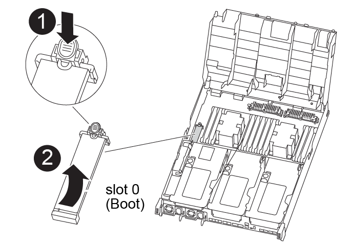

= Remplacez le matériel du module de contrôleur - AFF A400
:allow-uri-read: 
:icons: font
:imagesdir: ../media/

[role="lead"]
Pour remplacer le matériel du module de contrôleur, vous devez retirer le contrôleur défectueux, déplacer les composants FRU vers le module de contrôleur de remplacement, installer le module de contrôleur de remplacement dans le châssis, puis démarrer le système en mode de maintenance.

== Étape 1 : retirer le module de contrôleur

Pour accéder aux composants à l'intérieur du module de contrôleur, vous devez retirer le module de contrôleur du châssis.

Vous pouvez utiliser la , illustration ou les étapes écrites suivantes pour retirer le module de contrôleur du châssis.

.Animation - retirez le module de contrôleur
video::ca74d345-e213-4390-a599-aae10019ec82[panopto]
. Si vous n'êtes pas déjà mis à la terre, mettez-vous à la terre correctement.
. Libérez les dispositifs de retenue du câble d'alimentation, puis débranchez les câbles des blocs d'alimentation.
. Desserrez le crochet et la bride de boucle qui relient les câbles au périphérique de gestion des câbles, puis débranchez les câbles système et les SFP (si nécessaire) du module de contrôleur, en maintenant une trace de l'emplacement où les câbles ont été connectés.
+
Laissez les câbles dans le périphérique de gestion des câbles de sorte que lorsque vous réinstallez le périphérique de gestion des câbles, les câbles sont organisés.

. Retirez le périphérique de gestion des câbles du module de contrôleur et mettez-le de côté.
. Appuyez sur les deux loquets de verrouillage, puis faites pivoter les deux loquets vers le bas en même temps.
+
Le module de contrôleur se déplace légèrement hors du châssis.

+
image:../media/drw_A400_Remove_controller.png["Relâchez le module de contrôleur"]

+
[cols="10a,90a"]
|===

 a| 
image:../media/icon_round_1.png["Légende numéro 1"]
 a| 
Loquets de verrouillage

 a| 
image:../media/icon_round_2.png["Légende numéro 2"]
 a| 
Le contrôleur sort légèrement du châssis

|===
. Faites glisser le module de contrôleur hors du châssis.
+
Assurez-vous de prendre en charge la partie inférieure du module de contrôleur lorsque vous le faites glisser hors du châssis.

. Placez le module de commande sur une surface plane et stable.
. Sur le module de contrôleur de remplacement, ouvrez le conduit d'air et retirez les surmontoirs vides du module de contrôleur en suivant l'animation, l'illustration ou les étapes écrites :
+
.Animation - retirez les cartes de montage vides du module de contrôleur de remplacement
video::49053752-e813-4c15-a917-ab190147fa6e[panopto]

image::../media/drw_a400_empty_riser_remove.png[Retirez la carte de montage vide]

[cols="10,90"]
|===

 a| 
image:../media/icon_round_1.png["Légende numéro 1"]
 a| 
Loquets de déverrouillage de la carte de montage

|===
. Appuyer sur les pattes de verrouillage situées sur les côtés du conduit d'air vers le milieu du module de commande.
. Faites glisser le conduit d'air vers l'arrière du module de commande, puis faites-le pivoter vers le haut jusqu'à sa position complètement ouverte.
. Faites pivoter le loquet de verrouillage de la rehausse sur le côté gauche de la rehausse 1 vers le haut et vers le conduit d'air, soulevez la rehausse, puis mettez-la de côté.
. Répétez l'étape précédente pour les autres surmontoirs.

== Étape 2 : déplacer les blocs d'alimentation

Lorsque vous remplacez un module de contrôleur, vous devez déplacer le bloc d'alimentation du module de contrôleur endommagé vers le module de contrôleur de remplacement.

Vous pouvez utiliser l'animation, l'illustration ou les étapes écrites suivantes pour déplacer les blocs d'alimentation vers le module de contrôleur de remplacement.

.Animation - déplacer les blocs d'alimentation
video::92060115-1967-475b-b517-aad9012f130c[panopto]
. Retirer l'alimentation électrique :
+
image::../media/drw_A400_psu.png[Remplacez le bloc d'alimentation]

+
[cols="10,90"]
|===

 a| 
image:../media/icon_round_1.png["Légende numéro 1"]
 a| 
Languette de verrouillage du bloc d'alimentation

 a| 
image:../media/icon_round_2.png["Légende numéro 2"]
 a| 
Dispositif de retenue du câble d'alimentation

|===
+
.. Faites pivoter la poignée de came de façon à ce qu'elle puisse être utilisée pour extraire le bloc d'alimentation du châssis.
.. Appuyez sur la languette de verrouillage bleue pour dégager le bloc d'alimentation du châssis.
.. A l'aide des deux mains, retirez le bloc d'alimentation du châssis, puis mettez-le de côté.

. Déplacez le bloc d'alimentation vers le nouveau module de contrôleur, puis installez-le.
. À l'aide des deux mains, soutenez et alignez les bords du bloc d'alimentation avec l'ouverture du module de contrôleur, puis poussez doucement le bloc d'alimentation dans le module de contrôleur jusqu'à ce que la languette de verrouillage s'enclenche.
+
Les blocs d'alimentation ne s'enclenteront correctement qu'avec le connecteur interne et se verrouillent d'une seule manière.

+

NOTE: Pour éviter d'endommager le connecteur interne, ne pas exercer de force excessive lors du glissement du bloc d'alimentation dans le système.

. Répétez les étapes précédentes pour les blocs d'alimentation restants.

== Étape 3 : déplacez la batterie NVDIMM

Pour déplacer la batterie NVDIMM du module de contrôleur défaillant vers le module de contrôleur de remplacement, vous devez effectuer une séquence spécifique d'étapes.

Vous pouvez utiliser l'animation, l'illustration ou les étapes écrites suivantes pour déplacer la batterie NVDIMM du module de contrôleur pour facultés affaiblies vers le module de contrôleur de remplacement.

.Animation : déplacez la batterie NVDIMM
video::94d115b2-b02a-4234-805c-aad9012f204c[panopto]
image::../media/drw_A400_nvdimm-batt.png[Retirez la batterie NVDIMM]

[cols="10,90"]
|===

 a| 
image:../media/icon_round_1.png["Légende numéro 1"]
 a| 
Fiche de batterie NVDIMM

 a| 
image:../media/icon_round_2.png["Légende numéro 2"]
 a| 
Languette de verrouillage de la batterie NVDIMM

 a| 
image:../media/icon_round_3.png["Numéro de légende 3"]
 a| 
Batterie NVDIMM

|===
. Ouvrir le conduit d'air :
+
.. Appuyer sur les pattes de verrouillage situées sur les côtés du conduit d'air vers le milieu du module de commande.
.. Faites glisser le conduit d'air vers l'arrière du module de commande, puis faites-le pivoter vers le haut jusqu'à sa position complètement ouverte.

. Localisez la batterie NVDIMM dans le module de contrôleur.
. Localisez la fiche mâle batterie et appuyez sur le clip situé sur la face de la fiche mâle batterie pour libérer la fiche de la prise, puis débranchez le câble de batterie de la prise.
. Saisissez la batterie et appuyez sur la languette de verrouillage bleue indiquant « POUSSER », puis soulevez la batterie pour la sortir du support et du module de contrôleur.
. Placer la batterie sur le module de contrôleur de remplacement.
. Alignez le module de batterie avec l'ouverture de la batterie, puis poussez doucement la batterie dans son logement jusqu'à ce qu'elle s'enclenche.
+

NOTE: Ne rebranchez pas le câble de la batterie sur la carte mère tant que vous n'y êtes pas invité.

== Étape 4 : déplacer le support de démarrage

Vous devez localiser le support de démarrage, puis suivre les instructions pour le retirer du module de contrôleur pour facultés affaiblies et l'insérer dans le module de contrôleur de remplacement.

Vous pouvez utiliser l'animation, l'illustration ou les étapes écrites suivantes pour déplacer le support de démarrage du module de contrôleur pour facultés affaiblies vers le module de contrôleur de remplacement.

.Animation : permet de déplacer le support de démarrage
video::2a14099c-85de-4a84-867c-aad9012efac8[panopto]

[cols="10,90"]
|===

 a| 
image:../media/icon_round_1.png["Légende numéro 1"]
 a| 
Languette de verrouillage du support de démarrage

 a| 
image:../media/icon_round_2.png["Légende numéro 2"]
 a| 
Support de démarrage

|===
. Recherchez et retirez le support de démarrage du module de contrôleur :
+
.. Appuyez sur le bouton bleu à l'extrémité du support de démarrage jusqu'à ce que le rebord du support de démarrage disparaisse du bouton bleu.
.. Faites pivoter le support de démarrage vers le haut et retirez doucement le support de démarrage du support.

. Déplacez le support de démarrage vers le nouveau module de contrôleur, alignez les bords du support de démarrage avec le boîtier du support, puis poussez-le doucement dans le support.
. Vérifiez le support de démarrage pour vous assurer qu'il est bien en place dans le support.
+
Si nécessaire, retirez le support de démarrage et réinstallez-le dans le support.

. Verrouillez le support de démarrage en place :
+
.. Faites pivoter le support de démarrage vers le bas, vers la carte mère.
.. Appuyer sur le bouton de verrouillage bleu pour qu'il soit en position ouverte.
.. En plaçant vos doigts à l'extrémité du support de démarrage par le bouton bleu, appuyez fermement sur l'extrémité du support de démarrage pour engager le bouton de verrouillage bleu.

== Étape 5 : déplacez les cartes de montage PCIe et la carte mezzanine

Dans le cadre du processus de remplacement du contrôleur, vous devez déplacer les cartes de montage PCIe et la carte mezzanine du module de contrôleur pour facultés affaiblies vers le module de contrôleur de remplacement.

Vous pouvez utiliser les animations, illustrations ou étapes écrites suivantes pour déplacer les cartes de montage PCIe et la carte mezzanine du module de contrôleur pour facultés affaiblies vers le module de contrôleur de remplacement.

Déplacement des cartes de montage PCIe 1 et 2 (redresseurs gauche et central) :

.Animation - déplacer les cartes de montage PCI 1 et 2
video::f4ee1d4d-6029-4fe6-a063-aad9012f170b[panopto]
Déplacement de la carte mezzanine et de la carte de montage 3 (carte de montage droite) :

.Animation : déplacez la carte mezzanine et la carte de montage 3
video::b0c3b575-3434-4e00-a421-aad9012f2e9e[panopto]
image::../media/drw_A400_Replace-PCIe-cards.png[Retirez les cartes PCIe]

[cols="10,90"]
|===

 a| 
image:../media/icon_round_1.png["Légende numéro 1"]
 a| 
Loquet de verrouillage de la rehausse

 a| 
image:../media/icon_round_2.png["Légende numéro 2"]
 a| 
Loquet de verrouillage de la carte PCI

 a| 
image:../media/icon_round_3.png["Numéro de légende 3"]
 a| 
Plaque de verrouillage PCI

 a| 
image:../media/icon_round_4.png["Numéro de légende 4"]
 a| 
Carte PCI

|===
. Déplacez les cartes de montage PCIe une et deux du module de contrôleur pour facultés affaiblies vers le module de contrôleur de remplacement :
+
.. Retirez tous les modules SFP ou QSFP qui peuvent se trouver dans les cartes PCIe.
.. Faites pivoter le loquet de verrouillage de la rehausse sur le côté gauche de la rehausse vers le haut et vers le conduit d'air.
+
La carte de montage se soulève légèrement du module de contrôleur.

.. Soulevez la carte de montage, puis déplacez-la vers le module de contrôleur de remplacement.
.. Alignez la carte de montage avec les broches sur le côté du support de la carte de montage, abaissez la carte de montage sur les broches, poussez-la directement dans le support de la carte mère, puis faites-la pivoter vers le bas au même niveau que la tôle de la carte de montage.
.. Répétez cette étape pour la carte de montage numéro 2.

. Retirez la carte de montage numéro 3, retirez la carte mezzanine et installez les deux dans le module de contrôleur de remplacement :
+
.. Retirez tous les modules SFP ou QSFP qui peuvent se trouver dans les cartes PCIe.
.. Faites pivoter le loquet de verrouillage de la rehausse sur le côté gauche de la rehausse vers le haut et vers le conduit d'air.
+
La carte de montage se soulève légèrement du module de contrôleur.

.. Soulevez la rehausse, puis mettez-la de côté sur une surface plane et stable.
.. Desserrez les vis moletées de la carte mezzanine, soulevez doucement la carte pour la sortir du support, puis déplacez-la vers le module de contrôleur de remplacement.
.. Installez la mezzanine dans le contrôleur de remplacement et fixez-la à l'aide des vis à molette.
.. Installez la troisième carte de montage dans le module de contrôleur de remplacement.

== Étape 6 : déplacez les modules DIMM

Vous devez localiser les modules DIMM, puis les déplacer du module de contrôleur défaillant vers le module de contrôleur de remplacement.

Vous devez avoir le nouveau module de contrôleur prêt pour pouvoir déplacer les modules DIMM directement du module de contrôleur défaillant vers les logements correspondants du module de contrôleur de remplacement.

Vous pouvez utiliser l'animation, l'illustration ou les étapes écrites suivantes pour déplacer les modules DIMM du module de contrôleur défaillant vers le module de contrôleur de remplacement.

.Animation : déplacez les modules DIMM
video::717b52fa-f236-4f3d-b07d-aad9012f51a3[panopto]
image::../media/drw_A400_Replace-NVDIMM-DIMM.png[Déplacez les modules DIMM]

[cols="10,90"]
|===

 a| 
image:../media/icon_round_1.png["Légende numéro 1"]
 a| 
Languettes de verrouillage DIMM

 a| 
image:../media/icon_round_2.png["Légende numéro 2"]
 a| 
DIMM

 a| 
image:../media/icon_round_3.png["Numéro de légende 3"]
 a| 
Support DIMM

|===
. Localisez les modules DIMM de votre module de contrôleur.
. Notez l'orientation du module DIMM dans le support afin que vous puissiez insérer le module DIMM dans le module de remplacement dans le bon sens.
. Vérifiez que la batterie NVDIMM n'est pas branchée sur le nouveau module de contrôleur.
. Déplacez les modules DIMM du module de contrôleur défaillant vers le module de contrôleur de remplacement :
+

NOTE: Assurez-vous d'installer chaque module DIMM dans le même emplacement qu'il est occupé dans le module de contrôleur défaillant.

+
.. Éjectez le module DIMM de son logement en écartant lentement les languettes de l'éjecteur de DIMM de chaque côté du module DIMM, puis en faisant glisser le module DIMM hors de son logement.
+

NOTE: Tenez soigneusement le module DIMM par les bords pour éviter toute pression sur les composants de la carte de circuit DIMM.

.. Localisez le slot DIMM correspondant sur le module de contrôleur de remplacement.
.. Assurez-vous que les languettes de l'éjecteur de DIMM sur le support DIMM sont en position ouverte, puis insérez le module DIMM directement dans le support.
+
Les barrettes DIMM s'adaptent bien dans le support, mais elles devraient être facilement intégrées. Si ce n'est pas le cas, réalignez le module DIMM avec le support et réinsérez-le.

.. Inspectez visuellement le module DIMM pour vérifier qu'il est bien aligné et complètement inséré dans le support.
.. Répétez ces sous-étapes pour les modules DIMM restants.

. Branchez la batterie NVDIMM sur la carte mère.
+
Assurez-vous que la fiche se verrouille sur le module de contrôleur.

== Étape 7 : installer le module de contrôleur

Après avoir déplacé tous les composants du module de contrôleur défaillant vers le module de contrôleur de remplacement, vous devez installer le module de contrôleur de remplacement dans le châssis, puis le démarrer en mode maintenance.

Vous pouvez utiliser l'animation, l'illustration ou les étapes écrites suivantes pour installer le module de contrôleur de remplacement dans le châssis.

.Animation - installez le module de contrôleur
video::0310fe80-b129-4685-8fef-ab19010e720a[panopto]
image::../media/drw_A400_Install_controller_source.png[Installer le contrôleur]

[cols="10,90"]
|===

 a| 
image:../media/icon_round_1.png["Légende numéro 1"]
 a| 
Module de contrôleur

 a| 
image:../media/icon_round_2.png["Légende numéro 2"]
 a| 
Loquets de verrouillage du contrôleur

|===
. Si ce n'est déjà fait, fermer le conduit d'air.
. Alignez l'extrémité du module de contrôleur avec l'ouverture du châssis, puis poussez doucement le module de contrôleur à mi-course dans le système.
+

NOTE: N'insérez pas complètement le module de contrôleur dans le châssis tant qu'il n'y a pas été demandé.

. Reliez uniquement les ports de gestion et de console, de sorte que vous puissiez accéder au système pour effectuer les tâches décrites dans les sections ci-après.
+

NOTE: Vous connecterez le reste des câbles au module de contrôleur plus loin dans cette procédure.

. Terminez l'installation du module de contrôleur :
+
.. Branchez le cordon d'alimentation dans le bloc d'alimentation, réinstallez le collier de verrouillage du câble d'alimentation, puis connectez le bloc d'alimentation à la source d'alimentation.
.. A l'aide des loquets de verrouillage, poussez fermement le module de contrôleur dans le châssis jusqu'à ce que les loquets de verrouillage commencent à se relever.
+

NOTE: Ne forcez pas trop lorsque vous faites glisser le module de contrôleur dans le châssis pour éviter d'endommager les connecteurs.

.. Insérez complètement le module de commande dans le châssis en faisant tourner les loquets de verrouillage vers le haut, en les inclinant de manière à dégager les goupilles de verrouillage, poussez doucement le contrôleur complètement vers l'intérieur, puis abaissez les loquets de verrouillage en position verrouillée.
+
Le module de contrôleur commence à démarrer dès qu'il est complètement inséré dans le châssis. Soyez prêt à interrompre le processus de démarrage.

.. Si ce n'est déjà fait, réinstallez le périphérique de gestion des câbles.
.. Interrompez le processus de démarrage normal et démarrez vers LE CHARGEUR en appuyant sur `Ctrl-C`.
+

NOTE: Si votre système s'arrête au menu de démarrage, sélectionnez l'option de démarrage pour DÉMARRER le CHARGEUR.

.. À l'invite DU CHARGEUR, entrez `bye` Pour réinitialiser les cartes PCIe et les autres composants.
.. Interrompez le processus de démarrage et démarrez vers l'invite DU CHARGEUR en appuyant sur `Ctrl-C`.
+
Si votre système s'arrête au menu de démarrage, sélectionnez l'option de démarrage pour DÉMARRER le CHARGEUR.

