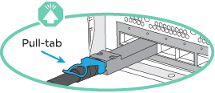
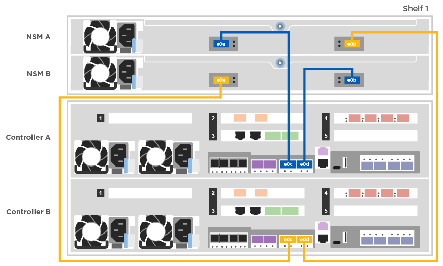

= Guide détaillé - AFF A400
:allow-uri-read: 
:icons: font
:imagesdir: ../media/

[role="lead"]
Ce guide fournit des instructions détaillées vous permettant d'installer un système NetApp classique. Utilisez ce guide si vous souhaitez obtenir des instructions d'installation plus détaillées.

== Étape 1 : préparer l'installation

Pour installer votre système, vous devez créer un compte, enregistrer le système et obtenir des clés de licence. Vous devez également inventorier le nombre et le type de câbles appropriés pour votre système et collecter des informations réseau spécifiques.

.Avant de commencer
Pour obtenir des informations sur les conditions requises par le site ainsi que des informations supplémentaires sur le système configuré, accédez au Hardware Universe. Pour plus d'informations sur ce système, vous pouvez également accéder aux notes de version de votre version de ONTAP.

https://hwu.netapp.com["NetApp Hardware Universe"]

http://mysupport.netapp.com/documentation/productlibrary/index.html?productID=62286["Retrouvez les notes de mise à jour de votre version de ONTAP 9"]

Vous devez fournir les informations suivantes sur votre site :

* Espace rack pour le système de stockage
* Tournevis Phillips n°2
* Câbles réseau supplémentaires pour connecter votre système à votre commutateur réseau et à votre ordinateur portable ou console avec un navigateur Web

.Étapes
. Déballez le contenu de toutes les boîtes.
. Notez le numéro de série du système depuis les contrôleurs.
+
image::../media/drw_ssn_label.png[Exemple de numéro de série du système indiquant l'emplacement du numéro]

. Faites un inventaire et notez le nombre et le type de câbles que vous avez reçus.
+
Le tableau suivant identifie les types de câbles que vous pouvez recevoir. Si vous recevez un câble non répertorié dans le tableau, reportez-vous à la Hardware Universe pour localiser le câble et identifier son utilisation.

+
https://hwu.netapp.com["NetApp Hardware Universe"]

+
[cols="1,2,1,2"]
|===
| Type de câble... | Numéro de pièce et longueur | Type de connecteur | Pour... 

 a| 
Câble 100 GbE (QSF(28)
 a| 
X66211A-05 (112-00595), 0,5 m

X66211A-1 (112-00573), 1 m

X66211A-2 (112-00574), 2 M.

X66211A-5 (112-00574), 5 m
 a| 
image:../media/oie_cable100_gbe_qsfp28.png["Connecteur QSFP28 100 GbE"]
 a| 
Stockage, interconnexion de cluster/haute disponibilité et données Ethernet (selon les commandes)

 a| 
Câble 25 GbE (SFP28s)
 a| 
X66240-2 (112-00598), 2 M.

X66240-5 (112-00639), 5 m
 a| 
image:../media/oie_cable_sfp_gbe_copper.png["Connecteur en cuivre SFP GbE"]
 a| 
Connexion réseau GbE (en fonction de la commande)

 a| 
FC 32 Gbit/s (SFP+ Op)
 a| 
X66250-2 (112-00342), 2 M.

X66250-5 (112-00344), 5 m

X66250-15 (112-00346), 15 M.
 a| 
image:../media/oie_cable_sfp_gbe_copper.png["Connecteur en cuivre SFP GbE"]
 a| 
Connexion réseau FC

 a| 
Câbles de stockage
 a| 
X66030A (112-00435), 0,5 m

X66031A (112-00436), 1 m

X66032A (112-00437), 2 M.

X66033A (112-00438), 3 M.
 a| 
image:../media/oie_cable_mini_sas_hd_to_mini_sas_hd.png["Connecteur mini-SAS vers mini-SAS"]
 a| 
Câbles HD Mini-SAS vers mini-SAS HD (selon les commandes)

 a| 
Câbles optiques
 a| 
X66250-2-N-C (112-00342)
 a| 
image:../media/oie_cable_fiber_lc_connector.png["Illustration montrant un connecteur LC à fibre optique"]
 a| 
Câbles 16 Go FC ou 25 GbE pour cartes mezzanine (selon la commande)

 a| 
RJ-45 (selon la commande)
 a| 
X6585-R6 (112-00291), 3 m

X6562-R6 (112-00196), 5 m
 a| 
image:../media/oie_cable_rj45.png["Connecteur de câble RJ-45"]
 a| 
Réseau de gestion

 a| 
Câble de console micro-USB
 a| 
Sans objet
 a| 
image:../media/oie_cable_micro_usb.png["Illustration montrant un connecteur micro USB"]
 a| 
Connexion à la console utilisée lors de la configuration du logiciel si l'ordinateur portable ou la console ne prend pas en charge la détection du réseau.

 a| 
Câbles d'alimentation
 a| 
Sans objet
 a| 
image:../media/oie_cable_power.png["Câbles d'alimentation"]
 a| 
Mise sous tension du système

|===
. Consultez le _Guide de configuration du ONTAP NetApp_ et recueillez les informations nécessaires indiquées dans ce guide.
+
https://library.netapp.com/ecm/ecm_download_file/ECMLP2862613["Guide de configuration de ONTAP"]

== Étape 2 : installer le matériel de fixation

Vous devez installer votre système sur un rack de 4 montants ou une armoire système NetApp, le cas échéant.

. Installez les kits de rails, au besoin.
. Installez et sécurisez votre système en suivant les instructions fournies avec le kit de rails.
+

NOTE: Vous devez être conscient des problèmes de sécurité associés au poids du système.

+
image::../media/drw_katana_lifting_restriction_icon.png[Précaution de levage pour deux personnes]

. Fixez les dispositifs de gestion des câbles (comme illustré).
+
image::../media/drw_a320_cable_management_arms.png[Retrait ou installation des bras de gestion des câbles]

. Placez le panneau à l'avant du système.

== Étape 3 : connectez les câbles des contrôleurs à votre réseau

Vous pouvez connecter les contrôleurs à votre réseau en utilisant la méthode de cluster sans commutateur à deux nœuds ou en utilisant le réseau d'interconnexion de cluster.

NOTE: Si les étiquettes de port de la carte ne sont pas visibles, vérifiez l'orientation de l'installation de la carte (le connecteur PCIe se trouve sur le côté gauche du logement de carte dans les modèles A400 et FAS8300/8700), puis recherchez la carte, par numéro de pièce, dans le https://hwu.netapp.com["NetApp Hardware Universe"^] pour obtenir un graphique du panneau indiquant les étiquettes des ports. Le numéro de référence de la carte se trouve à l'aide du `sysconfig -a` ou sur la liste d'emballage du système.

NOTE: Si vous effectuez le câblage d'une configuration IP MetroCluster, les ports e0a/e0b sont disponibles pour l'hébergement des LIF de données (généralement dans l'IPSpace par défaut).

=== Option 1 : câler un cluster à deux nœuds sans commutateur

Les ports de données en option, les cartes NIC en option et les ports de gestion des modules de contrôleur sont connectés aux commutateurs. Les ports d'interconnexion de cluster et haute disponibilité sont câblés sur les deux modules de contrôleur.

Vous devez avoir contacté votre administrateur réseau pour obtenir des informations sur la connexion du système aux commutateurs.

Veillez à vérifier le sens des languettes de fixation du câble lors de l'insertion des câbles dans les orifices. Les languettes de branchement des câbles sont vers le haut pour tous les ports intégrés et vers le bas pour les cartes d'extension (NIC).

image::../media/oie_cable_pull_tab_down.png[Connecteur de câble avec languette de traction en bas]

NOTE: Lorsque vous insérez le connecteur, vous devez le sentir en place ; si vous ne le sentez pas, retirez-le, tournez-le et réessayez.

.Étapes
. Utilisez l'animation ou l'illustration pour terminer le câblage entre les contrôleurs et les commutateurs :
+
.Animation : câblage de cluster sans commutateur à deux nœuds
video::48552ddf-0925-4f88-8e93-ab1b00666489[panopto]
+
image::../media/drw_A400_TNSC-network-cabling.png[Câblage réseau TNSC drw A400]

. Accédez à <<Étape 4 : câblage des contrôleurs aux tiroirs disques>> pour obtenir les instructions de câblage du tiroir disque.

=== Option 2 : câblage d'un cluster commuté

Les ports de données en option, les cartes NIC en option, les cartes mezzanine et les ports de gestion des modules de contrôleur sont connectés aux commutateurs. Les ports d'interconnexion de cluster et haute disponibilité sont câblés sur le commutateur de cluster/haute disponibilité.

Vous devez avoir contacté votre administrateur réseau pour obtenir des informations sur la connexion du système aux commutateurs.

Veillez à vérifier le sens des languettes de fixation du câble lors de l'insertion des câbles dans les orifices. Les languettes de branchement des câbles sont vers le haut pour tous les ports intégrés et vers le bas pour les cartes d'extension (NIC).

image::../media/oie_cable_pull_tab_down.png[Connecteur de câble avec languette de traction en bas]

NOTE: Lorsque vous insérez le connecteur, vous devez le sentir en place ; si vous ne le sentez pas, retirez-le, tournez-le et réessayez.

.Étapes
. Utilisez l'animation ou l'illustration pour terminer le câblage entre les contrôleurs et les commutateurs :
+
.Animation - câblage commuté du cluster
video::8fefba75-f395-4cf2-ba3c-ab1b00665870[panopto]
+
image::../media/drw_a400_switched_network_cabling.png[câblage réseau commuté drw a400]

. Accédez à <<Étape 4 : câblage des contrôleurs aux tiroirs disques>> pour obtenir les instructions de câblage du tiroir disque.

== Étape 4 : câblage des contrôleurs aux tiroirs disques

Vous pouvez connecter le câble des tiroirs NSS224 ou SAS à votre système.

=== Option 1 : câblage des contrôleurs à un tiroir disque unique

Vous devez connecter chaque contrôleur aux modules NSM du tiroir de disque NS224.

Assurez-vous de vérifier que la flèche de l'illustration indique l'orientation correcte du connecteur de câble à languette. La languette de retrait du câble du NS224 est relevée.

NOTE: Lorsque vous insérez le connecteur, vous devez le sentir en place ; si vous ne le sentez pas, retirez-le, tournez-le et réessayez.

.Étapes
. Utilisez l'animation ou l'illustration suivante pour connecter les câbles des contrôleurs à un tiroir disque.
+
.Animation : Connectez les contrôleurs à un tiroir de disque NS224
video::48d68897-c91d-47dc-b4b0-ab1b0066808a[panopto]
+

. Accédez à <<Étape 5 : installation et configuration complètes du système>> pour terminer l'installation et la configuration du système.

=== Option 2 : câblage des contrôleurs à deux tiroirs disques

Vous devez connecter chaque contrôleur aux modules NSM des deux tiroirs disques NS224.

Assurez-vous de vérifier que la flèche de l'illustration indique l'orientation correcte du connecteur de câble à languette. La languette de retrait du câble du NS224 est relevée.

NOTE: Lorsque vous insérez le connecteur, vous devez le sentir en place ; si vous ne le sentez pas, retirez-le, tournez-le et réessayez.

.Étapes
. Utilisez l'animation ou l'illustration suivante pour connecter les câbles des contrôleurs à deux tiroirs disques.
+
.Animation : Connectez les contrôleurs à un tiroir de disque NS224
video::5501c7bf-8b74-49e8-8067-ab1b00668804[panopto]
+
image::../media/drw_a400_two_ns224_shelves.png[drw a400 deux clayettes ns224]

. Accédez à <<Étape 5 : installation et configuration complètes du système>> pour terminer l'installation et la configuration du système.

=== Option 3 : câblage des contrôleurs aux tiroirs disques SAS

Vous devez connecter chaque contrôleur aux modules IOM des deux tiroirs disques SAS.

Assurez-vous de vérifier que la flèche de l'illustration indique l'orientation correcte du connecteur de câble à languette. La languette du câble pour la DS2244-C est abaissée.

image::../media/oie_cable_pull_tab_down.png[Connecteur de câble avec languette de traction en bas]

NOTE: Lorsque vous insérez le connecteur, vous devez le sentir en place ; si vous ne le sentez pas, retirez-le, tournez-le et réessayez.

.Étapes
. Utilisez l'illustration suivante pour connecter les câbles des contrôleurs à deux tiroirs disques.
+
.Animation : Connectez les contrôleurs aux tiroirs disques SAS
video::cbb0280e-708d-4365-92b6-ab1b006677ef[panopto]
+
image::../media/drw_a400_three_ds224c_shelves.png[drw a400 trois étagères ds224c]

. Accédez à <<Étape 5 : installation et configuration complètes du système>> pour terminer l'installation et la configuration du système.

== Étape 5 : installation et configuration complètes du système

Vous pouvez effectuer la configuration et l'installation du système en utilisant la découverte de cluster uniquement avec une connexion au commutateur et à l'ordinateur portable, ou en vous connectant directement à un contrôleur du système, puis en vous connectant au commutateur de gestion.

=== Option 1 : fin de la configuration et de la configuration du système si la détection du réseau est activée

Si la détection réseau est activée sur votre ordinateur portable, vous pouvez effectuer l'installation et la configuration du système à l'aide de la détection automatique des clusters.

. Utilisez l'animation suivante pour définir un ou plusieurs ID de tiroir disque :
+
Si votre système est équipé de tiroirs disques NS224, les tiroirs sont prédéfinis pour les ID de tiroir 00 et 01. Si vous souhaitez modifier les ID de tiroir, vous devez créer un outil pour les insérer dans le trou où se trouve le bouton.

+
.Animation : définissez les ID de tiroir disque
video::c600f366-4d30-481a-89d9-ab1b0066589b[panopto]
. Branchez les câbles d'alimentation aux alimentations du contrôleur, puis connectez-les à des sources d'alimentation de différents circuits.
. Assurez-vous que la détection réseau de votre ordinateur portable est activée.
+
Consultez l'aide en ligne de votre ordinateur portable pour plus d'informations.

. Utilisez l'animation suivante pour connecter votre ordinateur portable au commutateur de gestion.
+
.Animation : connectez votre ordinateur portable au commutateur de gestion
video::d61f983e-f911-4b76-8b3a-ab1b0066909b[panopto]
. Sélectionnez une icône ONTAP pour découvrir :
+
image::../media/drw_autodiscovery_controler_select.png[Sélectionnez une icône ONTAP]

+
.. Ouvrez l'Explorateur de fichiers.
.. Cliquez sur réseau dans le volet gauche.
.. Cliquez avec le bouton droit de la souris et sélectionnez Actualiser.
.. Double-cliquez sur l'une des icônes ONTAP et acceptez les certificats affichés à l'écran.
+

NOTE: XXXXX est le numéro de série du système du nœud cible.

+
System Manager s'ouvre.

. Utilisez la configuration assistée de System Manager pour configurer votre système à l'aide des données collectées dans le _guide de configuration ONTAP_ de NetApp.
+
https://library.netapp.com/ecm/ecm_download_file/ECMLP2862613["Guide de configuration de ONTAP"]

. Configurez votre compte et téléchargez Active IQ Config Advisor :
+
.. Connectez-vous à votre compte existant ou créez un compte.
+
https://mysupport.netapp.com/eservice/public/now.do["Inscription au support NetApp"]

.. Enregistrez votre système.
+
https://mysupport.netapp.com/eservice/registerSNoAction.do?moduleName=RegisterMyProduct["Enregistrement de produit NetApp"]

.. Téléchargez Active IQ Config Advisor.
+
https://mysupport.netapp.com/site/tools/tool-eula/activeiq-configadvisor["Téléchargement NetApp : Config Advisor"]

. Vérifiez l'état de santé de votre système en exécutant Config Advisor.
. Une fois la configuration initiale terminée, passez à la https://www.netapp.com/data-management/oncommand-system-documentation/["ONTAP  ; Ressources de documentation ONTAP System Manager"] Pour plus d'informations sur la configuration de fonctionnalités supplémentaires dans ONTAP.

=== Option 2 : fin de la configuration et de la configuration du système si la détection du réseau n'est pas activée

Si la détection réseau n'est pas activée sur votre ordinateur portable, vous devez effectuer la configuration et la configuration à l'aide de cette tâche.

. Branchez et configurez votre ordinateur portable ou votre console :
+
.. Définissez le port de console de l'ordinateur portable ou de la console sur 115,200 bauds avec N-8-1.
+

NOTE: Consultez l'aide en ligne de votre ordinateur portable ou de votre console pour savoir comment configurer le port de console.

.. Connectez le câble de la console à l'ordinateur portable ou à la console à l'aide du câble de console fourni avec le système, puis connectez l'ordinateur portable au commutateur de gestion du sous-réseau de gestion .
.. Attribuez une adresse TCP/IP à l'ordinateur portable ou à la console à l'aide d'une adresse située sur le sous-réseau de gestion.

. Utilisez l'animation suivante pour définir un ou plusieurs ID de tiroir disque :
+
.Animation : définissez les ID de tiroir disque
video::c600f366-4d30-481a-89d9-ab1b0066589b[panopto]
+
Si votre système est équipé de tiroirs disques NS224, les tiroirs sont prédéfinis pour les ID de tiroir 00 et 01. Si vous souhaitez modifier les ID de tiroir, vous devez créer un outil pour les insérer dans le trou où se trouve le bouton.

+
.Animation : définissez les ID de tiroir disque
video::c600f366-4d30-481a-89d9-ab1b0066589b[panopto]
. Branchez les câbles d'alimentation aux alimentations du contrôleur, puis connectez-les à des sources d'alimentation de différents circuits.
+

NOTE: FAS8300 et FAS8700 indiquées.

+
.Animation : mettez les contrôleurs sous tension
video::50cdf200-ede1-45a9-b4b5-ab1b006698d7[panopto]
+

NOTE: Le démarrage initial peut prendre jusqu'à huit minutes.

. Attribuez une adresse IP initiale de gestion des nœuds à l'un des nœuds.
+
[cols="1,2"]
|===
| Si le réseau de gestion dispose de DHCP... | Alors... 

 a| 
Configuré
 a| 
Notez l'adresse IP attribuée aux nouveaux contrôleurs.

 a| 
Non configuré
 a| 
.. Ouvrez une session de console à l'aide de PuTTY, d'un serveur de terminal ou de l'équivalent pour votre environnement.
+

NOTE: Consultez l'aide en ligne de votre ordinateur portable ou de votre console si vous ne savez pas comment configurer PuTTY.

.. Saisissez l'adresse IP de gestion lorsque le script vous y invite.

|===
. Utilisez System Manager sur votre ordinateur portable ou sur la console pour configurer votre cluster :
+
.. Indiquez l'adresse IP de gestion des nœuds dans votre navigateur.
+

NOTE: Le format de l'adresse est +https://x.x.x.x.+

.. Configurez le système à l'aide des données collectées dans le _NetApp ONTAP Configuration guide_.
+
https://library.netapp.com/ecm/ecm_download_file/ECMLP2862613["Guide de configuration de ONTAP"]

. Configurez votre compte et téléchargez Active IQ Config Advisor :
+
.. Connectez-vous à votre compte existant ou créez un compte.
+
https://mysupport.netapp.com/eservice/public/now.do["Inscription au support NetApp"]

.. Enregistrez votre système.
+
https://mysupport.netapp.com/eservice/registerSNoAction.do?moduleName=RegisterMyProduct["Enregistrement de produit NetApp"]

.. Téléchargez Active IQ Config Advisor.
+
https://mysupport.netapp.com/site/tools/tool-eula/activeiq-configadvisor["Téléchargement NetApp : Config Advisor"]

. Vérifiez l'état de santé de votre système en exécutant Config Advisor.
. Une fois la configuration initiale terminée, passez à la https://www.netapp.com/data-management/oncommand-system-documentation/["ONTAP  ; Ressources de documentation ONTAP System Manager"] Pour plus d'informations sur la configuration de fonctionnalités supplémentaires dans ONTAP.

