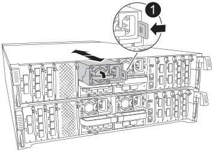

= Remplacer le module de contrôleur - AFF A70 et AFF A90
:allow-uri-read: 
:icons: font
:imagesdir: ../media/

[role="lead"]
Pour remplacer le contrôleur, vous devez retirer le contrôleur défectueux, déplacer les composants FRU du module de contrôleur défectueux vers le module de contrôleur de remplacement, installer le module de contrôleur de remplacement dans le châssis, puis démarrer le système en mode maintenance.

== Étape 1 : retirer le module de contrôleur

Vous devez retirer le module de contrôleur du châssis lorsque vous remplacez le module de contrôleur ou remplacez un composant dans le module de contrôleur.

. À l'avant du châssis, enfoncez fermement chaque disque jusqu'à ce que vous sentiez un arrêt positif. Cela permet de s'assurer que les disques sont fermement installés contre le fond de panier central du châssis.
+
image::../media/drw_a800_drive_seated_IEOPS-960.svg[Disques de siège]

. Vérifiez la mémoire NVRAM orange que le voyant d'état situé dans le logement 4/5 à l'arrière du module de contrôleur défectueux est éteint. Recherchez l'icône NV.
+
image::../media/drw_a1K-70-90_nvram-led_ieops-1463.svg[Emplacement graphique de la LED d'avertissement et d'état de la NVRAM]

+
[cols="1,4"]
|===

 a| 
image:../media/legend_icon_01.png["Légende numéro 1"]
 a| 
LED d'état NVRAM

 a| 
image:../media/legend_icon_02.png["Légende numéro 2"]
 a| 
LED d'avertissement NVRAM

|===
+

NOTE: Si la LED d'état de la mémoire NVRAM clignote, cela peut signifier que le module de contrôleur n'a pas été repris ou arrêté correctement (données non validées). Si le module de contrôleur défectueux n'a pas été repris avec succès par le module de contrôleur partenaire, contactez https://mysupport.netapp.com/site/global/dashboard["Support NetApp"] avant de poursuivre cette procédure.

+
Le comportement général de la LED d'état NVRAM sur le module de contrôleur défectueux est le suivant :

+
** La LED d'état de la NVRAM clignote lorsque le module de contrôleur est mis hors tension et que le système de stockage est à l'état « en attente de rétablissement », ou que le module de contrôleur n'est pas repris ou arrêté correctement (données non validées).
** La LED d'état de la NVRAM clignote lorsque le module de contrôleur est retiré du châssis et peut signifier que le module de contrôleur n'est pas pris en charge ou arrêté correctement (données non validées). Vérifiez que le module de contrôleur a été correctement pris en charge par le module de contrôleur partenaire ou que le module de contrôleur défectueux affiche `waiting for giveback`. Le voyant clignotant peut alors être ignoré (et le module de contrôleur peut être retiré du châssis).

. Si vous n'êtes pas déjà mis à la terre, mettez-vous à la terre correctement.
. Débranchez les câbles d'alimentation du module de contrôleur des blocs d'alimentation.
+

NOTE: Si votre système est alimenté en courant continu, débranchez le bloc d'alimentation des blocs d'alimentation.

. Débranchez les câbles système et les modules SFP et QSFP (si nécessaire) du module de contrôleur, en respectant la trace de l'endroit où les câbles ont été connectés.
+
Laissez les câbles dans le périphérique de gestion des câbles de sorte que lorsque vous réinstallez le périphérique de gestion des câbles, les câbles sont organisés.

. Retirez le périphérique de gestion des câbles du module de contrôleur.
. Appuyez sur les deux loquets de verrouillage, puis faites pivoter les deux loquets vers le bas en même temps.
+
Le module de contrôleur se déplace légèrement hors du châssis.

+
image::../media/drw_a70-90_pcm_remove_replace_ieops-1365.svg[Supprimer le graphique du contrôleur]

+
[cols="1,4"]
|===

 a| 
image:../media/legend_icon_01.png["Légende numéro 1"]
| Un loquet de verrouillage 

 a| 
image:../media/legend_icon_02.png["Légende numéro 2"]
 a| 
Goupille de blocage

|===
. Faites glisser le module de contrôleur hors du châssis et placez-le sur une surface plane et stable.
+
Assurez-vous de prendre en charge la partie inférieure du module de contrôleur lorsque vous le faites glisser hors du châssis.

== Étape 2 : déplacer les blocs d'alimentation

Déplacez les blocs d'alimentation vers le contrôleur de remplacement.

. Faites tourner la poignée de came de façon à pouvoir tirer le bloc d'alimentation hors du module de contrôleur tout en appuyant sur la patte de verrouillage.
+

CAUTION: L'alimentation est en court-circuit. Utilisez toujours deux mains pour le soutenir lors du retrait du module de contrôleur afin qu'il ne bascule pas brusquement et ne vous blesse pas.

+

+
[cols="1,4"]
|===

 a| 
image::../media/legend_icon_01.svg[Légende numéro 1]
| Languette de verrouillage du bloc d'alimentation en terre cuite 

 a| 
image::../media/legend_icon_02.svg[Légende numéro 2]
 a| 
Alimentation électrique

|===
. Déplacez le bloc d'alimentation vers le nouveau module de contrôleur, puis installez-le.
. À l'aide des deux mains, soutenez et alignez les bords du bloc d'alimentation avec l'ouverture du module de contrôleur, puis poussez doucement le bloc d'alimentation dans le module de contrôleur jusqu'à ce que la languette de verrouillage s'enclenche.
+
Les blocs d'alimentation ne s'enclenteront correctement qu'avec le connecteur interne et se verrouillent d'une seule manière.

+

NOTE: Pour éviter d'endommager le connecteur interne, ne pas exercer de force excessive lors du glissement du bloc d'alimentation dans le système.

== Étape 3 : déplacer les ventilateurs

Déplacez les modules de ventilation vers le module de contrôleur de remplacement.

. Retirez le module de ventilateur en pinçant les languettes de verrouillage sur le côté du module de ventilateur, puis en soulevant le module de ventilateur pour le sortir du module de contrôleur.
+
image::../media/drw_a70-90_fan_remove_replace_ieops-1366.svg[Retirez les ventilateurs]

+
[cols="1,4"]
|===

 a| 
image::../media/legend_icon_01.svg[Légende numéro 1]
 a| 
Languettes de verrouillage du ventilateur

 a| 
image::../media/legend_icon_02.svg[Légende numéro 2]
 a| 
Module de ventilateur

|===
. Déplacez le module de ventilateur vers le module de contrôleur de remplacement, puis installez le module de ventilateur en alignant ses bords avec l'ouverture du module de contrôleur, puis en faisant glisser le module de ventilateur dans le module de contrôleur jusqu'à ce que les loquets de verrouillage s'enclenchent.
. Répétez ces étapes pour les autres modules de ventilation.

== Étape 4 : déplacez la batterie NV

Déplacez la batterie NV vers le module de contrôleur de remplacement.

. Ouvrez le couvercle du conduit d'air au milieu du module de contrôleur et localisez la batterie NV.
+
image::../media/drw_a70-90_remove_replace_nvmembat_ieops-1369.svg[Déplacez la batterie NV]

+
[cols="1,4"]
|===

 a| 
image::../media/legend_icon_01.svg[Légende numéro 1]
| Conduit d'air de la batterie NV 

 a| 
image::../media/legend_icon_02.svg[Légende numéro 2]
 a| 
Fiche du bloc-batterie NV

|===
+
*Attention:* le voyant du module NV clignote pendant le déchargement du contenu dans la mémoire flash lorsque vous arrêtez le système. Une fois le transfert terminé, le voyant s'éteint.

. Soulevez la batterie pour accéder à la prise mâle batterie.
. Appuyez sur le clip situé à l'avant de la fiche mâle batterie pour la débrancher de la prise, puis débranchez le câble de batterie de la prise.
. Soulever la batterie hors du conduit d'air et du module de contrôleur.
. Déplacez la batterie vers le module de contrôleur de remplacement, puis installez-la dans le module de contrôleur de remplacement :
+
.. Ouvrez le conduit d'air de la batterie NV dans le module de contrôleur de remplacement.
.. Branchez la fiche de la batterie dans la prise et assurez-vous que la fiche se verrouille en place.
.. Insérez la batterie dans son logement et appuyez fermement sur la batterie pour vous assurer qu'elle est bien verrouillée.
.. Fermez le conduit d'air de la batterie NV.

== Étape 5 : déplacement des DIMM système

Déplacez les modules DIMM vers le module de contrôleur de remplacement.

. Ouvrir le conduit d'air du contrôleur sur le dessus du contrôleur.
+
.. Insérez vos doigts dans les encoches situées à l'extrémité du conduit d'air.
.. Soulevez le conduit d'air et faites-le pivoter vers le haut aussi loin que possible.

. Repérez les modules DIMM système sur la carte mère.
+
image::../media/drw_a70_90_dimm_ieops-1513.svg[Mappage DIMM]

+
[cols="1,4"]
|===

 a| 
image::../media/legend_icon_01.svg[Légende numéro 1]
| DIMM système 
|===
. Notez l'orientation du module DIMM dans le support afin que vous puissiez insérer le module DIMM dans le module de remplacement dans le bon sens.
. Éjectez le module DIMM de son logement en écartant lentement les deux languettes de l'éjecteur de DIMM de chaque côté du module DIMM, puis en faisant glisser le module DIMM hors de son logement.
+

NOTE: Tenez soigneusement le module DIMM par les bords pour éviter toute pression sur les composants de la carte de circuit DIMM.

. Repérez le logement du module de contrôleur de remplacement dans lequel vous installez le module DIMM.
. Insérez le module DIMM directement dans le logement.
+
Le module DIMM s'insère bien dans le logement, mais devrait être facilement installé. Si ce n'est pas le cas, réalignez le module DIMM avec le logement et réinsérez-le.

+

NOTE: Inspectez visuellement le module DIMM pour vérifier qu'il est bien aligné et complètement inséré dans le logement.

. Poussez délicatement, mais fermement, sur le bord supérieur du module DIMM jusqu'à ce que les languettes de l'éjecteur s'enclenchent sur les encoches situées aux extrémités du module DIMM.
. Répétez ces étapes pour les autres modules DIMM.
. Fermer le conduit d'air du contrôleur.

== Étape 6 : déplacez les modules d'E/S.

Déplacez les modules d'E/S vers le module de contrôleur de remplacement.

image::../media/drw_a70_90_io_remove_replace_ieops-1532.svg[Retirez le module d'E/S.]

[cols="1,4"]
|===

 a| 
image::../media/legend_icon_01.svg[Légende numéro 1]
| Levier de came du module d'E/S. 
|===
. Débranchez tout câblage du module d'E/S cible.
+
Assurez-vous d'étiqueter les câbles de manière à connaître leur origine.

. Faites pivoter le ARM de gestion des câbles vers le bas en tirant sur les boutons situés à l'intérieur du ARM de gestion des câbles et en le faisant pivoter vers le bas.
. Retirez les modules d'E/S du module de contrôleur :
+
.. Appuyez sur le bouton de verrouillage de la came du module d'E/S cible.
.. Faites pivoter le loquet de came le plus loin possible. Pour les modules horizontaux, faites pivoter la came à l'écart du module aussi loin que possible.
.. Retirez le module du module de contrôleur en accrochant votre doigt dans l'ouverture du levier de came et en tirant le module hors du module de contrôleur.
+
Assurez-vous de garder une trace de l'emplacement dans lequel se trouvait le module d'E/S.

.. Installez le module d'E/S de remplacement dans le module de contrôleur de remplacement en faisant glisser doucement le module d'E/S dans le logement jusqu'à ce que le loquet de la came d'E/S commence à s'engager avec la broche de came d'E/S, puis poussez le loquet de la came d'E/S complètement vers le haut pour verrouiller le module en place.

. Répétez ces étapes pour déplacer les modules d'E/S restants, à l'exception des modules des emplacements 6 et 7, vers le module de contrôleur de remplacement.
+

NOTE: Pour déplacer les modules d'E/S des emplacements 6 et 7, vous devez déplacer le support contenant ces modules d'E/S du module de contrôleur défectueux vers le module de contrôleur de remplacement.

. Déplacez le support contenant les modules d'E/S dans les emplacements 6 et 7 vers le module de contrôleur de remplacement :
+
.. Appuyez sur le bouton situé sur la poignée la plus à droite de la poignée du support. ..faites glisser le support hors du module de contrôleur défectueux et insérez-le dans le module de contrôleur de remplacement dans la même position que celle du module de contrôleur défectueux.
.. Poussez doucement le support à fond dans le module de contrôleur de remplacement jusqu'à ce qu'il s'enclenche.

== Étape 7 : déplacez le module gestion du système

Déplacez le module de gestion du système vers le module de contrôleur de remplacement.

image::../media/drw_a70-90_sys-mgmt_replace_ieops-1373.svg[Remplacez le module de gestion du système]

[cols="1,4"]
|===

 a| 
image::../media/legend_icon_01.svg[Légende numéro 1]
 a| 
Loquet de came du module de gestion du système

 a| 
image::../media/legend_icon_02.svg[Légende numéro 2]
 a| 
Bouton de verrouillage du support de démarrage

 a| 
image::../media/legend_icon_03.svg[Numéro de légende 3]
 a| 
Module de gestion du système de remplacement

|===
. Retirez le module de gestion du système du module de contrôleur défectueux :
+
.. Appuyez sur le bouton de la came de gestion du système.
.. Faites tourner le levier de came complètement vers le bas.
.. Enroulez votre doigt dans le levier de came et tirez le module hors du système.

. Installez le module de gestion du système dans le module de contrôleur de remplacement dans le même emplacement que celui du module de contrôleur défectueux :
+
.. Alignez les bords du module de gestion du système avec l'ouverture du système et poussez-le doucement dans le module de contrôleur.
.. Faites glisser doucement le module dans le logement jusqu'à ce que le loquet de came commence à s'engager avec la broche de came d'E/S, puis faites tourner le loquet de came complètement vers le haut pour verrouiller le module en place.

== Étape 8 : déplacez le module NVRAM

Déplacez le module NVRAM vers le module de contrôleur de remplacement.

image::../media/drw_a70-90_nvram12_remove_replace_ieops-1370.svg[Retirez le module NVRAM12 et les modules DIMM]

[cols="1,4"]
|===

| image:../media/legend_icon_01.png["Légende numéro 1"]  a| 
Bouton de verrouillage de came

 a| 
image:../media/legend_icon_02.png["Légende numéro 2"]
| Languette de verrouillage DIMM 
|===
. Retirez le module NVRAM du module de contrôleur défectueux :
+
.. Appuyer sur le bouton de verrouillage de came.
+
Le bouton de came s'éloigne du châssis.

.. Faites tourner le loquet de came aussi loin que possible.
.. Retirez le module NVRAM du boîtier en accrochant votre doigt dans l'ouverture du levier de came et en tirant le module hors du boîtier.

. Installez le module NVRAM dans le logement 4/5 du module de contrôleur de remplacement :
+
.. Alignez le module avec les bords de l'ouverture du châssis dans le logement 4/5.
.. Faites glisser doucement le module dans son logement jusqu'à ce qu'il soit complètement en place, puis poussez le loquet de la came jusqu'à ce qu'il soit complètement en place.

== Étape 9 : installer le module de contrôleur

Réinstallez le module de contrôleur et redémarrez-le.

. Assurez-vous que le conduit d'air est complètement fermé en le faisant tourner jusqu'en butée.
+
Il doit être aligné sur la tôle du module de contrôleur.

. Alignez l'extrémité du module de contrôleur avec l'ouverture du châssis, puis poussez doucement le module de contrôleur à mi-course dans le système.
+

NOTE: N'insérez pas complètement le module de contrôleur dans le châssis tant qu'il n'y a pas été demandé.

. Recâblage du système, selon les besoins.
+
Si vous avez retiré les émetteurs-récepteurs (QSFP ou SFP), n'oubliez pas de les réinstaller si vous utilisez des câbles à fibre optique.

. Terminez la réinstallation du module de contrôleur :
+
.. Poussez fermement le module de contrôleur dans le châssis jusqu'à ce qu'il rencontre le fond de panier central et qu'il soit bien en place.
+
Les loquets de verrouillage se montent lorsque le module de contrôleur est bien en place.

+

NOTE: Ne forcez pas trop lorsque vous faites glisser le module de contrôleur dans le châssis pour éviter d'endommager les connecteurs.

+
.. Faites pivoter les loquets de verrouillage vers le haut en position verrouillée.

. Branchez les cordons d'alimentation aux blocs d'alimentation.
+

NOTE: Si vous disposez d'une alimentation CC, reconnectez le bloc d'alimentation aux blocs d'alimentation une fois le module de contrôleur entièrement installé dans le châssis.

+
Le module de contrôleur démarre une fois l'alimentation rétablie. Si elle démarre à l'invite DU CHARGEUR, redémarrez le contrôleur avec la `boot_ontap` commande.

. Restaurez le retour automatique si vous le désactivez à l'aide de `storage failover modify -node local -auto-giveback true` commande.
. Si AutoSupport est activé, restaurez/annulez la création automatique de cas à l'aide de la `system node autosupport invoke -node * -type all -message MAINT=END` commande.
. Si vous ne l'avez pas déjà fait, réinstallez le périphérique de gestion des câbles et recentrez le contrôleur.

