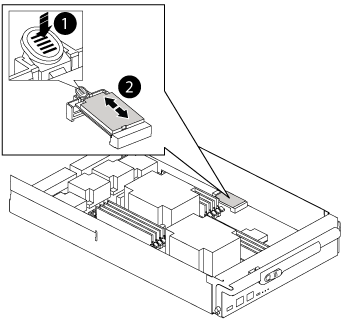

= Remplacez le matériel du module de contrôleur - AFF A700
:allow-uri-read: 
:icons: font
:imagesdir: ../media/

[role="lead"]
Pour remplacer le matériel du module de contrôleur, vous devez retirer le nœud défaillant, déplacer les composants FRU vers le module de contrôleur de remplacement, installer le module de contrôleur de remplacement dans le châssis, puis démarrer le système en mode de maintenance.

== Étape 1 : retirer le module de contrôleur

Pour accéder aux composants à l'intérieur du contrôleur, vous devez d'abord retirer le module de contrôleur du système, puis retirer le capot du module de contrôleur.

.Étapes
. Si vous n'êtes pas déjà mis à la terre, mettez-vous à la terre correctement.
. Débranchez les câbles du module de contrôleur défaillant et suivez l'emplacement de connexion des câbles.
. Faites glisser le bouton orange sur la poignée de came vers le bas jusqu'à ce qu'il se déverrouille.

image::../media/drw_9000_remove_pcm.png[Retrait du module de contrôleur]

|===

 a| 
image:../media/legend_icon_01.png["Légende numéro 1"]

 a| 
Bouton de déverrouillage de la poignée de came

 a| 
image:../media/legend_icon_02.png["Légende numéro 2"]

 a| 
Poignée de came

|===
. Faites pivoter la poignée de came de façon à ce qu'elle désengage complètement le module de contrôleur du châssis, puis faites glisser le module de contrôleur hors du châssis.
+
Assurez-vous de prendre en charge la partie inférieure du module de contrôleur lorsque vous le faites glisser hors du châssis.

. Placez le couvercle du module de contrôleur face vers le haut sur une surface stable et plane, appuyez sur le bouton bleu du capot, faites glisser le couvercle vers l'arrière du module de contrôleur, puis faites pivoter le couvercle vers le haut et retirez-le du module de contrôleur.
+
image::../media/drw_9000_pcm_open.png[Ouverture ou fermeture du module de contrôleur]

+
|===

 a| 
image:../media/legend_icon_01.png["Légende numéro 1"]

 a| 
Bouton de verrouillage du couvercle du module de commande

|===

== Étape 2 : déplacer le support de démarrage

Vous devez localiser le support de démarrage et suivre les instructions pour le retirer de l'ancien contrôleur et l'insérer dans le nouveau contrôleur.

.Étapes
. Soulevez le conduit d'air noir à l'arrière du module de contrôleur, puis localisez le support de démarrage à l'aide de l'illustration suivante ou de la carte FRU du module de contrôleur :
+

+
|===

 a| 
image:../media/legend_icon_01.png["Légende numéro 1"]

 a| 
Appuyez sur la languette de dégagement

 a| 
image:../media/legend_icon_02.png["Légende numéro 2"]

 a| 
Support de démarrage

|===
. Appuyez sur le bouton bleu du logement du support de démarrage pour libérer le support de démarrage de son logement, puis tirez-le doucement hors du support de démarrage.
+

NOTE: Ne faites pas tourner ou tirer le support de démarrage directement vers le haut, car cela pourrait endommager le support ou le support de démarrage.

. Déplacez le support de démarrage vers le nouveau module de contrôleur, alignez les bords du support de démarrage avec le boîtier du support, puis poussez-le doucement dans le support.
. Vérifiez le support de démarrage pour vous assurer qu'il est bien en place dans le support.
+
Si nécessaire, retirez le support de démarrage et réinstallez-le dans le support.

. Poussez le support de démarrage vers le bas pour engager le bouton de verrouillage sur le boîtier du support de démarrage.

== Étape 3 : déplacez les DIMM système

Pour déplacer les modules DIMM, localisez-les et déplacez-les de l'ancien contrôleur vers le contrôleur de remplacement et suivez la séquence d'étapes spécifique.

.Étapes
. Si vous n'êtes pas déjà mis à la terre, mettez-vous à la terre correctement.
. Localisez les modules DIMM de votre module de contrôleur.
. Notez l'orientation du module DIMM dans le support afin que vous puissiez insérer le module DIMM dans le module de remplacement dans le bon sens.
. Éjectez le module DIMM de son logement en écartant lentement les deux languettes de l'éjecteur de DIMM de chaque côté du module DIMM, puis en faisant glisser le module DIMM hors de son logement.
+

NOTE: Tenez soigneusement le module DIMM par les bords pour éviter toute pression sur les composants de la carte de circuit DIMM.

+
image::../media/drw_9000_replace_pcm_dimms.png[le drw 9000 remplace les modules dimm pcm]

+
|===

 a| 
image:../media/legend_icon_01.png["Légende numéro 1"]

 a| 
Languettes d'éjection du module DIMM

 a| 
image:../media/legend_icon_02.png["Légende numéro 2"]

 a| 
DIMM

|===
. Repérez le logement où vous installez le module DIMM.
. Assurez-vous que les languettes de l'éjecteur de DIMM sur le connecteur sont en position ouverte, puis insérez le module DIMM directement dans le logement.
+
Le module DIMM s'insère bien dans le logement, mais devrait être facilement installé. Si ce n'est pas le cas, réalignez le module DIMM avec le logement et réinsérez-le.

+

NOTE: Inspectez visuellement le module DIMM pour vérifier qu'il est bien aligné et complètement inséré dans le logement.

. Insérez le module DIMM directement dans le logement.
+
Le module DIMM s'insère bien dans le logement, mais devrait être facilement installé. Si ce n'est pas le cas, réalignez le module DIMM avec le logement et réinsérez-le.

+

NOTE: Inspectez visuellement le module DIMM pour vérifier qu'il est bien aligné et complètement inséré dans le logement.

. Poussez délicatement, mais fermement, sur le bord supérieur du module DIMM jusqu'à ce que les languettes de l'éjecteur s'enclenchent sur les encoches situées aux extrémités du module DIMM.
. Répétez ces étapes pour les autres modules DIMM.

== Étape 4 : installer le contrôleur

Après avoir installé les composants dans le module de contrôleur, vous devez réinstaller le module de contrôleur dans le châssis du système et démarrer le système d'exploitation.

Pour les paires haute disponibilité avec deux modules de contrôleur dans le même châssis, l'ordre dans lequel vous installez le module de contrôleur est particulièrement important, car il tente de redémarrer dès que vous le placez entièrement dans le châssis.

NOTE: Le système peut mettre à jour le firmware du système lors de son démarrage. N'interrompez pas ce processus. La procédure requiert l'interruption du processus d'amorçage, que vous pouvez généralement faire à tout moment après l'invite à le faire. Toutefois, si le système met à jour le firmware du système lors de son démarrage, vous devez attendre la fin de la mise à jour avant d'interrompre le processus de démarrage.

.Étapes
. Si vous n'êtes pas déjà mis à la terre, mettez-vous à la terre correctement.
. Si vous ne l'avez pas encore fait, remettez le capot sur le module de contrôleur.
. Alignez l'extrémité du module de contrôleur avec l'ouverture du châssis, puis poussez doucement le module de contrôleur à mi-course dans le système.
+

NOTE: N'insérez pas complètement le module de contrôleur dans le châssis tant qu'il n'y a pas été demandé.

. Reliez uniquement les ports de gestion et de console, de sorte que vous puissiez accéder au système pour effectuer les tâches décrites dans les sections ci-après.
+

NOTE: Vous connecterez le reste des câbles au module de contrôleur plus loin dans cette procédure.

. Terminez la réinstallation du module de contrôleur :
+
.. Si ce n'est déjà fait, réinstallez le périphérique de gestion des câbles.
.. Poussez fermement le module de contrôleur dans le châssis jusqu'à ce qu'il rencontre le fond de panier central et qu'il soit bien en place.
+
Les loquets de verrouillage se montent lorsque le module de contrôleur est bien en place.

+

NOTE: Ne forcez pas trop lorsque vous faites glisser le module de contrôleur dans le châssis pour éviter d'endommager les connecteurs.

+
Le module de contrôleur commence à démarrer dès qu'il est complètement inséré dans le châssis. Soyez prêt à interrompre le processus de démarrage.

.. Faites pivoter les loquets de verrouillage vers le haut, inclinez-les de manière à dégager les goupilles de verrouillage, puis abaissez-les en position verrouillée.
.. Interrompez le processus de démarrage en appuyant sur `Ctrl-C` lorsque vous voyez `Press Ctrl-C for Boot Menu`.
.. Sélectionnez l'option pour démarrer en mode maintenance dans le menu qui s'affiche.

