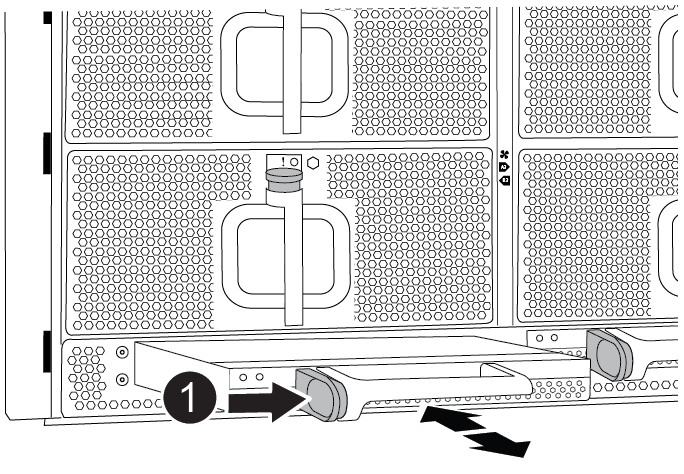

= Déplacer et remplacer le matériel - AFF A900
:allow-uri-read: 
:icons: font
:imagesdir: ../media/

[role="lead"]
Pour remplacer le châssis, vous devez retirer les composants de l'ancien châssis et les installer dans le châssis de remplacement.

== Étape 1 : retirer les alimentations

[role="lead"]
Le retrait des blocs d'alimentation lors du remplacement d'un châssis implique l'arrêt, le débranchement, puis le retrait du bloc d'alimentation de l'ancien châssis.

. Si vous n'êtes pas déjà mis à la terre, mettez-vous à la terre correctement.
. Mettez le bloc d'alimentation hors tension et débranchez les câbles d'alimentation :
+
.. Eteindre l'interrupteur de l'alimentation en panne.
.. Ouvrez le dispositif de retenue du câble d'alimentation, puis débranchez le câble d'alimentation du bloc d'alimentation.
.. Débranchez le câble d'alimentation de la source d'alimentation.

. Appuyez sur le bouton en terre cuite de la poignée du bloc d'alimentation et maintenez-le enfoncé, puis retirez le bloc d'alimentation du châssis.
+

NOTE: Lors de la dépose d'une alimentation électrique, toujours utiliser deux mains pour soutenir son poids.

+
.Animation - Supprimer/installer le bloc d'alimentation
video::6d0eee92-72e2-4da4-a4fa-adf9016b57ff[panopto]
+
image::../media/drw_a900_remove_install_PSU_module.png[drw a900 déposer installer le module PSU]

+
[cols="10,90"]
|===

 a| 
image:../media/legend_icon_01.png[""]
 a| 
Bouton de verrouillage

|===
. Répétez les étapes précédentes pour les blocs d'alimentation restants.

== Étape 2 : retirez les ventilateurs

[role="lead"]
Pour retirer les modules de ventilation lors du remplacement du châssis, vous devez effectuer une séquence spécifique de tâches.

. Si vous n'êtes pas déjà mis à la terre, mettez-vous à la terre correctement.
. Retirez le cadre (si nécessaire) à deux mains, en saisissant les ouvertures de chaque côté du cadre, puis en le tirant vers vous jusqu'à ce que le cadre se dégage des goujons à rotule du châssis.
. Appuyez sur le bouton en terre cuite du module de ventilation et tirez le module de ventilation hors du châssis en vous assurant de le soutenir avec votre main libre.
+

NOTE: Les modules de ventilation sont courts. Soutenez toujours la partie inférieure du module de ventilation avec votre main libre pour qu'il ne tombe pas brusquement du châssis et vous blesse.

+
.Animation - Supprimer/installer le ventilateur
video::3c3c8d93-b48e-4554-87c8-adf9016af819[panopto]
+
image::../media/drw_a900_remove_install_fan.png[drw a900 déposer le ventilateur]

+
[cols="10,90"]
|===

 a| 
image:../media/legend_icon_01.png[""]
 a| 
Bouton de déverrouillage orange

 a| 
image:../media/legend_icon_02.png[""]
 a| 
Faire glisser le ventilateur vers l'intérieur/l'extérieur du châssis

|===
. Mettez le module de ventilation de côté.
. Répétez les étapes précédentes pour les modules de ventilation restants.

== Étape 3 : retirez le module de contrôleur

[role="lead"]
Pour remplacer le châssis, vous devez retirer le ou les modules de contrôleur de l'ancien châssis.

. Si vous n'êtes pas déjà mis à la terre, mettez-vous à la terre correctement.
. Débranchez les câbles du module de contrôleur défaillant et suivez l'emplacement de connexion des câbles.
. Faites glisser le bouton en terre cuite de la poignée de came vers le bas jusqu'à ce qu'il se déverrouille.
+
.Animation - retirez le contrôleur
video::256721fd-4c2e-40b3-841a-adf2000df5fa[panopto]
+
image::../media/drw_a900_remove_PCM.png[drw a900 déposer le module de commande du groupe motopropulseur]

+
[cols="10,90"]
|===

 a| 
image:../media/legend_icon_01.png[""]
 a| 
Bouton de déverrouillage de la poignée de came

 a| 
image:../media/legend_icon_02.png[""]
 a| 
Poignée de came

|===
. Faites pivoter la poignée de came de façon à ce qu'elle désengage complètement le module de contrôleur du châssis, puis faites glisser le module de contrôleur hors du châssis.
+
Assurez-vous de prendre en charge la partie inférieure du module de contrôleur lorsque vous le faites glisser hors du châssis.

. Mettez le module de contrôleur de côté en lieu sûr et répétez ces étapes si vous avez un autre module de contrôleur dans le châssis.

== Étape 4 : retirez les modules d'E/S.

[role="lead"]
Pour retirer les modules d'E/S de l'ancien châssis, y compris les modules NVRAM, suivez la séquence spécifique des étapes. Vous n'avez pas besoin de retirer le module Flash cache, le cas échéant, du module NVRAM lors du transfert vers un nouveau châssis.

. Si vous n'êtes pas déjà mis à la terre, mettez-vous à la terre correctement.
. Débranchez tout câblage associé au module d'E/S cible.
+
Assurez-vous d'étiqueter les câbles de manière à connaître leur origine.

. Retirez le module d'E/S cible du châssis :
+
.. Appuyer sur le bouton à came numéroté et numéroté.
+
Le bouton de came s'éloigne du châssis.

.. Faites pivoter le loquet de came vers le bas jusqu'à ce qu'il soit en position horizontale.
+
Le module d'E/S se désengage du châssis et se déplace d'environ 1/2 pouces hors du logement d'E/S.

.. Retirez le module d'E/S du châssis en tirant sur les languettes de traction situées sur les côtés de la face du module.
+
Assurez-vous de garder une trace de l'emplacement dans lequel se trouvait le module d'E/S.

+
.Animation - Supprimer/installer le module d'E/S.
video::3a5b1f6e-15ec-40b4-bb2a-adf9016af7b6[panopto]
+
image:../media/drw_a900_remove_PCIe_module.png[""]

+
[cols="10,90"]
|===

 a| 
image:../media/legend_icon_01.png[""]
 a| 
Loquet de came d'E/S numéroté et numéroté

 a| 
image:../media/legend_icon_02.png[""]
 a| 
Verrou de came d'E/S complètement déverrouillé

|===
. Mettez le module d'E/S de côté.
. Répétez l'étape précédente pour les autres modules d'E/S de l'ancien châssis.

== Étape 5 : retirez le module d'alimentation du contrôleur de coulisses

[role="lead"]
Vous devez retirer les modules d'alimentation du contrôleur de déétage de l'ancien châssis pour préparer l'installation du châssis de remplacement.

. Si vous n'êtes pas déjà mis à la terre, mettez-vous à la terre correctement.
. Appuyez sur le bouton de verrouillage en terre cuite de la poignée du module, puis faites glisser le module DCPM hors du châssis.
+
.Animation - Supprimer/installer la DCPM
video::ade18276-5dbc-4b91-9a0e-adf9016b4e55[panopto]
+

+
[cols="10,90"]
|===

 a| 
image:../media/legend_icon_01.png[""]
 a| 
Bouton de verrouillage terre cuite du module DCPM

|===
. Mettez le module DCPM de côté dans un endroit sûr et répétez cette étape pour le module DCPM restant.

== Étape 6 : remplacer un châssis depuis le rack d'équipement ou l'armoire système

[role="lead"]
Vous devez retirer le châssis existant du rack ou de l'armoire système de l'équipement avant de pouvoir installer le châssis de remplacement.

. Retirez les vis des points de montage du châssis.
+

NOTE: Si le système se trouve dans une armoire système, il peut être nécessaire de retirer le support d'arrimage arrière.

. A l'aide de deux ou trois personnes, faites glisser l'ancien châssis hors des rails du rack dans une armoire système ou des supports _L_ dans un rack d'équipement, puis mettez-le de côté.
. Si vous n'êtes pas déjà mis à la terre, mettez-vous à la terre correctement.
. De deux à trois personnes, installez le châssis de remplacement dans le rack ou l'armoire système en guidant le châssis sur les rails de rack d'une armoire système ou sur les supports _L_ dans un rack d'équipement.
. Faites glisser le châssis complètement dans le rack de l'équipement ou l'armoire système.
. Fixez l'avant du châssis sur le rack ou l'armoire système de l'équipement à l'aide des vis que vous avez retirées de l'ancien châssis.
. Fixez l'arrière du châssis sur le rack de l'équipement ou l'armoire système.
. Si vous utilisez les supports de gestion des câbles, retirez-les de l'ancien châssis, puis installez-les sur le châssis de remplacement.
. Si ce n'est déjà fait, installez le cadre.

== Étape 7 : déplacez le module LED USB vers le nouveau châssis

[role="lead"]
Une fois le nouveau châssis installé dans le rack ou l'armoire, vous devez déplacer le module de LED USB de l'ancien châssis vers le nouveau châssis.

.Animation - Supprimer/installer USB
video::eb715462-cc20-454f-bcf9-adf9016af84e[panopto]
image::../media/drw_a900_remove_replace_LED_mod.png[drw a900 retirer le module de LED de remplacement]

[cols="10,90"]
|===

 a| 
image:../media/legend_icon_01.png[""]
 a| 
Éjectez le module.

 a| 
image:../media/legend_icon_02.png[""]
 a| 
Faites glisser le châssis pour le sortir.

|===
. Repérez le module de voyants USB à l'avant de l'ancien châssis, directement sous les baies d'alimentation.
. Appuyez sur le bouton de verrouillage noir situé sur le côté droit du module pour libérer le module du châssis, puis faites-le glisser hors de l'ancien châssis.
. Alignez les bords du module avec la baie LED USB située en bas à l'avant du châssis de remplacement, puis poussez doucement le module jusqu'à ce qu'il s'enclenche.

== Étape 8 : installez le module d'alimentation du contrôleur de déétage lors du remplacement du châssis

[role="lead"]
Une fois le châssis de remplacement installé dans le rack ou l'armoire système, vous devez réinstaller les modules d'alimentation du contrôleur.

. Si vous n'êtes pas déjà mis à la terre, mettez-vous à la terre correctement.
. Alignez l'extrémité du module DCPM avec l'ouverture du châssis, puis faites-le glisser doucement dans le châssis jusqu'à ce qu'il s'enclenche.
+

NOTE: Le module et l'emplacement sont munis d'un clé. Ne forcez pas le module dans l'ouverture. Si le module ne se place pas facilement, réalignez-le et faites-le glisser dans le châssis.

. Répéter cette étape pour le module DCPM restant.

== Étape 9 : installez les ventilateurs dans le châssis

[role="lead"]
Pour installer les modules de ventilation lors du remplacement du châssis, vous devez effectuer une séquence spécifique de tâches.

. Si vous n'êtes pas déjà mis à la terre, mettez-vous à la terre correctement.
. Alignez les bords du module de ventilateur de remplacement avec l'ouverture du châssis, puis faites-le glisser dans le châssis jusqu'à ce qu'il s'enclenche.
+
Lorsqu'il est inséré dans un système sous tension, le voyant d'avertissement orange clignote quatre fois lorsque le module de ventilation est correctement inséré dans le châssis.

. Répétez ces étapes pour les autres modules de ventilation.
. Alignez le cadre avec les goujons à rotule, puis poussez doucement le cadre sur les goujons à rotule.

== Étape 10 : installez les modules d'E/S.

[role="lead"]
Pour installer des modules d'E/S, y compris les modules NVRAM/Flash cache de l'ancien châssis, suivez la séquence spécifique des étapes.

Vous devez installer le châssis pour pouvoir installer les modules d'E/S dans les emplacements correspondants du nouveau châssis.

. Si vous n'êtes pas déjà mis à la terre, mettez-vous à la terre correctement.
. Une fois le châssis de remplacement installé dans le rack ou l'armoire, installez les modules d'E/S dans leurs emplacements correspondants dans le châssis de remplacement en faisant glisser doucement le module d'E/S dans son logement jusqu'à ce que le loquet de came d'E/S numéroté et numéroté commence à s'engager, Puis poussez le loquet de came d'E/S complètement vers le haut pour verrouiller le module en place.
. Recâblage du module d'E/S, si nécessaire.
. Répétez l'étape précédente pour les modules d'E/S restants que vous mettez de côté.
+

NOTE: Si l'ancien châssis est doté de panneaux d'E/S vides, déplacez-les vers le châssis de remplacement à ce stade.

== Étape 11 : installer les blocs d'alimentation

[role="lead"]
L'installation des blocs d'alimentation lors du remplacement d'un châssis implique l'installation des blocs d'alimentation dans le châssis de remplacement et le raccordement à la source d'alimentation.

. Si vous n'êtes pas déjà mis à la terre, mettez-vous à la terre correctement.
. À l'aide des deux mains, soutenez et alignez les bords du bloc d'alimentation avec l'ouverture du châssis du système, puis poussez doucement le bloc d'alimentation dans le châssis jusqu'à ce qu'il s'enclenche.
+
Les blocs d'alimentation sont munis de clés et ne peuvent être installés qu'une seule fois.

+

IMPORTANT: Ne pas exercer de force excessive lors du glissement du bloc d'alimentation dans le système. Vous pouvez endommager le connecteur.

. Rebranchez le câble d'alimentation et fixez-le au bloc d'alimentation à l'aide du mécanisme de verrouillage du câble d'alimentation.
+

IMPORTANT: Connectez uniquement le câble d'alimentation au bloc d'alimentation. Ne connectez pas le câble d'alimentation à une source d'alimentation pour le moment.

. Répétez les étapes précédentes pour les blocs d'alimentation restants.

== Étape 12 : installer le contrôleur

[role="lead"]
Après avoir installé le module de contrôleur et tout autre composant dans le nouveau châssis, démarrez-le dans un état où vous pouvez exécuter le test de diagnostic d'interconnexion.

. Si vous n'êtes pas déjà mis à la terre, mettez-vous à la terre correctement.
. Alignez l'extrémité du module de contrôleur avec l'ouverture du châssis, puis poussez doucement le module de contrôleur à mi-course dans le système.
+

NOTE: N'insérez pas complètement le module de contrôleur dans le châssis tant qu'il n'y a pas été demandé.

. Recâblage de la console sur le module contrôleur, puis reconnexion du port de gestion.
. Connectez les blocs d'alimentation à différentes sources d'alimentation, puis mettez-les sous tension.
. Avec la poignée de came en position ouverte, faites glisser le module de contrôleur dans le châssis et enfoncez fermement le module de contrôleur jusqu'à ce qu'il rencontre le fond de panier et soit bien en place, puis fermez la poignée de came jusqu'à ce qu'il s'enclenche en position verrouillée.
+

IMPORTANT: N'appliquez pas une force excessive lorsque vous faites glisser le module de contrôleur dans le châssis ; vous risquez d'endommager les connecteurs.

+
Le module de contrôleur commence à démarrer dès qu'il est complètement inséré dans le châssis.

. Répétez la procédure précédente pour installer le second contrôleur dans le nouveau châssis.
. Démarrer chaque contrôleur en mode maintenance :
+
.. Au fur et à mesure que chaque contrôleur démarre, appuyez sur `Ctrl-C` Pour interrompre le processus de démarrage lorsque le message s'affiche, appuyez sur Ctrl-C pour le menu de démarrage.
+

NOTE: Si l'invite et les modules de contrôleur ne s'affichent pas sur ONTAP, entrez `halt`, Puis à l'invite DU CHARGEUR, entrez `boot_ontap`, appuyez sur `Ctrl-C` lorsque vous y êtes invité, puis répétez cette étape.

.. Dans le menu de démarrage, sélectionner l'option pour le mode maintenance.

