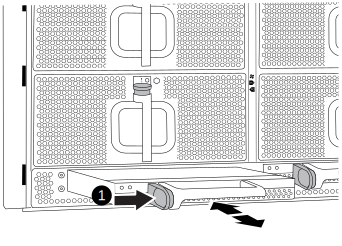

= Remplacez le module d'alimentation de commande de déchargement contenant la batterie NVRAM11 - AFF A900
:allow-uri-read: 
:icons: font
:imagesdir: ../media/

[role="lead"]
Pour intervertir à chaud un module d'alimentation de contrôleur (DCPM) contenant la batterie NVRAM11, vous devez localiser le module DCPM défaillant, le retirer du châssis et installer le module DCPM de remplacement.

Vous devez disposer d'un module DCPM de remplacement avant de retirer le module défectueux du châssis et il doit être remplacé dans les cinq minutes suivant son retrait. Une fois le module DCPM retiré du châssis, il n'y a pas de protection contre l'arrêt pour le module de contrôleur qui possède le module DCPM, autre que le basculement vers l'autre module de contrôleur.

== Étape 1 : remplacer le module DCPM

Pour remplacer le module DCPM de votre système, vous devez retirer le module DCPM défectueux du système, puis le remplacer par un nouveau module DCPM.

. Si vous n'êtes pas déjà mis à la terre, mettez-vous à la terre correctement.
. Retirez le cadre à l'avant du système et mettez-le de côté.
. Localisez le module DCPM défectueux à l'avant du système en recherchant le voyant d'avertissement sur le module.
+
Le voyant est orange fixe si le module est défectueux.

+

IMPORTANT: Le module DCPM doit être remplacé dans le châssis dans les cinq minutes suivant le retrait ou le contrôleur associé s'arrête.

. Appuyez sur le bouton de déverrouillage en terre cuite de la poignée du module, puis faites glisser le module DCPM hors du châssis.
+
.Animation - Supprimer/installer la DCPM
video::ade18276-5dbc-4b91-9a0e-adf9016b4e55[panopto]
+

+
[cols="10,90"]
|===

 a| 
image:../media/legend_icon_01.png["Légende numéro 1"]
 a| 
Bouton de verrouillage terre cuite du module DCPM

|===
. Alignez l'extrémité du module DCPM avec l'ouverture du châssis, puis faites-le glisser doucement dans le châssis jusqu'à ce qu'il s'enclenche.
+

NOTE: Le module et l'emplacement sont munis d'un clé. Ne forcez pas le module dans l'ouverture. Si le module ne se place pas facilement, réalignez-le et faites-le glisser dans le châssis.

+
Le voyant orange clignote quatre fois lors de l'insertion et le voyant vert clignote également si la batterie fournit une tension. Si ce n'est pas la technologie Flash, il faudra probablement le remplacer.

== Étape 2 : mettez les piles au rebut

Vous devez mettre les batteries au rebut conformément aux réglementations en vigueur en matière de recyclage ou de mise au rebut des batteries. Si vous ne pouvez pas recycler vos batteries de manière appropriée, vous devez les retourner à NetApp en suivant les instructions RMA (retour de matériel) jointes au kit.

https://library.netapp.com/ecm/ecm_download_file/ECMP12475945["Consignes de sécurité et avis réglementaires"^]

== Étape 3 : renvoyer la pièce défaillante à NetApp

Retournez la pièce défectueuse à NetApp, tel que décrit dans les instructions RMA (retour de matériel) fournies avec le kit. Voir la https://mysupport.netapp.com/site/info/rma["Retour de pièce et amp ; remplacements"] pour plus d'informations.
