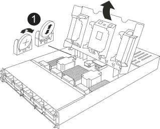

= Remplacer la pile de l'horloge temps réel - AFX 1K
:allow-uri-read: 
:icons: font
:imagesdir: ../media/

[role="lead"]
Remplacez la batterie de l'horloge temps réel (RTC), communément appelée pile bouton, dans votre système de stockage AFX 1K pour garantir que les services et applications s'appuyant sur une synchronisation horaire précise restent opérationnels.

.Avant de commencer
* Vous pouvez utiliser cette procédure avec toutes les versions de ONTAP prises en charge par votre système.
* Assurez-vous que tous les autres composants du système fonctionnent correctement ; si ce n'est pas le cas, contactez le support technique.

== Étape 1 : arrêtez le contrôleur défaillant

Arrêtez ou prenez le contrôleur pour facultés affaiblies en utilisant l'une des options suivantes.

Pour arrêter le contrôleur endommagé, vous devez déterminer l'état du contrôleur et, si nécessaire, effectuer une reprise de basculement de stockage du contrôleur afin que le contrôleur sain continue de fournir les données du stockage du contrôleur endommagé.

.Description de la tâche
* Si vous avez un cluster avec plus de quatre nœuds, il doit être en quorum.  Pour afficher les informations de cluster sur vos nœuds, utilisez le `cluster show` commande.  Pour plus d'informations sur le `cluster show` commande, voirlink:https://docs.netapp.com/us-en/ontap/system-admin/display-nodes-cluster-task.html["Afficher les détails au niveau du nœud dans un cluster ONTAP"^] .
* Si le cluster n'est pas en quorum ou si l'état ou l'éligibilité d'un contrôleur (autre que le contrôleur altéré) s'affiche comme faux, vous devez corriger le problème avant d'arrêter le contrôleur altéré. Voir link:https://docs.netapp.com/us-en/ontap/system-admin/synchronize-node-cluster-task.html?q=Quorum["Synchroniser un nœud avec le cluster"^] .

.Étapes
. Si AutoSupport est activé, supprimez la création automatique de dossier en invoquant un message AutoSupport :
+
`system node autosupport invoke -node * -type all -message MAINT=<# of hours>h`

+
Le message AutoSupport suivant supprime la création automatique de dossiers pendant deux heures :

+
`cluster1:> system node autosupport invoke -node * -type all -message MAINT=2h`

. Désactiver le retour automatique depuis la console du contrôleur défaillant :
+
`storage failover modify -node impaired-node -auto-giveback-of false`

+

NOTE: Lorsque vous voyez _Voulez-vous désactiver la restitution automatique ?_, entrez `y` .

+
.. Si vous exécutez la version 9.17.1 ONTAP et que le contrôleur endommagé ne peut pas être redémarré ou est déjà pris en charge, vous devez désactiver la liaison d'interconnexion HA du contrôleur sain avant de démarrer le contrôleur endommagé.  Cela empêche le contrôleur défaillant d'effectuer un retour automatique.
+
`system ha interconnect link off -node healthy-node -link 0`

+
`system ha interconnect link off -node healthy-node -link 1`

+

NOTE: Si vous n’exécutez pas la version 9.17.1 ONTAP , ignorez l’étape ci-dessus et passez à l’étape 3.

. Faites passer le contrôleur douteux à l'invite DU CHARGEUR :
+
[cols="1,2"]
|===
| Si le contrôleur en état de fonctionnement s'affiche... | Alors... 

 a| 
Invite DU CHARGEUR
 a| 
Passez à l'étape suivante.

 a| 
Invite système ou invite de mot de passe
 a| 
Prendre le relais ou arrêter le contrôleur altéré à partir du contrôleur sain :
`storage failover takeover -ofnode _impaired_node_name_ -halt _true_`

Le paramètre _-halt true_ amène le nœud altéré à l'invite LOADER.

|===

== Étape 2 : retirer le module de contrôleur

Vous devez retirer le module de contrôleur du boîtier lorsque vous remplacez le module de contrôleur ou un composant à l'intérieur du module de contrôleur.

. Vérifiez le voyant d'état de la mémoire NVRAM situé dans le logement 4/5 du système. Une LED NVRAM est également présente sur le panneau avant du module contrôleur. Recherchez l'icône NV :
+
image::../media/drw_a1K-70-90_nvram-led_ieops-1463.svg[Emplacement graphique de la LED d'avertissement et d'état de la NVRAM]

+
[cols="1,4"]
|===

 a| 
image:../media/icon_round_1.png["Légende numéro 1"]
 a| 
LED d'état NVRAM

 a| 
image:../media/icon_round_2.png["Légende numéro 2"]
 a| 
LED d'avertissement NVRAM

|===
+
** Si le voyant NV est éteint, passez à l'étape suivante.
** Si le voyant NV clignote, attendez l'arrêt du clignotement. Si le clignotement continue pendant plus de 5 minutes, contactez le support technique pour obtenir de l'aide.

. Si vous n'êtes pas déjà mis à la terre, mettez-vous à la terre correctement.
. Retirez la lunette (si nécessaire) à deux mains, en saisissant les ouvertures de chaque côté de la lunette et en tirant vers vous jusqu'à ce que la lunette se détache des rotules sur le cadre du châssis.
. À l'avant de l'unité, accrochez vos doigts dans les trous des cames de verrouillage, appuyez sur les languettes des leviers de came et faites doucement, mais fermement pivoter les deux loquets vers vous en même temps.
+
Le module de contrôleur se déplace légèrement hors du boîtier.

+
image::../media/drw_a1k_pcm_remove_replace_ieops-1375.svg[Supprimer le graphique du contrôleur]

+
[cols="1,4"]
|===

 a| 
image:../media/icon_round_1.png["Légende numéro 1"]
| Verrouillage des verrous de came 
|===
. Faites glisser le module de contrôleur hors du boîtier et placez-le sur une surface plane et stable.
+
Assurez-vous de soutenir le bas du module de contrôleur lorsque vous le faites glisser hors du boîtier.

== Étape 3 : remplacer la batterie RTC

Retirez la batterie RTC défectueuse et installez la batterie de remplacement.

. Ouvrir le conduit d'air du contrôleur sur le dessus du contrôleur.
+
.. Insérez vos doigts dans les encoches situées à l'extrémité du conduit d'air.
.. Soulevez le conduit d'air et faites-le pivoter vers le haut aussi loin que possible.

. Localisez la batterie RTC sous le conduit d'air.
+

+
[cols="1,4"]
|===

 a| 
image:../media/icon_round_1.png["Légende numéro 1"]
| Batterie RTC et boîtier 
|===
. Poussez doucement la batterie hors du support, faites-la pivoter pour l'éloigner du support, puis retirez-la du support.
+

NOTE: Respectez la polarité de la batterie lorsque vous la retirez du support.  La batterie est marquée d'un signe plus et doit être positionnée correctement dans le support.  Un signe plus près du support indique l'orientation correcte.

. Retirez la batterie de rechange du sac d'expédition antistatique.
. Notez la polarité de la batterie RTC, puis insérez-la dans le support en inclinant la batterie et en la poussant vers le bas.
. Inspectez visuellement la batterie pour vous assurer qu'elle est complètement installée dans le support et que la polarité est correcte.

== Étape 4 : réinstallez le module de contrôleur

Réinstallez le module de contrôleur et démarrez-le.

. Assurez-vous que le conduit d'air est complètement fermé en le faisant tourner jusqu'en butée.
+
Il doit être aligné sur la tôle du module de contrôleur.

. Alignez l'extrémité du module de contrôleur avec l'ouverture du boîtier, puis faites glisser le module de contrôleur dans le châssis, les leviers tournés vers l'avant du système.
. Une fois que le module de contrôleur vous empêche de le faire glisser plus loin, faites pivoter les poignées de came vers l'intérieur jusqu'à ce qu'elles se reverrouillent sous les ventilateurs
+

NOTE: N'appliquez pas une force excessive lorsque vous faites glisser le module de contrôleur dans le boîtier pour éviter d'endommager les connecteurs.

+
Le module de contrôleur commence à démarrer dès qu'il est complètement inséré dans le boîtier.

. Alignez la lunette avec les rotules, puis poussez doucement la lunette en place.

== Étape 5 : réinitialisez l'heure et la date sur le contrôleur

NOTE: Après avoir remplacé la pile RTC, inséré le contrôleur et effectué la première réinitialisation du BIOS, vous verrez les messages d'erreur suivants :
`RTC date/time error. Reset date/time to default`
`RTC power failure error` Ces messages sont attendus et vous pouvez continuer cette procédure.

. Vérifiez la date et l'heure sur le contrôleur sain avec le `cluster date show` commande.
+

NOTE: Si votre système s'arrête dans le menu de démarrage, sélectionnez l'option  `Reboot node` et répondez _y_ lorsque vous y êtes invité, puis démarrez le CHARGEUR en appuyant sur _Ctrl-C_

+
.. À l'invite LOADER sur le contrôleur cible, vérifiez l'heure et la date avec le `show date` commande.
.. Si nécessaire, modifiez la date avec le `set date mm/dd/yyyy` commande.
.. Si nécessaire, réglez l'heure, en GMT, à l'aide du `set time hh:mm:ss` commande.
+
... Vous pouvez obtenir le GMT actuel à partir du nœud partenaire avec le `date -u` commande.

. Confirmez la date et l'heure sur le contrôleur cible.
. À l'invite DU CHARGEUR, entrez `bye` Pour réinitialiser les cartes PCIe et d'autres composants et laisser le contrôleur redémarrer.
. Appuyez sur <enter> lorsque les messages de la console s'arrêtent.
+
** Si vous voyez l’invite _login_, passez à l’étape suivante.
** Si vous ne voyez pas l’invite de connexion, connectez-vous au nœud partenaire.

. Renvoyer uniquement la racine avec l'option override-destination-checks :
+
`storage failover giveback -ofnode impaired-node -only-root true -override -destination-checks true`

+

NOTE: La commande suivante n’est disponible que dans le niveau de privilège du mode Diagnostic.  Pour plus d'informations sur les niveaux de privilège, voirlink:https://docs.netapp.com/us-en/ontap/system-admin/administrative-privilege-levels-concept.html["Comprendre les niveaux de privilèges pour les commandes CLI ONTAP"^] .

+
Si vous rencontrez des erreurs, contactez https://support.netapp.com["Support NetApp"].

. Attendez cinq minutes après la fin du rapport de retour, puis vérifiez les statuts de basculement et de retour :
+
`storage failover show`et `storage failover show-giveback`

+

NOTE: La commande suivante n’est disponible que dans le niveau de privilège du mode Diagnostic.

. Si les liens d'interconnexion HA ont été supprimés, rétablissez-les :
+
`system ha interconnect link on -node healthy-node -link 0`

+
`system ha interconnect link on -node healthy-node -link 1`

. Remettre le contrôleur défectueux en fonctionnement normal en réutilisant son espace de stockage :
+
`storage failover giveback -ofnode _impaired_node_name_`

. Si le retour automatique a été désactivé, réactivez-le :
+
`storage failover modify -node local -auto-giveback-of true`

. Si AutoSupport est activé, restaurer/annuler la suppression de la création automatique de cas :
+
`system node autosupport invoke -node * -type all -message MAINT=END`

== Étape 6 : renvoyer la pièce défaillante à NetApp

Retournez la pièce défectueuse à NetApp, tel que décrit dans les instructions RMA (retour de matériel) fournies avec le kit. Voir la https://mysupport.netapp.com/site/info/rma["Retour de pièces et remplacements"] page pour plus d'informations.
