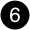
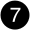
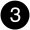

= Présentation de l'ajout et du remplacement du module d'E/S - AFX 2K
:allow-uri-read: 
:icons: font
:imagesdir: ../media/

[role="lead"]
Le système de stockage AFX 2K offre une flexibilité pour l’extension ou le remplacement des modules d’E/S afin d’améliorer la connectivité réseau et les performances. L’ajout ou le remplacement d’un module d’E/S est essentiel lors de la mise à niveau des capacités réseau ou pour traiter un module défaillant.

Vous pouvez remplacer un module d'E/S défectueux de votre système de stockage AFX 2K par le même type de module d'E/S ou par un autre type de module d'E/S. Vous pouvez également ajouter un module d'E/S dans un système avec des emplacements vides.

* link:io-module-add.html["Ajoutez un module d'E/S."]
+
L'ajout de modules supplémentaires peut améliorer la redondance, ce qui permet de garantir que le système reste opérationnel même en cas de défaillance d'un module.

* link:io-module-replace.html["Remplacez un module d'E/S."]
+
Le remplacement d'un module d'E/S défaillant permet de restaurer l'état de fonctionnement optimal du système.

.Numérotation des connecteurs d'E/S.
Les emplacements d'E/S du contrôleur AFX 2K sont numérotés de 1 à 11, comme indiqué dans l'illustration suivante.

image::../media/drw_afx_2k_rear_slots_ieops-2862.svg[Numérotation des emplacements sur un contrôleur AFX 2K]

[cols="10%,23%,10%,24%,10%,23%"]
|===
| Numéro de l'emplacement | Emplacement d'E/S | Numéro de l'emplacement | Emplacement d'E/S | Numéro de l'emplacement | Emplacement d'E/S 

 a| 
image::../media/icon_round_1.svg[Légende numéro 1]
| HA  a| 
image::../media/icon_round_4.svg[Numéro de légende 4]

image::../media/icon_round_5.svg[Numéro de légende 5]
| NVRAM12  a| 
image::../media/icon_round_9.svg[Callout numéro 9]
| Le réseau 

 a| 
image::../media/icon_round_2.svg[Légende numéro 2]
| Cluster  a| 

| NVRAM12-EX  a| 
image::../media/icon_round_10.svg[Callout numéro 10]
| Stockage 

 a| 

| Le réseau  a| 
image::../media/icon_round_8.svg[Callout numéro 8]
| Stockage  a| 
image::../media/icon_round_11.svg[Callout numéro 11]
| (*Optionnel*) Quatre ports 25GbE SFP28 pour une connectivité de gestion supplémentaire 
|===