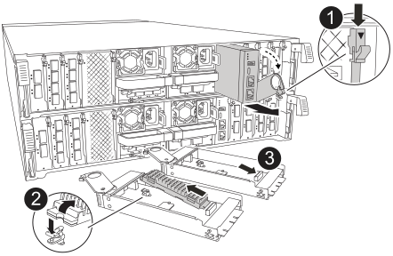

= Remplacez le module de gestion du système - ASA A70 et ASA A90
:allow-uri-read: 
:icons: font
:imagesdir: ../media/

[role="lead"]
Remplacez le module de gestion du système de votre système ASA A70 ou ASA A90 s'il est défectueux ou si son micrologiciel est corrompu. Le processus de remplacement implique l'arrêt du contrôleur, le remplacement du module de gestion du système en panne, le redémarrage du contrôleur, la mise à jour des clés de licence et le renvoi de la pièce défectueuse à NetApp.

.Avant de commencer
* Cette procédure utilise la terminologie suivante :
+
** Le contrôleur affecté est le contrôleur sur lequel vous effectuez la maintenance.
** Le contrôleur en bonne santé est le partenaire de haute disponibilité associé au contrôleur affecté.

* Tous les autres composants du système doivent fonctionner correctement.
* Le contrôleur partenaire doit pouvoir prendre le contrôle du contrôleur défectueux.
* Vous devez remplacer le composant défectueux par un composant FRU de remplacement que vous avez reçu de votre fournisseur.

.Description de la tâche
Le module de gestion du système, situé à l'arrière du contrôleur dans le logement 8, contient des composants intégrés pour la gestion du système, ainsi que des ports pour la gestion externe. Le contrôleur cible doit être arrêté pour remplacer un module de gestion du système défectueux ou pour remplacer le support d'amorçage.

== Étape 1 : arrêtez le contrôleur défaillant

Arrêtez ou prenez le contrôle du contrôleur défectueux.

Pour arrêter le contrôleur défaillant, vous devez déterminer l'état du contrôleur et, si nécessaire, prendre le contrôle de façon à ce que le contrôleur en bonne santé continue de transmettre des données provenant du stockage défaillant du contrôleur.

.Description de la tâche
* Si vous disposez d'un système SAN, vous devez avoir vérifié les messages d'événement  `cluster kernel-service show`) pour le serveur lame SCSI du contrôleur défectueux.  `cluster kernel-service show`La commande (from priv mode Advanced) affiche le nom du nœud, son état de disponibilité et link:https://docs.netapp.com/us-en/ontap/system-admin/display-nodes-cluster-task.html["état du quorum"]son état de fonctionnement.
+
Chaque processus SCSI-Blade doit se trouver au quorum avec les autres nœuds du cluster. Tout problème doit être résolu avant de procéder au remplacement.

* Si vous avez un cluster avec plus de deux nœuds, il doit être dans le quorum. Si le cluster n'est pas au quorum ou si un contrôleur en bonne santé affiche la valeur false pour l'éligibilité et la santé, vous devez corriger le problème avant de désactiver le contrôleur défaillant ; voir link:https://docs.netapp.com/us-en/ontap/system-admin/synchronize-node-cluster-task.html?q=Quorum["Synchroniser un nœud avec le cluster"^].

.Étapes
. Si AutoSupport est activé, supprimez la création automatique de dossier en invoquant un message AutoSupport :
+
`system node autosupport invoke -node * -type all -message MAINT=<# of hours>h`

+
Le message AutoSupport suivant supprime la création automatique de dossiers pendant deux heures :

+
`cluster1:> system node autosupport invoke -node * -type all -message MAINT=2h`

. Désactiver le retour automatique :
+
.. Entrez la commande suivante depuis la console du contrôleur sain :
+
`storage failover modify -node _impaired_node_name_ -auto-giveback false`

.. Entrer `y` lorsque vous voyez l'invite _Voulez-vous désactiver le retour automatique ?_

. Faites passer le contrôleur douteux à l'invite DU CHARGEUR :
+
[cols="1,2"]
|===
| Si le contrôleur en état de fonctionnement s'affiche... | Alors... 

 a| 
Invite DU CHARGEUR
 a| 
Passez à l'étape suivante.

 a| 
Attente du retour...
 a| 
Appuyez sur Ctrl-C, puis répondez `y` lorsque vous y êtes invité.

 a| 
Invite système ou invite de mot de passe
 a| 
Prendre le contrôle défectueux ou l'arrêter à partir du contrôleur en bon état :

`storage failover takeover -ofnode _impaired_node_name_ -halt _true_`

Le paramètre _-halt true_ vous amène à l'invite Loader.

|===

== Étape 2 : Remplacer le module de gestion du système

Remplacez le module de gestion du système défectueux.

.Étapes
. Assurez-vous que le déchargement de la NVRAM est terminé avant de continuer. Lorsque le voyant du module NV est éteint, le NVRAM est déchargé. Si le voyant clignote, attendez l'arrêt du clignotement. Si le clignotement continue pendant plus de 5 minutes, contactez le support technique pour obtenir de l'aide.
+
image::../media/drw_a1K-70-90_nvram-led_ieops-1463.svg[Emplacement graphique de la LED d'avertissement et d'état de la NVRAM]

+
[cols="1,4"]
|===

 a| 
image:../media/icon_round_1.png["Légende numéro 1"]
 a| 
LED d'état NVRAM

 a| 
image:../media/icon_round_2.png["Légende numéro 2"]
 a| 
LED d'avertissement NVRAM

|===
+
** Si le voyant NV est éteint, passez à l'étape suivante.
** Si le voyant NV clignote, attendez l'arrêt du clignotement. Si le clignotement continue pendant plus de 5 minutes, contactez le support technique pour obtenir de l'aide.

. Aller à l'arrière du châssis. Si vous n'êtes pas déjà mis à la terre, mettez-vous à la terre correctement.
. Débranchez les blocs d’alimentation du contrôleur.
+

NOTE: Si votre système est alimenté en courant continu, débranchez le bloc d'alimentation des blocs d'alimentation.

. Faites pivoter le chemin de câbles vers le bas en tirant sur les boutons situés des deux côtés à l'intérieur du chemin de câbles, puis faites pivoter le bac vers le bas.
. Retirez tous les câbles connectés au module de gestion du système. Assurez-vous que l'étiquette indiquant l'emplacement de connexion des câbles vous permet de les connecter aux ports appropriés lorsque vous réinstallez le module.
+
image::../media/drw_70-90_sys-mgmt_remove_ieops-1817.svg[Remplacez le module de gestion du système]

+
[cols="1,4"]
|===

 a| 
image::../media/icon_round_1.png[Légende numéro 1]
 a| 
Loquet de came du module de gestion du système

|===
. Retirez le module de gestion du système :
+
.. Appuyez sur le bouton de la came de gestion du système. Le levier de came s'éloigne du châssis.
.. Faites tourner le levier de came complètement vers le bas.
.. Enroulez votre doigt dans le levier de came et tirez le module hors du système.
.. Placez le module de gestion du système sur un tapis antistatique, de manière à ce que le support de démarrage soit accessible.

. Déplacez le support de démarrage vers le module de gestion du système de remplacement :
+

+
[cols="1,4"]
|===

 a| 
image::../media/icon_round_1.png[Légende numéro 1]
 a| 
Loquet de came du module de gestion du système

 a| 
image::../media/icon_round_2.png[Légende numéro 2]
 a| 
Bouton de verrouillage du support de démarrage

 a| 
image::../media/icon_round_3.png[Numéro de légende 3]
 a| 
Support de démarrage

|===
+
.. Appuyez sur le bouton de verrouillage bleu. Le support de démarrage tourne légèrement vers le haut.
.. Faites pivoter le support de démarrage vers le haut et retirez-le de son support.
.. Installez le support de démarrage dans le module de gestion du système de remplacement :
+
... Alignez les bords du support de coffre avec le logement de la prise, puis poussez-le doucement d'équerre dans le support.
... Faites pivoter le support de démarrage vers le bas jusqu'à ce qu'il engage le bouton de verrouillage. Appuyez sur le bouton de verrouillage bleu si nécessaire.

. Installez le module de gestion du système :
+
.. Alignez les bords du module de gestion du système de remplacement avec l'ouverture du système et poussez-le doucement dans le module de contrôleur.
.. Faites glisser doucement le module dans le logement jusqu'à ce que le loquet de came commence à s'engager avec la broche de came d'E/S, puis faites tourner le loquet de came complètement vers le haut pour verrouiller le module en place.

. Recâblage du module de gestion du système.
. Branchez les cordons d'alimentation aux blocs d'alimentation. Le contrôleur redémarre dès que l'alimentation est rétablie.
+

NOTE: Si vous disposez d’alimentations CC, reconnectez le bloc d’alimentation aux alimentations.

. Faites pivoter le chemin de câbles vers le haut jusqu'à la position fermée.

== Étape 3 : redémarrer le contrôleur

Redémarrez le module contrôleur.

.Étapes
. Entrez _bye_ à l'invite du CHARGEUR.
. Rétablir le fonctionnement normal du contrôleur en renvoie son espace de stockage :
+
`storage failover giveback -ofnode _impaired_node_name_`

. Restaurer le retour automatique :
+
`storage failover modify -node local -auto-giveback true`

. Si une fenêtre de maintenance AutoSupport a été déclenchée, terminez-la :
+
`system node autosupport invoke -node * -type all -message MAINT=END`

== Étape 4 : installez les licences et enregistrez le numéro de série

Vous devez installer de nouvelles licences pour le nœud concerné si ce dernier utilisait des fonctionnalités ONTAP nécessitant une licence standard (verrouillée par un nœud). Pour les fonctionnalités avec licences standard, chaque nœud du cluster doit avoir sa propre clé pour cette fonctionnalité.

.Description de la tâche
Tant que vous n'avez pas installé les clés de licence, les fonctionnalités nécessitant une licence standard restent disponibles pour le nœud. Toutefois, si le nœud était le seul nœud du cluster avec une licence pour la fonctionnalité, aucune modification de configuration de la fonctionnalité n'est autorisée. En outre, l'utilisation de fonctionnalités sans licence sur le nœud peut vous mettre en conformité avec votre contrat de licence. Vous devez donc installer la ou les clés de licence de remplacement sur le pour le nœud dès que possible.

.Avant de commencer
Les clés de licence doivent être au format à 28 caractères.

Vous disposez d'une période de grâce de 90 jours pour installer les clés de licence. Après la période de grâce, toutes les anciennes licences sont invalidés. Après l'installation d'une clé de licence valide, vous disposez de 24 heures pour installer toutes les clés avant la fin du délai de grâce.

NOTE: Si votre système exécutait initialement ONTAP 9.10.1 ou une version ultérieure, suivez la procédure décrite dans link:https://kb.netapp.com/on-prem/ontap/OHW/OHW-KBs/Post_Motherboard_Replacement_Process_to_update_Licensing_on_a_AFF_FAS_system#Internal_Notes["Procédure de remplacement post-carte mère pour mettre à jour les licences sur un système AFF/FAS"^]. Si vous n'êtes pas sûr de la version ONTAP initiale de votre système, reportez-vous à la section link:https://hwu.netapp.com["NetApp Hardware Universe"^] pour plus d'informations.

.Étapes
. Si vous avez besoin de nouvelles clés de licence, vous pouvez obtenir ces clés sur le https://mysupport.netapp.com/site/global/dashboard["Site de support NetApp"] Dans la section My support (mon support), sous licences logicielles.
+

NOTE: Les nouvelles clés de licence dont vous avez besoin sont générées automatiquement et envoyées à l'adresse électronique du fichier. Si vous ne recevez pas l'e-mail contenant les clés de licence dans les 30 jours, contactez l'assistance technique.

. Installer chaque clé de licence : `+system license add -license-code license-key, license-key...+`
. Supprimez les anciennes licences, si nécessaire :
+
.. Vérifier si les licences ne sont pas utilisées : `license clean-up -unused -simulate`
.. Si la liste semble correcte, supprimez les licences inutilisées : `license clean-up -unused`

. Enregistrez le numéro de série du système auprès du support NetApp.
+
** Si AutoSupport est activé, envoyez un message AutoSupport pour enregistrer le numéro de série.
** Si AutoSupport n'est pas activé, appeler https://mysupport.netapp.com["Support NetApp"] pour enregistrer le numéro de série.

== Étape 5 : renvoyer la pièce défaillante à NetApp

Retournez la pièce défectueuse à NetApp, tel que décrit dans les instructions RMA (retour de matériel) fournies avec le kit. Voir la https://mysupport.netapp.com/site/info/rma["Retour de pièces et remplacements"] page pour plus d'informations.
