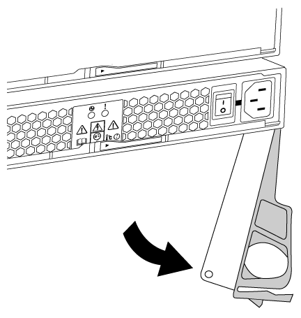

= Remplacement à chaud d'une alimentation - ASA A150
:allow-uri-read: 
:icons: font
:imagesdir: ../media/

[role="lead"]
Le remplacement d'un bloc d'alimentation implique la mise hors tension, le débranchement et le retrait de l'ancien bloc d'alimentation, ainsi que l'installation, la connexion et l'activation du bloc d'alimentation de remplacement.

Tous les autres composants du système doivent fonctionner correctement ; si ce n'est pas le cas, vous devez contacter le support technique.

* Les alimentations sont redondantes et remplaçables à chaud. Vous n’avez pas besoin d’arrêter le contrôleur pour remplacer un bloc d’alimentation.
* Cette procédure permet de remplacer une alimentation à la fois.
+

NOTE: Le refroidissement est intégré au bloc d'alimentation. Vous devez donc remplacer le bloc d'alimentation dans les deux minutes qui suivent le retrait afin d'éviter toute surchauffe due à une réduction du débit d'air. Le châssis offre une configuration de refroidissement partagée pour les deux nœuds haute disponibilité. Un délai de plus de deux minutes entraîne l'arrêt de tous les modules de contrôleur dans le châssis. Si les deux modules du contrôleur s'arrêtent, assurez-vous que les deux blocs d'alimentation sont insérés, les deux s'arrêtent pendant 30 secondes, puis les deux s'allument.

* Les blocs d'alimentation sont à sélection automatique.

.Étapes
. Identifiez le bloc d'alimentation que vous souhaitez remplacer, en fonction des messages d'erreur de la console ou des LED des alimentations.
. Si vous n'êtes pas déjà mis à la terre, mettez-vous à la terre correctement.
. Mettez le bloc d'alimentation hors tension et débranchez les câbles d'alimentation :
+
.. Eteindre l'interrupteur de l'alimentation en panne.
.. Ouvrez le dispositif de retenue du câble d'alimentation, puis débranchez le câble d'alimentation du bloc d'alimentation.
.. Débranchez le câble d'alimentation de la source d'alimentation.

. Appuyez sur le loquet de la poignée de came du bloc d'alimentation, puis ouvrez la poignée de came pour libérer complètement le bloc d'alimentation du plan central.
+

. Utilisez la poignée de came pour faire glisser le bloc d'alimentation hors du système.
+

CAUTION: Lors de la dépose d'une alimentation électrique, toujours utiliser deux mains pour soutenir son poids.

. S'assurer que l'interrupteur marche/arrêt de la nouvelle alimentation est en position arrêt.
. À l'aide des deux mains, soutenez et alignez les bords du bloc d'alimentation avec l'ouverture du châssis du système, puis poussez doucement le bloc d'alimentation dans le châssis à l'aide de la poignée de came.
+
Les blocs d'alimentation sont munis de clés et ne peuvent être installés qu'une seule fois.

+

NOTE: Ne pas exercer de force excessive lors du glissement du bloc d'alimentation dans le système. Vous pouvez endommager le connecteur.

. Fermez la poignée de came de façon à ce que le loquet s'enclenche en position verrouillée et que le bloc d'alimentation soit bien en place.
. Rebranchez le câblage du bloc d'alimentation :
+
.. Rebranchez le câble d'alimentation au bloc d'alimentation et à la source d'alimentation.
.. Fixez le câble d'alimentation à l'alimentation à l'aide de la retenue du câble d'alimentation.

+
Une fois l'alimentation rétablie, la LED d'état doit être verte.

. Mettez la nouvelle alimentation sous tension, puis vérifiez le fonctionnement des LED d'activité des blocs d'alimentation.
+
Les LED du bloc d'alimentation sont allumées lorsque le bloc d'alimentation est en ligne.

. Retournez la pièce défectueuse à NetApp, tel que décrit dans les instructions RMA (retour de matériel) fournies avec le kit. Voir la https://mysupport.netapp.com/site/info/rma["Retour de pièces et remplacements"^] page pour plus d'informations.

