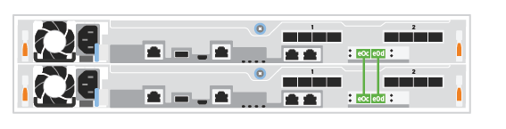

= Étapes détaillées - ASA A250
:allow-uri-read: 
:icons: font
:imagesdir: ../media/

[role="lead"]
Cette page fournit des instructions détaillées pour l'installation d'un système ASA A250.

== Étape 1 : préparer l'installation

Pour installer votre système, vous devez créer un compte et enregistrer le système. Vous devez également inventorier le nombre et le type de câbles appropriés pour votre système et collecter des informations réseau spécifiques.

NOTE: Les clients qui ont des exigences énergétiques spécifiques doivent vérifier que l'HWU est bien adaptée à leur configuration.

.Avant de commencer
* Assurez-vous d'avoir accès au link:https://hwu.netapp.com["NetApp Hardware Universe"^] (HWU) pour obtenir des informations sur les exigences relatives au site.
* Assurez-vous d'avoir accès au link:http://mysupport.netapp.com/documentation/productlibrary/index.html?productID=62286["Notes de version pour votre version de ONTAP"^] pour plus d'informations sur ce système.
* Vous devez fournir les informations suivantes sur votre site :
+
** Espace rack pour le système de stockage
** Tournevis Phillips n°2
** Câbles réseau supplémentaires pour connecter votre système à votre commutateur réseau et à votre ordinateur portable ou console avec un navigateur Web

.Étapes
. Déballez le contenu de toutes les boîtes.
. Notez le numéro de série du système depuis les contrôleurs.
+
image::../media/drw_ssn_label.png[Exemple de numéro de série du système]

. Configurez votre compte :
+
.. Connectez-vous à votre compte existant ou créez un compte.
.. link:https://mysupport.netapp.com/eservice/registerSNoAction.do?moduleName=RegisterMyProduct["S'inscrire"^] votre système.

. Téléchargez et installez link:https://mysupport.netapp.com/site/tools/tool-eula/activeiq-configadvisor["Téléchargement NetApp : Config Advisor"^] sur votre ordinateur portable.
. Faites un inventaire et notez le nombre et le type de câbles que vous avez reçus.
+
Le tableau suivant identifie les types de câbles que vous pouvez recevoir. Si vous recevez un câble non répertorié dans le tableau, reportez-vous à la section link:https://hwu.netapp.com["NetApp Hardware Universe"^] pour localiser le câble et identifier son utilisation.

+
[cols="1,2,1,2"]
|===
| Type de câble... | Numéro de pièce et longueur | Type de connecteur | Pour... 

 a| 
Câble 25 GbE
 a| 
X66240A-05 (112-00595), 0,5 m ;

X66240-2 (112-00573), 2 M.
 a| 
image:../media/oie_cable100_gbe_qsfp28.png["Connecteur QSFP28 100 GbE"]
 a| 
Réseau d'interconnexion de cluster

 a| 
X66240A-2 (112-00598), 2 m ;

X66240A-5 (112-00600), 5 m
 a| 
Les données

 a| 
Câble 100 GbE
 a| 
X66211-2 (112-00574), 2 m ;

X66211-5 (112-00576), 5 m
 a| 
Stockage

 a| 
RJ-45 (selon la commande)
 a| 
Sans objet
 a| 
image:../media/oie_cable_rj45.png["Connecteur de câble RJ-45"]
 a| 
Réseau de gestion (BMC et port de clé) et données Ethernet (e0a et e0b)

 a| 
Fibre Channel
 a| 
X66250-2 (112-00342) 2 m ;

X66250-5 (112-00344) 5 m ;

X66250-15 (112-00346) 15 m ;

X66250-30 (112-00347) 30 m
 a| 
image:../media/oie_cable_fc_optical.png["Câble optique Fibre Channel de l'OIE"]
 a| 

 a| 
Câble de console micro-USB
 a| 
Sans objet
 a| 
image:../media/oie_cable_micro_usb.png["Illustration montrant un connecteur micro USB"]
 a| 
Connexion de la console durant la configuration du logiciel

 a| 
Câbles d'alimentation
 a| 
Sans objet
 a| 
image:../media/oie_cable_power.png["Câbles d'alimentation"]
 a| 
Mise sous tension du système

|===
. Vérifiez le link:https://library.netapp.com/ecm/ecm_download_file/ECMLP2862613["Guide de configuration de ONTAP"^] et recueillez les informations requises répertoriées dans ce guide.

== Étape 2 : installer le matériel de fixation

Vous devez installer votre système sur un rack de 4 montants ou une armoire système NetApp, le cas échéant.

.Étapes
. Installez les kits de rails, au besoin.
. Installez et sécurisez votre système en suivant les instructions fournies avec le kit de rails.
+

NOTE: Vous devez être conscient des problèmes de sécurité associés au poids du système.

+
image::../media/drw_affa250_weight_caution.png[Précaution de levage pour deux personnes]

. Identifiez et gérez les câbles car ce système ne dispose pas de périphérique de gestion des câbles.
. Placez le panneau à l'avant du système.

== Étape 3 : câblage des contrôleurs au cluster

Reliez les contrôleurs à un cluster à l'aide de la méthode cluster sans commutateur à deux nœuds ou à l'aide de la méthode réseau d'interconnexion de cluster.

[role="tabbed-block"]
====
.Option 1 : cluster à 2 nœuds sans commutateur
--
Les ports de gestion, Fibre Channel et de données ou réseau hôte des modules de contrôleur sont connectés aux commutateurs. Les ports d'interconnexion de cluster sont câblés sur les deux modules de contrôleur.

.Avant de commencer
* Pour plus d'informations sur la connexion du système aux commutateurs, contactez votre administrateur réseau.
* Assurez-vous de vérifier que la flèche de l'illustration indique l'orientation correcte du connecteur de câble à languette.
+
image::../media/oie_cable_pull_tab_down.png[Connecteur de câble avec languette de traction en bas]

+

NOTE: Lorsque vous insérez le connecteur, vous devez le sentir en place ; si vous ne le sentez pas, retirez-le, tournez-le et réessayez.

.Description de la tâche
Utilisez l'animation ou les étapes tabulées pour terminer le câblage entre les contrôleurs et les commutateurs. Effectuez les étapes sur chaque contrôleur.

.Animation : câble d'un cluster sans commutateur à deux nœuds
video::beec3966-0a01-473c-a5de-ac68017fbf29[panopto]
.Étapes
. Utilisez le câble d'interconnexion de cluster 25 GbE pour connecter les ports d'interconnexion de cluster e0c à e0c et e0d à e0d.
+
image:../media/oie_cable_sfp_gbe_copper.png["Connecteur en cuivre SFP GbE"]:

+

. Reliez les ports de clé aux commutateurs du réseau de gestion à l'aide de câbles RJ45.
+
image::../media/drw_affa250_mgmt_cabling.png[Câblage du port de gestion]

IMPORTANT: NE branchez PAS les cordons d'alimentation à ce stade.

--
.Option 2 : cluster commuté
--
Tous les ports des contrôleurs sont connectés aux commutateurs, à l'interconnexion de cluster, à la gestion, à Fibre Channel et aux commutateurs de réseau d'hôte ou de données.

.Avant de commencer
* Pour plus d'informations sur la connexion du système aux commutateurs, contactez votre administrateur réseau.
* Assurez-vous de vérifier que la flèche de l'illustration indique l'orientation correcte du connecteur de câble à languette.
+
image::../media/oie_cable_pull_tab_down.png[Connecteur de câble avec languette de traction en bas]

+

NOTE: Lorsque vous insérez le connecteur, vous devez le sentir en place ; si vous ne le sentez pas, retirez-le, tournez-le et réessayez.

.Description de la tâche
Utilisez l'animation ou les étapes pour terminer le câblage entre les contrôleurs et les commutateurs. Effectuez les étapes sur chaque contrôleur.

.Animation - Groupe de câbles commutés
video::bf6759dc-4cbf-488e-982e-ac68017fbef8[panopto]
.Étapes
. Reliez les ports d'interconnexion de cluster e0c et e0d aux commutateurs d'interconnexion de cluster 25 GbE.
+
image:../media/drw_affa250_switched_clust_cabling.png["Câblage d'interconnexion de cluster"]

. Reliez les ports de clé aux commutateurs du réseau de gestion à l'aide de câbles RJ45.
+
image::../media/drw_affa250_mgmt_cabling.png[Câblage du port de gestion]

--
====

== Étape 4 : câble vers le réseau ou le stockage hôte (facultatif)

Vous disposez d'un câblage en option dépendant de la configuration pour les réseaux hôtes Fibre Channel ou iSCSI ou pour le stockage à connexion directe. Ce câblage n'est pas exclusif ; vous pouvez disposer d'un câblage vers un réseau hôte et un stockage.

[role="tabbed-block"]
====
.Option 1 : câble vers le réseau hôte Fibre Channel
--
Les ports Fibre Channel situés sur les contrôleurs sont connectés aux commutateurs réseau hôte Fibre Channel.

.Avant de commencer
* Pour plus d'informations sur la connexion du système aux commutateurs, contactez votre administrateur réseau.
* Assurez-vous de vérifier que la flèche de l'illustration indique l'orientation correcte du connecteur de câble à languette.
+
image::../media/oie_cable_pull_tab_up.png[Connecteur de câble avec languette de traction sur le dessus]

+

NOTE: Lorsque vous insérez le connecteur, vous devez le sentir en place. Si vous ne le sentez pas, retirez-le, retournez-le et réessayez.

.Description de la tâche
Effectuer l'étape suivante sur chaque module de contrôleur.

.Étapes
. Reliez les ports 2a à 2d aux commutateurs hôte FC.
+
image:../media/drw_affa250_fc_host_cabling.png["Câblage hôte Fibre Channel"]

--
.Option 2 : câble vers un réseau de données 25 GbE ou hôte
--
Les ports 25 GbE des contrôleurs sont connectés à des switchs de données 25 GbE ou du réseau hôte.

.Avant de commencer
* Pour plus d'informations sur la connexion du système aux commutateurs, contactez votre administrateur réseau.
* Assurez-vous de vérifier que la flèche de l'illustration indique l'orientation correcte du connecteur de câble à languette.
+
image::../media/oie_cable_pull_tab_up.png[Connecteur de câble avec languette de traction sur le dessus]

+

NOTE: Lorsque vous insérez le connecteur, vous devez le sentir en place ; si vous ne le sentez pas, retirez-le, tournez-le et réessayez.

.Description de la tâche
Effectuer l'étape suivante sur chaque module de contrôleur.

.Étapes
. Reliez les ports e4a à e4d aux commutateurs du réseau hôte 10GbE.
+
image:../media/drw_affa250_25gbe_host_cabling.png["Câblage 25 GbE"]

--
.Option 3 : câblage des contrôleurs pour un tiroir disque
--
Reliez chaque contrôleur aux modules NSM du tiroir de disque NS224.

.Avant de commencer
Assurez-vous de vérifier que la flèche de l'illustration indique l'orientation correcte du connecteur de câble à languette.

image::../media/oie_cable_pull_tab_up.png[Connecteur de câble avec languette de traction sur le dessus]

NOTE: Lorsque vous insérez le connecteur, vous devez le sentir en place ; si vous ne le sentez pas, retirez-le, tournez-le et réessayez.

.Description de la tâche
Utilisez l'animation ou les étapes tabulées pour terminer le câblage entre les contrôleurs et le tiroir unique. Effectuez les étapes sur chaque module de contrôleur.

.Animation : raccorder les contrôleurs à un seul NS224
video::3f92e625-a19c-4d10-9028-ac68017fbf57[panopto]
.Étapes
. Reliez le contrôleur A au tiroir.
+
image:../media/drw_affa250_1shelf_cabling_a.png["Câblage du contrôleur A."]

. Reliez le contrôleur B au tiroir.
+
image:../media/drw_affa250_1shelf_cabling_b.png["Câblage du contrôleur B."]

--
====

== Étape 5 : terminez la configuration du système

Procédez à la configuration du système en utilisant la découverte du cluster uniquement avec une connexion au commutateur et à l'ordinateur portable, ou en vous connectant directement à un contrôleur du système, puis en vous connectant au commutateur de gestion.

[role="tabbed-block"]
====
.Option 1 : si la détection réseau est activée
--
Si la détection réseau est activée sur votre ordinateur portable, vous pouvez effectuer l'installation et la configuration du système à l'aide de la détection automatique des clusters.

.Étapes
. Branchez les câbles d'alimentation aux alimentations du contrôleur, puis connectez-les à des sources d'alimentation de différents circuits.
+
Le système commence à démarrer. Le démarrage initial peut prendre jusqu'à huit minutes.

. Assurez-vous que la détection réseau de votre ordinateur portable est activée.
+
Consultez l'aide en ligne de votre ordinateur portable pour plus d'informations.

. Utilisez l'animation pour connecter votre ordinateur portable au commutateur de gestion :
+
.Animation : connectez votre ordinateur portable au commutateur de gestion
video::d61f983e-f911-4b76-8b3a-ab1b0066909b[panopto]
. Sélectionnez une icône ONTAP pour découvrir :
+
image::../media/drw_autodiscovery_controler_select.png[Sélectionnez une icône ONTAP]

+
.. Ouvrez l'Explorateur de fichiers.
.. Cliquez sur *réseau* dans le volet de gauche.
.. Cliquez avec le bouton droit de la souris et sélectionnez *Actualiser*.
.. Double-cliquez sur l'une des icônes ONTAP et acceptez les certificats affichés à l'écran.
+

NOTE: XXXXX est le numéro de série du système du nœud cible.

+
System Manager s'ouvre.

. Utilisez la configuration assistée de System Manager pour configurer votre système à l'aide des données collectées dans le link:https://library.netapp.com/ecm/ecm_download_file/ECMLP2862613["Guide de configuration de ONTAP"^].
. Vérifiez l'état de santé de votre système en exécutant Config Advisor.
. Une fois la configuration initiale terminée, passez à la link:https://www.netapp.com/data-management/oncommand-system-documentation/["ONTAP  ; Ressources de documentation ONTAP System Manager"^] Pour plus d'informations sur la configuration de fonctionnalités supplémentaires dans ONTAP.

--
.Option 2 : si la détection réseau n'est pas activée
--
Si la détection réseau n'est pas activée sur votre ordinateur portable, vous devez effectuer la configuration et la configuration à l'aide de cette tâche.

.Étapes
. Branchez et configurez votre ordinateur portable ou votre console :
+
.. Définissez le port de console de l'ordinateur portable ou de la console sur 115,200 bauds avec N-8-1.
+

NOTE: Consultez l'aide en ligne de votre ordinateur portable ou de votre console pour savoir comment configurer le port de console.

.. Connectez l'ordinateur portable ou la console au commutateur du sous-réseau de gestion.
+
image::../media/drw_console_client_mgmt_subnet_affa250.png[Connexion au sous-réseau de gestion]

.. Attribuez une adresse TCP/IP à l'ordinateur portable ou à la console à l'aide d'une adresse située sur le sous-réseau de gestion.

. Branchez les câbles d'alimentation aux alimentations du contrôleur, puis connectez-les à des sources d'alimentation de différents circuits.
+
Le système commence à démarrer. Le démarrage initial peut prendre jusqu'à huit minutes.

. Attribuez une adresse IP initiale de gestion des nœuds à l'un des nœuds.
+
[cols="1,2"]
|===
| Si le réseau de gestion dispose de DHCP... | Alors... 

 a| 
Configuré
 a| 
Notez l'adresse IP attribuée aux nouveaux contrôleurs.

 a| 
Non configuré
 a| 
.. Ouvrez une session de console à l'aide de PuTTY, d'un serveur de terminal ou de l'équivalent pour votre environnement.
+

NOTE: Consultez l'aide en ligne de votre ordinateur portable ou de votre console si vous ne savez pas comment configurer PuTTY.

.. Saisissez l'adresse IP de gestion lorsque le script vous y invite.

|===
. Utilisez System Manager sur votre ordinateur portable ou sur la console pour configurer votre cluster :
+
.. Indiquez l'adresse IP de gestion des nœuds dans votre navigateur.
+

NOTE: Le format de l'adresse est +https://x.x.x.x+.

.. Configurez le système à l'aide des données que vous avez collectées dans link:https://library.netapp.com/ecm/ecm_download_file/ECMLP2862613["Guide de configuration de ONTAP"^].

. Vérifiez l'état de santé de votre système en exécutant Config Advisor.
. Une fois la configuration initiale terminée, passez à la link:https://www.netapp.com/data-management/oncommand-system-documentation/["ONTAP  ; Ressources de documentation ONTAP System Manager"^] Pour plus d'informations sur la configuration de fonctionnalités supplémentaires dans ONTAP.

--
====