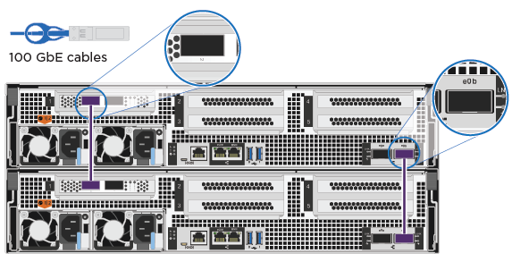

= Étapes détaillées - ASA A800
:allow-uri-read: 
:icons: font
:imagesdir: ../media/

[role="lead"]
Cette page fournit des instructions détaillées pour l'installation d'un système ASA A800.

== Étape 1 : préparer l'installation

Pour installer votre système, vous devez créer un compte et enregistrer le système. Vous devez également inventorier le nombre et le type de câbles appropriés pour votre système et collecter des informations réseau spécifiques.

Vous devez avoir accès au link:https://hwu.netapp.com["NetApp Hardware Universe"^] (HWU) pour obtenir des informations sur les conditions requises par le site ainsi que des informations supplémentaires sur votre système configuré. Vous pouvez également avoir accès au link:http://mysupport.netapp.com/documentation/productlibrary/index.html?productID=62286["Notes de version pour votre version de ONTAP"^] pour plus d'informations sur ce système.

.Ce dont vous avez besoin
Vous devez fournir les informations suivantes sur votre site :

* Espace rack pour le système de stockage
* Tournevis Phillips n°2
* Câbles réseau supplémentaires pour connecter votre système à votre commutateur réseau et à votre ordinateur portable ou console avec un navigateur Web
+
.. Déballez le contenu de toutes les boîtes.
.. Notez le numéro de série du système depuis les contrôleurs.
+
image::../media/drw_ssn_label.png[Exemple de numéro de série du système]

.Étapes
. Configurez votre compte :
+
.. Connectez-vous à votre compte existant ou créez un compte.
.. Registre (link:https://mysupport.netapp.com/eservice/registerSNoAction.do?moduleName=RegisterMyProduct["Enregistrement de produit NetApp"^]) votre système.

. Téléchargez et installez link:https://mysupport.netapp.com/site/tools/tool-eula/activeiq-configadvisor["Téléchargement NetApp : Config Advisor"^] sur votre ordinateur portable.
. Faites un inventaire et notez le nombre et le type de câbles que vous avez reçus.
+
Le tableau suivant identifie les types de câbles que vous pouvez recevoir. Si vous recevez un câble non répertorié dans le tableau, reportez-vous à la section link:https://hwu.netapp.com["NetApp Hardware Universe"^] pour localiser le câble et identifier son utilisation.

+
[cols="1,2,1,2"]
|===
| Type de connecteur | Numéro de pièce et longueur | Type de câble... | Pour... 

 a| 
Câble 100 GbE
 a| 
X66211A-05 (112-00595), 0,5 m
 a| 
image:../media/oie_cable100_gbe_qsfp28.png["Connecteur QSFP28 100 GbE"]
 a| 
Interconnexion HAUTE DISPONIBILITÉ

 a| 
X66211A-05 (112-00595), 0,5 m

X66211-1 (112-00573), 1 m
 a| 
Réseau d'interconnexion de cluster

 a| 
X66211-2 (112-00574), 2 m ;

X66211-5 (112-00576), 5 m
 a| 
Stockage, données

 a| 
Câble 10 GbE
 a| 
X6566B-3-R6 (112-00300), 3 m ;

X6566B-5-R6 (112-00301), 5 m
 a| 
Les données

 a| 
Câble 25 GbE
 a| 
X66240A-2 (112-00598), 2 m ;

X66240A-5 (112-00600), 5 m
 a| 
Les données

 a| 
RJ-45 (selon la commande)
 a| 
Sans objet
 a| 
image:../media/oie_cable_rj45.png["Connecteur de câble RJ-45"]
 a| 
Gestion

 a| 
Fibre Channel
 a| 
X66250-2 (112-00342) 2 m ;

X66250-5 (112-00344) 5 m ;

X66250-15 (112-00346) 15 m ;

X66250-30 (112-00347) 30 m
 a| 
image:../media/oie_cable_fc_optical.png["Câble optique Fibre Channel de l'OIE"]
 a| 

 a| 
Câble de console micro-USB
 a| 
Sans objet
 a| 
image:../media/oie_cable_micro_usb.png["Connecteur micro USB"]
 a| 
Connexion de la console durant la configuration du logiciel

 a| 
Câbles d'alimentation
 a| 
Sans objet
 a| 
image:../media/oie_cable_power.png["Câbles d'alimentation"]
 a| 
Mise sous tension du système

|===
. Téléchargez et complétez le link:https://library.netapp.com/ecm/ecm_download_file/ECMLP2839002["Fiche de configuration du cluster"^].

== Étape 2 : installer le matériel de fixation

Vous devez installer votre système sur un rack de 4 montants ou une armoire système NetApp, le cas échéant.

.Étapes
. Installez les kits de rails, au besoin.
+
link:../platform-supplemental/superrail-install.html["Installation de SuperRail dans un rack à quatre montants"]

. Installez et sécurisez votre système en suivant les instructions fournies avec le kit de rails.
+

NOTE: Vous devez être conscient des problèmes de sécurité associés au poids du système.

+
image::../media/drw_affa800_weight_caution.png[Précaution de levage pour quatre personnes]

. Fixez les dispositifs de gestion des câbles (comme illustré).
+
image::../media/drw_affa800_install_cable_mgmt.png[Connexion du périphérique de gestion des câbles]

. Placez le panneau à l'avant du système.

== Étape 3 : contrôleurs de câble

Un câblage est nécessaire pour le cluster de votre plateforme via la méthode de cluster sans commutateur à deux nœuds ou la méthode de réseau d'interconnexion de cluster. Il existe un câblage en option vers les réseaux hôtes Fibre Channel ou iSCSI ou le stockage à connexion directe. Ce câblage n'est pas exclusif ; vous pouvez disposer d'un câble vers un réseau hôte et un espace de stockage.

=== Câblage requis : câblage des contrôleurs à un cluster

Reliez les contrôleurs à un cluster en utilisant la méthode de cluster sans commutateur à deux nœuds ou en utilisant le réseau d'interconnexion de cluster.

==== Option 1 : câler un cluster à deux nœuds sans commutateur

Les ports du réseau de gestion situés sur les contrôleurs sont connectés aux commutateurs. Les ports d'interconnexion haute disponibilité et d'interconnexion de cluster sont câblés sur les deux contrôleurs.

.Avant de commencer
Pour plus d'informations sur la connexion du système aux commutateurs, contactez votre administrateur réseau.

Assurez-vous de vérifier que la flèche de l'illustration indique l'orientation correcte du connecteur de câble à languette.

image::../media/oie_cable_pull_tab_up.png[Connecteur de câble avec languette de traction sur le dessus]

NOTE: Lorsque vous insérez le connecteur, vous devez le sentir en place ; si vous ne le sentez pas, retirez-le, tournez-le et réessayez.

.Étapes
. Utilisez l'animation ou les étapes tabulées pour terminer le câblage entre les contrôleurs et les commutateurs :
+
.Animation : câblé à un cluster sans commutateur à deux nœuds
video::edc42447-f721-4cbe-b080-ab0c0123a139[panopto]
+
[cols="10,90"]
|===
| Étape | Effectuer des opérations sur chaque module de contrôleur 

 a| 
image:../media/icon_square_1_blue.png["Légende numéro 1"]
 a| 
Câconnectez les ports d'interconnexion haute disponibilité :

** e0b à e0b
** e1b à e1b

 a| 
image:../media/icon_square_2_yellow.png["Légende numéro 2"]
 a| 
Câconnectez les ports d'interconnexion de cluster :

** e0a à e0a
** e1a à e1a
image:../media/drw_affa800_tnsc_clust_cabling.png["Câblage d'interconnexion de cluster dans un cluster sans commutateur à 2 nœuds"]

 a| 
image:../media/icon_square_3_orange.png["Étape 3"]
 a| 
Reliez les ports de gestion aux switchs réseau de gestion    image:../media/drw_affa800_mgmt_cabling.png["Illustration de l'emplacement des ports de gestion à l'arrière du système"]

 a| 
image:../media/oie_legend_icon_attn_symbol.png["Symbole d'attention"]
 a| 
NE branchez PAS les cordons d'alimentation à ce stade.

|===
. Pour procéder au câblage facultatif, reportez-vous à la section :
+
** <<Option 1 : câble vers un réseau hôte Fibre Channel>>
** <<Option 2 : câble vers un réseau hôte 10GbE>>
** <<Option 3 : câblage des contrôleurs à un tiroir disque unique>>
** <<Option 4 : câblage des contrôleurs à deux tiroirs disques>>

. Pour terminer la configuration de votre système, reportez-vous à la section link:install-detailed-guide.html#step-4-complete-system-setup-and-configuration["Étape 4 : installation et configuration complètes du système"].

==== Option 2 : câblage d'un cluster commuté

Les ports réseau d'interconnexion et de gestion de cluster des contrôleurs sont connectés aux commutateurs, tandis que les ports d'interconnexion haute disponibilité sont câblés sur les deux contrôleurs.

.Avant de commencer
Pour plus d'informations sur la connexion du système aux commutateurs, contactez votre administrateur réseau.

Assurez-vous de vérifier que la flèche de l'illustration indique l'orientation correcte du connecteur de câble à languette.

image::../media/oie_cable_pull_tab_up.png[Connecteur de câble avec languette de traction sur le dessus]

NOTE: Lorsque vous insérez le connecteur, vous devez le sentir en place ; si vous ne le sentez pas, retirez-le, tournez-le et réessayez.

.Étapes
. Utilisez l'animation ou les étapes tabulées pour terminer le câblage entre les contrôleurs et les commutateurs :
+
.Animation - câble a du bloc d'instruments commuté
video::49e48140-4c5a-4395-a7d7-ab0c0123a10e[panopto]
+
[cols="10,90"]
|===
| Étape | Effectuer des opérations sur chaque module de contrôleur 

 a| 
image:../media/icon_square_1_blue.png["Légende numéro 1"]
 a| 
Câconnectez les ports d'interconnexion haute disponibilité :

** e0b à e0b
** e1b à e1b

 a| 
image:../media/icon_square_2_yellow.png["Légende numéro 2"]
 a| 
Reliez les ports d'interconnexion de cluster aux commutateurs d'interconnexion de cluster 100 GbE.
** e0a
** e1a
image:../media/drw_affa800_switched_clust_cabling.png["Câblage d'interconnexion de cluster"]

 a| 
image:../media/icon_square_3_orange.png["Étape 3"]
 a| 
Reliez les ports de gestion aux switchs réseau de gestion    image:../media/drw_affa800_mgmt_cabling.png["Illustration de l'emplacement des ports de gestion à l'arrière du système"]

 a| 
image:../media/oie_legend_icon_attn_symbol.png["Symbole d'attention"]
 a| 
NE branchez PAS les cordons d'alimentation à ce stade.

|===
. Pour procéder au câblage facultatif, reportez-vous à la section :
+
** <<Option 1 : câble vers un réseau hôte Fibre Channel>>
** <<Option 2 : câble vers un réseau hôte 10GbE>>
** <<Option 3 : câblage des contrôleurs à un tiroir disque unique>>
** <<Option 4 : câblage des contrôleurs à deux tiroirs disques>>

. Pour terminer la configuration de votre système, reportez-vous à la section link:install-detailed-guide.html#step-4-complete-system-setup-and-configuration["Étape 4 : installation et configuration complètes du système"].

=== Câblage en option : options dépendant de la configuration du câble

Vous disposez d'un câblage en option dépendant de la configuration pour les réseaux hôtes Fibre Channel ou iSCSI ou pour le stockage à connexion directe. Ce câblage n'est pas exclusif ; vous pouvez disposer d'un câblage vers un réseau hôte et un stockage.

==== Option 1 : câble vers un réseau hôte Fibre Channel

Les ports Fibre Channel situés sur les contrôleurs sont connectés aux commutateurs réseau hôte Fibre Channel.

.Avant de commencer
Pour plus d'informations sur la connexion du système aux commutateurs, contactez votre administrateur réseau.

Assurez-vous de vérifier que la flèche de l'illustration indique l'orientation correcte du connecteur de câble à languette.

image::../media/oie_cable_pull_tab_up.png[Connecteur de câble avec languette de traction sur le dessus]

NOTE: Lorsque vous insérez le connecteur, vous devez le sentir en place ; si vous ne le sentez pas, retirez-le, tournez-le et réessayez.

[cols="10,90"]
|===
| Étape | Effectuer des opérations sur chaque module de contrôleur 

 a| 
1
 a| 
Reliez les ports 2a à 2d aux commutateurs hôte FC.image:../media/drw_affa800_fc_host_cabling.png["Câblage réseau hôte Fibre Channel"]

 a| 
2
 a| 
Pour effectuer d'autres câbles en option, choisissez parmi les options suivantes :

* <<Option 3 : câblage des contrôleurs à un tiroir disque unique>>
* <<Option 4 : câblage des contrôleurs à deux tiroirs disques>>

 a| 
3
 a| 
Pour terminer la configuration de votre système, reportez-vous à la section link:install-detailed-guide.html#step-4-complete-system-setup-and-configuration["Étape 4 : installation et configuration complètes du système"].

|===

==== Option 2 : câble vers un réseau hôte 10GbE

Les ports 10GbE des contrôleurs sont connectés aux commutateurs du réseau hôte 10GbE.

.Avant de commencer
Pour plus d'informations sur la connexion du système aux commutateurs, contactez votre administrateur réseau.

Assurez-vous de vérifier que la flèche de l'illustration indique l'orientation correcte du connecteur de câble à languette.

image::../media/oie_cable_pull_tab_up.png[Connecteur de câble avec languette de traction sur le dessus]

NOTE: Lorsque vous insérez le connecteur, vous devez le sentir en place ; si vous ne le sentez pas, retirez-le, tournez-le et réessayez.

[cols="10,90"]
|===
| Étape | Effectuer des opérations sur chaque module de contrôleur 

 a| 
1
 a| 
Reliez les ports e4a à e4d aux commutateurs du réseau hôte 10GbE.image:../media/drw_affa800_10gbe_host_cabling.png["Câblage réseau de l'hôte"]

 a| 
2
 a| 
Pour effectuer d'autres câbles en option, choisissez parmi les options suivantes :

* <<Option 3 : câblage des contrôleurs à un tiroir disque unique>>
* <<Option 4 : câblage des contrôleurs à deux tiroirs disques>>

 a| 
3
 a| 
Pour terminer la configuration de votre système, reportez-vous à la section link:install-detailed-guide.html#step-4-complete-system-setup-and-configuration["Étape 4 : installation et configuration complètes du système"].

|===

==== Option 3 : câblage des contrôleurs à un tiroir disque unique

Vous devez connecter chaque contrôleur aux modules NSM du tiroir de disque NS224.

.Avant de commencer
Assurez-vous de vérifier que la flèche de l'illustration indique l'orientation correcte du connecteur de câble à languette.

image::../media/oie_cable_pull_tab_up.png[Connecteur de câble avec languette de traction sur le dessus]

NOTE: Lorsque vous insérez le connecteur, vous devez le sentir en place ; si vous ne le sentez pas, retirez-le, tournez-le et réessayez.

Utilisez l'animation ou les étapes tabulées pour câbler vos contrôleurs à un seul tiroir :

.Animation : Connectez les contrôleurs à un tiroir disque unique
video::09dade4f-00bd-4d41-97d7-ab0c0123a0b4[panopto]
[cols="10,90"]
|===
| Étape | Effectuer des opérations sur chaque module de contrôleur 

 a| 
image:../media/icon_square_1_blue.png["Légende numéro 1"]
 a| 
Connectez les câbles du contrôleur A au tiroir :    image:../media/drw_affa800_1shelf_cabling_a.png["Câblage des contrôleurs à un seul tiroir"]

 a| 
image:../media/icon_square_2_yellow.png["Légende numéro 2"]
 a| 
Câble du contrôleur B vers le tiroir :    image:../media/drw_affa800_1shelf_cabling_b.png["Câblage du contrôleur B à un seul tiroir"]

|===
Pour terminer la configuration de votre système, reportez-vous à la section link:install-detailed-guide.html#step-4-complete-system-setup-and-configuration["Étape 4 : installation et configuration complètes du système"].

==== Option 4 : câblage des contrôleurs à deux tiroirs disques

Vous devez connecter chaque contrôleur aux modules NSM des deux tiroirs disques NS224.

.Avant de commencer
Assurez-vous de vérifier que la flèche de l'illustration indique l'orientation correcte du connecteur de câble à languette.

image::../media/oie_cable_pull_tab_up.png[Connecteur de câble avec languette de traction sur le dessus]

NOTE: Lorsque vous insérez le connecteur, vous devez le sentir en place ; si vous ne le sentez pas, retirez-le, tournez-le et réessayez.

Utilisez l'animation ou l'onglet pour connecter les câbles des contrôleurs à deux tiroirs disques :

.Animation : Connectez les contrôleurs à deux tiroirs disques
video::fe50ac38-9375-4e6b-85af-ab0c0123a0e0[panopto]
[cols="10,90"]
|===
| Étape | Effectuer des opérations sur chaque module de contrôleur 

 a| 
image:../media/icon_square_1_blue.png["Légende numéro 1"]
 a| 
Connectez les câbles du contrôleur A aux tiroirs.    image:../media/drw_affa800_2shelf_cabling_a.png["Câblage du contrôleur A à deux tiroirs"]

 a| 
image:../media/icon_square_2_yellow.png["Légende numéro 2"]
 a| 
Connectez les câbles du contrôleur B aux tiroirs.    image:../media/drw_affa800_2shelf_cabling_b.png["Câblage du contrôleur B à deux tiroirs"]

|===
Pour terminer la configuration de votre système, reportez-vous à la section link:install-detailed-guide.html#step-4-complete-system-setup-and-configuration["Étape 4 : installation et configuration complètes du système"].

== Étape 4 : installation et configuration complètes du système

Procédez à la configuration du système en utilisant la découverte du cluster uniquement avec une connexion au commutateur et à l'ordinateur portable, ou en vous connectant directement à un contrôleur du système, puis en vous connectant au commutateur de gestion.

=== Option 1 : effectuez la configuration et l'installation du système si la détection du réseau est activée

Si la détection réseau est activée sur votre ordinateur portable, vous pouvez effectuer l'installation et la configuration du système à l'aide de la détection automatique des clusters.

.Étapes
. Branchez les câbles d'alimentation aux alimentations du contrôleur, puis connectez-les à des sources d'alimentation de différents circuits.
+
Le système commence à démarrer. Le démarrage initial peut prendre jusqu'à huit minutes.

. Assurez-vous que la détection réseau de votre ordinateur portable est activée.
+
Consultez l'aide en ligne de votre ordinateur portable pour plus d'informations.

. Utilisez l'animation pour connecter votre ordinateur portable au commutateur de gestion :
+
.Animation : connectez votre ordinateur portable au commutateur de gestion
video::d61f983e-f911-4b76-8b3a-ab1b0066909b[panopto]
. Sélectionnez une icône ONTAP pour découvrir :
+
image::../media/drw_autodiscovery_controler_select.png[Sélectionnez une icône ONTAP]

+
.. Ouvrez l'Explorateur de fichiers.
.. Cliquez sur *réseau* dans le volet de gauche.
.. Cliquez avec le bouton droit de la souris et sélectionnez *Actualiser*.
.. Double-cliquez sur l'une des icônes ONTAP et acceptez les certificats affichés à l'écran.
+

NOTE: XXXXX est le numéro de série du système du nœud cible.

+
System Manager s'ouvre.

. Utilisez la configuration assistée de System Manager pour configurer votre système à l'aide des données collectées dans le link:https://library.netapp.com/ecm/ecm_download_file/ECMLP2862613["Guide de configuration de ONTAP"^].
. Vérifiez l'état de santé de votre système en exécutant Config Advisor.
. Une fois la configuration initiale terminée, reportez-vous à la section https://docs.netapp.com/us-en/ontap/index.html["Documentation sur ONTAP 9"^] pour plus d'informations sur la configuration de fonctions supplémentaires dans ONTAP.

=== Option 2 : effectuez la configuration et l'installation du système si la détection du réseau n'est pas activée

Si la détection réseau n'est pas activée sur votre ordinateur portable, vous devez effectuer la configuration et la configuration à l'aide de cette tâche.

.Étapes
. Branchez et configurez votre ordinateur portable ou votre console :
+
.. Définissez le port de console de l'ordinateur portable ou de la console sur 115,200 bauds avec N-8-1.
+

NOTE: Consultez l'aide en ligne de votre ordinateur portable ou de votre console pour savoir comment configurer le port de console.

.. Connectez le câble de la console à l'ordinateur portable ou à la console, et connectez le port de console du contrôleur à l'aide du câble de console fourni avec votre système.
+

.. Connectez l'ordinateur portable ou la console au commutateur du sous-réseau de gestion.
+
image::../media/drw_client_mgmt_subnet_affa800.png[Connexion de l'ordinateur portable ou de la console pour activer le sous-réseau de gestion]

.. Attribuez une adresse TCP/IP à l'ordinateur portable ou à la console à l'aide d'une adresse située sur le sous-réseau de gestion.

. Branchez les câbles d'alimentation aux alimentations du contrôleur, puis connectez-les à des sources d'alimentation de différents circuits.
+
Le système commence à démarrer. Le démarrage initial peut prendre jusqu'à huit minutes.

. Attribuez une adresse IP initiale de gestion des nœuds à l'un des nœuds.
+
[cols="1,2"]
|===
| Si le réseau de gestion dispose de DHCP... | Alors... 

 a| 
Configuré
 a| 
Notez l'adresse IP attribuée aux nouveaux contrôleurs.

 a| 
Non configuré
 a| 
.. Ouvrez une session de console à l'aide de PuTTY, d'un serveur de terminal ou de l'équivalent pour votre environnement.
+

NOTE: Consultez l'aide en ligne de votre ordinateur portable ou de votre console si vous ne savez pas comment configurer PuTTY.

.. Saisissez l'adresse IP de gestion lorsque le script vous y invite.

|===
. Utilisez System Manager sur votre ordinateur portable ou sur la console pour configurer votre cluster :
+
.. Indiquez l'adresse IP de gestion des nœuds dans votre navigateur.
+

NOTE: Le format de l'adresse est +https://x.x.x.x+.

.. Configurez le système à l'aide des données que vous avez collectées dans link:https://library.netapp.com/ecm/ecm_download_file/ECMLP2862613["Guide de configuration de ONTAP"^].

. Vérifiez l'état de santé de votre système en exécutant Config Advisor.
. Une fois la configuration initiale terminée, reportez-vous à la section https://docs.netapp.com/us-en/ontap/index.html["Documentation sur ONTAP 9"^] pour plus d'informations sur la configuration de fonctions supplémentaires dans ONTAP.

