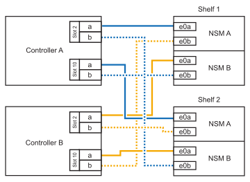

= Étapes détaillées - ASA 900
:allow-uri-read: 
:icons: font
:imagesdir: ../media/

[role="lead"]
Cette page fournit des instructions détaillées pour l'installation d'un système NetApp classique. Utilisez cet article si vous souhaitez obtenir des instructions d'installation plus détaillées.

== Étape 1 : préparer l'installation

Pour installer votre système, vous devez créer un compte sur le site de support NetApp, enregistrer votre système et obtenir les clés de licence. Vous devez également inventorier le nombre et le type de câbles appropriés pour votre système et collecter des informations réseau spécifiques.

Vous devez avoir accès au https://hwu.netapp.com["NetApp Hardware Universe"^] pour plus d'informations sur les exigences du site ainsi que sur les informations supplémentaires sur votre système configuré.

.Ce dont vous avez besoin
Vous pouvez également avoir accès au http://mysupport.netapp.com/documentation/productlibrary/index.html?productID=62286["Notes de version de ONTAP 9"^] Pour votre version de ONTAP pour plus d'informations sur ce système.

Vous devez fournir les informations suivantes sur votre site :

* Espace rack pour le système de stockage
* Tournevis Phillips n°2
* Câbles réseau supplémentaires pour connecter votre système à votre commutateur réseau et à votre ordinateur portable ou console avec un navigateur Web

.Étapes
. Déballez le contenu de toutes les boîtes.
. Notez le numéro de série du système depuis les contrôleurs.
+
image:../media/drw_ssn_label.svg["Exemple de numéro de série du système indiquant l'emplacement du numéro"]

. Faites un inventaire et notez le nombre et le type de câbles que vous avez reçus.
+
Le tableau suivant identifie les types de câbles que vous pouvez recevoir. Si vous recevez un câble non répertorié dans le tableau, reportez-vous à la Hardware Universe pour localiser le câble et identifier son utilisation.

+
https://hwu.netapp.com["NetApp Hardware Universe"^]

+
[cols="1,2,2,2"]
|===
| Type de câble... | Numéro de pièce et longueur | Type de connecteur | Pour... 

 a| 
Câble de données 25 GbE
 a| 
X66240A-05 (112-00639), 0,5 M.

X66240A-2 (112-00598), 2 M.

X66240A-5 (112-00600), 5 m
 a| 
image:../media/oie_cable_sfp_gbe_copper.png["SFP cuivre GbE"]
 a| 
Câble réseau

 a| 
FC 32 Gbit/s (SFP+ Op)
 a| 
X66250-2 (112-00342), 2 M.

X66250-5 (112-00344), 5 m

X66250-15 (112-00346), 15 M.
 a| 
image:../media/oie_cable_sfp_gbe_copper.png["SFP cuivre GbE"]
 a| 
Câble réseau optique FC

 a| 
Câble réseau 40 GbE
 a| 
X66100-1 (112-00542), 1 m

X66100-3 (112-00543), 3 m

X66100-5 (112-00544), 5 m
 a| 
image:../media/oie_cable100_gbe_qsfp28.png["Câble de 100 Go"]
 a| 
Données Ethernet, réseau en cluster

 a| 
Câble 100 GbE
 a| 
X66211B-1 (112-00573), 1 m

X66211B-2 (112-00574), 2 M.

X66211B-5 (112-00576), 5 m
 a| 
image:../media/oie_cable100_gbe_qsfp28.png["Câble de 100 Go"]
 a| 
Réseau,

Stockage NVMe,

Données Ethernet,

réseau de clusters

 a| 
Câbles optiques
 a| 
X66031A (112-00436), 1 m

X66032A (112-00437), 2 M.

X66033A (112-00438), 3 M.
 a| 
image:../media/oie_cable_fiber_lc_connector.png["Connecteur à fibre LC"]
 a| 
Réseau optique FC

 a| 
Cat 6, RJ-45 (selon la commande)
 a| 
Références X6585-R6 (112-00291), 3 m

X6562-R6 (112-00196), 5 m
 a| 
image:../media/oie_cable_rj45.png["Câbles RJ-45"]
 a| 
Réseau de gestion et données Ethernet

 a| 
Câble de console micro-USB
 a| 
Sans objet
 a| 
image:../media/oie_cable_micro_usb.png["Câble micro USB"]
 a| 
Connexion de la console pendant la configuration du logiciel sur un ordinateur portable/console autre que Windows ou Mac

 a| 
Câbles d'alimentation
 a| 
Sans objet
 a| 
image:../media/oie_cable_power.png["Câbles d'alimentation"]
 a| 
Mise sous tension du système

|===
. Vérifiez le https://library.netapp.com/ecm/ecm_download_file/ECMLP2862613["Guide de configuration de ONTAP"^] et recueillez les informations requises répertoriées dans ce guide.

== Étape 2 : installer le matériel de fixation

Vous devez installer votre système sur un rack de 4 montants ou une armoire système NetApp, le cas échéant.

. Installez les kits de rails, au besoin.
. Installez et sécurisez votre système en suivant les instructions fournies avec le kit de rails.
+

NOTE: Vous devez être conscient des problèmes de sécurité associés au poids du système.

+
image::../media/drw_9500_lifting_icon.svg[Étiquette de mise en garde relative au poids]

. Fixez les dispositifs de gestion des câbles (comme illustré).
+
image::../media/drw_9500_cable_management_arms.svg[Poignées de levage et dispositif de gestion des câbles]

. Placez le panneau à l'avant du système.

Le schéma suivant illustre à quoi ressemble un système type et où se trouvent les principaux composants à l'arrière du système :

image::../media/drw_a900_controller_in_chassis_ID_IEOPS-856.svg[Configuration type de cluster]

== Étape 3 : connectez les câbles des contrôleurs à votre réseau

Vous pouvez connecter les contrôleurs à votre réseau en utilisant la méthode de cluster sans commutateur à deux nœuds ou en utilisant le réseau d'interconnexion de cluster.

[role="tabbed-block"]
====
.Option 1 : cluster à 2 nœuds sans commutateur
--
Le réseau de gestion, le réseau de données et les ports de gestion des contrôleurs sont connectés aux commutateurs. Les ports d'interconnexion de cluster sont câblés sur les deux contrôleurs.

.Avant de commencer
Vous devez avoir contacté votre administrateur réseau pour obtenir des informations sur la connexion du système aux commutateurs.

Veillez à vérifier le sens des languettes de fixation du câble lors de l'insertion des câbles dans les orifices. Les languettes de fixation des câbles sont destinées à tous les ports de module réseau.

image:../media/oie_cable_pull_tab_up.svg["direction de la languette de tirage du câble"]

NOTE: Lorsque vous insérez le connecteur, vous devez le sentir en place ; si vous ne le sentez pas, retirez-le, tournez-le et réessayez.

. Utilisez l'animation ou l'illustration pour terminer le câblage entre les contrôleurs et les commutateurs :
+
.Animation : câblé à un cluster sans commutateur à deux nœuds
video::37419c37-f56f-48e5-8e6c-afa600095444[panopto]
+
image:../media/drw_a900_tnsc_network_cabling_IEOPS-933.svg["Câblage réseau à 2 nœuds sans commutateur"]

+
[cols="20%,80%"]
|===
| Étape | Effectuer des opérations sur chaque contrôleur 

 a| 
image:../media/icon_square_1_green.png["Légende numéro 1"]
 a| 
Câblage des ports d'interconnexion de cluster :

** Logements A4 et B4 (e4a)
** Fente A8 et B8 (e8a)

image:../media/oie_cable100_gbe_qsfp28.png["Câble de 100 Go"]

 a| 
image:../media/icon_square_2_yellow.png["Légende numéro 2"]
 a| 
Reliez les ports de gestion du contrôleur (clé en charge).

image:../media/oie_cable_rj45.png["Câbles RJ-45"]

 a| 
image:../media/icon_square_3_orange.png["Numéro de légende 3"]
 a| 
Câblage des commutateurs réseau 25 GbE :

Ports des logements A3 et B3 (e3a et e3c) et A9 et B9 (e9a et e9c) vers les commutateurs réseau 25 GbE.

image:../media/oie_cable_sfp_gbe_copper.png["SFP cuivre GbE"]

40 GbE commutateurs réseau hôte :

Reliez les ports b côté hôte dans les logements A4 et B4 (e4b) et A8 et B8 (e8b) au commutateur hôte.

image:../media/oie_cable100_gbe_qsfp28.png["Câble de 100 Go"]

 a| 
image:../media/icon_square_4_red.png["Numéro de légende 4"]
 a| 
Câbles de connexions FC 32 Gb :

Reliez les ports A5 et B5 (5a, 5b, 5c et 5d) et les connecteurs A7 et B7 (7a, 7b, 7c et 7d) aux commutateurs réseau FC 32 Gbit.

image:../media/oie_cable_sfp_gbe_copper.png["SFP cuivre GbE"]

 a| 
image:../media/icon_square_4_red.png["Légende cinq"]
 a| 
** Attachez les câbles aux bras de gestion des câbles (non illustrés).
** Connectez les câbles d'alimentation aux blocs d'alimentation et connectez-les à différentes sources d'alimentation (non illustrées). Les PSU 1 et 3 fournissent l'alimentation à tous les composants de la face A, tandis que les PSU2 et PSU4 fournissent l'alimentation à tous les composants de la face B.

|===

--
.Option 2 : cluster commuté
--
Le réseau de gestion, le réseau de données et les ports de gestion des contrôleurs sont connectés aux commutateurs. Les ports d'interconnexion de cluster et haute disponibilité sont câblés sur le commutateur de cluster/haute disponibilité.

.Avant de commencer
Vous devez avoir contacté votre administrateur réseau pour obtenir des informations sur la connexion du système aux commutateurs.

Veillez à vérifier le sens des languettes de fixation du câble lors de l'insertion des câbles dans les orifices. Les languettes de fixation des câbles sont destinées à tous les ports de module réseau.

image:../media/oie_cable_pull_tab_up.svg["direction de la languette de tirage du câble"]

NOTE: Lorsque vous insérez le connecteur, vous devez le sentir en place ; si vous ne le sentez pas, retirez-le, retournez-le et réessayez.

. Utilisez l'animation ou l'illustration pour terminer le câblage entre les contrôleurs et les commutateurs :
+
.Animation - câble a du bloc d'instruments commuté
video::61ec11ec-aa30-474a-87a5-afa60008b52b[panopto]
+
image:../media/drw_a900_switched_network_cabling_IEOPS-934.svg["largeur=500 px"]

+
[cols="20%,80%"]
|===
| Étape | Effectuer des opérations sur chaque contrôleur 

 a| 
image :../media/icon_square_1_green.png[
 a| 
Câblage des ports d'interconnexion de cluster a :

** Connecteurs A4 et B4 (e4a) sur le commutateur de réseau du cluster.
** Les connecteurs A8 et B8 (e8a) du commutateur de réseau du cluster.

image:../media/oie_cable100_gbe_qsfp28.png["Câble de 100 Go"]

 a| 
image:../media/icon_square_2_yellow.png["Légende numéro 2"]
 a| 
Reliez les ports de gestion du contrôleur (clé en charge).

image:../media/oie_cable_rj45.png["Câbles RJ-45"]

 a| 
image:../media/icon_square_3_orange.png["Numéro de légende 3"]
 a| 
Câble 25 GbE switchs réseau :

Ports des logements A3 et B3 (e3a et e3c) et A9 et B9 (e9a et e9c) vers les commutateurs réseau 25 GbE.

image:../media/oie_cable_sfp_gbe_copper.png["SFP cuivre GbE"]

40 GbE commutateurs réseau hôte :

Reliez les ports b côté hôte dans les logements A4 et B4 (e4b) et A8 et B8 (e8b) au commutateur hôte.

image:../media/oie_cable100_gbe_qsfp28.png["Câble de 100 Go"]

 a| 
image:../media/icon_square_4_red.png["Numéro de légende 4"]
 a| 
Câbles de connexions FC 32 Gb :

Reliez les ports A5 et B5 (5a, 5b, 5c et 5d) et les connecteurs A7 et B7 (7a, 7b, 7c et 7d) aux commutateurs réseau FC 32 Gbit.

image:../media/oie_cable_sfp_gbe_copper.png["SFP cuivre GbE"]

 a| 
image:../media/icon_square_4_red.png["Légende cinq"]
 a| 
** Attachez les câbles aux bras de gestion des câbles (non illustrés).
** Connectez les câbles d'alimentation aux blocs d'alimentation et connectez-les à différentes sources d'alimentation (non illustrées). Les PSU 1 et 3 fournissent l'alimentation à tous les composants de la face A, tandis que les PSU2 et PSU4 fournissent l'alimentation à tous les composants de la face B.

image:../media/oie_cable_power.png["Câbles d'alimentation"]

image:../media/drw_a900fas9500_power_icon_IEOPS-1142.svg["largeur=200px"]

|===

--
====

== Étape 4 : câblage des contrôleurs aux tiroirs disques

Reliez un tiroir de disque NS224 ou deux tiroirs de disques NS224 à vos contrôleurs.

[role="tabbed-block"]
====
.Option 1 : connectez les contrôleurs à un seul tiroir disque NS224
--
Vous devez connecter chaque contrôleur aux modules NSM du tiroir de disque NS224.

.Avant de commencer
* Assurez-vous de vérifier que la flèche de l'illustration indique l'orientation correcte du connecteur de câble à languette. La languette de retrait des câbles des modules de stockage est vers le haut, tandis que les languettes de retrait des étagères sont vers le bas.

image:../media/oie_cable_pull_tab_up.svg["direction de la languette de tirage du câble"]

image:../media/oie_cable_pull_tab_down.svg["largeur=200px"]

NOTE: Lorsque vous insérez le connecteur, vous devez le sentir en place ; si vous ne le sentez pas, retirez-le, tournez-le et réessayez.

. Utilisez l'animation ou les dessins suivants pour connecter les contrôleurs à un seul tiroir de disque NS224.
+
.Animation : raccorder un seul tiroir NS224
video::8d8b45cd-bd8f-4fab-a4fa-afa5017e7b72[panopto]
+
image:../media/drw_a900_NS224_one shelf_cabling_IEOPS-937.svg["largeur=500 px"]

+
[cols="20%,80%"]
|===
| Étape | Effectuer des opérations sur chaque contrôleur 

 a| 
image:../media/icon_square_1_blue.png["Légende numéro 1"]
 a| 
** Connectez le port e2a du contrôleur au port e0a du NSM A du shelf.
** Connectez le port e10b du contrôleur A au port e0b sur le NSM B du tiroir.

image:../media/oie_cable100_gbe_qsfp28.png["largeur=50px"]

Câble 100 GbE

 a| 
image:../media/icon_square_2_yellow.png["Légende numéro 1"]
 a| 
** Connectez le port e2a du contrôleur B au port e0a du NSM B du shelf.
** Connectez le port e10b du contrôleur B au port e0b sur le NSM A du tiroir.

image:../media/oie_cable100_gbe_qsfp28.png["largeur=50px"]

Câble 100 GbE

|===

--
.Option 2 : connectez les contrôleurs à deux tiroirs disques NS224
--
Vous devez connecter chaque contrôleur aux modules NSM des tiroirs disques NS224.

.Avant de commencer
* Assurez-vous de vérifier que la flèche de l'illustration indique l'orientation correcte du connecteur de câble à languette. La languette de retrait des câbles des modules de stockage est vers le haut, tandis que les languettes de retrait des étagères sont vers le bas.

image:../media/oie_cable_pull_tab_up.svg["direction de la languette de tirage du câble"]

image:../media/oie_cable_pull_tab_down.svg["largeur=200px"]

NOTE: Lorsque vous insérez le connecteur, vous devez le sentir en place ; si vous ne le sentez pas, retirez-le, tournez-le et réessayez.

. Utilisez l'animation ou le schéma ci-dessous pour connecter les câbles du contrôleur à deux tiroirs disques NS224.
+
.Animation : raccorder deux clayettes NS224
video::ec143c32-9e4b-47e5-893e-afa5017da6b4[panopto]
+

+
image:../media/drw_a900_NS224_two_shelf_cabling_IEOPS-938.svg["largeur=500 px"]

+
[cols="20%,80%"]
|===
| Étape | Effectuer des opérations sur chaque contrôleur 

 a| 
image:../media/icon_square_1_blue.png["Légende numéro 1"]
 a| 
** Connectez le port e2a du contrôleur à NSM A e0a sur le tiroir 1.
** Connectez le port e10b du contrôleur A au port NSM B e0b sur le tiroir 1.
** Connectez le port e2b du contrôleur A au port NSM B e0b sur le tiroir 2.
** Connectez le port e10a du contrôleur a à NSM A e0a sur le tiroir 2.

image:../media/oie_cable100_gbe_qsfp28.png["largeur=50px"]

Câble 100 GbE

 a| 
image:../media/icon_square_2_yellow.png["largeur=30px"]
 a| 
** Connectez le port e2a du contrôleur B au NSM B e0a du tiroir 1.
** Connectez le port e10b du contrôleur B au NSM A e0b sur le tiroir 1.
** Connectez le port du contrôleur B e2b au NSM A e0b sur le tiroir 2.
** Brancher le port e10a du contrôleur B sur le NSM B e0a du tiroir 2.

image:../media/oie_cable100_gbe_qsfp28.png["largeur=50px"]

Câble 100 GbE

|===

--
====

== Étape 5 : installation et configuration complètes du système

Vous pouvez effectuer la configuration et l'installation du système en utilisant la découverte de cluster uniquement avec une connexion au commutateur et à l'ordinateur portable, ou en vous connectant directement à un contrôleur du système, puis en vous connectant au commutateur de gestion.

[role="tabbed-block"]
====
.Option 1 : si la détection réseau est activée
--
Si la détection réseau est activée sur votre ordinateur portable, vous pouvez effectuer l'installation et la configuration du système à l'aide de la détection automatique des clusters.

. Utilisez l'animation ou la mise en plan suivante pour définir un ou plusieurs ID de tiroir disque :
+
Les étagères NS224 sont pré-définies pour les ID de tiroir 00 et 01. Si vous souhaitez modifier les ID de tiroir, vous devez créer un outil pour l'insérer dans le trou où se trouve le bouton. Pour link:../ns224/change-shelf-id.html["Modifiez l'ID de tiroir NS224"]des instructions détaillées, reportez-vous à la section.

+
.Animation : définissez les ID de tiroirs de disques NVMe
video::95a29da1-faa3-4ceb-8a0b-ac7600675aa6[panopto]
+
image:../media/drw_a900_oie_change_ns224_shelf_ID_ieops-836.svg["Modifiez l'ID de tiroir"]

+
[cols="20%,80%"]
|===

 a| 
image:../media/icon_round_1.png["Légende numéro 1"]
 a| 
Capuchon d'extrémité de tablette

 a| 
image:../media/icon_round_2.png["Légende numéro 2"]
 a| 
Plateau de tablette

 a| 
image:../media/icon_round_3.png["Numéro de légende 3"]
 a| 
LED de l'ID de tiroir

 a| 
image:../media/icon_round_4.png["Numéro de légende 4"]
 a| 
Bouton de configuration de l'ID de tiroir

|===
. Mettez les boutons marche/arrêt sur les alimentations des deux nœuds.
+
.Animation : mettez les contrôleurs sous tension
video::a905e56e-c995-4704-9673-adfa0005a891[panopto]
+
image:../media/drw_a900_power-on_IEOPS-941.svg["largeur=500 px"]

+

NOTE: Le démarrage initial peut prendre jusqu'à huit minutes.

. Assurez-vous que la détection réseau de votre ordinateur portable est activée.
+
Consultez l'aide en ligne de votre ordinateur portable pour plus d'informations.

. Utilisez l'animation suivante pour connecter votre ordinateur portable au commutateur de gestion.
+
.Animation : connectez votre ordinateur portable au commutateur de gestion
video::d61f983e-f911-4b76-8b3a-ab1b0066909b[panopto]
+
image:../media/dwr_laptop_to_switch_only.svg["largeur=500 px"]

. Sélectionnez une icône ONTAP pour découvrir :
+
image:../media/drw_autodiscovery_controler_select.svg["largeur=500 px"]

+
.. Ouvrez l'Explorateur de fichiers.
.. Cliquez sur réseau dans le volet gauche.
.. Cliquez avec le bouton droit de la souris et sélectionnez Actualiser.
.. Double-cliquez sur l'une des icônes ONTAP et acceptez les certificats affichés à l'écran.
+

NOTE: XXXXX est le numéro de série du système du nœud cible.

+
System Manager s'ouvre.

. Utilisez la configuration assistée de System Manager pour configurer votre système à l'aide des données collectées dans le https://library.netapp.com/ecm/ecm_download_file/ECMLP2862613["Guide de configuration de ONTAP"^].
. Configurez votre compte et téléchargez Active IQ Config Advisor :
+
.. Connectez-vous à votre compte existant ou créez un compte.
+
https://mysupport.netapp.com/eservice/public/now.do["Inscription au support NetApp"^]

.. Enregistrez votre système.
+
https://mysupport.netapp.com/eservice/registerSNoAction.do?moduleName=RegisterMyProduct["Enregistrement de produit NetApp"^]

.. Téléchargez Active IQ Config Advisor.
+
https://mysupport.netapp.com/site/tools/tool-eula/activeiq-configadvisor["Téléchargement NetApp : Config Advisor"^]

. Vérifiez l'état de santé de votre système en exécutant Config Advisor.
. Une fois la configuration initiale terminée, passez à la https://www.netapp.com/data-management/oncommand-system-documentation/["ONTAP  ; Ressources de documentation ONTAP System Manager"^] Pour plus d'informations sur la configuration de fonctionnalités supplémentaires dans ONTAP.

--
.Option 2 : si la détection réseau n'est pas activée
--
Si vous n'utilisez pas un ordinateur portable ou une console Windows ou Mac ou si la détection automatique n'est pas activée, vous devez terminer la configuration et la configuration à l'aide de cette tâche.

. Branchez et configurez votre ordinateur portable ou votre console :
+
.. Définissez le port de console de l'ordinateur portable ou de la console sur 115,200 bauds avec N-8-1.
+

NOTE: Consultez l'aide en ligne de votre ordinateur portable ou de votre console pour savoir comment configurer le port de console.

.. Connectez le câble de la console à l'ordinateur portable ou à la console à l'aide du câble de console fourni avec le système, puis connectez l'ordinateur portable au commutateur de gestion du sous-réseau de gestion.
+
image:../media/drw_a900_cable_console_switch_controller_IEOPS-953.svg["Connexion du câble de la console"]

.. Attribuez une adresse TCP/IP à l'ordinateur portable ou à la console à l'aide d'une adresse située sur le sous-réseau de gestion.

. Utilisez l'animation suivante pour définir un ou plusieurs ID de tiroir disque :
+
Les étagères NS224 sont pré-définies pour les ID de tiroir 00 et 01. Si vous souhaitez modifier les ID de tiroir, vous devez créer un outil pour l'insérer dans le trou où se trouve le bouton. Pour link:../ns224/change-shelf-id.html["Modifiez l'ID de tiroir NS224"]des instructions détaillées, reportez-vous à la section.

+
.Animation : définissez les ID de tiroirs de disques NVMe
video::95a29da1-faa3-4ceb-8a0b-ac7600675aa6[panopto]
+
image:../media/drw_a900_oie_change_ns224_shelf_ID_ieops-836.svg["Modifiez l'ID de tiroir"]

+
[cols="1,5"]
|===

 a| 
image:../media/icon_round_1.png["Légende numéro 1"]
 a| 
Capuchon d'extrémité de tablette

 a| 
image:../media/icon_round_2.png["Légende numéro 2"]
 a| 
Plateau de tablette

 a| 
image:../media/icon_round_3.png["Numéro de légende 3"]
 a| 
LED de l'ID de tiroir

 a| 
image:../media/icon_round_4.png["Numéro de légende 4"]
 a| 
Bouton de configuration de l'ID de tiroir

|===
. Mettez les boutons marche/arrêt sur les alimentations des deux nœuds.
+
.Animation : mettez les contrôleurs sous tension
video::bb04eb23-aa0c-4821-a87d-ab2300477f8b[panopto]
+
Image :[numéro de légende 1] drw_a900_POWER-on_IEOPS-941.svg[largeur=500px]

+

NOTE: Le démarrage initial peut prendre jusqu'à huit minutes.

. Attribuez une adresse IP initiale de gestion des nœuds à l'un des nœuds.
+
[cols="20%,80%"]
|===
| Si le réseau de gestion dispose de DHCP... | Alors... 

 a| 
Configuré
 a| 
Notez l'adresse IP attribuée aux nouveaux contrôleurs.

 a| 
Non configuré
 a| 
.. Ouvrez une session de console à l'aide de PuTTY, d'un serveur de terminal ou de l'équivalent pour votre environnement.
+

NOTE: Consultez l'aide en ligne de votre ordinateur portable ou de votre console si vous ne savez pas comment configurer PuTTY.

.. Saisissez l'adresse IP de gestion lorsque le script vous y invite.

|===
. Utilisez System Manager sur votre ordinateur portable ou sur la console pour configurer votre cluster :
+
.. Indiquez l'adresse IP de gestion des nœuds dans votre navigateur.
+

NOTE: Le format de l'adresse est +https://x.x.x.x+.

.. Configurez le système à l'aide des données que vous avez collectées dans https://library.netapp.com/ecm/ecm_download_file/ECMLP2862613["Guide de configuration de ONTAP"^]

. Configurez votre compte et téléchargez Active IQ Config Advisor :
+
.. Connectez-vous à votre compte existant ou créez un compte.
+
https://mysupport.netapp.com/eservice/public/now.do["Inscription au support NetApp"^]

.. Enregistrez votre système.
+
https://mysupport.netapp.com/eservice/registerSNoAction.do?moduleName=RegisterMyProduct["Enregistrement de produit NetApp"^]

.. Téléchargez Active IQ Config Advisor.
+
https://mysupport.netapp.com/site/tools/tool-eula/activeiq-configadvisor["Téléchargement NetApp : Config Advisor"^]

. Vérifiez l'état de santé de votre système en exécutant Config Advisor.
. Une fois la configuration initiale terminée, passez à la https://www.netapp.com/data-management/oncommand-system-documentation/["ONTAP  ; Ressources de documentation ONTAP System Manager"^] Pour plus d'informations sur la configuration de fonctionnalités supplémentaires dans ONTAP.

--
====