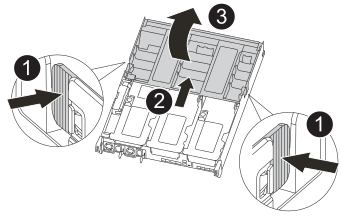

= Remplacez le support de démarrage - AFF C400
:allow-uri-read: 
:icons: font
:imagesdir: ../media/

[role="lead"]
Pour remplacer le support de démarrage, vous devez retirer le module de contrôleur endommagé, installer le support de démarrage de remplacement et transférer l'image de démarrage sur une clé USB.

== Étape 1 : retirer le module de contrôleur

Pour accéder aux composants à l'intérieur du module de contrôleur, vous devez retirer le module de contrôleur du châssis.

.Étapes
. Si vous n'êtes pas déjà mis à la terre, mettez-vous à la terre correctement.
. Libérez les dispositifs de retenue du câble d'alimentation, puis débranchez les câbles des blocs d'alimentation.
. Desserrez le crochet et la bride de boucle qui relient les câbles au périphérique de gestion des câbles, puis débranchez les câbles système et les SFP (si nécessaire) du module de contrôleur, en maintenant une trace de l'emplacement où les câbles ont été connectés.
+
Laissez les câbles dans le périphérique de gestion des câbles de sorte que lorsque vous réinstallez le périphérique de gestion des câbles, les câbles sont organisés.

. Retirez le périphérique de gestion des câbles du module de contrôleur et mettez-le de côté.
. Appuyez sur les deux loquets de verrouillage, puis faites pivoter les deux loquets vers le bas en même temps.
+
Le module de contrôleur se déplace légèrement hors du châssis.

+
image::../media/drw_c400_remove_controller_IEOPS-1216.svg[drw c400 retirer le contrôleur IEOPS 1216]

+
[cols="10,90"]
|===

 a| 
image:../media/legend_icon_01.png["Légende numéro 1"]
 a| 
Loquets de verrouillage

 a| 
image:../media/legend_icon_02.png["Légende numéro 2"]
 a| 
Le contrôleur sort légèrement du châssis

|===
. Faites glisser le module de contrôleur hors du châssis.
+
Assurez-vous de prendre en charge la partie inférieure du module de contrôleur lorsque vous le faites glisser hors du châssis.

. Placez le module de commande sur une surface plane et stable.

== Étape 2 : remplacer le support de démarrage

Vous devez localiser le support de démarrage dans le module de contrôleur (voir le mappage des FRU sur le module de contrôleur), puis suivre les instructions pour le remplacer.

.Avant de commencer
Bien que le contenu du support de démarrage soit chiffré, il est conseillé d'effacer le contenu du support de démarrage avant de le remplacer. Pour plus d'informations, reportez-vous à la section https://mysupport.netapp.com/info/web/ECMP1132988.html["Rapport de volatilité"] De votre système sur le site de support NetApp.

NOTE: Vous devez vous connecter sur le site de support NetApp pour afficher le _Statement of Volatility_ pour votre système.

Vous pouvez utiliser l'animation, l'illustration ou les étapes écrites suivantes pour remplacer le support de démarrage.

.Animation : remplacez le support de démarrage
video::bb4d91d7-2be1-44d8-ba18-afcf01681872[panopto]
.Étapes
. Ouvrir le conduit d'air :
+

+
[cols="10,90"]
|===

 a| 
image:../media/legend_icon_01.png["Légende numéro 1"]
 a| 
Languettes de verrouillage

 a| 
image:../media/legend_icon_02.png["Légende numéro 2"]
 a| 
Faire glisser le conduit d'air vers l'arrière du contrôleur

 a| 
image::../media/legend_icon_03.png[icône de légende 03]
 a| 
Tourner le conduit d'air vers le haut

|===
+
.. Appuyer sur les pattes de verrouillage situées sur les côtés du conduit d'air vers le milieu du module de commande.
.. Faites glisser le conduit d'air vers l'arrière du module de commande, puis faites-le pivoter vers le haut jusqu'à sa position complètement ouverte.

. Recherchez et retirez le support de démarrage du module de contrôleur :
+
image::../media/drw_c400_replace_boot_media_IEOPS-1217.svg[drw c400 remplacer le support de démarrage IOPS 1217]

+
[cols="10,90"]
|===

 a| 
image:../media/legend_icon_01.png["Légende numéro 1"]
 a| 
Appuyez sur le bouton bleu

 a| 
image:../media/legend_icon_02.png["Légende numéro 2"]
 a| 
Faites pivoter le support de démarrage vers le haut et retirez-le du support

|===
+
.. Appuyez sur le bouton bleu à l'extrémité du support de démarrage jusqu'à ce que le rebord du support de démarrage disparaisse du bouton bleu.
.. Faites pivoter le support de démarrage vers le haut et retirez doucement le support de démarrage du support.

. Alignez les bords du support de démarrage de remplacement avec le support de démarrage, puis poussez-le doucement dans le support.
. Vérifiez le support de démarrage pour vous assurer qu'il est bien en place dans le support.
+
Si nécessaire, retirez le support de démarrage et réinstallez-le dans le support.

. Verrouillez le support de démarrage en place :
+
.. Faites pivoter le support de démarrage vers le bas, vers la carte mère.
.. En plaçant un doigt à l'extrémité du support de démarrage par le bouton bleu, appuyez sur l'extrémité du support de démarrage pour engager le bouton de verrouillage bleu.
.. Tout en appuyant sur le support de démarrage, soulevez le bouton de verrouillage bleu pour verrouiller le support de démarrage en place.

. Fermer le conduit d'air.

== Étape 3 : transférez l'image de démarrage sur le support de démarrage

Le support de démarrage de remplacement que vous avez installé ne dispose pas d'une image d'amorçage. Vous devez donc transférer une image d'amorçage à l'aide d'un lecteur flash USB.

.Avant de commencer
* Vous devez disposer d'une clé USB, formatée en MBR/FAT32, avec au moins 4 Go de capacité
* Copie de la même version d'image de ONTAP que celle du contrôleur avec facultés affaiblies. Vous pouvez télécharger l'image appropriée depuis la section Downloads du site de support NetApp
+
** Si NVE est activé, téléchargez l'image avec NetApp Volume Encryption, comme indiqué sur le bouton de téléchargement.
** Si NVE n'est pas activé, téléchargez l'image sans NetApp Volume Encryption, comme indiqué sur le bouton de téléchargement.

* Si votre système est une paire haute disponibilité, vous devez disposer d'une connexion réseau.
* Si votre système est un système autonome, vous n'avez pas besoin d'une connexion réseau, mais vous devez procéder à un redémarrage supplémentaire lors de la restauration du système `var` système de fichiers.

.Étapes
. Téléchargez et copiez l'image de service appropriée depuis le site de support NetApp vers le lecteur Flash USB.
+
.. Téléchargez l'image du service sur votre espace de travail sur votre ordinateur portable.
.. Décompressez l'image du service.
+

NOTE: Si vous extrayez le contenu à l'aide de Windows, n'utilisez pas WinZip pour extraire l'image netboot. Utilisez un autre outil d'extraction, tel que 7-Zip ou WinRAR.

+
Le fichier image du service décompressé contient deux dossiers :

+
*** `boot`
*** `efi`

.. Copiez le `efi` Dossier dans le répertoire supérieur de la clé USB.
+
Le lecteur flash USB doit avoir le dossier efi et la même version BIOS (Service image) de ce que le contrôleur douteux est en cours d'exécution.

.. Retirez la clé USB de votre ordinateur portable.

. Si ce n'est déjà fait, fermer le conduit d'air.
. Alignez l'extrémité du module de contrôleur avec l'ouverture du châssis, puis poussez doucement le module de contrôleur à mi-course dans le système.
. Réinstallez le périphérique de gestion des câbles et recâblage du système, selon les besoins.
+
Lors du retrait, n'oubliez pas de réinstaller les convertisseurs de support (SFP ou QSFP) s'ils ont été retirés.

. Branchez le câble d'alimentation dans le bloc d'alimentation et réinstallez le dispositif de retenue du câble d'alimentation.
. Insérez la clé USB dans le logement USB du module de contrôleur.
+
Assurez-vous d'installer le lecteur flash USB dans le logement étiqueté pour périphériques USB et non dans le port de console USB.

. Terminez l'installation du module de contrôleur :
+
.. Branchez le cordon d'alimentation dans le bloc d'alimentation, réinstallez le collier de verrouillage du câble d'alimentation, puis connectez le bloc d'alimentation à la source d'alimentation.
.. Poussez fermement le module de contrôleur dans le châssis jusqu'à ce qu'il rencontre le fond de panier central et qu'il soit bien en place.
+
Les loquets de verrouillage se montent lorsque le module de contrôleur est bien en place.

+

NOTE: Ne forcez pas trop lorsque vous faites glisser le module de contrôleur dans le châssis pour éviter d'endommager les connecteurs.

+
Le module de contrôleur commence à démarrer dès qu'il est complètement inséré dans le châssis. Soyez prêt à interrompre le processus de démarrage.

.. Faites pivoter les loquets de verrouillage vers le haut, inclinez-les de manière à dégager les goupilles de verrouillage, puis abaissez-les en position verrouillée.
.. Si ce n'est déjà fait, réinstallez le périphérique de gestion des câbles.

. Interrompez le processus de démarrage en appuyant sur Ctrl-C pour vous arrêter à l'invite DU CHARGEUR.
+
Si ce message ne vous est pas manquer, appuyez sur Ctrl-C, sélectionnez l'option pour démarrer en mode maintenance, puis `halt` Contrôleur à démarrer sur LE CHARGEUR.

. Si le contrôleur est en mode MetroCluster Stretch ou Fabric-Attached, vous devez restaurer la configuration de l'adaptateur FC :
+
.. Démarrage en mode maintenance : `boot_ontap maint`
.. Définissez les ports MetroCluster comme initiateurs : `ucadmin modify -m fc -t _initiator adapter_name_`
.. Arrêter pour revenir en mode maintenance : `halt`

+
Les modifications seront mises en œuvre au démarrage du système.

