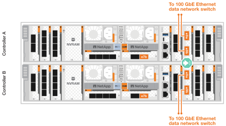

= Câbler le matériel - AFF C80
:allow-uri-read: 
:icons: font
:imagesdir: ../media/

[role="lead"]
Une fois le matériel rack du système de stockage AFF C80 installé, installez les câbles réseau des contrôleurs et connectez les câbles entre les contrôleurs et les tiroirs de stockage.

.Avant de commencer
Pour plus d'informations sur la connexion du système de stockage aux commutateurs, contactez votre administrateur réseau.

.Description de la tâche
* Ces procédures présentent les configurations courantes. Le câblage spécifique dépend des composants commandés pour votre système de stockage. Pour obtenir des détails complets sur la configuration et la priorité des emplacements, reportez-vous à la section link:https://hwu.netapp.com["NetApp Hardware Universe"^].
* Les connecteurs d'E/S d'un contrôleur AFF C80 sont numérotés de 1 à 11.
+
image::../media/drw_a1K_back_slots_labeled_ieops-2162.svg[Numérotation des logements sur un contrôleur AFF C80]

* Les graphiques de câblage sont dotés d'icônes de flèche indiquant l'orientation correcte (vers le haut ou vers le bas) de la languette du connecteur de câble lors de l'insertion d'un connecteur dans un port.
+
Lorsque vous insérez le connecteur, vous devez le sentir en place ; si vous ne le sentez pas, retirez-le, retournez-le et réessayez.

+
image::../media/drw_cable_pull_tab_direction_ieops-1699.svg[Exemple d'orientation de la languette de tirage du câble]

* Si vous effectuez un câblage vers un commutateur optique, insérez l'émetteur-récepteur optique dans le port du contrôleur avant de le connecter au port du commutateur.

== Étape 1 : câblez les connexions du cluster/haute disponibilité

Connectez les contrôleurs au cluster ONTAP. Cette procédure varie en fonction du modèle de votre système de stockage et de la configuration de votre module d'E/S.

NOTE: Le trafic d'interconnexion de cluster et le trafic haute disponibilité partagent les mêmes ports physiques.

[role="tabbed-block"]
====
.Câblage switchless cluster Cabling
--
Utilisez le câble d'interconnexion cluster/haute disponibilité pour connecter les ports e1a à e1a et les ports e7a à e7a.

.Étapes
. Connectez le port e1a du contrôleur A au port e1a du contrôleur B.
. Connectez le port e7a du contrôleur A au port e7a du contrôleur B.
+
*Câbles d'interconnexion cluster/haute disponibilité*

+

+
image::../media/drw_a1k_tnsc_cluster_cabling_ieops-1648.svg[Schéma de câblage d'un cluster sans commutateur à 2 nœuds]

--
.Câblage commuté du cluster
--
Utilisez le câble 100 GbE pour connecter les ports e1a et e7a des contrôleurs A et B aux commutateurs réseau en cluster A et B. .Étapes . Connectez le port e1a du contrôleur A et le port e1a du contrôleur B au commutateur réseau du cluster A. . Connectez le port e7a du contrôleur A et le port e7a du contrôleur B au commutateur réseau du cluster B.

+ *câble 100 GbE*

image::../media/oie_cable100_gbe_qsfp28.png[Câble de 100 Go]

image::../media/drw_70-90_switched_cluster_cabling_ieops-1657.svg[Reliez les connexions du cluster au réseau du cluster]

--
====

== Étape 2 : câblez les connexions réseau de l'hôte

Connectez les ports du module Ethernet à votre réseau hôte.

Voici quelques exemples types de câblage réseau hôte. Reportez-vous à la section link:https://hwu.netapp.com["NetApp Hardware Universe"^] pour connaître la configuration spécifique de votre système.

.Étapes
. Connectez les ports e9a et e9b à votre commutateur de réseau de données Ethernet.
+

NOTE: N'utilisez pas les ports e1b et e7b pour les connexions réseau hôte. Utilisez une carte hôte distincte.

+
*Câble 100 GbE*

+
image::../media/oie_cable_sfp_gbe_copper.png[Câble Ethernet 100 Gb]

+

. Connectez vos commutateurs de réseau hôte 10/25 GbE.
+
*4 ports, hôte 10/25 GbE*

+
image::../media/oie_cable_sfp_gbe_copper.png[Câble Ethernet 10 Gb]

+
image::../media/drw_70-90_network_cabling2_ieops-1655.svg[Câble vers un réseau Ethernet 10 Gb]

== Étape 3 : branchement des câbles du réseau de gestion

Utilisez les câbles 1000BASE-T RJ-45 pour connecter les ports de gestion (clé anglaise) de chaque contrôleur aux commutateurs du réseau de gestion.

*CÂBLES 1000BASE-T RJ-45*

image::../media/oie_cable_rj45.png[Câbles RJ-45]

image::../media/drw_70-90_management_connection_ieops-1656.svg[Connectez-vous à votre réseau de gestion]

IMPORTANT: Ne branchez pas encore les cordons d'alimentation.

== Étape 4 : branchement des tiroirs sur le câble

Les procédures de câblage suivantes indiquent comment connecter les contrôleurs à un tiroir de stockage. Choisissez l'une des options de câblage suivantes correspondant à votre configuration.

Pour connaître le nombre maximum de tiroirs pris en charge par votre système de stockage et pour toutes vos options de câblage, reportez-vous à link:https://hwu.netapp.com["NetApp Hardware Universe"^]la section .

[role="tabbed-block"]
====
.Option 1 : un tiroir de stockage NS224
--
Connectez chaque contrôleur aux modules NSM du tiroir NS224. Les graphiques présentent le câblage du contrôleur A en bleu et le câblage du contrôleur B en jaune.

*Câbles en cuivre QSFP28 100 GbE*

image::../media/oie_cable100_gbe_qsfp28.png[Câble en cuivre QSFP28 à 100 GbE]

.Étapes
. Connectez le port e11a du contrôleur A au port e0a du NSM A.
. Connectez le port e11b du contrôleur A au port NSM B e0b.
+
image:../media/drw_a70-90_1shelf_cabling_a_ieops-1731.svg["Contrôleur A e11a et e11b vers un seul tiroir NS224"]

. Connectez le port e11a du contrôleur B au port e0a du NSM B.
. Connectez le port e11b du contrôleur B au port e0b de la carte NSM A.
+
image:../media/drw_a70-90_1shelf_cabling_b_ieops-1732.svg["Contrôleur B e11a et e11b vers un seul tiroir NS224"]

--
.Option 2 : deux tiroirs de stockage NS224
--
Connectez chaque contrôleur aux modules NSM des deux tiroirs NS224. Les graphiques présentent le câblage du contrôleur A en bleu et le câblage du contrôleur B en jaune.

*Câbles en cuivre QSFP28 100 GbE*

image::../media/oie_cable100_gbe_qsfp28.png[Câble en cuivre QSFP28 à 100 GbE]

.Étapes
. Sur le contrôleur A, connecter les ports suivants :
+
.. Connectez le port e11a au port e0a du tiroir 1, NSM A.
.. Connectez le port e11b au tiroir 2, port NSM B e0b.
.. Connectez le port e8a au port e0a du tiroir 2, NSM A.
.. Connectez le port e8b au port e0b du tiroir 1, NSM B.
+
image:../media/drw_a70-90_2shelf_cabling_a_ieops-1733.svg["Connexions contrôleur à tiroir pour le contrôleur A"]

. Sur le contrôleur B, connecter les ports suivants :
+
.. Connectez le port e11a au port e0a du tiroir 1, NSM B.
.. Connectez le port e11b au port e0b du tiroir 2, NSM A.
.. Connectez le port e8a au port e0a du tiroir 2, NSM B.
.. Connectez le port e8b au port e0b du tiroir 1, NSM A.
+
image:../media/drw_a70-90_2shelf_cabling_b_ieops-1734.svg["Connexions contrôleur à tiroir pour le contrôleur B."]

--
====
.Et la suite ?
Après avoir câblé le matériel de votre système AFF C80, vous link:install-power-hardware.html["Mettez le système de stockage AFF C80 sous tension"].
