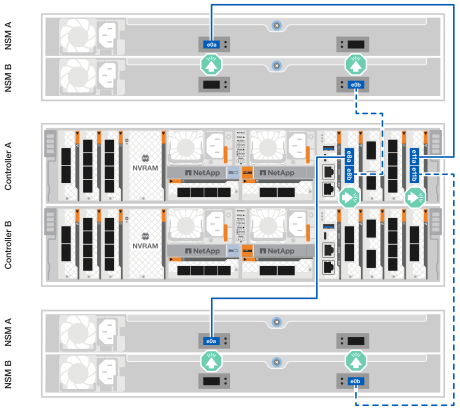

= Câbler le matériel - AFF C80
:allow-uri-read: 
:icons: font
:imagesdir: ../media/

[role="lead"]
Une fois le matériel rack du système de stockage AFF C80 installé, installez les câbles réseau des contrôleurs et connectez les câbles entre les contrôleurs et les tiroirs de stockage.

.Avant de commencer
Vérifiez la flèche d'illustration dans les schémas de câblage pour connaître l'orientation correcte de la languette de retrait du connecteur de câble.

image::../media/drw_cable_pull_tab_direction_ieops-1699.svg[Exemple d'orientation de la languette de tirage du câble]

* Lorsque vous insérez le connecteur, vous devez le sentir en place. Si vous ne le sentez pas, retirez-le, retournez la tête du câble et réessayez.
* Si vous vous connectez à un commutateur optique, insérez l'émetteur-récepteur enfichable à petit facteur de forme (SFP) dans le port du contrôleur avant de le connecter au port.

== Étape 1 : connectez les contrôleurs de stockage à votre réseau

Connectez les contrôleurs de stockage à votre réseau hôte.

.Avant de commencer
Pour plus d'informations sur la connexion du système de stockage aux commutateurs, contactez votre administrateur réseau.

.Description de la tâche
Ces procédures présentent les configurations courantes. N'oubliez pas que le câblage spécifique dépend des composants commandés pour votre système de stockage. Pour obtenir des détails complets sur la configuration et la priorité des emplacements, reportez-vous à la section link:https://hwu.netapp.com["NetApp Hardware Universe"^].

[role="tabbed-block"]
====
.Option 1 : cluster ONTAP sans switch
--
Connectez vos contrôleurs de stockage pour créer des connexions de cluster ONTAP, puis connectez les ports Ethernet de chaque contrôleur au réseau hôte.

.Étapes
. Utilisez le câble d'interconnexion cluster/haute disponibilité pour connecter les ports e1a à e1a et les ports e7a à e7a.
+

NOTE: Le trafic d'interconnexion de cluster et le trafic haute disponibilité partagent les mêmes ports physiques.

+
.. Connectez le port e1a du contrôleur A au port e1a du contrôleur B.
.. Connectez le port e7a du contrôleur A au port e7a du contrôleur B.
+
*Câbles d'interconnexion cluster/haute disponibilité*

+
image::../media/oie_cable_25Gb_Ethernet_SFP28_IEOPS-1069.svg[Câble haute disponibilité du cluster]

+
image::../media/drw_70-90_tnsc_cluster_cabling_ieops-1653.svg[Schéma de câblage d'un cluster sans commutateur à 2 nœuds]

. Connectez les ports du module Ethernet à votre réseau hôte.
+
Voici quelques exemples types de câblage réseau hôte. Reportez-vous à la section link:https://hwu.netapp.com["NetApp Hardware Universe"^] pour connaître la configuration spécifique de votre système.

+
.. Connectez les ports e9a et e9b à votre commutateur de réseau de données Ethernet, comme illustré.
+

NOTE: Pour optimiser les performances du système pour le trafic de cluster et haute disponibilité, n'utilisez pas les ports e1b et e7b pour les connexions réseau hôte. Utilisez une carte hôte séparée pour optimiser les performances.

+
*Câble 100 GbE*

+
image::../media/oie_cable_sfp_gbe_copper.png[Câble Ethernet 100 Gb]

+
image::../media/drw_70-90_network_cabling1_ieops-1654.svg[Câble vers un réseau Ethernet 100 Gb]

.. Connectez vos commutateurs de réseau hôte 10/25 GbE.
+
*4 ports, hôte 10/25 GbE*

+
image::../media/oie_cable_sfp_gbe_copper.png[Câble de 10/25 Go]

+
image::../media/drw_70-90_network_cabling2_ieops-1655.svg[Câble vers un réseau Ethernet 100 Gb]

. Utilisez les câbles 1000BASE-T RJ-45 pour connecter les ports de gestion du contrôleur (clé anglaise) aux commutateurs du réseau de gestion.
+
image::../media/oie_cable_rj45.png[Câbles RJ45]

+
*CÂBLES 1000BASE-T RJ-45*

+
image::../media/drw_70-90_management_connection_ieops-1656.svg[Connectez-vous à votre réseau de gestion]

IMPORTANT: Ne branchez pas encore les cordons d'alimentation.

--
.Option 2 : cluster ONTAP commuté
--
Connectez vos contrôleurs de stockage aux switchs réseau en cluster pour créer les connexions en cluster ONTAP, puis connectez les ports Ethernet de chaque contrôleur au réseau hôte.

.Étapes
. Effectuez les connexions de câblage suivantes :
+

NOTE: Le trafic d'interconnexion de cluster et le trafic haute disponibilité partagent les mêmes ports physiques.

+
.. Connectez le port e1a du contrôleur A et le port e1a du contrôleur B au commutateur a du réseau du cluster
.. Connectez le port e7a du contrôleur A et le port e7a du contrôleur B au commutateur de réseau du cluster B.
+
*Câble 100 GbE*

+
image::../media/oie_cable100_gbe_qsfp28.png[Câble de 100 Go]

+
image::../media/drw_70-90_switched_cluster_cabling_ieops-1657.svg[Reliez les connexions du cluster au réseau du cluster]

. Connectez les ports du module Ethernet à votre réseau hôte.
+
Voici quelques exemples types de câblage réseau hôte. Reportez-vous à la section link:https://hwu.netapp.com["NetApp Hardware Universe"^] pour connaître la configuration spécifique de votre système.

+
.. Connectez les ports e9a et e9b à votre commutateur de réseau de données Ethernet, comme illustré.
+

NOTE: Pour optimiser les performances du système pour le trafic de cluster et haute disponibilité, n'utilisez pas les ports e1b et e7b pour les connexions réseau hôte. Utilisez une carte hôte séparée pour optimiser les performances.

+
*Câble 100 GbE*

+
image::../media/oie_cable_sfp_gbe_copper.png[Câble Ethernet 100 Gb]

+
image::../media/drw_70-90_network_cabling1_ieops-1654.svg[Câble vers un réseau Ethernet 100 Gb]

.. Connectez vos commutateurs de réseau hôte 10/25 GbE.
+
*4 ports, hôte 10/25 GbE*

+
image::../media/oie_cable_sfp_gbe_copper.png[Câble Ethernet 10 Gb]

+
image::../media/drw_70-90_network_cabling2_ieops-1655.svg[Câble vers un réseau Ethernet 10 Gb]

. Connectez les ports de gestion du contrôleur (clé anglaise) aux commutateurs du réseau de gestion à l'aide de câbles 1000BASE-T RJ-45.
+
image::../media/oie_cable_rj45.png[Câbles RJ-45]

+
*CÂBLES 1000BASE-T RJ-45*

+
image::../media/drw_70-90_management_connection_ieops-1656.svg[Connectez-vous à votre réseau de gestion]

IMPORTANT: Ne branchez pas encore les cordons d'alimentation.

--
====

== Étape 2 : connectez les contrôleurs de stockage aux tiroirs de stockage

Les procédures de câblage suivantes indiquent comment connecter les contrôleurs à un tiroir et à deux tiroirs. Vous pouvez directement connecter jusqu'à quatre tiroirs à vos contrôleurs.

[role="tabbed-block"]
====
.Option 1 : connexion à un tiroir de stockage NS224
--
Connectez chaque contrôleur aux modules NSM du tiroir NS224. Les graphiques présentent le câblage depuis chaque contrôleur : le câblage du contrôleur A est représenté en bleu et le câblage du contrôleur B en jaune.

*Câbles en cuivre QSFP28 100 GbE*

image::../media/oie_cable100_gbe_qsfp28.png[Câble en cuivre QSFP28 à 100 GbE]

.Étapes
. Connectez le port e11a du contrôleur A au port e0a du NSM A.
. Connectez le port e11b du contrôleur A au port NSM B e0b.
+
image:../media/drw_a70-90_1shelf_cabling_a_ieops-1731.svg["Contrôleur A e11a et e11b vers un seul tiroir NS224"]

. Connectez le port e11a du contrôleur B au port e0a du NSM B.
. Connectez le port e11b du contrôleur B au port e0b de la carte NSM A.
+
image:../media/drw_a70-90_1shelf_cabling_b_ieops-1732.svg["Contrôleur B e11a et e11b vers un seul tiroir NS224"]

--
.Option 2 : connexion à deux tiroirs de stockage NS224
--
Connectez chaque contrôleur aux modules NSM des deux tiroirs NS224. Les graphiques présentent le câblage depuis chaque contrôleur : le câblage du contrôleur A est représenté en bleu et le câblage du contrôleur B en jaune.

*Câbles en cuivre QSFP28 100 GbE*

image::../media/oie_cable100_gbe_qsfp28.png[Câble en cuivre QSFP28 à 100 GbE]

.Étapes
. Sur le contrôleur A, connecter les ports suivants :
+
.. Connectez le port e11a au port e0a du tiroir 1, NSM A.
.. Connectez le port e11b au tiroir 2, port NSM B e0b.
.. Connectez le port e8a au port e0a du tiroir 2, NSM A.
.. Connectez le port e8b au port e0b du tiroir 1, NSM B.
+

. Sur le contrôleur B, connecter les ports suivants :
+
.. Connectez le port e11a au port e0a du tiroir 1, NSM B.
.. Connectez le port e11b au port e0b du tiroir 2, NSM A.
.. Connectez le port e8a au port e0a du tiroir 2, NSM B.
.. Connectez le port e8b au port e0b du tiroir 1, NSM A.
+
image:../media/drw_a70-90_2shelf_cabling_b_ieops-1734.svg["Connexions contrôleur à tiroir pour le contrôleur B."]

--
====
.Et la suite ?
Après avoir câblé le matériel de votre système AFF C80, vous link:install-power-hardware.html["Mettez le système de stockage AFF C80 sous tension"].
