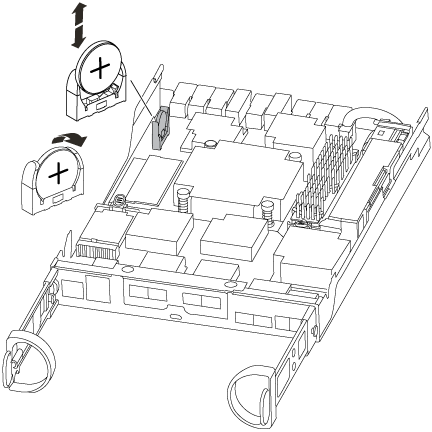

= Remplacez la pile de l'horloge en temps réel
:allow-uri-read: 
:icons: font
:imagesdir: ../media/

[role="lead"]
Vous remplacez la batterie de l'horloge temps réel (RTC) dans le module de contrôleur afin que les services et applications de votre système qui dépendent d'une synchronisation précise de l'heure continuent de fonctionner.

* Cette procédure peut être utilisée avec toutes les versions de ONTAP prises en charge par votre système
* Tous les autres composants du système doivent fonctionner correctement ; si ce n'est pas le cas, vous devez contacter le support technique.

video::CNk4FB5OUOI[youtube]

== Étape 1 : arrêtez le contrôleur défaillant

Pour arrêter le contrôleur défaillant, vous devez déterminer l'état du contrôleur et, si nécessaire, prendre le contrôle de façon à ce que le contrôleur en bonne santé continue de transmettre des données provenant du stockage défaillant du contrôleur.

Si vous avez un cluster avec plus de deux nœuds, il doit être dans le quorum. Si le cluster n'est pas au quorum ou si un contrôleur en bonne santé affiche la valeur false pour l'éligibilité et la santé, vous devez corriger le problème avant de désactiver le contrôleur défaillant ; voir link:https://docs.netapp.com/us-en/ontap/system-admin/synchronize-node-cluster-task.html?q=Quorum["Synchroniser un nœud avec le cluster"^].

.Étapes
. Si AutoSupport est activé, supprimez la création automatique de dossier en invoquant un message AutoSupport : `system node autosupport invoke -node * -type all -message MAINT=_number_of_hours_down_h`
+
Le message AutoSupport suivant supprime la création automatique de dossiers pendant deux heures : `cluster1:*> system node autosupport invoke -node * -type all -message MAINT=2h`

. Si le contrôleur défectueux fait partie d'une paire HA, désactivez le rétablissement automatique à partir de la console du contrôleur en bon état : `storage failover modify -node local -auto-giveback false`
. Faites passer le contrôleur douteux à l'invite DU CHARGEUR :
+
[cols="1,2"]
|===
| Si le contrôleur en état de fonctionnement s'affiche... | Alors... 

 a| 
Invite DU CHARGEUR
 a| 
Passez à la section retrait du module de contrôleur.

 a| 
Attente du retour...
 a| 
Appuyez sur Ctrl-C, puis répondez `y`.

 a| 
Invite système ou invite de mot de passe (entrer le mot de passe système)
 a| 
Prendre le contrôle défectueux ou l'arrêter à partir du contrôleur en bon état : `storage failover takeover -ofnode _impaired_node_name_`

Lorsque le contrôleur douteux s'affiche en attente de rétablissement..., appuyez sur Ctrl-C et répondez `y`.

|===
. Si le système ne dispose que d'un seul module de contrôleur dans le châssis, mettez les blocs d'alimentation hors tension, puis débranchez les câbles d'alimentation du contrôleur pour cause d'altération de la source d'alimentation.

== Étape 2 : retirer le module de contrôleur

Pour accéder aux composants à l'intérieur du contrôleur, vous devez d'abord retirer le module de contrôleur du système, puis retirer le capot du module de contrôleur.

. Si vous n'êtes pas déjà mis à la terre, mettez-vous à la terre correctement.
. Desserrez le crochet et la bride de boucle qui relient les câbles au périphérique de gestion des câbles, puis débranchez les câbles système et les SFP (si nécessaire) du module de contrôleur, en maintenant une trace de l'emplacement où les câbles ont été connectés.
+
Laissez les câbles dans le périphérique de gestion des câbles de sorte que lorsque vous réinstallez le périphérique de gestion des câbles, les câbles sont organisés.

. Retirez et mettez de côté les dispositifs de gestion des câbles des côtés gauche et droit du module de contrôleur.
+
image::../media/drw_25xx_cable_management_arm.png[Insertion ou retrait du ARM de gestion des câbles]

. Appuyez sur le loquet de la poignée de came jusqu'à ce qu'il se libère, ouvrez complètement la poignée de came pour libérer le module de contrôleur du fond de panier central, puis, à l'aide de deux mains, retirez le module de contrôleur du châssis.
+
image::../media/drw_2240_x_opening_cam_latch.png[Ouverture du loquet de la poignée de came]

. Retournez le module de contrôleur et placez-le sur une surface plane et stable.
. Ouvrez le capot en le faisant glisser dans les languettes bleues pour le dégager, puis faites pivoter le couvercle vers le haut et ouvrez-le.
+
image::../media/drw_2600_opening_pcm_cover.png[Ouverture ou fermeture du module de contrôleur]

== Étape 3 : remplacer la batterie RTC

Pour remplacer la batterie RTC, la placer à l'intérieur du contrôleur et suivre l'ordre des étapes.

. Localisez la batterie RTC.
+

. Poussez doucement la batterie hors du support, faites-la pivoter pour l'éloigner du support, puis retirez-la du support.
+

NOTE: Notez la polarité de la batterie lorsque vous la retirez du support. La batterie est signalée par un signe plus et doit être correctement positionnée dans le support. Un signe plus près du support indique comment la batterie doit être positionnée.

. Retirez la batterie de rechange du sac d'expédition antistatique.
. Localisez le support de batterie vide dans le module de contrôleur.
. Notez la polarité de la batterie RTC, puis insérez-la dans le support en inclinant la batterie et en la poussant vers le bas.
. Inspectez visuellement la batterie pour vous assurer qu'elle est complètement installée dans le support et que la polarité est correcte.

== Étape 4 : réinstaller le module de contrôleur et régler l'heure/la date après le remplacement de la batterie RTC

Après avoir remplacé un composant dans le module de contrôleur, vous devez réinstaller le module de contrôleur dans le châssis du système, réinitialiser l'heure et la date sur le contrôleur, puis le démarrer.

. Si ce n'est déjà fait, fermez le conduit d'air ou le couvercle du module de commande.
. Alignez l'extrémité du module de contrôleur avec l'ouverture du châssis, puis poussez doucement le module de contrôleur à mi-course dans le système.
+
N'insérez pas complètement le module de contrôleur dans le châssis tant qu'il n'y a pas été demandé.

. Recâblage du système, selon les besoins.
+
Si vous avez retiré les convertisseurs de support (QSFP ou SFP), n'oubliez pas de les réinstaller si vous utilisez des câbles à fibre optique.

. Si les blocs d'alimentation ont été débranchés, rebranchez-les et réinstallez les dispositifs de retenue du câble d'alimentation.
. Terminez la réinstallation du module de contrôleur :
+
.. Avec la poignée de came en position ouverte, poussez fermement le module de contrôleur jusqu'à ce qu'il rencontre le fond de panier et soit bien en place, puis fermez la poignée de came en position verrouillée.
+

NOTE: Ne forcez pas trop lorsque vous faites glisser le module de contrôleur dans le châssis pour éviter d'endommager les connecteurs.

.. Si ce n'est déjà fait, réinstallez le périphérique de gestion des câbles.
.. Fixez les câbles au dispositif de gestion des câbles à l'aide du crochet et de la sangle de boucle.
.. Rebranchez les câbles d'alimentation aux blocs d'alimentation et aux sources d'alimentation, puis mettez le système sous tension pour démarrer le processus d'amorçage.
.. Arrêtez le contrôleur à l'invite DU CHARGEUR.

. Réinitialiser l'heure et la date sur le contrôleur :
+
.. Vérifiez la date et l'heure sur le contrôleur en bon état à l'aide du `show date` commande.
.. À l'invite DU CHARGEUR sur le contrôleur cible, vérifier l'heure et la date.
.. Si nécessaire, modifiez la date avec le `set date mm/dd/yyyy` commande.
.. Si nécessaire, réglez l'heure, en GMT, à l'aide du `set time hh:mm:ss` commande.
.. Confirmez la date et l'heure sur le contrôleur cible.

. À l'invite DU CHARGEUR, entrez `bye` Pour réinitialiser les cartes PCIe et d'autres composants et laisser le contrôleur redémarrer.
. Rétablir le fonctionnement normal du contrôleur en renvoie son espace de stockage : `storage failover giveback -ofnode _impaired_node_name_`
. Si le retour automatique a été désactivé, réactivez-le : `storage failover modify -node local -auto-giveback true`

== Étape 5 : terminer le processus de remplacement

Retournez la pièce défectueuse à NetApp, tel que décrit dans les instructions RMA (retour de matériel) fournies avec le kit. Voir la https://mysupport.netapp.com/site/info/rma["Retour de pièces et remplacements"] page pour plus d'informations.
