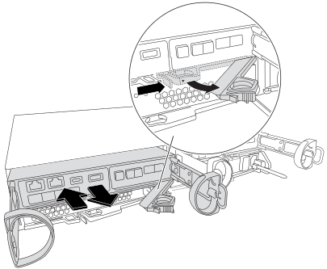

= Remplacez le support de démarrage - FAS2820
:allow-uri-read: 
:icons: font
:imagesdir: ../media/

[role="lead"]
Vous devez retirer et ouvrir le module de contrôleur défectueux, localiser et remplacer le support de démarrage dans le contrôleur, transférer l'image de démarrage sur une clé USB, insérer la clé USB dans le contrôleur, puis démarrer le contrôleur.

== Étape 1 : retirer le module de contrôleur

.Étapes
Pour accéder aux composants à l'intérieur du contrôleur, vous devez d'abord retirer le module de contrôleur du système, puis retirer le capot du module de contrôleur.

. Si vous n'êtes pas déjà mis à la terre, mettez-vous à la terre correctement.
. Desserrez le crochet et la bride de boucle qui relient les câbles au périphérique de gestion des câbles, puis débranchez les câbles système et les SFP (si nécessaire) du module de contrôleur, en maintenant une trace de l'emplacement où les câbles ont été connectés.
. Appuyez sur le loquet de la poignée de came jusqu'à ce qu'il se libère, ouvrez complètement la poignée de came pour libérer le module de contrôleur du fond de panier central, puis, à l'aide de deux mains, retirez le module de contrôleur du châssis.
+

. Retournez le module de contrôleur et placez-le sur une surface plane et stable.
. Ouvrez le capot en appuyant sur les boutons bleus situés sur les côtés du module de contrôleur pour libérer le capot, puis faites pivoter le capot vers le haut et hors du module de contrôleur.
+
image::../media/drw_2850_open_controller_module_cover_IEOPS-695.svg[Ouvrir le contrôleur]

[cols="1,2"]
|===

 a| 
image::../media/icon_round_1.png[Légende numéro 1]
 a| 
Bouton de déverrouillage du capot du module de contrôleur

|===

== Étape 2 : remplacer le support de démarrage

Localisez le support de démarrage dans le module de contrôleur, situé sous la carte mezzanine et suivez les instructions pour le remplacer.

image:../media/drw_2850_replace_boot_media_IEOPS-696.svg["Remplacez le support de démarrage"]

[cols="1,2"]
|===

 a| 
image::../media/icon_round_1.png[Légende numéro 1]
 a| 
Languette de verrouillage du support de démarrage

|===
.Étapes
. Si vous n'êtes pas déjà mis à la terre, mettez-vous à la terre correctement.
. Retirez la carte mezzanine à l'aide de l'illustration suivante ou du mappage FRU sur le module de contrôleur :
+
.. Retirez la plaque d'E/S en la faisant glisser hors du module de contrôleur.
.. Desserrez les vis à molette de la carte mezzanine.
+

NOTE: Vous pouvez desserrer les vis moletées avec vos doigts ou un tournevis. Si vous utilisez vos doigts, vous devrez peut-être faire pivoter la batterie NV vers le haut pour obtenir un meilleur achat de doigts sur la vis à molette située à côté de celle-ci.

.. Soulevez la carte mezzanine.

. Remplacez le support de démarrage :
+
.. Appuyez sur le bouton bleu du boîtier du support de démarrage pour libérer le support de démarrage de son logement, faites pivoter le support de démarrage vers le haut, puis tirez-le doucement hors du support de démarrage.
+

NOTE: Ne faites pas tourner ou tirer le support de démarrage directement vers le haut, car cela pourrait endommager le support ou le support de démarrage.

.. Alignez les bords du support de démarrage de remplacement avec le support de démarrage, puis poussez-le doucement dans le support.
Vérifiez le support de démarrage pour vous assurer qu'il est correctement inséré dans le support et, si nécessaire, retirez le support de démarrage et réinstallez-le dans le support.
.. Appuyez sur le bouton de verrouillage bleu, faites pivoter le support de démarrage complètement vers le bas, puis relâchez le bouton de verrouillage pour verrouiller le support de démarrage en place.

. Réinstallez la carte mezzanine :
+
.. Alignez le connecteur de la carte mère avec le connecteur de la carte mezzanine, puis insérez doucement la carte dans le support.
.. Serrez les trois vis à molette de la carte mezzanine.
.. Réinstallez la plaque d'E/S.

. Réinstallez le capot du module de contrôleur et verrouillez-le en place.

== Étape 3 : transférez l'image de démarrage sur le support de démarrage

Installez l'image système sur le support de démarrage de remplacement à l'aide d'une clé USB sur laquelle l'image est installée. Vous devez restaurer le système de fichiers var au cours de cette procédure.

.Avant de commencer
* Vous devez disposer d'une clé USB, formatée en MBR/FAT32, d'une capacité minimale de 4 Go.
* Vous devez disposer d'une connexion réseau.

.Étapes
. Téléchargez la version d'image appropriée de ONTAP sur le lecteur flash USB formaté :
+
.. Utiliser https://kb.netapp.com/onprem/ontap/dm/Encryption/How_to_determine_if_the_running_ONTAP_version_supports_NetApp_Volume_Encryption_(NVE)["Comment déterminer si la version ONTAP en cours d'exécution prend en charge NetApp Volume Encryption (NVE)"^] pour déterminer si le chiffrement de volume est actuellement pris en charge.
+
*** Si NVE est pris en charge sur le cluster, téléchargez l'image avec le chiffrement de volume NetApp.
*** Si NVE n'est pas pris en charge sur le cluster, téléchargez l'image sans chiffrement de volume NetApp.
Voir https://kb.netapp.com/onprem/ontap/os/Which_ONTAP_image_should_I_download%3F_With_or_without_Volume_Encryption%3F["Quelle image ONTAP dois-je télécharger ? Avec ou sans chiffrement de volume ?"^] pour en savoir plus.

. Retirez la clé USB de votre ordinateur portable.
. Installez le module de contrôleur :
+
.. Alignez l'extrémité du module de contrôleur avec l'ouverture du châssis, puis poussez doucement le module de contrôleur à mi-course dans le système.
.. Recâblage du module de contrôleur.
+
Lors de la remise en état, n'oubliez pas de réinstaller les convertisseurs de support (SFP) s'ils ont été retirés.

. Insérez la clé USB dans le logement USB du module de contrôleur.
+
Assurez-vous d'installer le lecteur flash USB dans le logement étiqueté pour périphériques USB et non dans le port de console USB.

. Poussez le module de contrôleur complètement dans le système, en vous assurant que la poignée de came se dégage du lecteur flash USB, appuyez fermement sur la poignée de came pour terminer l'installation du module de contrôleur, poussez la poignée de came en position fermée, puis serrez la vis moletée.
+
Le contrôleur commence à démarrer dès qu'il est complètement installé dans le châssis et s'arrête à l'invite LOADER.

.Et la suite ?
Après avoir remplacé le support de démarrage, vous devez link:bootmedia-recovery-image-boot.html["démarrez l'image de récupération"].
