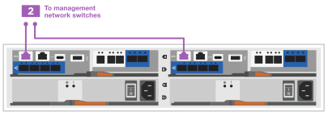

= Étapes détaillées - FAS2820
:allow-uri-read: 
:icons: font
:imagesdir: ../media/

[role="lead"]
Cette procédure fournit des instructions détaillées étape par étape pour l'installation d'un système de stockage NetApp classique. Utilisez cette procédure pour obtenir des instructions d'installation plus détaillées.

== Étape 1 : préparer l'installation

.Avant de commencer
Vous devez fournir les informations suivantes sur votre site :

* Espace rack du système de stockage dans un rack Telco ou une armoire système.
+
** 2U pour le système de stockage
** 2U ou 4U par tiroir disque de votre système

* Tournevis Phillips n°2
* Câbles réseau supplémentaires pour connecter votre système de stockage à votre commutateur réseau et à votre ordinateur portable ou à votre console à l'aide d'un navigateur Web
* Ordinateur portable ou console avec connexion RJ-45 et accès à un navigateur Web
+
** Accès au https://hwu.netapp.com["NetApp Hardware Universe"] pour plus d'informations sur les exigences du site et sur le système de stockage configuré.
** Vous pouvez également avoir accès au http://mysupport.netapp.com/documentation/productlibrary/index.html?productID=62286["Notes de version pour votre version de ONTAP 9"] Pour votre version de ONTAP pour plus d'informations sur ce système de stockage.

.Étapes
. Déballez toutes les boîtes et faites l'inventaire du contenu.
+

IMPORTANT: Les clients ayant des besoins spécifiques en alimentation doivent les vérifier https://hwu.netapp.com["NetApp Hardware Universe"] pour leurs options de configuration.

. Accédez au https://docs.netapp.com/us-en/ontap/task_configure_ontap.html#assign-a-node-management-ip-address["Configurez ONTAP sur un nouveau cluster avec System Manager"^]
+
.. Passez en revue les étapes de la procédure amd requises.
.. Collectez des informations sur votre système de stockage en complétant le https://docs.netapp.com/us-en/ontap/task_configure_ontap.html["Feuille de travail de configuration^ (URL nécessaire pour accéder à la fiche)"].
.. Notez le numéro de série du système de stockage provenant des contrôleurs.
+
image::../media/drw_ssn_label.svg[Exemple de numéro de série du système]

Le tableau suivant identifie les types de câbles que vous pouvez recevoir. Si vous recevez un câble non répertorié dans le tableau, reportez-vous à la section https://hwu.netapp.com["NetApp Hardware Universe"] pour localiser le câble et identifier son utilisation.

[cols="1,2,1,2"]
|===
| Type de câble... | Numéro de pièce et longueur | Type de connecteur | Pour... 

 a| 
10 GbE, SFP28 (en fonction de la commande)
 a| 
X6566B-05-R6, .5,

X6566B-2-R6, 2 M.
 a| 
image::../media/oie_cable_sfp_gbe_copper.png[Connecteur en cuivre SFP GbE]
 a| 
Câble réseau

 a| 
Ethernet 25 Gb, SFP28
 a| 
X66240A-05, 0,5 M.

X66240-2, 2 M.

X66240A-5, 5 M.
 a| 
image::../media/oie_cable_25Gb_Ethernet_SFP28_IEOPS-1069.svg[Câble réseau de 25 Gb]
 a| 
Câble réseau

 a| 
Fibre Channel 32 Gb,
SFP+ (cible/initiateur)
 a| 
X66250-2, 2 M.

X66250-5, 5 M.

X66250-15, 15 M.
 a| 
image::../media/oie_cable_sfp_gbe_copper.png[Connecteur en cuivre SFP GbE]
 a| 
Réseau FC

 a| 
Cat 6, RJ-45 (selon la commande)
 a| 
X6561-R6

X6562-R6
 a| 
image::../media/oie_cable_rj45.png[Câbles RJ-45]
 a| 
Réseau de gestion et données Ethernet

 a| 
Stockage
 a| 
X66030A, 0,5 M.

X66031A, 1 M.

X66032A, 2 M.
 a| 
image::../media/oie_cable_mini_sas_hd_to_mini_sas_hd.svg[Câble mini-SAS vers mini-SAS]
 a| 
Stockage

 a| 
Câble de console USB-C.
 a| 
Aucune étiquette de référence
 a| 
image::../media/oie_cable_micro_usb.png[Connecteur micro USB]
 a| 
Connexion de la console pendant la configuration du logiciel sur un ordinateur portable/console autre que Windows ou Mac

 a| 
Câbles d'alimentation
 a| 
Aucune étiquette de référence
 a| 
image::../media/oie_cable_power.png[Câble d'alimentation]
 a| 
Mise sous tension du système de stockage

 a| 
Câble FC en option
 a| 
Câble FC en option
 a| 
image::../media/oie_cable_fiber_lc_connector.png[Connecteur à fibre LC]
 a| 
Câble réseau FC supplémentaire

|===

== Étape 2 : installer le matériel de fixation

Installez votre système de stockage dans un rack de télécommunications ou une armoire de système de stockage NetApp, le cas échéant.

.Étapes
. Installez les kits de rails, au besoin.
. Installez et sécurisez votre système de stockage en suivant les instructions fournies avec le kit de rails.
+

NOTE: Vous devez être conscient des problèmes de sécurité associés au poids du système de stockage.

+
image::../media/oie_fas2800_weight_caution_IEOPS-1070.svg[Etiquette de mise en garde relative au levage]

. Fixez les dispositifs de gestion des câbles (comme illustré).
+
image::../media/drw_cable_management_arm_install.svg[Installez le ARM de gestion des câbles]

. Placez le panneau à l'avant du système de stockage.

== Étape 3 : connectez les câbles des contrôleurs à votre réseau

Reliez les contrôleurs au réseau en tant que cluster à 2 nœuds sans commutateur ou avec commutateur.

Le tableau suivant identifie le type de câble avec le numéro d'appel et la couleur de câble sur les illustrations pour un cluster à deux nœuds sans commutateur et un cluster avec commutateur.

[cols="20%,80%"]
|===
| Câblage | Type de connexion 

 a| 
image::../media/icon_square_1_green.png[Numéro de légende 3]]
 a| 
Interconnexion de cluster

 a| 
image::../media/icon_square_2_purple.png[Légende numéro 2]
 a| 
Switch réseau de gestion

 a| 
image::../media/icon_square_3_orange.png[Numéro de légende 3]
 a| 
Switchs réseau de l'hôte

|===
.Avant de commencer
* Pour plus d'informations sur la connexion du système de stockage aux commutateurs, contactez votre administrateur réseau.
* Vérifiez la flèche de l'illustration pour connaître l'orientation correcte de la languette de retrait du connecteur de câble.
+
** Lorsque vous insérez le connecteur, vous devez le sentir en place. Si vous ne le sentez pas, retirez-le, retournez la tête du câble et réessayez.
** Si vous vous connectez à un commutateur optique, insérez le SFP dans le port du contrôleur avant de procéder au câblage vers le port.

image::../media/oie_cable_pull_tab_down.png[Direction de la languette d'extraction]

[role="tabbed-block"]
====
.Option 1 : câler un cluster à deux nœuds sans commutateur
--
Reliez les connexions réseau et les ports d'interconnexion de cluster à un cluster sans commutateur à deux nœuds.

.Description de la tâche
Utilisez l'animation ou les instructions détaillées pour effectuer le câblage entre les contrôleurs et les commutateurs.

.Animation - câblage d'un câblage de cluster sans commutateur à deux nœuds
video::90577508-fa79-46cf-b18a-afe8016325af[panopto]
.Étapes
. Reliez les ports d'interconnexion de cluster e0a à e0a et e0b à e0b à l'aide du câble d'interconnexion de cluster :
+
image::../media/oie_cable_25Gb_Ethernet_SFP28_IEOPS-1069.svg[Câble réseau de 25 Gb]

+
*Câbles d'interconnexion de cluster*

+
image::../media/drw_2800_tnsc_cluster_cabling_IEOPS-892.svg[Câblage du cluster à deux nœuds]

. Reliez les ports e0M aux switchs réseau de gestion avec les câbles RJ45 :
+
image::../media/oie_cable_rj45.png[Câbles RJ-45]

+
*Câbles RJ45*

+

. Reliez les ports de la carte mezzanine au réseau hôte.
+
image::../media/drw_2800_network_cabling_IEOPS-894.svg[Connexions réseau]

+
.. Si vous disposez d'un réseau de données Ethernet à 4 ports, reliez les ports e1a à e1d à votre réseau de données Ethernet.
+
*** 4 ports, Ethernet 10 Gb, SFP28
+
image::../media/oie_cable_sfp_gbe_copper.png[Connecteur en cuivre SFP GbE]

+
image::../media/oie_cable_25Gb_Ethernet_SFP28_IEOPS-1069.svg[Câble Ethernet 25 Gb]

*** 4 PORTS, 10GBASE-T, RJ45
+
image::../media/oie_cable_rj45.png[Câbles RJ-45]

.. Si vous disposez d'un réseau de données Fibre Channel à 4 ports, câblez les ports 1a à 1D pour votre réseau FC.
+
*** 4 ports, Fibre Channel 32 Gb, SFP+ (cible uniquement)
+
image::../media/oie_cable_sfp_gbe_copper.png[Connecteur en cuivre SFP GbE]

*** 4 ports, Fibre Channel 32 Gb, SFP+ (initiateur/cible)
+
image::../media/oie_cable_sfp_gbe_copper.png[Connecteur en cuivre SFP GbE]

.. Si vous disposez d'une carte 2+2 (2 ports avec connexions Ethernet et 2 ports avec connexions Fibre Channel), reliez les ports e1a et e1b à votre réseau de données FC et les ports e1c et e1D à votre réseau de données Ethernet.
+
*** 2 ports, Ethernet 10 Gb (SFP28) + 2 ports FC 32 Gb (SFP+)
+
image::../media/oie_cable_sfp_gbe_copper.png[Connecteur en cuivre SFP GbE]

+
image::../media/oie_cable_sfp_gbe_copper.png[Connecteur en cuivre SFP GbE]

IMPORTANT: NE branchez PAS les cordons d'alimentation.

--
.Option 2 : câblage d'un cluster commuté
--
Reliez les connexions réseau et les ports d'interconnexion de cluster à un cluster commuté.

.Description de la tâche
Utilisez l'animation ou les instructions détaillées pour effectuer le câblage entre les contrôleurs et les commutateurs.

.Animation - câblage commuté du cluster
video::6553a3db-57dd-4247-b34a-afe8016315d4[panopto]
.Étapes
. Reliez les ports d'interconnexion de cluster e0a à e0a et e0b à e0b à l'aide du câble d'interconnexion de cluster :
+
image::../media/oie_cable_25Gb_Ethernet_SFP28_IEOPS-1069.svg[Connecteur Ethernet 25 Gb]

+
image::../media/drw_2800_switched_cluster_cabling_IEOPS-893.svg[Connexions de cluster commutées]

. Reliez les ports e0M aux switchs réseau de gestion avec les câbles RJ45 :
+
image::../media/oie_cable_rj45.png[Câbles RJ-45]

+

. Reliez les ports de la carte mezzanine au réseau hôte.
+
image::../media/drw_2800_network_cabling_IEOPS-894.svg[Connexions réseau]

+
.. Si vous disposez d'un réseau de données Ethernet à 4 ports, reliez les ports e1a à e1d à votre réseau de données Ethernet.
+
*** 4 ports, Ethernet 10 Gb, SFP28
+
image::../media/oie_cable_sfp_gbe_copper.png[Connecteur en cuivre SFP GbE]

+
image::../media/oie_cable_25Gb_Ethernet_SFP28_IEOPS-1069.svg[Connecteur Ethernet 25 Gb]

*** 4 PORTS, 10GBASE-T, RJ45
+
image::../media/oie_cable_rj45.png[Câbles RJ-45]

.. Si vous disposez d'un réseau de données Fibre Channel à 4 ports, câblez les ports 1a à 1D pour votre réseau FC.
+
*** 4 ports, Fibre Channel 32 Gb, SFP+ (cible uniquement)
+
image::../media/oie_cable_sfp_gbe_copper.png[Connecteur en cuivre SFP GbE]

*** 4 ports, Fibre Channel 32 Gb, SFP+ (initiateur/cible)
+
image::../media/oie_cable_sfp_gbe_copper.png[Connecteur en cuivre SFP GbE]

.. Si vous disposez d'une carte 2+2 (2 ports avec connexions Ethernet et 2 ports avec connexions Fibre Channel), reliez les ports e1a et e1b à votre réseau de données FC et les ports e1c et e1D à votre réseau de données Ethernet.
+
*** 2 ports, Ethernet 10 Gb (SFP28) + 2 ports FC 32 Gb (SFP+)
+
image::../media/oie_cable_sfp_gbe_copper.png[Connecteur en cuivre SFP GbE]

+
image::../media/oie_cable_sfp_gbe_copper.png[Connecteur en cuivre SFP GbE]

IMPORTANT: NE branchez PAS les cordons d'alimentation.

--
====

== Étape 4 : câblage des contrôleurs aux tiroirs disques

Connectez les contrôleurs à un système de stockage externe.

Le tableau suivant identifie le type de câble à l'aide du numéro d'appel et de la couleur des câbles illustrés pour le câblage des tiroirs disques à votre système de stockage.

NOTE: L'exemple utilise DS224C. Le câblage est similaire à celui des autres tiroirs disques pris en charge. Voir link:../sas3/install-new-system.html["Installez et reliez les étagères pour une nouvelle installation du système - étagères avec modules IOM12/IOM12B"] pour plus d'informations.

[cols="20%,80%"]
|===
| Câblage | Type de connexion 

 a| 
image::../media/icon_square_1_yellow.png[Icône de légende 1]
 a| 
Le câblage tiroir à tiroir

 a| 
image::../media/icon_square_2_blue.png[Icône de légende 2]
 a| 
Contrôleur A vers les tiroirs disques

 a| 
image::../media/icon_square_3_tourquoise.png[Icône de légende 3]
 a| 
Contrôleur B vers les tiroirs disques

|===
Assurez-vous de vérifier que la flèche de l'illustration indique l'orientation correcte du connecteur de câble à languette.

image::../media/oie_cable_pull_tab_down.png[Direction de la languette d'extraction]

.Description de la tâche
Utilisez l'animation ou les instructions détaillées pour terminer le câblage entre les contrôleurs et les tiroirs disques.

IMPORTANT: Ne pas utiliser le port 0b2 sur un FAS2820. Ce port SAS n'est pas utilisé par ONTAP et est toujours désactivé. Voir link:../sas3/install-new-system.html["Installez un tiroir sur un nouveau système de stockage"^] pour plus d'informations.

.Animation : câblage du tiroir disque
video::b2a7549d-8141-47dc-9e20-afe8016f4386[panopto]
.Étapes
. Reliez les ports tiroir à tiroir.
+
.. Du port 1 de l'IOM A au port 3 de l'IOM A sur le shelf directement en dessous.
.. Du port 1 de l'IOM B au port 3 de l'IOM B sur le shelf directement en dessous.
+
image::../media/oie_cable_mini_sas_hd_to_mini_sas_hd.svg[Connecteur mini-SAS vers mini-SAS]

*Câbles HD mini-SAS vers mini-SAS*

+ image ::../media/drw_2800_shelf-to-shelf_Cabling_IEOPS-895.svg[câblage tiroir à tiroir]

+ . Reliez le contrôleur A aux tiroirs disques. .. Contrôleur A du port 0a à IOM B du port 1 sur le premier tiroir disque de la pile. .. Du port 0b1 du contrôleur A au port 3 du module d'E/S Sur le dernier tiroir disque de la pile.

+ image::../media/oie_cable_mini_sas_hd_to_mini_sas_hd.svg[Mini-SAS vers mini-connecteur SAS]

*Câbles HD mini-SAS vers mini-SAS*

+ image::../media/dwr-2800_controler1-to shelfs_IEOPS-896.svg[connexion contrôleur A à tiroir]

+ . Connectez le contrôleur B aux tiroirs disques. .. Contrôleur B du port 0a à IOM A port 1 sur le premier tiroir disque de la pile. .. Du port 0b1 du contrôleur B au port 3 du module d'E/S B du dernier tiroir disque de la pile.

+ image::../media/oie_cable_mini_sas_hd_to_mini_sas_hd.svg[Mini-SAS vers mini-connecteur SAS]

*Câbles HD mini-SAS vers mini-SAS*

+ image::../media/dwr-2800_controler2-to shelfs_IEOPS-897.svg[connexion contrôleur B au tiroir]

== Étape 5 : installation et configuration complètes du système de stockage

Terminez l'installation et la configuration de votre système de stockage en utilisant l'option 1 : si la détection du réseau est activée ou l'option 2 : si la détection du réseau n'est pas activée.

[role="tabbed-block"]
====
.Option 1 : si la détection réseau est activée
--
Si la détection de réseau est activée sur votre ordinateur portable, effectuez la configuration et la configuration du système de stockage à l'aide de la détection automatique de cluster.

.Étapes
. Utilisez l'animation suivante pour mettre sous tension et définir les ID de tiroir.
+
.Animation : définissez les ID de tiroir disque
video::c600f366-4d30-481a-89d9-ab1b0066589b[panopto]
. Mettez les contrôleurs sous tension
+
.. Branchez les câbles d'alimentation aux alimentations du contrôleur, puis connectez-les à des sources d'alimentation de différents circuits.
.. Mettez les boutons marche/arrêt sur les deux nœuds.
+

NOTE: Le démarrage initial peut prendre jusqu'à huit minutes.

+
image::../media/dwr_2800_turn_on_power_IEOPS-898.svg[Mettez l'appareil sous tension]

. Assurez-vous que la détection réseau de votre ordinateur portable est activée.
+
Consultez l'aide en ligne de votre ordinateur portable pour plus d'informations.

. Connectez votre ordinateur portable au commutateur de gestion.
. Utilisez le graphique ou les étapes pour découvrir le nœud du système de stockage à configurer :
+
image::../media/drw_autodiscovery_controler_select_ieops-1849.svg[Système de détection automatique]

+
.. Ouvrez l'Explorateur de fichiers.
.. Cliquez sur *réseau* dans le volet gauche, cliquez avec le bouton droit de la souris et sélectionnez *refresh*.
.. Double-cliquez sur l'une des icônes ONTAP et acceptez les certificats affichés à l'écran.
+

NOTE: XXXXX est le numéro de série du système de stockage du nœud cible.

+
System Manager s'ouvre.

. Utilisez la configuration guidée de System Manager pour configurer votre système de stockage à l'aide des données collectées dans <<Étape 1 : préparer l'installation>>.
. Créez un compte ou connectez-vous à votre compte.
+
.. Cliquez sur https://mysupport.netapp.com["mysupport.netapp.com"]
.. Cliquez sur _Créer un compte_ si vous devez créer un compte ou vous connecter à votre compte.

. Téléchargez et installez https://mysupport.netapp.com/site/tools["Active IQ Config Advisor"]
+
.. Vérifiez l'état de santé de votre système de stockage en exécutant Active IQ Config Advisor.

. Enregistrez votre système à l'adresse https://mysupport.netapp.com/site/systems/register[].
. Une fois la configuration initiale terminée, passez à la https://www.netapp.com/support-and-training/documentation/["Ressources NetApp ONTAP"] Pour plus d'informations sur la configuration de fonctionnalités supplémentaires dans ONTAP.

--
.Option 2 : si la détection réseau n'est pas activée
--
Si la détection réseau n'est pas activée sur votre ordinateur portable, effectuez manuellement la configuration et la configuration.

.Étapes
. Branchez et configurez votre ordinateur portable ou votre console :
+
.. Définissez le port de console de l'ordinateur portable ou de la console sur 115,200 bauds avec N-8-1.
+

NOTE: Consultez l'aide en ligne de votre ordinateur portable ou de votre console pour savoir comment configurer le port de console.

.. Connectez le câble de la console à l'ordinateur portable ou à la console, puis le port console du contrôleur à l'aide du câble de console fourni avec le système de stockage. Connectez ensuite l'ordinateur portable ou la console au commutateur du sous-réseau de gestion.
+
image::../media/drw_2800_laptop_to_switch_to_controller_IEOPS-1084.svg[Connexion de l'ordinateur portable au commutateur]

.. Attribuez une adresse TCP/IP à l'ordinateur portable ou à la console à l'aide d'une adresse située sur le sous-réseau de gestion.

. Utilisez l'animation suivante pour définir un ou plusieurs ID de tiroir disque :
+
.Animation : définissez les ID de tiroir disque
video::c600f366-4d30-481a-89d9-ab1b0066589b[panopto]
. Branchez les câbles d'alimentation aux alimentations du contrôleur, puis connectez-les à des sources d'alimentation de différents circuits.
. Mettez les boutons marche/arrêt sur les deux nœuds.
+
image::../media/dwr_2800_turn_on_power_IEOPS-898.svg[Mettez l'appareil sous tension]

+

NOTE: Le démarrage initial peut prendre jusqu'à huit minutes.

. Attribuez une adresse IP initiale de gestion des nœuds à l'un des nœuds.
+
[cols="20%,80%"]
|===
| Si le réseau de gestion dispose de DHCP... | Alors... 

 a| 
Configuré
 a| 
Notez l'adresse IP attribuée aux nouveaux contrôleurs.

 a| 
Non configuré
 a| 
.. Ouvrez une session de console à l'aide de PuTTY, d'un serveur de terminal ou de l'équivalent pour votre environnement.
+

NOTE: Consultez l'aide en ligne de votre ordinateur portable ou de votre console si vous ne savez pas comment configurer PuTTY.

.. Saisissez l'adresse IP de gestion lorsque le script vous y invite.

|===
. Utilisez System Manager sur votre ordinateur portable ou sur la console pour configurer votre cluster :
+
.. Indiquez l'adresse IP de gestion des nœuds dans votre navigateur.
+

NOTE: Le format de l'adresse est +https://x.x.x.x.+

.. Configurez le système de stockage à l'aide des données collectées dans <<Étape 1 : préparer l'installation>>..

. Créez un compte ou connectez-vous à votre compte.
+
.. Cliquez sur https://mysupport.netapp.com["mysupport.netapp.com"]
.. Cliquez sur _Créer un compte_ si vous devez créer un compte ou vous connecter à votre compte.

. Téléchargez et installez https://mysupport.netapp.com/site/tools["Active IQ Config Advisor"]
+
.. Vérifiez l'état de santé de votre système de stockage en exécutant Active IQ Config Advisor.

. Enregistrez votre système à l'adresse https://mysupport.netapp.com/site/systems/register[].
. Une fois la configuration initiale terminée, passez à la https://www.netapp.com/support-and-training/documentation/["Ressources NetApp ONTAP"] Pour plus d'informations sur la configuration de fonctionnalités supplémentaires dans ONTAP.

--
====