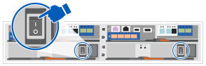

= Étapes détaillées - FAS2800
:allow-uri-read: 
:icons: font
:imagesdir: ../media/

[role="lead"]
Ce guide fournit des instructions détaillées vous permettant d'installer un système NetApp classique. Utilisez ce guide si vous souhaitez obtenir des instructions d'installation plus détaillées.

== Étape 1 : préparer l'installation

Pour installer votre système FAS2800, vous devez créer un compte sur le site du support NetApp, enregistrer votre système et obtenir des clés de licence. Vous devez également inventorier le nombre et le type de câbles appropriés pour votre système et collecter des informations réseau spécifiques.

Vous devez avoir accès au https://hwu.netapp.com["NetApp Hardware Universe"] pour plus d'informations sur les exigences du site ainsi que sur les informations supplémentaires sur votre système configuré. Vous pouvez également avoir accès au http://mysupport.netapp.com/documentation/productlibrary/index.html?productID=62286["Notes de version pour votre version de ONTAP 9"] Pour votre version de ONTAP pour plus d'informations sur ce système.

Vous devez fournir les informations suivantes sur votre site :

* Espace rack pour le système de stockage
* Tournevis Phillips n°2
* Câbles réseau supplémentaires pour connecter votre système à votre commutateur réseau et à votre ordinateur portable ou console avec un navigateur Web
* Ordinateur portable ou console avec connexion RJ-45 et accès à un navigateur Web

.Étapes
. Déballez le contenu de toutes les boîtes.
. Notez le numéro de série du système depuis les contrôleurs.
+
image::../media/drw_ssn_label.svg[etiquette drw ssn]

. Configurez votre compte :
+
.. Connectez-vous à votre compte existant ou créez un compte.
.. Enregistrez votre système via  https://mysupport.netapp.com/eservice/registerSNoAction.do?moduleName=RegisterMyProduct["Enregistrement de produit NetApp"]

. Téléchargez et installez https://mysupport.netapp.com/site/tools/tool-eula/activeiq-configadvisor["Config Advisor"] sur votre ordinateur portable.
. Faites un inventaire et notez le nombre et le type de câbles que vous avez reçus.
+
Le tableau suivant identifie les types de câbles que vous pouvez recevoir. Si vous recevez un câble non répertorié dans le tableau, reportez-vous à la section https://hwu.netapp.com["NetApp Hardware Universe"] pour localiser le câble et identifier son utilisation.

+
[cols="1,2,1,2"]
|===
| Type de câble... | Numéro de pièce et longueur | Type de connecteur | Pour... 

 a| 
10 GbE, SFP28 (en fonction de la commande)
 a| 
X6566B-05-R6, .5,

X6566B-2-R6, 2 M.
 a| 
image::../media/oie_cable_sfp_gbe_copper.svg[câble oie sfp gbe cuivre]
 a| 
Câble réseau

 a| 
Ethernet 25 Gb, SFP28
 a| 
X66240A-05, 0,5 M.

X66240-2, 2 M.

X66240A-5, 5 M.
 a| 
image::../media/oie_cable_25Gb_Ethernet_SFP28_IEOPS-1069.svg[Câble oie Ethernet 25 Gb SFP28 IEOPS 1069]
 a| 
Câble réseau

 a| 
Fibre Channel 32 Gb,
SFP+ (cible/initiateur)
 a| 
X66250-2, 2 M.

X66250-5, 5 M.

X66250-15, 15 M.
 a| 
image::../media/oie_cable_sfp_gbe_copper.svg[câble oie sfp gbe cuivre]
 a| 
Réseau FC

 a| 
Cat 6, RJ-45 (selon la commande)
 a| 
X6561-R6

X6562-R6
 a| 
image::../media/oie_cable_rj45.svg[câble oie rj45]
 a| 
Réseau de gestion et données Ethernet

 a| 
Stockage
 a| 
X66030A, 0,5 M.

X66031A, 1 M.

X66032A, 2 M.
 a| 
image::../media/oie_cable_mini_sas_hd_to_mini_sas_hd.svg[câble oie mini sas hd vers mini sas hd]
 a| 
Stockage

 a| 
Câble de console USB-C.
 a| 
Sans objet
 a| 
image::../media/oie_cable_micro_usb.svg[câble oie micro usb]
 a| 
Connexion de la console pendant la configuration du logiciel sur un ordinateur portable/console autre que Windows ou Mac

 a| 
Câbles d'alimentation
 a| 
Sans objet
 a| 
image::../media/oie_cable_power.svg[alimentation du câble de l'oie]
 a| 
Mise sous tension du système

 a| 
Câble FC en option
 a| 
Câble FC en option
 a| 
image::../media/oie_cable_fiber_lc_connector.svg[connecteur lc pour câble oie]
 a| 
Câble réseau FC supplémentaire

|===
. Téléchargez et complétez les feuilles de calcul disponibles dans le  https://docs.netapp.com/us-en/ontap/software_setup/concept_set_up_the_cluster.html#cluster-setup-worksheets["Configuration du cluster via l'interface de ligne de commandes ONTAP"^].

== Étape 2 : installer le matériel de fixation

Vous devez installer votre système sur un rack de 4 montants ou une armoire système NetApp, le cas échéant.

.Étapes
. Installez les kits de rails, au besoin.
. Installez et sécurisez votre système en suivant les instructions fournies avec le kit de rails.
+

NOTE: Vous devez être conscient des problèmes de sécurité associés au poids du système.

+
image::../media/oie_fas2800_weight_caution_IEOPS-1070.svg[oie fas2800 attention au poids IEOPS 1070]

. Fixez les dispositifs de gestion des câbles (comme illustré).
+
image::../media/drw_cable_management_arm_install.svg[installation du ARM de gestion des câbles drw]

. Placez le panneau à l'avant du système.

== Étape 3 : connectez les câbles des contrôleurs à votre réseau

Reliez les contrôleurs au réseau à l'aide de la méthode cluster sans commutateur à deux nœuds ou de la méthode réseau d'interconnexion de cluster.

Le tableau suivant identifie le type de câble avec le numéro d'appel et la couleur de câble sur les illustrations pour le câblage réseau à deux nœuds sans commutateur et le câblage réseau à cluster commuté.

[cols="20%,80%"]
|===
| Câblage | Type de connexion 

 a| 
image::../media/oie_legend_icon_1_lg.svg[légende de l'oie icône 1 lg]
 a| 
Interconnexion de cluster

 a| 
image::../media/oie_legend_icon_2_lp.svg[légende de l'oie icône 2 lp]
 a| 
Switch réseau de gestion

 a| 
image::../media/oie_legend_icon_3_o.svg[icône de légende de l'oie 3 o]
 a| 
Switchs réseau de l'hôte

|===
[role="tabbed-block"]
====
.Option 1 : câler un cluster à deux nœuds sans commutateur
--
Reliez les connexions réseau et les ports d'interconnexion de cluster à un cluster sans commutateur à deux nœuds.

.Avant de commencer
Pour plus d'informations sur la connexion du système aux commutateurs, contactez votre administrateur réseau.

Assurez-vous de vérifier que la flèche de l'illustration indique l'orientation correcte du connecteur de câble à languette.

image::../media/oie_cable_pull_tab_down.svg[languette de traction du câble oie vers le bas]

NOTE: Lorsque vous insérez le connecteur, vous devez le sentir en place. Si vous ne le sentez pas, retirez-le, retournez la tête du câble et réessayez.

NOTE: Si vous vous connectez à un commutateur optique, insérez le SFP dans le port du contrôleur avant de procéder au câblage vers le port.

.Description de la tâche
Vous pouvez utiliser le graphique ou les instructions détaillées pour effectuer le câblage entre les contrôleurs et les commutateurs.

.Animation - câblage d'un câblage de cluster sans commutateur à deux nœuds
video::90577508-fa79-46cf-b18a-afe8016325af[panopto]
.Étapes
. Reliez les ports d'interconnexion de cluster e0a à e0a et e0b à e0b à l'aide du câble d'interconnexion de cluster :
+
image::../media/oie_cable_25Gb_Ethernet_SFP28_IEOPS-1069.svg[Câble oie Ethernet 25 Gb SFP28 IEOPS 1069]

+
*Câbles d'interconnexion de cluster*

+
image::../media/drw_2800_tnsc_cluster_cabling_IEOPS-892.svg[drw 2800 Tnsc câblage du cluster IEOPS 892]

. Reliez les ports e0M aux switchs réseau de gestion avec les câbles RJ45 :
+
image::../media/oie_cable_rj45.svg[câble oie rj45]

+
*Câbles RJ45*

+
image::../media/drw_2800_management_connection_IEOPS-1077.svg[Connexion de gestion drw 2800 IEOPS 1077]

. Reliez les ports de la carte mezzanine au réseau hôte.
+
image::../media/drw_2800_network_cabling_IEOPS-894.svg[drw 2800 câblage réseau IEOPS 894]

+
.. Si vous disposez d'un réseau de données Ethernet à 4 ports, reliez les ports e1a à e1d à votre réseau de données Ethernet.
+
*** 4 ports, Ethernet 10 Gb, SFP28
+
image::../media/oie_cable_sfp_gbe_copper.svg[câble oie sfp gbe cuivre]

+
image::../media/oie_cable_25Gb_Ethernet_SFP28_IEOPS-1069.svg[Câble oie Ethernet 25 Gb SFP28 IEOPS 1069]

*** 4 PORTS, 10GBASE-T, RJ45
+
image::../media/oie_cable_rj45.svg[câble oie rj45]

.. Si vous disposez d'un réseau de données Fibre Channel à 4 ports, câblez les ports 1a à 1D pour votre réseau FC.
+
*** 4 ports, Fibre Channel 32 Gb, SFP+ (cible uniquement)
+
image::../media/oie_cable_sfp_gbe_copper.svg[câble oie sfp gbe cuivre]

*** 4 ports, Fibre Channel 32 Gb, SFP+ (initiateur/cible)
+
image::../media/oie_cable_sfp_gbe_copper.svg[câble oie sfp gbe cuivre]

.. Si vous disposez d'une carte 2+2 (2 ports avec connexions Ethernet et 2 ports avec connexions Fibre Channel), reliez les ports e1a et e1b à votre réseau de données FC et les ports e1c et e1D à votre réseau de données Ethernet.
+
*** 2 ports, Ethernet 10 Gb (SFP28) + 2 ports FC 32 Gb (SFP+)
+
image::../media/oie_cable_sfp_gbe_copper.svg[câble oie sfp gbe cuivre]

+
image::../media/oie_cable_sfp_gbe_copper.svg[câble oie sfp gbe cuivre]

IMPORTANT: NE branchez PAS les cordons d'alimentation.

--
.Option 2 : câblage d'un cluster commuté
--
Reliez les connexions réseau et les ports d'interconnexion de cluster à un cluster commuté.

NOTE: Vous devez avoir contacté votre administrateur réseau pour obtenir des informations sur la connexion du système aux commutateurs.

Assurez-vous de vérifier que la flèche de l'illustration indique l'orientation correcte du connecteur de câble à languette.

image::../media/oie_cable_pull_tab_down.svg[languette de traction du câble oie vers le bas]

NOTE: Lorsque vous insérez le connecteur, vous devez le sentir en place. Si vous ne le sentez pas, retirez-le, retournez la tête du câble et réessayez.

.Description de la tâche
Vous pouvez utiliser le graphique ou les instructions détaillées pour effectuer le câblage entre les contrôleurs et les commutateurs.

.Animation - câblage commuté du cluster
video::6553a3db-57dd-4247-b34a-afe8016315d4[panopto]
.Étapes
. Reliez les ports d'interconnexion de cluster e0a à e0a et e0b à e0b à l'aide du câble d'interconnexion de cluster :
+
image::../media/oie_cable_25Gb_Ethernet_SFP28_IEOPS-1069.svg[Câble oie Ethernet 25 Gb SFP28 IEOPS 1069]

+
image::../media/drw_2800_tnsc_cluster_cabling_IEOPS-892.svg[drw 2800 Tnsc câblage du cluster IEOPS 892]

. Reliez les ports e0M aux switchs réseau de gestion avec les câbles RJ45 :
+
image::../media/oie_cable_rj45.svg[câble oie rj45]

+
image::../media/drw_2800_management_connection_IEOPS-1077.svg[Connexion de gestion drw 2800 IEOPS 1077]

. Reliez les ports de la carte mezzanine au réseau hôte.
+
image::../media/drw_2800_network_cabling_IEOPS-894.svg[drw 2800 câblage réseau IEOPS 894]

+
.. Si vous disposez d'un réseau de données Ethernet à 4 ports, reliez les ports e1a à e1d à votre réseau de données Ethernet.
+
*** 4 ports, Ethernet 10 Gb, SFP28
+
image::../media/oie_cable_sfp_gbe_copper.svg[câble oie sfp gbe cuivre]

+
image::../media/oie_cable_25Gb_Ethernet_SFP28_IEOPS-1069.svg[Câble oie Ethernet 25 Gb SFP28 IEOPS 1069]

*** 4 PORTS, 10GBASE-T, RJ45
+
image::../media/oie_cable_rj45.svg[câble oie rj45]

.. Si vous disposez d'un réseau de données Fibre Channel à 4 ports, câblez les ports 1a à 1D pour votre réseau FC.
+
*** 4 ports, Fibre Channel 32 Gb, SFP+ (cible uniquement)
+
image::../media/oie_cable_sfp_gbe_copper.svg[câble oie sfp gbe cuivre]

*** 4 ports, Fibre Channel 32 Gb, SFP+ (initiateur/cible)
+
image::../media/oie_cable_sfp_gbe_copper.svg[câble oie sfp gbe cuivre]

.. Si vous disposez d'une carte 2+2 (2 ports avec connexions Ethernet et 2 ports avec connexions Fibre Channel), reliez les ports e1a et e1b à votre réseau de données FC et les ports e1c et e1D à votre réseau de données Ethernet.
+
*** 2 ports, Ethernet 10 Gb (SFP28) + 2 ports FC 32 Gb (SFP+)
+
image::../media/oie_cable_sfp_gbe_copper.svg[câble oie sfp gbe cuivre]

+
image::../media/oie_cable_sfp_gbe_copper.svg[câble oie sfp gbe cuivre]

IMPORTANT: NE branchez PAS les cordons d'alimentation.

--
====

== Étape 4 : câblage des contrôleurs aux tiroirs disques

Connectez les contrôleurs à un système de stockage externe.

NOTE: L'exemple utilise DS224C. Le câblage est similaire à celui des autres tiroirs disques pris en charge.

Assurez-vous de vérifier que la flèche de l'illustration indique l'orientation correcte du connecteur de câble à languette.

image::../media/oie_cable_pull_tab_down.svg[languette de traction du câble oie vers le bas]

.Description de la tâche
Vous pouvez utiliser le graphique ou les instructions détaillées pour terminer le câblage entre les contrôleurs et les tiroirs disques.

.Animation : câblage du tiroir disque
video::b2a7549d-8141-47dc-9e20-afe8016f4386[panopto]

NOTE: Ne pas utiliser le port 0b2 sur un FAS2800. Ce port SAS n'est pas utilisé par ONTAP et est toujours désactivé. Voir https://docs.netapp.com/us-en/ontap-systems/sas3/install-new-system.html["Installez un tiroir sur un nouveau système de stockage"^] pour en savoir plus.

Le tableau suivant identifie le type de câble avec le numéro d'appel et la couleur de câble sur les illustrations pour le câblage réseau à deux nœuds sans commutateur et le câblage réseau à cluster commuté.

[cols="20%,80%"]
|===
| Câblage | Type de connexion 

 a| 
image::../media/oie_legend_icon_1_lo.svg[icône de légende oie 1 lo]
 a| 
Interconnexion de cluster

 a| 
image::../media/oie_legend_icon_2_mb.svg[icône de légende oie 2 mb]
 a| 
Switch réseau de gestion

 a| 
image::../media/oie_legend_icon_3_t.svg[icône de légende de l'oie 3 t]
 a| 
Switchs réseau de l'hôte

|===
.Étapes
. Reliez les ports tiroir à tiroir.
+
.. Du port 1 de l'IOM A au port 3 de l'IOM A sur le shelf directement en dessous.
.. Du port 1 de l'IOM B au port 3 de l'IOM B sur le shelf directement en dessous.
+
image::../media/oie_cable_mini_sas_hd_to_mini_sas_hd.svg[câble oie mini sas hd vers mini sas hd]

+
*Câbles HD mini-SAS vers mini-SAS*

+
image::../media/drw_2800_shelf-to-shelf_cabling_IEOPS-895.svg[drw 2800 câblage tiroir à tiroir IEOPS 895]

. Reliez le contrôleur A aux tiroirs disques.
+
.. Contrôleur A du port 0a à IOM B du port 1 sur le premier tiroir disque de la pile.
.. Du port 0b1 du contrôleur A au port 3 du module d'E/S Sur le dernier tiroir disque de la pile.
+
image::../media/oie_cable_mini_sas_hd_to_mini_sas_hd.svg[câble oie mini sas hd vers mini sas hd]

+
*Câbles HD mini-SAS vers mini-SAS*

+
image::../media/dwr-2800_controller1-to shelves_IEOPS-896.svg[Contrôleur dwr 2800 1 vers étagères IEOPS 896]

. Connectez le contrôleur B aux tiroirs disques.
+
.. Contrôleur B du port 0a à IOM A port 1 sur le premier tiroir disque de la pile.
.. Du port 0b1 du contrôleur B au port 3 du module d'E/S B du dernier tiroir disque de la pile.
+
image::../media/oie_cable_mini_sas_hd_to_mini_sas_hd.svg[câble oie mini sas hd vers mini sas hd]

+
*Câbles HD mini-SAS vers mini-SAS*

+
image::../media/dwr-2800_controller2-to shelves_IEOPS-897.svg[Contrôleur dwr 2800 2 vers Etagères IOPS 897]

== Étape 5 : installation et configuration complètes du système

Vous pouvez effectuer la configuration et l'installation du système en utilisant la découverte de cluster uniquement avec une connexion au commutateur et à l'ordinateur portable, ou en vous connectant directement à un contrôleur du système, puis en vous connectant au commutateur de gestion.

[role="tabbed-block"]
====
.Option 1 : si la détection réseau est activée
--
Si la détection de réseau est activée sur votre ordinateur portable, effectuez la configuration du système à l'aide de la détection automatique de cluster.

.Étapes
. Utilisez l'animation suivante pour définir un ou plusieurs ID de tiroir disque
+
.Animation : définissez les ID de tiroir disque
video::c600f366-4d30-481a-89d9-ab1b0066589b[panopto]
. Branchez les câbles d'alimentation aux alimentations du contrôleur, puis connectez-les à des sources d'alimentation de différents circuits.
. Mettez les boutons marche/arrêt sur les deux nœuds.
+

+

NOTE: Le démarrage initial peut prendre jusqu'à huit minutes.

. Assurez-vous que la détection réseau de votre ordinateur portable est activée.
+
Consultez l'aide en ligne de votre ordinateur portable pour plus d'informations.

. Utilisez l'animation suivante pour connecter votre ordinateur portable au commutateur de gestion.
+
.Animation : connectez votre ordinateur portable au commutateur de gestion
video::d61f983e-f911-4b76-8b3a-ab1b0066909b[panopto]
. Sélectionnez une icône ONTAP pour découvrir :
+
image::../media/drw_autodiscovery_controler_select.svg[sélection du contrôleur de découverte automatique drw]

+
.. Ouvrez l'Explorateur de fichiers.
.. Cliquez sur réseau dans le volet gauche.
.. Cliquez avec le bouton droit de la souris et sélectionnez Actualiser.
.. Double-cliquez sur l'une des icônes ONTAP et acceptez les certificats affichés à l'écran.
+

NOTE: XXXXX est le numéro de série du système du nœud cible.

+
System Manager s'ouvre.

. Utilisez la configuration assistée de System Manager pour configurer votre système à l'aide des données collectées dans le https://library.netapp.com/ecm/ecm_download_file/ECMLP2862613["Guide de configuration de ONTAP"]
. Vérifiez l'état de santé de votre système en exécutant Config Advisor.
. Une fois la configuration initiale terminée, passez à la https://www.netapp.com/data-management/oncommand-system-documentation/["ONTAP  ; Ressources de documentation ONTAP System Manager"] Pour plus d'informations sur la configuration de fonctionnalités supplémentaires dans ONTAP.

--
.Option 2 : si la détection réseau n'est pas activée
--
Si la détection réseau n'est pas activée sur votre ordinateur portable, effectuez manuellement la configuration et la configuration.

.Étapes
. Branchez et configurez votre ordinateur portable ou votre console :
+
.. Définissez le port de console de l'ordinateur portable ou de la console sur 115,200 bauds avec N-8-1.
+

NOTE: Consultez l'aide en ligne de votre ordinateur portable ou de votre console pour savoir comment configurer le port de console.

.. Connectez le câble de la console à l'ordinateur portable ou à la console, puis connectez le port console du contrôleur à l'aide du câble de console fourni avec le système, puis cConnectez l'ordinateur portable ou la console au commutateur du sous-réseau de gestion.
+
image::../media/drw_2800_laptop_to_switch_to_controller_IEOPS-1084.svg[PC portable drw 2800 pour passer au contrôleur IOPS 1084]

.. Attribuez une adresse TCP/IP à l'ordinateur portable ou à la console à l'aide d'une adresse située sur le sous-réseau de gestion.

. Utilisez l'animation suivante pour définir un ou plusieurs ID de tiroir disque :
+
.Animation : définissez les ID de tiroir disque
video::c600f366-4d30-481a-89d9-ab1b0066589b[panopto]
. Branchez les câbles d'alimentation aux alimentations du contrôleur, puis connectez-les à des sources d'alimentation de différents circuits.
. Mettez les boutons marche/arrêt sur les deux nœuds.
+

NOTE: Le démarrage initial peut prendre jusqu'à huit minutes.

. Attribuez une adresse IP initiale de gestion des nœuds à l'un des nœuds.
+
[cols="20%,80%"]
|===
| Si le réseau de gestion dispose de DHCP... | Alors... 

 a| 
Configuré
 a| 
Notez l'adresse IP attribuée aux nouveaux contrôleurs.

 a| 
Non configuré
 a| 
.. Ouvrez une session de console à l'aide de PuTTY, d'un serveur de terminal ou de l'équivalent pour votre environnement.
+

NOTE: Consultez l'aide en ligne de votre ordinateur portable ou de votre console si vous ne savez pas comment configurer PuTTY.

.. Saisissez l'adresse IP de gestion lorsque le script vous y invite.

|===
. Utilisez System Manager sur votre ordinateur portable ou sur la console pour configurer votre cluster :
+
.. Indiquez l'adresse IP de gestion des nœuds dans votre navigateur.
+

NOTE: Le format de l'adresse est https://x.x.x.x[].

.. Configurez le système à l'aide des données que vous avez collectées dans https://library.netapp.com/ecm/ecm_download_file/ECMLP2862613["Guide de configuration de ONTAP"].

. Vérifiez l'état de santé de votre système en exécutant Config Advisor.
. Une fois la configuration initiale terminée, passez à l'  https://www.netapp.com/data-management/oncommand-system-documentation/["ONTAP  ; Ressources de documentation ONTAP System Manager"] Pour plus d'informations sur la configuration de fonctions supplémentaires dans ONTAP.

--
====