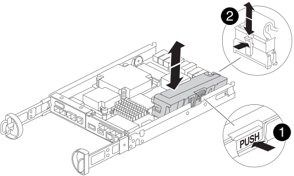

= Remplacez la batterie NVMEM - FAS2800
:allow-uri-read: 
:icons: font
:imagesdir: ../media/

[role="lead"]
Pour remplacer une batterie NVMEM du système, vous devez retirer le module de contrôleur du système, l'ouvrir, remplacer la batterie, puis fermer et remplacer le module de contrôleur.

Tous les autres composants du système doivent fonctionner correctement ; dans le cas contraire, vous devez contacter https://mysupport.netapp.com/site/global/dashboard["Support NetApp"].

== Étape 1 : arrêtez le contrôleur défaillant

Pour arrêter le contrôleur défaillant, vous devez déterminer l'état du contrôleur et, si nécessaire, prendre le contrôle de façon à ce que le contrôleur en bonne santé continue de transmettre des données provenant du stockage défaillant du contrôleur.

Si vous avez un cluster avec plus de deux nœuds, il doit être dans le quorum. Si le cluster n'est pas au quorum ou si un contrôleur en bonne santé affiche la valeur false pour l'éligibilité et la santé, vous devez corriger le problème avant de désactiver le contrôleur défaillant ; voir link:https://docs.netapp.com/us-en/ontap/system-admin/synchronize-node-cluster-task.html?q=Quorum["Synchroniser un nœud avec le cluster"^].

.Étapes
. Si AutoSupport est activé, supprimez la création automatique de dossier en invoquant un message AutoSupport : `system node autosupport invoke -node * -type all -message MAINT=_number_of_hours_down_h`
+
Le message AutoSupport suivant supprime la création automatique de dossiers pendant deux heures : `cluster1:*> system node autosupport invoke -node * -type all -message MAINT=2h`

. Si le contrôleur défectueux fait partie d'une paire HA, désactivez le rétablissement automatique à partir de la console du contrôleur en bon état : `storage failover modify -node local -auto-giveback false`
. Faites passer le contrôleur douteux à l'invite DU CHARGEUR :
+
[cols="1,2"]
|===
| Si le contrôleur en état de fonctionnement s'affiche... | Alors... 

 a| 
Invite DU CHARGEUR
 a| 
Passez à la section retrait du module de contrôleur.

 a| 
Attente du retour...
 a| 
Appuyez sur Ctrl-C, puis répondez `y`.

 a| 
Invite système ou invite de mot de passe (entrer le mot de passe système)
 a| 
Prendre le contrôle défectueux ou l'arrêter à partir du contrôleur en bon état : `storage failover takeover -ofnode _impaired_node_name_`

Lorsque le contrôleur douteux s'affiche en attente de rétablissement..., appuyez sur Ctrl-C et répondez `y`.

|===

== Étape 2 : retirez et ouvrez le module de contrôleur

Retirez et ouvrez le module de contrôleur.

.Étapes
. Si vous n'êtes pas déjà mis à la terre, mettez-vous à la terre correctement.
. Desserrez le crochet et la bride de boucle qui relient les câbles au périphérique de gestion des câbles, puis débranchez les câbles système et les SFP (si nécessaire) du module de contrôleur, en maintenant une trace de l'emplacement où les câbles ont été connectés.
+
Laissez les câbles dans le périphérique de gestion des câbles de sorte que lorsque vous réinstallez le périphérique de gestion des câbles, les câbles sont organisés.

. Retirez et mettez de côté les dispositifs de gestion des câbles des côtés gauche et droit du module de contrôleur.
. Appuyez sur le loquet de la poignée de came jusqu'à ce qu'elle se libère, ouvrez complètement la poignée de came pour libérer le module de contrôleur du fond de panier central, puis, à deux mains, tirez le module de contrôleur à mi-chemin hors du châssis.
+
image::../media/drw_2850_pcm_remove_install_IEOPS-694.svg[drw 2850 pcm déposer l'installation IOPS 694]

. Vérifiez le voyant NVMEM situé à l'arrière du module de contrôleur.  Recherchez l'icône NV :
+
image::../media/drw_hw_nvram_icon.svg[icône drw hw nvram]

+

NOTE: Le voyant vert NV situé sur la façade clignote lorsque le contrôleur est mis hors tension si le système était en état « en attente de rétablissement » ou si le système n'a pas été repris ou arrêté correctement (données non validées).  Si le module de contrôleur défectueux n'a pas été repris avec succès par le module de contrôleur partenaire, contactez https://mysupport.netapp.com/site/global/dashboard["Support NetApp"]

+
** Si le voyant vert d'état NV commence à clignoter lorsque le module de contrôleur est retiré du châssis :
+
*** Vérifiez que le contrôleur a subi un basculement net par le module de contrôleur partenaire ou que le contrôleur défectueux affiche _waiting for giveback_, le voyant clignotant peut être ignoré et vous pouvez terminer le retrait du contrôleur défectueux du châssis.

** Si le voyant vert NV est éteint, vous pouvez terminer le retrait du contrôleur défectueux du châssis.

== Étape 3 : remplacer la batterie NVMEM

Retirez la batterie NVMEM défectueuse du système et remplacez-la par une nouvelle batterie NVMEM.

.Étapes
. Si vous n'êtes pas déjà mis à la terre, mettez-vous à la terre correctement.
. Retirez le module de commande du châssis.
. Retournez le module de contrôleur et placez-le sur une surface plane et stable.
. Ouvrez le capot en appuyant sur les boutons bleus situés sur les côtés du module de contrôleur pour libérer le capot, puis faites pivoter le capot vers le haut et hors du module de contrôleur.
+
image::../media/drw_2850_open_controller_module_cover_IEOPS-695.svg[couvercle du module de contrôleur ouvert drw 2850 IOPS 695]

. Recherchez la batterie NVMEM dans le module de contrôleur.
+
.Animation - remplacez la batterie NV
video::592217fb-4868-4294-a559-af4701725598[panopto]
+

+
[cols="1,3"]
|===

 a| 
image::../media/legend_icon_01.png[Légende 1]
 a| 
Languette de déverrouillage de la batterie

 a| 
image::../media/legend_icon_02.svg[icône de légende 02]
 a| 
Connecteur d'alimentation de la batterie

|===
. Retirez la batterie défectueuse du module de contrôleur :
+
.. Appuyez sur le bouton bleu situé sur le côté du module de contrôleur.
.. Faites glisser la batterie vers le haut jusqu'à ce qu'elle se dégage des supports de fixation, puis retirez la batterie du module de contrôleur.
.. Débranchez la batterie du module de contrôleur

. Retirez la batterie de rechange de son emballage.
Installez la batterie de rechange :
+
.. Rebranchez la fiche de la batterie dans la prise du module de contrôleur.
+
Assurez-vous que la fiche se verrouille dans la prise batterie de la carte mère.

.. Alignement de la batterie avec les supports de fixation sur la paroi latérale en tôle.
.. Faites glisser la batterie vers le bas jusqu'à ce que le loquet de la batterie s'enclenche et s'enclenche dans l'ouverture de la paroi latérale.

. Réinstallez le capot du module de contrôleur et verrouillez-le en place.

== Étape 4 : réinstallez le module de contrôleur

Après avoir remplacé des composants dans le module de contrôleur, réinstallez-les dans le châssis.

.Étapes
. Si vous n'êtes pas déjà mis à la terre, mettez-vous à la terre correctement.
. Si vous ne l'avez pas encore fait, remettez le capot sur le module de contrôleur.
. Retournez le module de contrôleur et alignez l'extrémité sur l'ouverture du châssis.
. Alignez l'extrémité du module de contrôleur avec l'ouverture du châssis, puis poussez doucement le module de contrôleur à mi-course dans le système.
+

NOTE: N'insérez pas complètement le module de contrôleur dans le châssis tant qu'il n'y a pas été demandé.

. Recâblage du système, selon les besoins.
+
Si vous avez retiré les convertisseurs de support (QSFP ou SFP), n'oubliez pas de les réinstaller si vous utilisez des câbles à fibre optique.

. Terminez la réinstallation du module de contrôleur :
+
.. Avec la poignée de came en position ouverte, poussez fermement le module de contrôleur jusqu'à ce qu'il rencontre le fond de panier et soit bien en place, puis fermez la poignée de came en position verrouillée.
+

NOTE: Ne forcez pas trop lorsque vous faites glisser le module de contrôleur dans le châssis pour éviter d'endommager les connecteurs.

+
Le contrôleur commence à démarrer dès qu'il est assis dans le châssis.

.. Si ce n'est déjà fait, réinstallez le périphérique de gestion des câbles.
.. Fixez les câbles au dispositif de gestion des câbles à l'aide du crochet et de la sangle de boucle.

. Redémarrez le module contrôleur.
+

NOTE: Au cours du processus de démarrage, les invites suivantes peuvent s'afficher :

+
** Un message d'avertissement indiquant une discordance d'ID système et demandant de remplacer l'ID système.
** Un avertissement s'affiche lorsque vous passez en mode maintenance dans une configuration HA, vous devez vous assurer que le contrôleur en bon état reste arrêté. Vous pouvez répondre en toute sécurité `y` à ces invites.

== Étape 5 : restaurez le rétablissement automatique et AutoSupport

Restaurez le rétablissement automatique et les AutoSupport s'ils ont été désactivés.

. Restaurez le rétablissement automatique à l'aide de `storage failover modify -node local -auto-giveback true` commande.
. Si une fenêtre de maintenance AutoSupport a été déclenchée, mettez-la fin à l'aide du `system node autosupport invoke -node * -type all -message MAINT=END` commande.

== Étape 6 : renvoyer la pièce défaillante à NetApp

Retournez la pièce défectueuse à NetApp, tel que décrit dans les instructions RMA (retour de matériel) fournies avec le kit. Voir la https://mysupport.netapp.com/site/info/rma["Retour de pièces et remplacements"] page pour plus d'informations.
