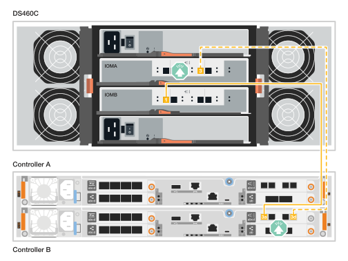

= Câblez le matériel - FAS50
:allow-uri-read: 
:icons: font
:imagesdir: ../media/

[role="lead"]
Une fois que vous avez installé le matériel du système de stockage FAS50, connectez les contrôleurs au réseau et aux tiroirs.

.Avant de commencer
Pour plus d'informations sur la connexion du système de stockage aux commutateurs réseau, contactez votre administrateur réseau.

.Description de la tâche
* Les graphiques de câblage sont dotés d'icônes de flèche indiquant l'orientation correcte (vers le haut ou vers le bas) de la languette du connecteur de câble lors de l'insertion d'un connecteur dans un port.
+
Lorsque vous insérez le connecteur, vous devez le sentir en place ; si vous ne le sentez pas, retirez-le, retournez-le et réessayez.

+
image:../media/drw_cable_pull_tab_direction_ieops-1699.svg["Direction de la languette de tirage du câble"]

* Si vous effectuez un câblage vers un commutateur optique, insérez l'émetteur-récepteur optique dans le port du contrôleur avant de le connecter au port du commutateur.

== Étape 1 : câblez les connexions du cluster/haute disponibilité

Créez les connexions du cluster ONTAP. Dans le cas de clusters sans commutateur, connectez les contrôleurs les uns aux autres. Pour les clusters commutés, connectez les contrôleurs aux commutateurs de réseau du cluster.

[NOTE]
====
Les exemples de câblage cluster/HA montrent des configurations courantes.

Si votre configuration ne s'affiche pas ici, reportez-vous à  la section link:https://hwu.netapp.com["NetApp Hardware Universe"^] pour obtenir des informations complètes sur la configuration et la priorité des connecteurs afin de connecter le câble de votre système de stockage.

====
[role="tabbed-block"]
====
.Câblage switchless cluster Cabling
--
.FAS50 avec un module d'E/S 40/100 GbE à 2 ports
[%collapsible]
=====
.Étapes
. Reliez les connexions d'interconnexion cluster/haute disponibilité :
+

NOTE: Le trafic d'interconnexion de cluster et le trafic haute disponibilité partagent les mêmes ports physiques (sur le module d'E/S du slot 4). Les ports sont 40/100 GbE.

+
.. Connectez le port e4a du contrôleur A au port e4a du contrôleur B.
.. Reliez le port e4b du contrôleur A au port e4b du contrôleur B.
+
*Câbles d'interconnexion cluster/haute disponibilité 100 GbE*

+
image::../media/oie_cable100_gbe_qsfp28.png[Câble 100 GbE haute disponibilité du cluster]

+
image::../media/drw_isi_fas50_switchless_2p_100gbe_cabling_ieops-1937.svg[schéma de câblage du cluster fas50 sans commutateur utilisant un module io 100 gbe]

=====
--
.Câblage commuté du cluster
--
.FAS50 avec un module d'E/S 40/100 GbE à 2 ports
[%collapsible]
=====
. Reliez les contrôleurs aux commutateurs du réseau du cluster :
+

NOTE: Le trafic d'interconnexion de cluster et le trafic haute disponibilité partagent les mêmes ports physiques (sur le module d'E/S du slot 4). Les ports sont 40/100 GbE.

+
.. Reliez le port e4a du contrôleur de câble A au commutateur de réseau du cluster A.
.. Reliez le port e4b du contrôleur A au commutateur de réseau du cluster B.
.. Reliez le port e4a du contrôleur B au commutateur a du réseau du cluster
.. Reliez le port e4b du contrôleur B au commutateur de réseau du cluster B.
+
*Câbles d'interconnexion cluster/haute disponibilité 40/100 GbE*

+
image::../media/oie_cable100_gbe_qsfp28.png[Câble 40/100 GbE haute disponibilité du cluster]

+
image:../media/drw_isi_fas50_2p_100gbe_switched_cluster_cabling_ieops-1936.svg["schéma de câblage du bloc de commande fas50 utilisant un module 100gbe io"]

=====
--
====

== Étape 2 : câblez les connexions réseau de l'hôte

Reliez les contrôleurs à votre réseau hôte Ethernet ou FC.

[NOTE]
====
Les exemples de câblage du réseau hôte montrent des configurations courantes.

Si votre configuration ne s'affiche pas ici, reportez-vous à  la section link:https://hwu.netapp.com["NetApp Hardware Universe"^] pour obtenir des informations complètes sur la configuration et la priorité des connecteurs afin de connecter le câble de votre système de stockage.

====
[role="tabbed-block"]
====
.Câblage hôte Ethernet
--
.FAS50 avec un module d'E/S 10/25 GbE à 4 ports
[%collapsible]
=====
.Étapes
. Sur chaque contrôleur, reliez les ports e2a, e2b, e2c et e2d aux commutateurs de réseau hôte Ethernet.
+
*Câbles 10/25 GbE*

+
image:../media/oie_cable_sfp_gbe_copper.png["Connecteur en cuivre SFP GbE, largeur = 100 px"]

+
image::../media/drw_isi_fas50_4p_25gbe_optional_cabling_ieops-1934.svg[câblage des commutateurs de réseau hôte ethernet fas50 à 10 gbe]

=====
--
.Câblage hôte FC
--
.FAS50 avec un module d'E/S FC 64 Gbit/s à 4 ports
[%collapsible]
=====
.Étapes
. Sur chaque contrôleur, reliez les ports 1a, 1b, 1c et 1D aux commutateurs réseau hôte FC.
+
*Câbles FC 64 Gbit/s*

+
image:../media/oie_cable_sfp_gbe_copper.png["Câble fc de 64 Go, largeur = 100 px"]

+
image::../media/drw_isi_fas50_4p_64gb_fc_optional_cabling_ieops-1935.svg[Câble vers les switchs réseau hôte fc de 64 go]

=====
--
====

== Étape 3 : branchement des câbles du réseau de gestion

Connectez les contrôleurs au réseau de gestion.

. Reliez les ports de gestion (clé anglaise) de chaque contrôleur aux switchs réseau de gestion.
+
*CÂBLES 1000BASE-T RJ-45*

+
image::../media/oie_cable_rj45.png[Câbles RJ-45]

+

IMPORTANT: Ne branchez pas encore les cordons d'alimentation.

== Étape 4 : branchement des tiroirs sur le câble

Les procédures suivantes montrent comment connecter les contrôleurs à un ou deux tiroirs DS460C.

.Description de la tâche
* Les exemples de câblage montrent des tiroirs DS460C. Toutefois, des tiroirs SAS supplémentaires sont pris en charge, voir link:https://hwu.netapp.com["NetApp Hardware Universe"^].
+
Le câblage des autres tiroirs SAS pris en charge est similaire. Voir link:../sas3/install-new-system.html["Installez les tiroirs et câblez-les en cas d'installation d'un nouveau système"^]. Vous pouvez également vous reporter à link:../sas3/overview-cabling-rules-examples.html["Rues de câblage SAS, feuilles de calcul et exemples de présentation"^].

* Pour connaître le nombre maximal de tiroirs pris en charge par votre système de stockage et toutes les options de câblage, telles que les câbles optiques et connectés par commutateur, reportez-vous à link:https://hwu.netapp.com["NetApp Hardware Universe"^]la section .
* Les graphiques présentent le câblage du contrôleur A en bleu et le câblage du contrôleur B en jaune.
* Vous utilisez les câbles de stockage fournis avec votre système de stockage, qui peuvent être de type de câble suivant :
+
*Câble HD mini-SAS*

+
image::../media/oie_cable_mini_sas_hd_to_mini_sas_hd.svg[Câble HD Mini-SAS]

[role="tabbed-block"]
====
.Option 1 : un tiroir DS460C
--
Reliez chaque contrôleur à chaque module IOM12 du tiroir DS460C.

.Étapes
. Connectez les câbles du contrôleur A au tiroir :
+
.. Cable Controller A port 3a vers le port IOMA 1.
.. Port 3d Du contrôleur de câble A vers le port IOMB 3.
+
image:../media/drw_isi_fas50_1_ds460c_controller_a_cabling_ieops-2167.svg["Ports 3a du contrôleur A et câble 3d sur un tiroir DS460C"]

. Câble du contrôleur B vers le tiroir :
+
.. Connectez le port 3a du contrôleur B au port IOMB 1.
.. Port 3d du contrôleur de câble B vers le port IOMA 3.
+

--
.Option 2 : deux tiroirs DS460C
--
Connectez chaque contrôleur aux modules IOM12 des deux tiroirs DS460C.

. Branchez les câbles des connexions tiroir à tiroir :
+
.. Cable Shelf 1 port IOMA 3 à Shelf 2 port IOMA 1.
.. Cable Shelf 1 port IOMB 3 to Shelf 2 port IOMB 1.
+
image:../media/drw_isi_fas50_2_ds460c_shelf_to_shelf_ieops-2172.svg["reliez le tiroir aux connexions du tiroir"]

. Connectez les câbles du contrôleur A aux tiroirs.
+
.. Reliez le port 3a du contrôleur A au port IOMA 1 du tiroir 1.
.. Reliez le port 3d du contrôleur A au port IOMB du tiroir 2 3.
+
image:../media/drw_isi_fas50_2_ds460c_controller_a_cabling_ieops-2170.svg["Les ports 3a du contrôleur A et la 3d sont câblés à deux tiroirs DS460C"]

. Connectez les câbles du contrôleur B aux tiroirs.
+
.. Reliez le port 3a du contrôleur B au port IOMB 1 du tiroir 1.
.. Reliez le port 3d du contrôleur B au port IOMA 3 du tiroir 2.
+
image:../media/drw_isi_fas50_2_ds460c_controller_b_cabling_ieops-2171.svg["Les ports 3a du contrôleur B et la 3d sont reliés à deux tiroirs DS460C"]

--
====
.Et la suite ?
Après avoir câblé le matériel de votre système de stockage, vous link:install-power-hardware.html["mettez le système de stockage sous tension"].
