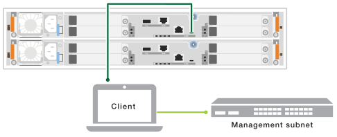

= Mettez le système de stockage sous tension - FAS50
:allow-uri-read: 
:icons: font
:imagesdir: ../media/

[role="lead"]
Lorsque vous connectez les contrôleurs au réseau et aux tiroirs du système de stockage FAS50, vos tiroirs et contrôleurs sont mis sous tension.

== Étape 1 : mettez le tiroir sous tension et attribuez l'ID de tiroir

Chaque tiroir se distingue par un ID de tiroir unique. Cet ID garantit que le tiroir est distinct dans la configuration de votre système de stockage.

.Description de la tâche
* Remarque : pour être valides, les ID de tiroir sont compris entre 01 et 99.
+
Si vous disposez de tiroirs internes (de stockage) intégrés aux contrôleurs, l'ID de tiroir fixe est 00.

* Vous devez mettre un tiroir hors tension et hors tension (mettez celui-ci hors tension sur chacune des alimentations du tiroir SAS, attendez la durée appropriée, puis remettez-le sous tension) pour que l'ID de tiroir prenne effet.

.Étapes
. Mettez le shelf sous tension en connectant d'abord les cordons d'alimentation au shelf, en les fixant en place à l'aide du dispositif de retenue du cordon d'alimentation, en connectant les cordons d'alimentation à des sources d'alimentation sur différents circuits, puis en allumant le bouton d'alimentation sur chacune des alimentations (à l'arrière du shelf).
+
Le tiroir se met sous tension et démarre automatiquement lors de la mise sous tension.

. Retirez le capuchon d'extrémité gauche pour accéder au bouton orange d'ID de tablette sur la façade.
+

+
[cols="20%,80%"]
|===

 a| 
image::../media/icon_round_1.png[Légende numéro 1]
 a| 
Capuchon d'extrémité de tablette

 a| 
image::../media/icon_round_2.png[[Légende numéro 2]
 a| 
Plateau de tablette

 a| 
image::../media/icon_round_3.png[[Légende numéro 3]
 a| 
Bouton de l'ID de tiroir

 a| 
image::../media/icon_round_4.png[[Légende numéro 4]
 a| 
Numéro ID du tiroir

|===
. Modifier le premier numéro de l'ID de tiroir :
+
.. Appuyez sur le bouton d'ID du tiroir et maintenez-le enfoncé jusqu'à ce que le premier chiffre de l'écran numérique clignote, puis relâchez le bouton.
+
Un chiffre peut clignoter pendant 15 secondes. Cela active le mode de programmation de l'ID de tiroir.

+

NOTE: Si l'ID nécessite plus de 15 secondes, appuyez de nouveau sur le bouton d'ID du tiroir et maintenez-le enfoncé, en veillant à appuyer sur le bouton.

.. Appuyez sur le bouton d'ID du tiroir et relâchez-le pour avancer le chiffre jusqu'à ce que vous atteigniez le chiffre souhaité de 0 à 9.
+
La durée de chaque pression et de chaque relâchement peut être aussi courte qu'une seconde.

+
Le premier chiffre continue de clignoter.

. Modifier le second numéro de l'ID de tiroir :
+
.. Appuyez sur le bouton et maintenez-le enfoncé jusqu'à ce que le second chiffre de l'écran numérique clignote.
+
Il peut prendre jusqu'à trois secondes pour que le chiffre clignote.

+
Le premier chiffre de l'écran numérique cesse de clignoter.

.. Appuyez sur le bouton d'ID du tiroir et relâchez-le pour avancer le chiffre jusqu'à ce que vous atteigniez le chiffre souhaité de 0 à 9.
+
Le second chiffre continue de clignoter.

. Verrouillez le chiffre souhaité et quittez le mode de programmation en appuyant sur le bouton d'ID du tiroir et en le maintenant enfoncé jusqu'à ce que le second chiffre ne clignote plus.
+
Un chiffre qui ne clignote plus pendant trois secondes peut s'arrêter.

+
Les deux chiffres de l'écran numérique commencent à clignoter et le voyant orange s'allume au bout de cinq secondes environ pour vous avertir que l'ID du tiroir en attente n'a pas encore pris effet.

. Mettez le tiroir sous tension pendant au moins 10 secondes pour valider l'ID de tiroir.
+
.. Mettez l'interrupteur d'alimentation sur chacune des alimentations hors tension.
.. Attendre 10 secondes.
.. Mettez le bouton de mise sous tension de chaque bloc d'alimentation sous tension pour terminer la mise hors/sous tension.
+
Lorsqu'une alimentation est sous tension, le voyant bicolore doit s'allumer en vert.

. Remettez le capuchon d'extrémité gauche en place.

== Étape 2 : mettez les contrôleurs sous tension

Une fois que vous avez mis vos tiroirs sous tension et attribué des ID uniques, mettez les contrôleurs de stockage sous tension.

.Étapes
. Connectez votre ordinateur portable au port série console. Cela vous permettra de surveiller la séquence d'amorçage lorsque les contrôleurs sont sous tension.
+
.. Définissez le port série console de l'ordinateur portable sur 115,200 bauds avec le N-8-1.
+

NOTE: Consultez l'aide en ligne de votre ordinateur portable pour obtenir des instructions sur la configuration du port série console.

.. À l'aide du câble de console fourni avec votre système de stockage, connectez une extrémité du câble de console à votre ordinateur portable et l'autre extrémité au port série console du contrôleur A.
.. Connectez l'ordinateur portable au commutateur du sous-réseau de gestion.
+

. Attribuez une adresse TCP/IP à l'ordinateur portable, en utilisant une adresse située sur le sous-réseau de gestion.
. Branchez les câbles d'alimentation aux alimentations du contrôleur, puis connectez-les à des sources d'alimentation de différents circuits.
+
image::../media/drw_psu_layout_1_ieops-1886.svg[Schéma de connexion de l'alimentation du système de stockage A20, A30 ou A50]

+
** Le système commence à démarrer. Le démarrage initial peut prendre jusqu'à huit minutes.
** Les LED clignotent et les ventilateurs démarrent, ce qui indique que les contrôleurs sont sous tension.
** Les ventilateurs sont peut-être très bruyants lors du premier démarrage. Le bruit du ventilateur au démarrage est normal.
** L'ID de tiroir affiché à l'avant du châssis du système ne s'allume pas.

. Fixez les cordons d'alimentation à l'aide du dispositif de fixation de chaque bloc d'alimentation. :fas50-a20-30-50!:

.Et la suite ?
Après avoir mis votre système de stockage sous tension, vous link:install-complete.html["terminez l'installation et la configuration du système"].
