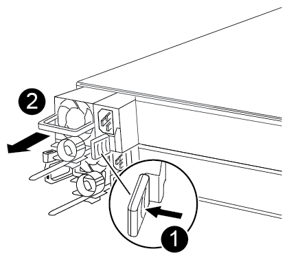

= Remplacez le matériel du module de contrôleur - FAS500f
:allow-uri-read: 
:icons: font
:imagesdir: ../media/

[role="lead"]
Pour remplacer le matériel du module de contrôleur, vous devez retirer le contrôleur défectueux, déplacer les composants FRU vers le module de contrôleur de remplacement, installer le module de contrôleur de remplacement dans le châssis, puis démarrer le système en mode de maintenance.

== Étape 1 : retirer le module de contrôleur

[role="lead"]
Vous devez retirer le module de contrôleur du châssis lorsque vous remplacez un composant dans le module de contrôleur.

Assurez-vous d'étiqueter les câbles de manière à connaître leur origine.

Vous pouvez utiliser la vidéo suivante ou les étapes tabulées pour remplacer un module de contrôleur :

.Animation - remplacer un module de contrôleur
video::ab0ebe6b-e891-489c-aab4-ac5b015c8f01[panopto]
. Si vous n'êtes pas déjà mis à la terre, mettez-vous à la terre correctement.
. Débranchez les blocs d'alimentation du module de contrôleur de la source.
. Libérez les dispositifs de retenue du câble d'alimentation, puis débranchez les câbles des blocs d'alimentation.
. Insérez votre index dans le mécanisme de verrouillage de chaque côté du module de contrôleur, appuyez sur le levier avec votre pouce et tirez doucement le contrôleur à quelques pouces du châssis.
+

NOTE: Si vous avez des difficultés à retirer le module de contrôleur, placez vos doigts à travers les trous des doigts de l'intérieur (en croisant vos bras).

+
image::../media/drw_a250_pcm_remove_install.png[le module de commande du groupe motopropulseur du drw a250 dépose l'installation]

+
|===

 a| 
image:../media/legend_icon_01.png[""]
| Levier 

 a| 
image:../media/legend_icon_02.png[""]
 a| 
Mécanisme de verrouillage

|===
. À l'aide des deux mains, saisissez les côtés du module de contrôleur et tirez-le doucement hors du châssis et posez-le sur une surface plane et stable.
. Tournez la vis moletée située à l'avant du module de contrôleur dans le sens anti-horaire et ouvrez le capot du module de contrôleur.
+
image::../media/drw_a250_open_controller_module_cover.png[ouvrir le couvercle du module de contrôleur drw a250]

+
|===

 a| 
image:../media/legend_icon_01.png[""]
| Vis moletée 

 a| 
image:../media/legend_icon_02.png[""]
 a| 
Capot du module de contrôleur.

|===
. Soulever le couvercle du conduit d'air.
+
image::../media/drw_a250_remove_airduct_cover.png[drw a250 déposer le couvercle du conduit d'air]

== Étape 2 : déplacer le bloc d'alimentation

[role="lead"]
Lorsque vous remplacez un module de contrôleur, vous devez déplacer le bloc d'alimentation du module de contrôleur endommagé vers le module de contrôleur de remplacement.

. Débrancher le bloc d'alimentation.
. Ouvrez le dispositif de retenue du câble d'alimentation, puis débranchez le câble d'alimentation du bloc d'alimentation.
. Débranchez le câble d'alimentation de la source d'alimentation.
. Faites tourner la poignée de came de façon à pouvoir tirer le bloc d'alimentation hors du module de contrôleur tout en appuyant sur la patte de verrouillage.
+

CAUTION: Ne forcez pas trop lorsque vous faites glisser le module de contrôleur dans le châssis pour éviter d'endommager les connecteurs.

+

+
|===

 a| 
image:../media/legend_icon_01.png[""]
| Languette bleue de verrouillage du bloc d'alimentation 

 a| 
image:../media/legend_icon_02.png[""]
 a| 
Alimentation électrique

|===
. Déplacez le bloc d'alimentation vers le nouveau module de contrôleur, puis installez-le.
. À l'aide des deux mains, soutenez et alignez les bords du bloc d'alimentation avec l'ouverture du module de contrôleur, puis poussez doucement le bloc d'alimentation dans le module de contrôleur jusqu'à ce que la languette de verrouillage s'enclenche.
+
Les blocs d'alimentation ne s'enclenteront correctement qu'avec le connecteur interne et se verrouillent d'une seule manière.

+

IMPORTANT: Pour éviter d'endommager le connecteur interne, ne pas exercer de force excessive lors du glissement du bloc d'alimentation dans le système.

== Étape 3 : déplacer les ventilateurs

[role="lead"]
Vous devez déplacer les ventilateurs du module de contrôleur défectueux vers le module de remplacement lors du remplacement d'un module de contrôleur défectueux.

. Retirez le module de ventilateur en pinçant le côté du module de ventilateur, puis en soulevant le module de ventilateur pour le sortir du module de contrôleur.
+
image::../media/drw_a250_replace_fan.png[drw a250 remplacer le ventilateur]

+
|===

 a| 
image:../media/legend_icon_01.png[""]
| Module de ventilateur 
|===
. Déplacez le module de ventilateur vers le module de contrôleur de remplacement, alignez les bords du module de ventilateur avec l'ouverture du module de contrôleur, puis faites glisser le module de ventilateur vers l'intérieur.
. Répétez ces étapes pour les autres modules de ventilation.

== Étape 4 : déplacer le support de démarrage

[role="lead"]
Le AFF A250 se trouve sous le conduit d'air dans le module de contrôleur. Vous devez le déplacer du module de contrôleur défaillant vers le module de contrôleur de remplacement.

Vous avez besoin d'un tournevis à tête cruciforme magnétique n° 1 pour retirer la vis qui maintient le support de démarrage en place. En raison des contraintes d'espace dans le module de contrôleur, vous devez également disposer d'un aimant pour transférer la vis à afin de ne pas la perdre.

. Localisez et déplacez le support de démarrage du module de contrôleur pour facultés affaiblies vers le module de contrôleur de remplacement.
+
image::../media/drw_a250_replace_boot_media.png[drw a250 remplace le support de démarrage]

+
|===

 a| 
image:../media/legend_icon_01.png[""]
| Retirez la vis qui fixe le support de démarrage à la carte mère du module de contrôleur pour facultés affaiblies. 

 a| 
image:../media/legend_icon_02.png[""]
 a| 
Soulevez le support de démarrage pour le retirer du module de contrôleur défaillant.

|===
+
.. A l'aide du tournevis magnétique n° 1, retirez la vis du support de coffre et mettez-la de côté en toute sécurité sur l'aimant.
.. Soulevez doucement le support de démarrage directement hors du support et alignez-le en place dans le module de contrôleur de remplacement.
.. A l'aide du tournevis magnétique n° 1, insérez et serrez la vis sur le support de démarrage.
+

NOTE: Ne pas exercer de force lors du serrage de la vis sur le support de soufflet ; vous pouvez le fissurer.

== Étape 5 : déplacez les modules DIMM

[role="lead"]
Pour déplacer les modules DIMM, localisez-les et déplacez-les du contrôleur défaillant vers le contrôleur de remplacement et suivez la séquence d'étapes spécifique.

image::../media/drw_a250_dimm_replace.png[remplacement du module dimm drw a250]

IMPORTANT: Installez chaque module DIMM dans le même emplacement qu'il a occupé dans le module de contrôleur défaillant.

. Poussez lentement les languettes de l'éjecteur de module DIMM de chaque côté du module DIMM, puis faites glisser le module DIMM hors de son logement.
+

IMPORTANT: Tenez le module DIMM par les bords pour éviter toute pression sur les composants de la carte de circuit DIMM.

. Localisez le slot DIMM correspondant sur le module de contrôleur de remplacement.
. Assurez-vous que les languettes de l'éjecteur de DIMM sur le support DIMM sont en position ouverte, puis insérez le module DIMM directement dans le support.
+
Les barrettes DIMM s'adaptent bien dans le support. Si ce n'est pas le cas, réinsérez le module DIMM pour le réaligner avec le support.

. Inspectez visuellement le module DIMM pour vérifier qu'il est bien aligné et complètement inséré dans le support.
. Répétez ces étapes pour le module DIMM restant.

== Étape 6 : déplacez une carte mezzanine

[role="lead"]
Pour déplacer une carte mezzanine, vous devez retirer le câblage et les modules SFP et SFP des ports, déplacer la carte mezzanine vers le contrôleur de remplacement, réinstaller les modules SFP et SFP sur les ports et brancher les ports.

. Localisez et déplacez les cartes mezzanine de votre module de contrôleur pour malvoyants.
+
image::../media/drw_a250_replace_mezz_card.png[le drw a250 remplace la carte mezz]

+
|===

 a| 
image:../media/legend_icon_01.png[""]
| Retirez les vis sur la face du module de contrôleur. 

 a| 
image:../media/legend_icon_02.png[""]
 a| 
Desserrez la vis du module de contrôleur.

 a| 
image:../media/legend_icon_03.png[""]
 a| 
Déplacez la carte mezzanine.

|===
. Débranchez tous les câbles associés à la carte mezzanine.
+
Assurez-vous d'étiqueter les câbles de manière à connaître leur origine.

+
.. Retirez tous les modules SFP ou QSFP qui pourraient se trouver dans la carte mezzanine et mettez-le de côté.
.. À l'aide du tournevis magnétique n° 1, retirez les vis de la face du module de contrôleur défaillant et de la carte mezzanine, puis mettez-les de côté en toute sécurité sur l'aimant.
.. Soulevez doucement la carte mezzanine hors du support et placez-la dans la même position dans le contrôleur de remplacement.
.. Alignez doucement la carte mezzanine en place dans le contrôleur de remplacement.
.. A l'aide du tournevis magnétique n° 1, insérez et serrez les vis sur la face du module de contrôleur de remplacement et sur la carte mezzanine.
+

NOTE: Ne forcez pas lors du serrage de la vis sur la carte mezzanine ; vous pouvez la fissurer.

. Répétez ces étapes si une autre carte mezzanine est présente dans le module de contrôleur pour facultés affaiblies.
. Insérez les modules SFP ou QSFP qui ont été retirés sur la carte mezzanine.

== Étape 7 : déplacer la batterie NV

[role="lead"]
Lors du remplacement du module de contrôleur, vous devez déplacer la batterie NV du module de contrôleur défaillant vers le module de contrôleur de remplacement.

. Localisez et déplacez la batterie NVMEM de votre module de contrôleur pour facultés affaiblies vers le module de contrôleur de remplacement.
+
image::../media/drw_a250_replace_nvmem_batt.png[drw a250 remplacer la batterie nvmem]

+
|===

 a| 
image:../media/legend_icon_01.png[""]
| Pressez le clip sur la face de la prise mâle batterie. 

 a| 
image:../media/legend_icon_02.png[""]
 a| 
Débrancher le câble de batterie de la prise.

 a| 
image:../media/legend_icon_03.png[""]
 a| 
Saisissez la batterie et appuyez sur la languette bleue de verrouillage marquée PUSH.

 a| 
image:../media/legend_icon_04.png[""]
 a| 
Soulevez la batterie pour la sortir du support et du module de contrôleur.

|===
. Localisez la fiche mâle batterie et appuyez sur le clip situé sur la face de la fiche mâle batterie pour dégager la fiche mâle de la prise.
. Saisissez la batterie et appuyez sur la languette de verrouillage bleue indiquant « POUSSER », puis soulevez la batterie pour la sortir du support et du module de contrôleur.
. Localisez le support de batterie NV correspondant sur le module de contrôleur de remplacement et alignez la batterie NV sur le support de batterie.
. Insérez la fiche de la batterie NV dans la prise.
. Faites glisser le bloc-batterie vers le bas le long de la paroi latérale en tôle jusqu'à ce que les pattes de support situées sur le crochet mural latéral s'engagent dans les fentes de la batterie et que le loquet du bloc-batterie s'enclenche et s'enclenche dans l'ouverture de la paroi latérale.
. Appuyez fermement sur la batterie pour vous assurer qu'elle est bien verrouillée.

== Étape 8 : installer le module de contrôleur

[role="lead"]
Après avoir déplacé tous les composants du module de contrôleur défaillant vers le module de contrôleur de remplacement, vous devez installer le module de contrôleur de remplacement dans le châssis, puis le démarrer en mode maintenance.

Vous pouvez utiliser l'illustration suivante ou les étapes écrites pour installer le module de contrôleur de remplacement dans le châssis.

. Si ce n'est déjà fait, installez le conduit d'air.
+
image::../media/drw_a250_install_airduct_cover.png[drw a250 installer le couvercle de la conduite d'air]

. Fermez le capot du module de contrôleur et serrez la vis à molette.
+
image::../media/drw_a250_close_controller_module_cover.png[drw a250 fermer le couvercle du module de commande]

+
|===

 a| 
image:../media/legend_icon_01.png[""]
| Capot du module de contrôleur 

 a| 
image:../media/legend_icon_02.png[""]
 a| 
Vis moletée

|===
. Alignez l'extrémité du module de contrôleur avec l'ouverture du châssis, puis poussez doucement le module de contrôleur à mi-course dans le système.
+

NOTE: N'insérez pas complètement le module de contrôleur dans le châssis tant qu'il n'y a pas été demandé.

. Reliez uniquement les ports de gestion et de console, de sorte que vous puissiez accéder au système pour effectuer les tâches décrites dans les sections ci-après.
+

NOTE: Vous connecterez le reste des câbles au module de contrôleur plus loin dans cette procédure.

. Insérer le module de contrôleur dans le châssis.
. S'assurer que les bras du mécanisme de verrouillage sont verrouillés en position complètement sortie.
. À l'aide des deux mains, alignez et faites glisser doucement le module de commande dans les bras du mécanisme de verrouillage jusqu'à ce qu'il s'arrête.
. Placez vos doigts à travers les trous des doigts depuis l'intérieur du mécanisme de verrouillage.
. Enfoncez vos pouces sur les pattes orange situées sur le mécanisme de verrouillage et poussez doucement le module de commande au-dessus de la butée.
. Libérez vos pouces de la partie supérieure des mécanismes de verrouillage et continuez à pousser jusqu'à ce que les mécanismes de verrouillage s'enclenchent.
+
Le module de contrôleur commence à démarrer dès qu'il est complètement inséré dans le châssis. Soyez prêt à interrompre le processus de démarrage.

+
Le module de contrôleur doit être complètement inséré et aligné avec les bords du châssis.

