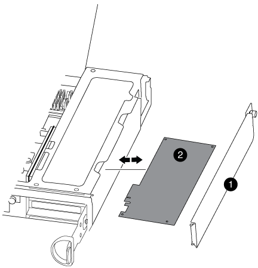
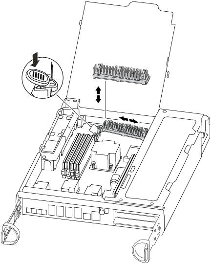

= Remplacez le matériel du module de contrôleur - FAS8200
:allow-uri-read: 
:icons: font
:imagesdir: ../media/

[role="lead"]
Pour remplacer le matériel du module de contrôleur, vous devez retirer le contrôleur défectueux, déplacer les composants FRU vers le module de contrôleur de remplacement, installer le module de contrôleur de remplacement dans le châssis, puis démarrer le système en mode de maintenance.

== Étape 1 : ouvrir le module de contrôleur

Pour remplacer le module de contrôleur, vous devez d'abord retirer l'ancien module de contrôleur du châssis.

. Si vous n'êtes pas déjà mis à la terre, mettez-vous à la terre correctement.
. Desserrez le crochet et la bride de boucle qui relient les câbles au périphérique de gestion des câbles, puis débranchez les câbles système et les SFP (si nécessaire) du module de contrôleur, en maintenant une trace de l'emplacement où les câbles ont été connectés.
+
Laissez les câbles dans le périphérique de gestion des câbles de sorte que lorsque vous réinstallez le périphérique de gestion des câbles, les câbles sont organisés.

. Retirez et mettez de côté les dispositifs de gestion des câbles des côtés gauche et droit du module de contrôleur.
+
image::../media/drw_32xx_cbl_mgmt_arm.png[Retrait des bras de gestion des câbles][]

. Si vous avez quitté les modules SFP dans le système après avoir retiré les câbles, déplacez-les vers le nouveau module de contrôleur.
. Desserrez la vis moletée sur la poignée de came du module de contrôleur.
+
image::../media/drw_8020_cam_handle_thumbscrew.png[Desserrez la vis moletée pour ouvrir la poignée de came]

+
|===

 a| 
image:../media/legend_icon_01.png["Légende numéro 1"]
| Vis moletée 

 a| 
image:../media/legend_icon_02.png["Légende numéro 2"]
 a| 
Poignée de came

|===
. Tirez la poignée de came vers le bas et commencez à faire glisser le module de contrôleur hors du châssis.
+
Assurez-vous de prendre en charge la partie inférieure du module de contrôleur lorsque vous le faites glisser hors du châssis.

== Étape 2 : déplacer le périphérique d'amorçage

Vous devez localiser le support de démarrage et suivre les instructions pour le retirer de l'ancien contrôleur et l'insérer dans le nouveau contrôleur.

. Recherchez le support de démarrage à l'aide de l'illustration suivante ou du mappage des FRU sur le module de contrôleur :
+
image::../media/drw_rxl_boot_media.png[Retrait du support de démarrage hte]

. Appuyez sur le bouton bleu du logement du support de démarrage pour libérer le support de démarrage de son logement, puis tirez-le doucement hors du support de démarrage.
+

NOTE: Ne faites pas tourner ou tirer le support de démarrage directement vers le haut, car cela pourrait endommager le support ou le support de démarrage.

. Déplacez le support de démarrage vers le nouveau module de contrôleur, alignez les bords du support de démarrage avec le boîtier du support, puis poussez-le doucement dans le support.
. Vérifiez le support de démarrage pour vous assurer qu'il est bien en place dans le support.
+
Si nécessaire, retirez le support de démarrage et réinstallez-le dans le support.

. Poussez le support de démarrage vers le bas pour engager le bouton de verrouillage sur le boîtier du support de démarrage.

== Étape 3 : déplacer la batterie NVMEM

Pour déplacer la batterie NVMEM de l'ancien module de contrôleur vers le nouveau module de contrôleur, vous devez effectuer une séquence spécifique d'étapes.

. Vérifiez le voyant NVMEM :
+
** Si votre système est dans une configuration haute disponibilité, passez à l'étape suivante.
** Si votre système est dans une configuration autonome, arrêtez correctement le module de contrôleur, puis vérifiez le voyant NVRAM identifié par l'icône NV.
+
image::../media/drw_hw_nvram_icon.png[LED NV]

+

NOTE: Le voyant NVRAM clignote lors de l'installation du contenu dans la mémoire flash lorsque vous arrêtez le système. Une fois le transfert terminé, le voyant s'éteint.

+
*** Si l'alimentation est perdue sans arrêt correct, la LED NVMEM clignote jusqu'à ce que le transfert soit terminé, puis la LED s'éteint.
*** Si le voyant est allumé et que l'alimentation est allumée, les données non écrites sont stockées sur NVMEM.
+
Cela se produit généralement lors d'un arrêt non contrôlé après le démarrage du système ONTAP.

. Ouvrez le conduit d'air de la CPU et localisez la batterie NVMEM.
+
image::../media/drw_rxl_nvmem_battery.png[Remplacement de la batterie NVMEM]

+
|===

 a| 
image:../media/legend_icon_01.png["Légende numéro 1"]
| Languette de verrouillage de la batterie 

 a| 
image:../media/legend_icon_02.png["Légende numéro 2"]
 a| 
Batterie NVMEM

|===
. Saisissez la batterie et appuyez sur la languette de verrouillage bleue indiquant « POUSSER », puis soulevez la batterie pour la sortir du support et du module de contrôleur.
. Retirez la batterie du module de contrôleur et mettez-la de côté.

== Étape 4 : déplacez les modules DIMM

Pour déplacer les modules DIMM, localisez-les et déplacez-les de l'ancien contrôleur vers le contrôleur de remplacement et suivez la séquence d'étapes spécifique.

. Localisez les modules DIMM de votre module de contrôleur.
. Notez l'orientation du module DIMM dans le support afin que vous puissiez insérer le module DIMM dans le module de remplacement dans le bon sens.
. Éjectez le module DIMM de son logement en écartant lentement les deux languettes de l'éjecteur de DIMM de chaque côté du module DIMM, puis en faisant glisser le module DIMM hors de son logement.
+

NOTE: Tenez soigneusement le module DIMM par les bords pour éviter toute pression sur les composants de la carte de circuit DIMM.

+
Le nombre et le positionnement des modules DIMM du système dépendent du modèle de votre système.

+
L'illustration suivante montre l'emplacement des DIMM système :

+
image::../media/drw_rxl_dimms.png[Remplacement des modules DIMM]

. Repérez le logement où vous installez le module DIMM.
. Assurez-vous que les languettes de l'éjecteur de DIMM sur le connecteur sont en position ouverte, puis insérez le module DIMM directement dans le logement.
+
Le module DIMM s'insère bien dans le logement, mais devrait être facilement installé. Si ce n'est pas le cas, réalignez le module DIMM avec le logement et réinsérez-le.

+

NOTE: Inspectez visuellement le module DIMM pour vérifier qu'il est bien aligné et complètement inséré dans le logement.

. Répétez ces étapes pour les autres modules DIMM.
. Déplacez la batterie NVMEM vers le module de contrôleur de remplacement.
. Alignez la languette ou les languettes du support de batterie avec les encoches du côté du module de contrôleur, puis appuyez doucement sur le boîtier de la batterie jusqu'à ce que le boîtier de la batterie s'enclenche.

== Étape 5 : déplacer une carte PCIe

Pour déplacer des cartes PCIe, localisez-les de l'ancien contrôleur et déplacez-les vers le contrôleur de remplacement, puis suivez les étapes spécifiques.

Vous devez être prêt pour le nouveau module de contrôleur afin de pouvoir déplacer les cartes PCIe directement de l'ancien module de contrôleur vers les connecteurs correspondants du nouveau.

. Desserrez la vis moletée sur le panneau latéral du module de contrôleur.
. Faire pivoter le panneau latéral pour le retirer du module de contrôleur.
+

+
|===

 a| 
image:../media/legend_icon_01.png["Légende numéro 1"]

 a| 
Panneau latéral

 a| 
image:../media/legend_icon_02.png["Légende numéro 2"]

 a| 
Carte PCIe

|===
. Retirez la carte PCIe de l'ancien module de contrôleur et mettez-la de côté.
+
Assurez-vous de garder une trace de l'emplacement de la carte PCIe.

. Répétez l'étape précédente pour les autres cartes PCIe de l'ancien module de contrôleur.
. Ouvrez le nouveau panneau latéral du module de contrôleur, si nécessaire, faites glisser la plaque de remplissage de la carte PCIe, si nécessaire, et installez avec précaution la carte PCIe.
+
Assurez-vous d'aligner correctement la carte dans la fente et d'exercer une pression uniforme sur la carte lorsqu'elle est insérée dans la prise. La carte doit être complètement et uniformément insérée dans le logement.

. Répétez l'étape précédente pour les autres cartes PCIe que vous avez mises de côté.
. Fermez le panneau latéral et serrez la vis à molette.

== Étape 6 : déplacer un module de mise en cache

Vous devez déplacer les modules de cache des modules de contrôleur douteux vers le module de contrôleur de remplacement lors du remplacement d'un module de contrôleur.

. Recherchez le module de mise en cache à l'arrière du module de contrôleur et retirez-le :
+
.. Appuyez sur la languette de dégagement.
.. Retirez le dissipateur de chaleur.
+
Le système de stockage est fourni avec deux emplacements disponibles pour le module de cache et un seul emplacement est occupé, par défaut.

+

. Déplacez le module de cache vers le nouveau module de contrôleur, puis alignez les bords du module de cache avec le boîtier du support et poussez-le doucement dans le support.
. Vérifiez que le module de mise en cache est bien placé dans le support. Si nécessaire, retirez le module de cache et réinstallez-le dans le support.
. Réinstallez et poussez le dissipateur de chaleur vers le bas pour engager le bouton de verrouillage sur le boîtier du module de cache.
. Répétez les étapes si vous avez un deuxième module de cache. Fermez le capot du module de contrôleur.

== Étape 7 : installer le contrôleur

Après avoir installé les composants de l'ancien module de contrôleur dans le nouveau module de contrôleur, vous devez installer le nouveau module de contrôleur dans le châssis du système et démarrer le système d'exploitation.

Pour les paires haute disponibilité avec deux modules de contrôleur dans le même châssis, l'ordre dans lequel vous installez le module de contrôleur est particulièrement important, car il tente de redémarrer dès que vous le placez entièrement dans le châssis.

NOTE: Le système peut mettre à jour le firmware du système lors de son démarrage. N'interrompez pas ce processus. La procédure requiert l'interruption du processus d'amorçage, que vous pouvez généralement faire à tout moment après l'invite à le faire. Toutefois, si le système met à jour le firmware du système lors de son démarrage, vous devez attendre la fin de la mise à jour avant d'interrompre le processus de démarrage.

. Si vous n'êtes pas déjà mis à la terre, mettez-vous à la terre correctement.
. Si ce n'est déjà fait, fermez le conduit d'air de l'UC.
. Alignez l'extrémité du module de contrôleur avec l'ouverture du châssis, puis poussez doucement le module de contrôleur à mi-course dans le système.
+

NOTE: N'insérez pas complètement le module de contrôleur dans le châssis tant qu'il n'y a pas été demandé.

. Reliez uniquement les ports de gestion et de console, de sorte que vous puissiez accéder au système pour effectuer les tâches décrites dans les sections ci-après.
+

NOTE: Vous connecterez le reste des câbles au module de contrôleur plus loin dans cette procédure.

. Terminez la réinstallation du module de contrôleur :
+
[cols="1,2"]
|===
| Si votre système est en... | Ensuite, procédez comme suit... 

 a| 
Une paire haute disponibilité
 a| 
 The controller module begins to boot as soon as it is fully seated in the chassis. Be prepared to interrupt the boot process.
.. Avec la poignée de came en position ouverte, poussez fermement le module de contrôleur jusqu'à ce qu'il rencontre le fond de panier et soit bien en place, puis fermez la poignée de came en position verrouillée. Serrez la vis moletée sur la poignée de came à l'arrière du module de contrôleur.
+

NOTE: Ne forcez pas trop lorsque vous faites glisser le module de contrôleur dans le châssis pour éviter d'endommager les connecteurs.

+
Le contrôleur commence à démarrer dès qu'il est assis dans le châssis.

.. Si ce n'est déjà fait, réinstallez le périphérique de gestion des câbles.
.. Fixez les câbles au dispositif de gestion des câbles à l'aide du crochet et de la sangle de boucle.
.. Lorsque le message s'affiche `Press Ctrl-C for Boot Menu`, appuyez sur `Ctrl-C` pour interrompre le processus de démarrage.
+

NOTE: Si l'invite et le module de contrôleur ne démarre pas sur ONTAP, entrez `halt`, Puis à l'invite DU CHARGEUR, entrez `boot_ontap`, appuyez sur `Ctrl-C` Lorsque vous y êtes invité, puis démarrez en mode de maintenance.

.. Sélectionnez l'option pour démarrer en mode maintenance dans le menu qui s'affiche.

 a| 
Une configuration autonome
 a| 
.. Avec la poignée de came en position ouverte, poussez fermement le module de contrôleur jusqu'à ce qu'il rencontre le fond de panier et soit bien en place, puis fermez la poignée de came en position verrouillée. Serrez la vis moletée sur la poignée de came à l'arrière du module de contrôleur.
+

NOTE: Ne forcez pas trop lorsque vous faites glisser le module de contrôleur dans le châssis pour éviter d'endommager les connecteurs.

.. Si ce n'est déjà fait, réinstallez le périphérique de gestion des câbles.
.. Fixez les câbles au dispositif de gestion des câbles à l'aide du crochet et de la sangle de boucle.
.. Rebranchez les câbles d'alimentation aux blocs d'alimentation et aux sources d'alimentation, mettez le système sous tension pour démarrer le processus de démarrage, puis appuyez sur `Ctrl-C` après que vous ayez vu le `Press Ctrl-C for Boot Menu` messagerie.
+

NOTE: Si l'invite et le module de contrôleur ne démarre pas sur ONTAP, entrez `halt`, Puis à l'invite DU CHARGEUR, entrez `boot_ontap`, appuyez sur `Ctrl-C` Lorsque vous y êtes invité, puis démarrez en mode de maintenance.

.. Dans le menu de démarrage, sélectionner l'option pour le mode maintenance.

|===
+
*Important:* pendant le processus de démarrage, vous pouvez voir les invites suivantes:

+
** Un message d'avertissement indiquant une discordance d'ID système et demandant de remplacer l'ID système.
** Un avertissement s'affiche lorsque vous passez en mode maintenance dans une configuration HA, vous devez vous assurer que le contrôleur en bon état reste arrêté. Vous pouvez répondre en toute sécurité `y` à ces invites.

