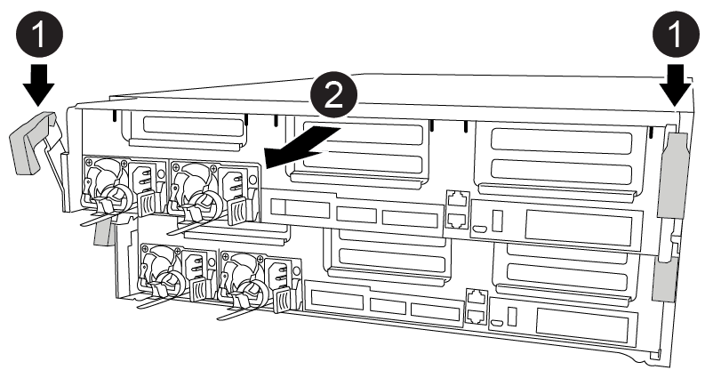

= Remplacez un module DIMM - FAS8300 et FAS8700
:allow-uri-read: 
:icons: font
:imagesdir: ../media/

[role="lead"]
Vous devez remplacer un module DIMM dans le module de contrôleur lorsque votre système enregistre un nombre croissant de codes de correction d'erreurs (ECC) pouvant être corrigés ; dans le cas contraire, le système risque de se trouver en panne.

Tous les autres composants du système doivent fonctionner correctement ; si ce n'est pas le cas, vous devez contacter le support technique.

Vous devez remplacer le composant défectueux par un composant FRU de remplacement que vous avez reçu de votre fournisseur.

== Étape 1 : arrêtez le contrôleur défaillant

Vous pouvez arrêter ou reprendre le contrôleur défaillant en suivant différentes procédures, en fonction de la configuration matérielle du système de stockage.

[role="tabbed-block"]
====
.Option 1 : plupart des configurations
--
Pour arrêter le contrôleur défaillant, vous devez déterminer l'état du contrôleur et, si nécessaire, prendre le contrôle de façon à ce que le contrôleur en bonne santé continue de transmettre des données provenant du stockage défaillant du contrôleur.

.Description de la tâche
* Si vous disposez d'un système SAN, vous devez avoir vérifié les messages d'événement  `cluster kernel-service show`) Pour la lame SCSI du contrôleur altérée. Le `cluster kernel-service show` commande affiche le nom du nœud, l'état quorum du nœud concerné, l'état de disponibilité de ce nœud et l'état opérationnel de ce nœud.
+
Chaque processus SCSI-Blade doit se trouver au quorum avec les autres nœuds du cluster. Tout problème doit être résolu avant de procéder au remplacement.

* Si vous avez un cluster avec plus de deux nœuds, il doit être dans le quorum. Si le cluster n'est pas au quorum ou si un contrôleur en bonne santé affiche la valeur false pour l'éligibilité et la santé, vous devez corriger le problème avant de désactiver le contrôleur défaillant ; voir link:https://docs.netapp.com/us-en/ontap/system-admin/synchronize-node-cluster-task.html?q=Quorum["Synchroniser un nœud avec le cluster"^].

.Étapes
. Si AutoSupport est activé, supprimez la création automatique de dossier en invoquant un message AutoSupport : `system node autosupport invoke -node * -type all -message MAINT=number_of_hours_downh`
+
Le message AutoSupport suivant supprime la création automatique de dossiers pendant deux heures : `cluster1:> system node autosupport invoke -node * -type all -message MAINT=2h`

. Désactiver le rétablissement automatique depuis la console du contrôleur sain : `storage failover modify –node local -auto-giveback false`
+

NOTE: Lorsque vous voyez _voulez-vous désactiver l'auto-giveback?_, entrez `y`.

. Faites passer le contrôleur douteux à l'invite DU CHARGEUR :
+
[cols="1,2"]
|===
| Si le contrôleur en état de fonctionnement s'affiche... | Alors... 

 a| 
Invite DU CHARGEUR
 a| 
Passez à l'étape suivante.

 a| 
Attente du retour...
 a| 
Appuyez sur Ctrl-C, puis répondez `y` lorsque vous y êtes invité.

 a| 
Invite système ou invite de mot de passe
 a| 
Prendre le contrôle défectueux ou l'arrêter à partir du contrôleur en bon état : `storage failover takeover -ofnode _impaired_node_name_`

Lorsque le contrôleur douteux s'affiche en attente de rétablissement..., appuyez sur Ctrl-C et répondez `y`.

|===

--
.Option 2 : le contrôleur est intégré à un MetroCluster à deux nœuds
--
Pour arrêter le contrôleur défaillant, vous devez déterminer l'état du contrôleur et, si nécessaire, basculer le contrôleur de sorte que ce dernier continue de transmettre des données depuis le stockage défaillant du contrôleur.

.Description de la tâche
* Vous devez laisser les alimentations allumées à l'issue de cette procédure pour fournir une alimentation au contrôleur en état.

.Étapes
. Vérifiez l'état du contrôleur MetroCluster pour déterminer si le contrôleur défectueux a automatiquement basculé sur le contrôleur en bon état : `metrocluster show`
. Selon qu'un basculement automatique s'est produit, suivre le tableau suivant :
+
[cols="1,2"]
|===
| En cas de dysfonctionnement du contrôleur... | Alors... 

 a| 
A automatiquement basculé
 a| 
Passez à l'étape suivante.

 a| 
N'a pas été automatiquement commutée
 a| 
Effectuer un basculement planifié à partir du contrôleur en bon état : `metrocluster switchover`

 a| 
N'a pas été automatiquement commutée, vous avez tenté de basculer avec le `metrocluster switchover` la commande, et le basculement a été vetoté
 a| 
Examinez les messages de veto et, si possible, résolvez le problème et réessayez. Si vous ne parvenez pas à résoudre le problème, contactez le support technique.

|===
. Resynchroniser les agrégats de données en exécutant le `metrocluster heal -phase aggregates` commande provenant du cluster survivant.
+
[listing]
----
controller_A_1::> metrocluster heal -phase aggregates
[Job 130] Job succeeded: Heal Aggregates is successful.
----
+
Si la guérison est vetotée, vous avez la possibilité de réémettre le `metrocluster heal` commande avec `-override-vetoes` paramètre. Si vous utilisez ce paramètre facultatif, le système remplace tout veto logiciel qui empêche l'opération de correction.

. Vérifiez que l'opération a été terminée à l'aide de la commande MetroCluster Operation show.
+
[listing]
----
controller_A_1::> metrocluster operation show
    Operation: heal-aggregates
      State: successful
Start Time: 7/25/2016 18:45:55
   End Time: 7/25/2016 18:45:56
     Errors: -
----
. Vérifier l'état des agrégats à l'aide de `storage aggregate show` commande.
+
[listing]
----
controller_A_1::> storage aggregate show
Aggregate     Size Available Used% State   #Vols  Nodes            RAID Status
--------- -------- --------- ----- ------- ------ ---------------- ------------
...
aggr_b2    227.1GB   227.1GB    0% online       0 mcc1-a2          raid_dp, mirrored, normal...
----
. Réparez les agrégats racine à l'aide de `metrocluster heal -phase root-aggregates` commande.
+
[listing]
----
mcc1A::> metrocluster heal -phase root-aggregates
[Job 137] Job succeeded: Heal Root Aggregates is successful
----
+
Si la guérison est vetotée, vous avez la possibilité de réémettre le `metrocluster heal` commande avec le paramètre -override-vetos. Si vous utilisez ce paramètre facultatif, le système remplace tout veto logiciel qui empêche l'opération de correction.

. Vérifier que l'opération de correction est terminée en utilisant le `metrocluster operation show` commande sur le cluster destination :
+
[listing]
----

mcc1A::> metrocluster operation show
  Operation: heal-root-aggregates
      State: successful
 Start Time: 7/29/2016 20:54:41
   End Time: 7/29/2016 20:54:42
     Errors: -
----
. Sur le module de contrôleur défaillant, débranchez les blocs d'alimentation.

--
====

== Étape 2 : retirer le module de contrôleur

Pour accéder aux composants à l'intérieur du module de contrôleur, vous devez retirer le module de contrôleur du châssis.

Vous pouvez utiliser l'animation, l'illustration ou les étapes écrites suivantes pour retirer le module de contrôleur du châssis.

.Animation - retirez le module de contrôleur
video::75b6fa91-96b9-4323-b156-aae10007c9a5[panopto]

.Étapes
. Si vous n'êtes pas déjà mis à la terre, mettez-vous à la terre correctement.
. Libérez les dispositifs de retenue du câble d'alimentation, puis débranchez les câbles des blocs d'alimentation.
. Desserrez le crochet et la bride de boucle qui relient les câbles au périphérique de gestion des câbles, puis débranchez les câbles système et les SFP (si nécessaire) du module de contrôleur, en maintenant une trace de l'emplacement où les câbles ont été connectés.
+
Laissez les câbles dans le périphérique de gestion des câbles de sorte que lorsque vous réinstallez le périphérique de gestion des câbles, les câbles sont organisés.

. Retirez le périphérique de gestion des câbles du module de contrôleur et mettez-le de côté.
. Appuyez sur les deux loquets de verrouillage, puis faites pivoter les deux loquets vers le bas en même temps.
+
Le module de contrôleur se déplace légèrement hors du châssis.

. Faites glisser le module de contrôleur hors du châssis.
+
Assurez-vous de prendre en charge la partie inférieure du module de contrôleur lorsque vous le faites glisser hors du châssis.

. Placez le module de commande sur une surface plane et stable.

== Étape 3 : remplacez les DIMM système

Le remplacement d'un module DIMM système implique l'identification du module DIMM cible par le message d'erreur associé, la localisation du module DIMM cible à l'aide de la carte des FRU sur le conduit d'air, puis le remplacement du module DIMM.

Vous pouvez utiliser l'animation, l'illustration ou les étapes écrites suivantes pour remplacer un module DIMM système.

NOTE: L'animation et l'illustration montrent des emplacements vides pour les sockets sans DIMM. Ces supports vides sont remplis de caches.

.Animation : remplacez un module DIMM système
video::175c6597-449e-4dc8-8c02-aad9012f08b5[panopto]
image::../media/drw_A400_Replace-NVDIMM-DIMM.png[drw A400 remplacez NVDIMM]

Le nombre et l'emplacement DES MODULES DIMM de votre système dépendent du modèle de votre système. Se référer au schéma des FRU sur le conduit d'air pour plus d'informations.

* Si vous disposez d'un système FAS8300, les modules DIMM système se trouvent dans les connecteurs 2, 4, 13 et 15.
* Si vous possédez un système FAS8700, les modules DIMM système se trouvent dans les emplacements 2, 4, 7, 9, 13, 15, 18 et 20.
* Le NVDIMM est situé dans le logement 11.

.Étapes
. Ouvrir le conduit d'air :
+
.. Appuyer sur les pattes de verrouillage situées sur les côtés du conduit d'air vers le milieu du module de commande.
.. Faites glisser le conduit d'air vers l'arrière du module de commande, puis faites-le pivoter vers le haut jusqu'à sa position complètement ouverte.

. Localisez les modules DIMM de votre module de contrôleur.
. Notez l'orientation du module DIMM dans le support afin que vous puissiez insérer le module DIMM de remplacement dans le bon sens.
. Éjectez le module DIMM de son support en écartant lentement les deux languettes d'éjection du module DIMM de chaque côté du module DIMM, puis en faisant glisser le module DIMM hors du support.
+

NOTE: Tenez soigneusement le module DIMM par les bords pour éviter toute pression sur les composants de la carte de circuit DIMM.

. Retirez le module DIMM de remplacement du sac d'expédition antistatique, tenez le module DIMM par les coins et alignez-le sur le logement.
+
L'encoche entre les broches du DIMM doit être alignée avec la languette du support.

. Assurez-vous que les languettes de l'éjecteur de DIMM sur le connecteur sont en position ouverte, puis insérez le module DIMM directement dans le logement.
+
Le module DIMM s'insère bien dans le logement, mais devrait être facilement installé. Si ce n'est pas le cas, réalignez le module DIMM avec le logement et réinsérez-le.

+

NOTE: Inspectez visuellement le module DIMM pour vérifier qu'il est bien aligné et complètement inséré dans le logement.

. Poussez délicatement, mais fermement, sur le bord supérieur du module DIMM jusqu'à ce que les languettes de l'éjecteur s'enclenchent sur les encoches situées aux extrémités du module DIMM.
. Fermer le conduit d'air.

== Étape 4 : installer le module de contrôleur

Après avoir remplacé le composant du module de contrôleur, vous devez réinstaller le module de contrôleur dans le châssis.

Vous pouvez utiliser l'animation, la mise en plan ou les étapes écrites suivantes pour installer le module de contrôleur dans le châssis.

.Animation - installez le module de contrôleur
video::9249fdb8-1522-437d-9280-aae10007c97b[panopto]
image::../media/drw_A400_Install_controller_source.png[drw A400 installez la source du contrôleur]

.Étapes
. Si ce n'est déjà fait, fermer le conduit d'air.
. Alignez l'extrémité du module de contrôleur avec l'ouverture du châssis, puis poussez doucement le module de contrôleur à mi-course dans le système.
+

NOTE: N'insérez pas complètement le module de contrôleur dans le châssis tant qu'il n'y a pas été demandé.

. Reliez uniquement les ports de gestion et de console, de sorte que vous puissiez accéder au système pour effectuer les tâches décrites dans les sections ci-après.
+

NOTE: Vous connecterez le reste des câbles au module de contrôleur plus loin dans cette procédure.

. Terminez l'installation du module de contrôleur :
+
.. Branchez le cordon d'alimentation dans le bloc d'alimentation, réinstallez le collier de verrouillage du câble d'alimentation, puis connectez le bloc d'alimentation à la source d'alimentation.
.. A l'aide des loquets de verrouillage, poussez fermement le module de contrôleur dans le châssis jusqu'à ce que les loquets de verrouillage commencent à se relever.
+

NOTE: Ne forcez pas trop lorsque vous faites glisser le module de contrôleur dans le châssis pour éviter d'endommager les connecteurs.

.. Insérez complètement le module de commande dans le châssis en faisant tourner les loquets de verrouillage vers le haut, en les inclinant de manière à dégager les goupilles de verrouillage, poussez doucement le contrôleur complètement vers l'intérieur, puis abaissez les loquets de verrouillage en position verrouillée.
+
Le module de contrôleur commence à démarrer dès qu'il est complètement inséré dans le châssis.

.. Si ce n'est déjà fait, réinstallez le périphérique de gestion des câbles.
.. Interrompez le processus de démarrage normal et démarrez vers LE CHARGEUR en appuyant sur `Ctrl-C`.
+

NOTE: Si votre système s'arrête au menu de démarrage, sélectionnez l'option de démarrage pour DÉMARRER le CHARGEUR.

.. À l'invite DU CHARGEUR, entrez `bye` Pour réinitialiser les cartes PCIe et les autres composants.

== Étape 5 : rétablir le fonctionnement du module de contrôleur

Vous devez recâblage du système, remettre le module de contrôleur, puis réactiver le rétablissement automatique.

.Étapes
. Recâblage du système, selon les besoins.
+
Si vous avez retiré les convertisseurs de support (QSFP ou SFP), n'oubliez pas de les réinstaller si vous utilisez des câbles à fibre optique.

. Rétablir le fonctionnement normal du contrôleur en renvoie son espace de stockage : `storage failover giveback -ofnode _impaired_node_name_`
. Si le retour automatique a été désactivé, réactivez-le : `storage failover modify -node local -auto-giveback true`

== Étape 6 : retournez les agrégats via une configuration MetroCluster à deux nœuds

Après avoir terminé le remplacement des unités remplaçables sur site dans une configuration MetroCluster à deux nœuds, vous pouvez exécuter l'opération de rétablissement MetroCluster. Cette configuration renvoie la configuration à son état de fonctionnement normal, avec les SVM (Storage Virtual machines) source et sur le site précédemment douteux actifs et peuvent accéder aux données des pools de disques locaux.

Cette tâche s'applique uniquement aux configurations MetroCluster à deux nœuds.

.Étapes
. Vérifiez que tous les nœuds sont dans le `enabled` état : `metrocluster node show`
+
[listing]
----
cluster_B::>  metrocluster node show

DR                           Configuration  DR
Group Cluster Node           State          Mirroring Mode
----- ------- -------------- -------------- --------- --------------------
1     cluster_A
              controller_A_1 configured     enabled   heal roots completed
      cluster_B
              controller_B_1 configured     enabled   waiting for switchback recovery
2 entries were displayed.
----
. Vérifier que la resynchronisation est terminée sur tous les SVM : `metrocluster vserver show`
. Vérifier que toutes les migrations LIF automatiques effectuées par les opérations de correction ont été effectuées correctement : `metrocluster check lif show`
. Effectuez le rétablissement en utilisant le `metrocluster switchback` utilisez une commande à partir d'un nœud du cluster survivant.
. Vérifiez que l'opération de rétablissement est terminée : `metrocluster show`
+
L'opération de rétablissement s'exécute toujours lorsqu'un cluster est dans `waiting-for-switchback` état :

+
[listing]
----
cluster_B::> metrocluster show
Cluster              Configuration State    Mode
--------------------	------------------- 	---------
 Local: cluster_B configured       	switchover
Remote: cluster_A configured       	waiting-for-switchback
----
+
Le rétablissement est terminé une fois les clusters dans `normal` état :

+
[listing]
----
cluster_B::> metrocluster show
Cluster              Configuration State    Mode
--------------------	------------------- 	---------
 Local: cluster_B configured      		normal
Remote: cluster_A configured      		normal
----
+
Si un rétablissement prend beaucoup de temps, vous pouvez vérifier l'état des lignes de base en cours en utilisant le `metrocluster config-replication resync-status show` commande.

. Rétablir toutes les configurations SnapMirror ou SnapVault.

== Étape 7 : renvoyer la pièce défaillante à NetApp

Retournez la pièce défectueuse à NetApp, tel que décrit dans les instructions RMA (retour de matériel) fournies avec le kit. Voir la https://mysupport.netapp.com/site/info/rma["Retour de pièce et amp ; remplacements"] pour plus d'informations.
