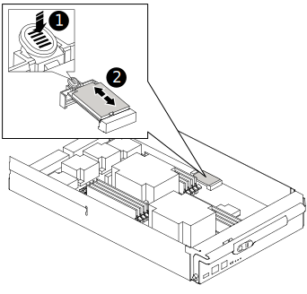

= Remplacez le support de démarrage - AFF A700 et FAS9000
:allow-uri-read: 
:icons: font
:imagesdir: ../media/

[role="lead"]
Pour remplacer le support de démarrage, vous devez retirer le module de contrôleur endommagé, installer le support de démarrage de remplacement et transférer l'image de démarrage sur une clé USB.

== Étape 1 : retirer le contrôleur

Pour accéder aux composants à l'intérieur du contrôleur, vous devez d'abord retirer le module de contrôleur du système, puis retirer le capot du module de contrôleur.

.Étapes
. Si vous n'êtes pas déjà mis à la terre, mettez-vous à la terre correctement.
. Débranchez les câbles du module de contrôleur défaillant et suivez l'emplacement de connexion des câbles.
. Faites glisser le bouton orange sur la poignée de came vers le bas jusqu'à ce qu'il se déverrouille.
+
image::../media/drw_9000_remove_pcm.png[drw 9000 déposer le module de commande du groupe motopropulseur]

+
|===

 a| 
image:../media/legend_icon_01.png[""]
 a| 
Bouton de déverrouillage de la poignée de came

 a| 
image:../media/legend_icon_02.png[""]
 a| 
Poignée de came

|===
. Faites pivoter la poignée de came de façon à ce qu'elle désengage complètement le module de contrôleur du châssis, puis faites glisser le module de contrôleur hors du châssis.
+
Assurez-vous de prendre en charge la partie inférieure du module de contrôleur lorsque vous le faites glisser hors du châssis.

. Placez le couvercle du module de contrôleur face vers le haut sur une surface stable et plane, appuyez sur le bouton bleu du capot, faites glisser le couvercle vers l'arrière du module de contrôleur, puis faites pivoter le couvercle vers le haut et retirez-le du module de contrôleur.
+
image::../media/drw_9000_pcm_open.png[drw 9000 pcm ouvert]

|===

 a| 
image:../media/legend_icon_01.png[""]
 a| 
Bouton de verrouillage du couvercle du module de commande

|===

== Étape 2 : remplacer le support de démarrage

Recherchez le support de démarrage à l'aide de l'illustration suivante ou du mappage des FRU sur le module de contrôleur :

|===

 a| 
image:../media/legend_icon_01.png[""]
 a| 
Appuyez sur la languette de dégagement

 a| 
image:../media/legend_icon_02.png[""]
 a| 
Support de démarrage

|===
. Appuyez sur le bouton bleu du logement du support de démarrage pour libérer le support de démarrage de son logement, puis tirez-le doucement hors du support de démarrage.
+

NOTE: Ne faites pas tourner ou tirer le support de démarrage directement vers le haut, car cela pourrait endommager le support ou le support de démarrage.

. Alignez les bords du support de démarrage de remplacement avec le support de démarrage, puis poussez-le doucement dans le support.
. Vérifiez le support de démarrage pour vous assurer qu'il est bien en place dans le support.
+
Si nécessaire, retirez le support de démarrage et réinstallez-le dans le support.

. Poussez le support de démarrage vers le bas pour engager le bouton de verrouillage sur le boîtier du support de démarrage.
. Réinstallez le couvercle du module de contrôleur en alignant les broches du couvercle avec les fentes du support de carte mère, puis faites glisser le couvercle pour le mettre en place.

== Étape 3 : transférez l'image de démarrage sur le support de démarrage

Vous pouvez installer l'image système sur le support de démarrage de remplacement à l'aide d'un lecteur flash USB avec l'image installée sur celui-ci. Cependant, vous devez restaurer le `var` système de fichiers pendant cette procédure.

* Vous devez disposer d'une clé USB, formatée en FAT32, avec au moins 4 Go de capacité.
* Copie de la même version d'image de ONTAP que celle du contrôleur avec facultés affaiblies. Vous pouvez télécharger l'image appropriée depuis la section Downloads du site de support NetApp
+
** Si NVE est activé, téléchargez l'image avec NetApp Volume Encryption, comme indiqué sur le bouton de téléchargement.
** Si NVE n'est pas activé, téléchargez l'image sans NetApp Volume Encryption, comme indiqué sur le bouton de téléchargement.

* Si votre système est un système autonome, vous n'avez pas besoin d'une connexion réseau, mais vous devez procéder à un redémarrage supplémentaire lors de la restauration du système `var` système de fichiers.

.Étapes
. Alignez l'extrémité du module de contrôleur avec l'ouverture du châssis, puis poussez doucement le module de contrôleur à mi-course dans le système.
. Recâblage du module de contrôleur, selon les besoins.
. Insérez la clé USB dans le logement USB du module de contrôleur.
+
Assurez-vous d'installer le lecteur flash USB dans le logement étiqueté pour périphériques USB et non dans le port de console USB.

. Poussez le module de contrôleur complètement dans le système, en vous assurant que la poignée de came se dégage du lecteur flash USB, appuyez fermement sur la poignée de came pour terminer l'installation du module de contrôleur, puis poussez la poignée de came en position fermée.
+
Le nœud commence à démarrer dès qu'il est entièrement installé dans le châssis.

. Interrompez le processus de démarrage pour qu'il s'arrête à l'invite DU CHARGEUR en appuyant sur Ctrl-C lorsque vous voyez démarrer L'AUTOBOOT, appuyez sur Ctrl-C pour annuler
+
Si vous manquez ce message, appuyez sur Ctrl-C, sélectionnez l'option pour démarrer en mode maintenance, puis arrêtez le nœud pour démarrer le CHARGEUR.

. Définissez le type de connexion réseau à l'invite DU CHARGEUR :
+
** Si vous configurez DHCP : `ifconfig e0a -auto`
+

NOTE: Le port cible que vous configurez est le port cible que vous utilisez pour communiquer avec le nœud douteux à partir du nœud en bon état pendant `var` restauration du système de fichiers avec une connexion réseau. Vous pouvez également utiliser le port e0M dans cette commande.

** Si vous configurez des connexions manuelles : `ifconfig e0a -addr=filer_addr -mask=netmask -gw=gateway-dns=dns_addr-domain=dns_domain`
+
*** Filer_addr est l'adresse IP du système de stockage.
*** Le masque de réseau est le masque de réseau du réseau de gestion connecté au partenaire haute disponibilité.
*** passerelle est la passerelle du réseau.
*** dns_addr est l'adresse IP d'un serveur de noms sur votre réseau.
*** dns_Domain est le nom de domaine DNS (Domain Name System).
+
Si vous utilisez ce paramètre facultatif, vous n'avez pas besoin d'un nom de domaine complet dans l'URL du serveur netboot. Vous avez uniquement besoin du nom d'hôte du serveur.

+

NOTE: D'autres paramètres peuvent être nécessaires pour votre interface. Vous pouvez entrer `help ifconfig` à l'invite du micrologiciel pour plus de détails.

. Si le contrôleur est en mode MetroCluster Stretch ou Fabric-Attached, vous devez restaurer la configuration de l'adaptateur FC :
+
.. Démarrage en mode maintenance : `boot_ontap maint`
.. Définissez les ports MetroCluster comme initiateurs : `ucadmin modify -m fc -t _initiator adapter_name_`
.. Arrêter pour revenir en mode maintenance : `halt`

+
Les modifications seront mises en œuvre au démarrage du système.

